# Wise PPT Skill

<p align="center">
  <a href="LICENSE"></a>
  <a href="references/themes.md"></a>
  <a href="https://github.com/WiseWong6/wise-skills"></a>
</p>

<p align="center">
  <a href="#效果预览">效果预览</a> ·
  <a href="#资产目录">资产目录</a> ·
  <a href="#快速开始">快速开始</a>
</p>

这个 Skill 可以把 PDF、链接、口语稿或现有 PPT，整理成一份 16:9 的 HTML PPT，也可以用于视觉优化和内容重组。

在过去，AI 做 PPT 非常喜欢排布格子，格子里面几乎都是 icon 和文案，信息密度极低，配色也很一般。

但 AI 其实缺少的不是生成页面的能力，只是不知道要用什么配色，要怎么规划内容。

于是我设计了一套完整的 PPT 设计流程，用规则、版式、结构、组件来驱动PPT的制作。

## 效果预览

六页视觉样例：

<table>
  <tr>
    <td width="50%" valign="top">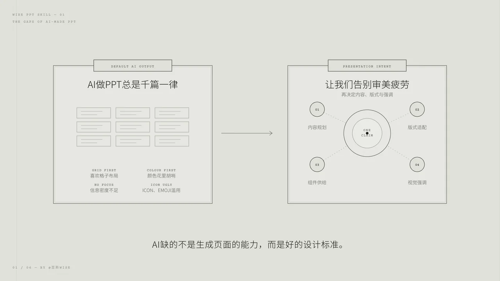<sub><b>01</b> · AI 做 PPT 总是千篇一律，因为缺的是设计判断</sub></td>
    <td width="50%" valign="top">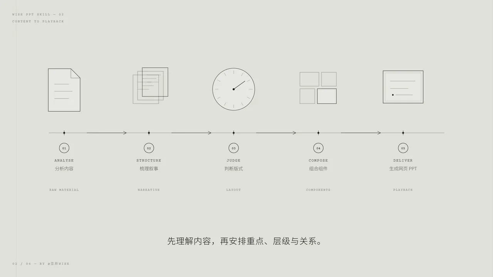<sub><b>02</b> · 五步编排链把原始资料变成可放映网页</sub></td>
  </tr>
  <tr>
    <td width="50%" valign="top">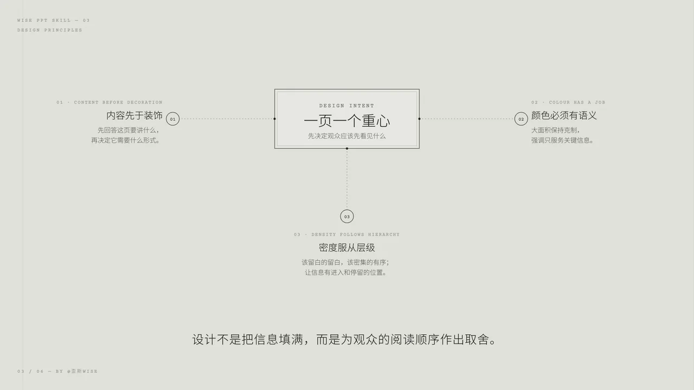<sub><b>03</b> · 一页一个重心，三项原则共同决定阅读顺序</sub></td>
    <td width="50%" valign="top">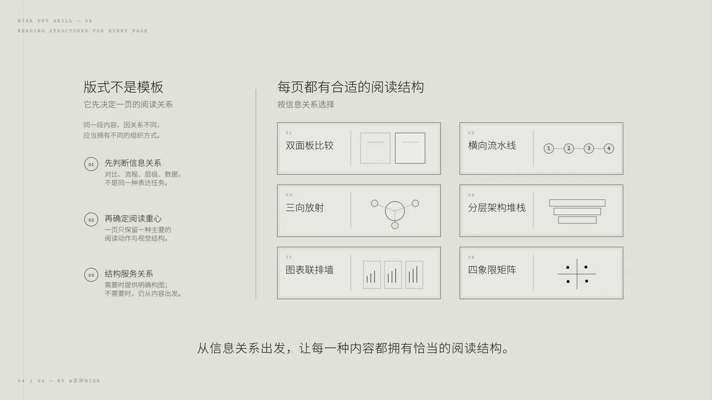<sub><b>04</b> · 版式图册提供结构候选，但内容关系拥有最终决定权</sub></td>
  </tr>
  <tr>
    <td width="50%" valign="top">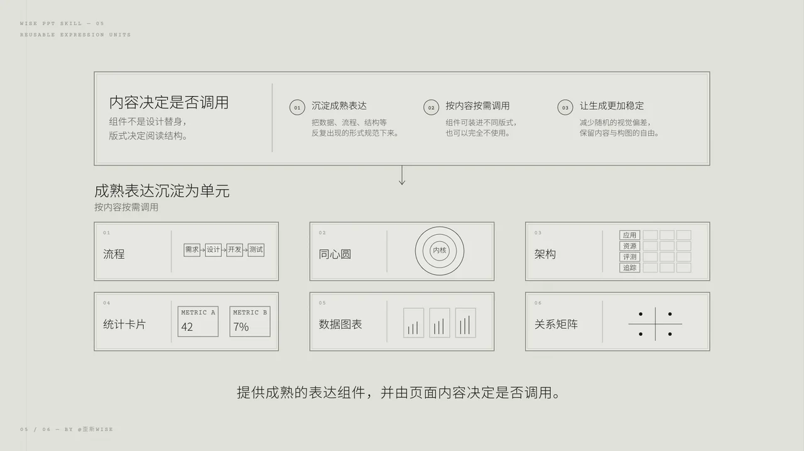<sub><b>05</b> · 组件沉淀成熟表达，但是否调用仍由页面内容决定</sub></td>
    <td width="50%" valign="top">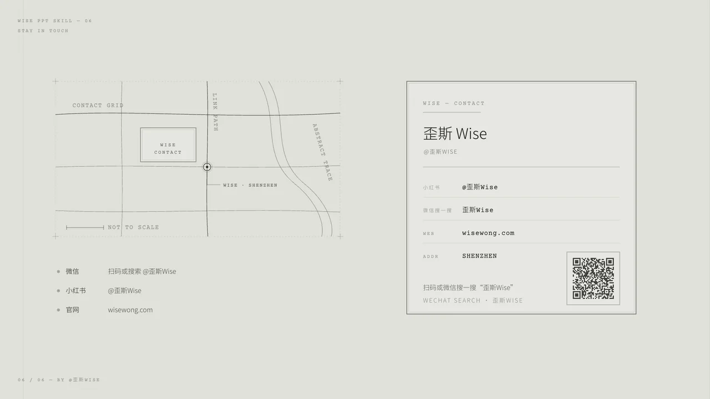<sub><b>06</b> · 通过三条可执行渠道继续获取 Wise PPT 更新</sub></td>
  </tr>
</table>

## 资产目录

当前版式、组件和图标以本地 Catalog 可见内容及机器 manifest 为准，不在 README 手抄动态数量。

这是几张示例，完整画册请访问：[https://wisewong.com/projects/wise-ppt/](https://wisewong.com/projects/wise-ppt/)

### 非关系页

<table>
  <tr>
    <td width="33.33%" valign="top"><a href="references/catalog-thumbnails/page-gallery-paper-ink-ai-frames-layout-d1.webp">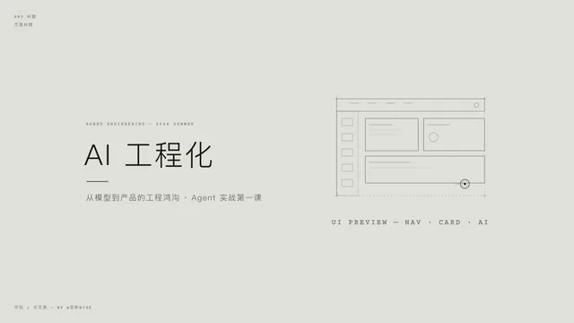</a><sub><b>D1</b> · 封面 · 左题右图</sub></td>
    <td width="33.33%" valign="top"><a href="references/catalog-thumbnails/page-gallery-paper-ink-ai-frames-layout-d4.webp">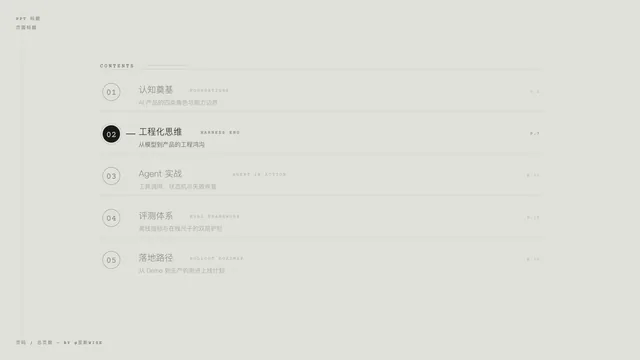</a><sub><b>D4</b> · 目录导航</sub></td>
    <td width="33.33%" valign="top"><a href="references/catalog-thumbnails/page-gallery-paper-ink-ai-frames-layout-d5.webp">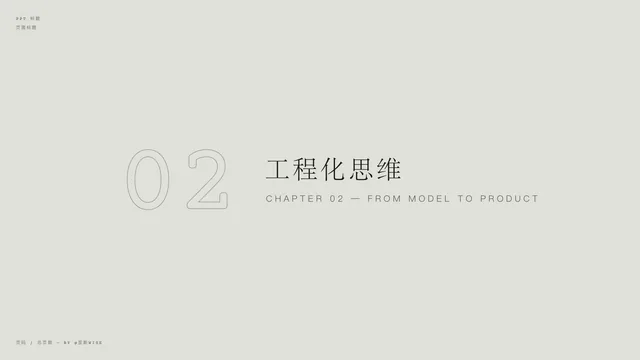</a><sub><b>D5</b> · 章节隔页</sub></td>
  </tr>
  <tr>
    <td width="33.33%" valign="top"><a href="references/catalog-thumbnails/page-gallery-paper-ink-ai-frames-layout-m2.webp">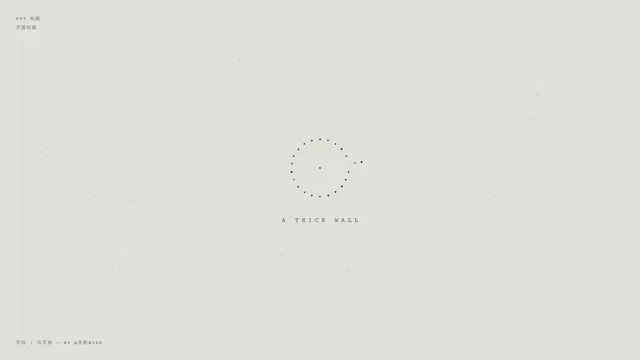</a><sub><b>M2</b> · 秩序环过渡页</sub></td>
    <td width="33.33%" valign="top"><a href="references/catalog-thumbnails/page-gallery-paper-ink-ai-frames-layout-d3.webp"></a><sub><b>D3</b> · 极简 Outro</sub></td>
    <td width="33.33%" valign="top"><a href="references/catalog-thumbnails/page-gallery-paper-ink-ai-frames-layout-d6.webp">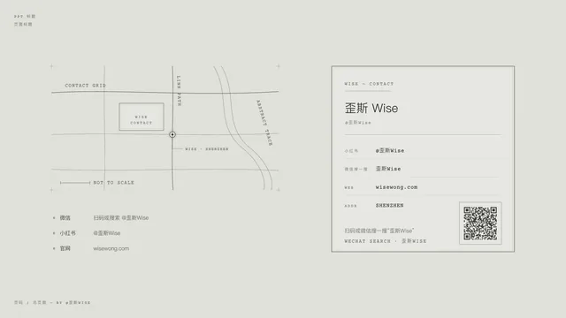</a><sub><b>D6</b> · 联络尾页</sub></td>
  </tr>
</table>

### 关系页

<table>
  <tr>
    <td width="33.33%" valign="top"><a href="references/catalog-thumbnails/page-gallery-paper-ink-ai-frames-layout-b1.webp">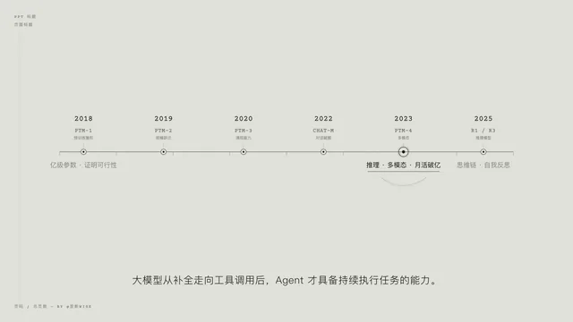</a><sub><b>B1</b> · 水平时间轴<br>有序 / 时序</sub></td>
    <td width="33.33%" valign="top"><a href="references/catalog-thumbnails/page-gallery-paper-ink-ai-frames-layout-c6.webp">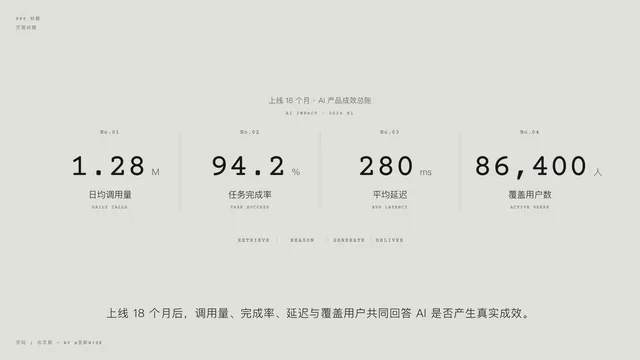</a><sub><b>C6</b> · KPI 大数字横带<br>并列 / 指标</sub></td>
    <td width="33.33%" valign="top"><a href="references/catalog-thumbnails/page-gallery-paper-ink-ai-frames-layout-e1.webp">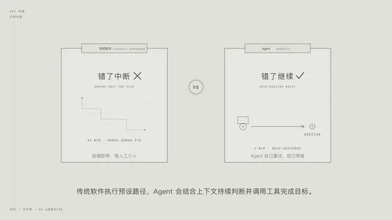</a><sub><b>E1</b> · 对比双面板<br>比较 / 对比</sub></td>
  </tr>
  <tr>
    <td width="33.33%" valign="top"><a href="references/catalog-thumbnails/page-gallery-paper-ink-ai-frames-layout-g4.webp">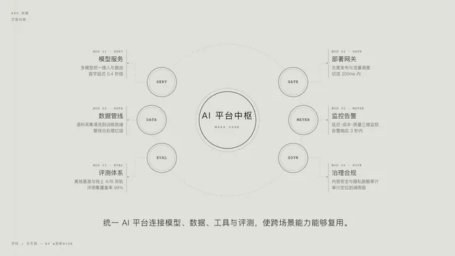</a><sub><b>G4</b> · 中心枢纽 + 卫星<br>重心 / 焦点</sub></td>
    <td width="33.33%" valign="top"><a href="references/catalog-thumbnails/page-gallery-paper-ink-ai-frames-layout-h3.webp">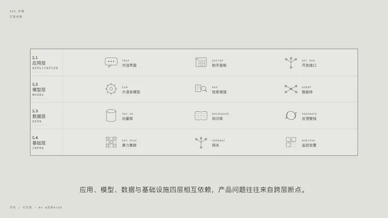</a><sub><b>H3</b> · 分层架构栈<br>包含 / 层级</sub></td>
    <td width="33.33%" valign="top"><a href="references/catalog-thumbnails/page-gallery-paper-ink-ai-frames-layout-o1.webp">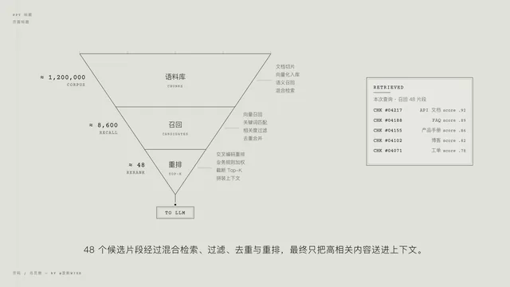</a><sub><b>O1</b> · 漏斗<br>有序 / 漏斗</sub></td>
  </tr>
</table>

### 组件

<table>
  <tr>
    <td width="33.33%" valign="top"><a href="references/catalog-thumbnails/component-atlas-42.webp">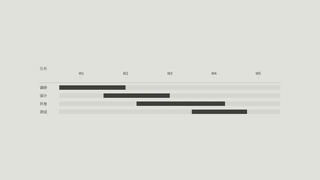</a><sub><b>#013</b> · gantt 甘特图</sub></td>
    <td width="33.33%" valign="top"><a href="references/catalog-thumbnails/component-atlas-20.webp">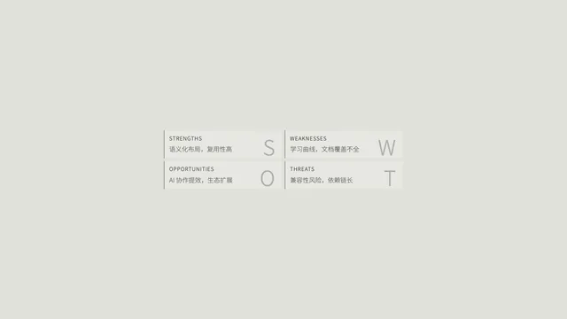</a><sub><b>#047</b> · swot SWOT 分析</sub></td>
    <td width="33.33%" valign="top"><a href="references/catalog-thumbnails/component-atlas-52.webp">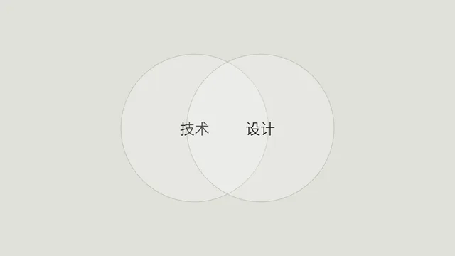</a><sub><b>#034</b> · venn 韦恩图</sub></td>
  </tr>
  <tr>
    <td width="33.33%" valign="top"><a href="references/catalog-thumbnails/component-native-73.webp">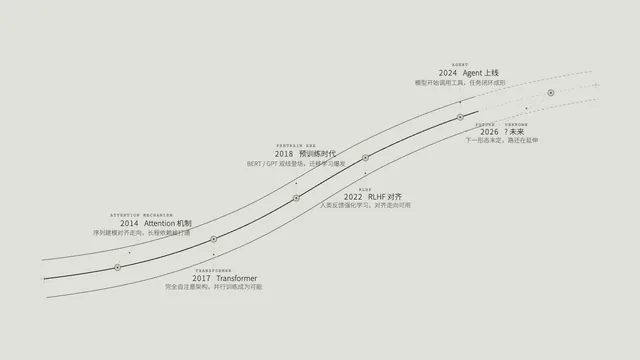</a><sub><b>#019</b> · winding-road 蜿蜒道路时间轴</sub></td>
    <td width="33.33%" valign="top"><a href="references/catalog-thumbnails/component-ec-echarts-geo-choropleth-map.webp">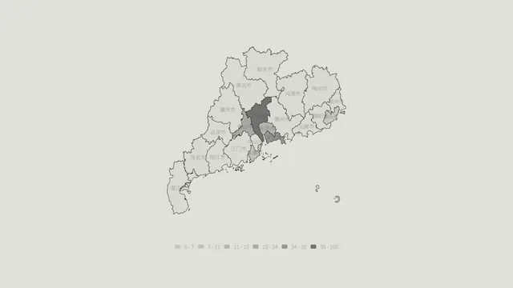</a><sub><b>#066</b> · geo-map 分级填色地图</sub></td>
    <td width="33.33%" valign="top"><a href="references/catalog-thumbnails/component-ec-echarts-sankey-basic.webp">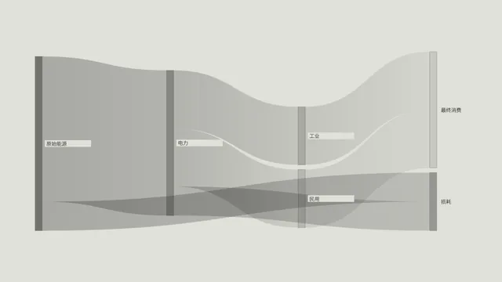</a><sub><b>#024</b> · sankey 桑基图</sub></td>
  </tr>
</table>

### 图标

<table>
  <tr>
    <td width="12.5%" align="center"><a href="assets/icons/rocket.svg"></a><sub>rocket</sub></td>
    <td width="12.5%" align="center"><a href="assets/icons/bulb.svg"></a><sub>bulb</sub></td>
    <td width="12.5%" align="center"><a href="assets/icons/sparkles.svg"></a><sub>sparkles</sub></td>
    <td width="12.5%" align="center"><a href="assets/icons/palette.svg"></a><sub>palette</sub></td>
    <td width="12.5%" align="center"><a href="assets/icons/target.svg"></a><sub>target</sub></td>
    <td width="12.5%" align="center"><a href="assets/icons/flag.svg">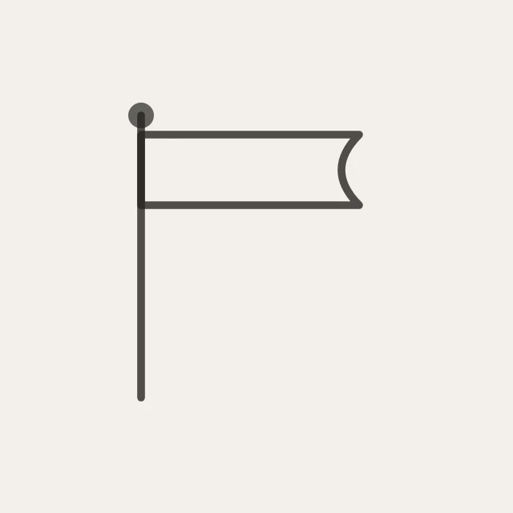</a><sub>flag</sub></td>
    <td width="12.5%" align="center"><a href="assets/icons/trophy.svg"></a><sub>trophy</sub></td>
    <td width="12.5%" align="center"><a href="assets/icons/star.svg"></a><sub>star</sub></td>
  </tr>
  <tr>
    <td width="12.5%" align="center"><a href="assets/icons/chart-bar.svg">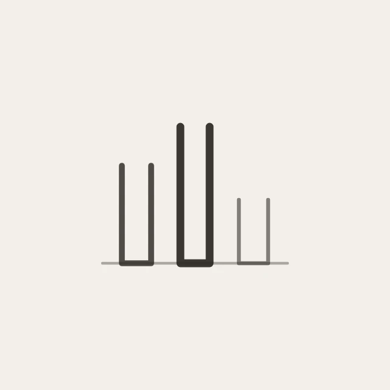</a><sub>chart-bar</sub></td>
    <td width="12.5%" align="center"><a href="assets/icons/chart-pie.svg">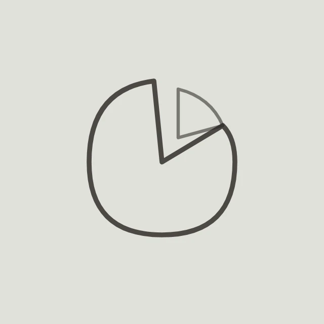</a><sub>chart-pie</sub></td>
    <td width="12.5%" align="center"><a href="assets/icons/clock.svg"></a><sub>clock</sub></td>
    <td width="12.5%" align="center"><a href="assets/icons/calendar.svg"></a><sub>calendar</sub></td>
    <td width="12.5%" align="center"><a href="assets/icons/map-pin.svg"></a><sub>map-pin</sub></td>
    <td width="12.5%" align="center"><a href="assets/icons/world.svg"></a><sub>world</sub></td>
    <td width="12.5%" align="center"><a href="assets/icons/cloud.svg"></a><sub>cloud</sub></td>
    <td width="12.5%" align="center"><a href="assets/icons/database.svg"></a><sub>database</sub></td>
  </tr>
  <tr>
    <td width="12.5%" align="center"><a href="assets/icons/mail.svg"></a><sub>mail</sub></td>
    <td width="12.5%" align="center"><a href="assets/icons/message-circle.svg"></a><sub>message-circle</sub></td>
    <td width="12.5%" align="center"><a href="assets/icons/microphone.svg"></a><sub>microphone</sub></td>
    <td width="12.5%" align="center"><a href="assets/icons/video.svg"></a><sub>video</sub></td>
    <td width="12.5%" align="center"><a href="assets/icons/camera.svg"></a><sub>camera</sub></td>
    <td width="12.5%" align="center"><a href="assets/icons/book.svg">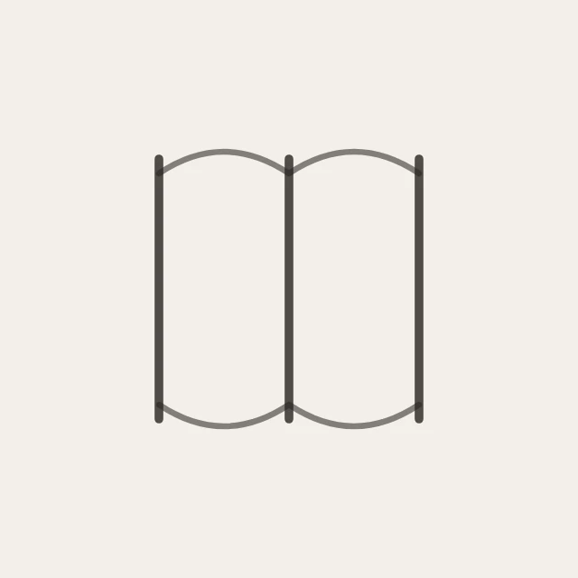</a><sub>book</sub></td>
    <td width="12.5%" align="center"><a href="assets/icons/search.svg"></a><sub>search</sub></td>
    <td width="12.5%" align="center"><a href="assets/icons/code.svg">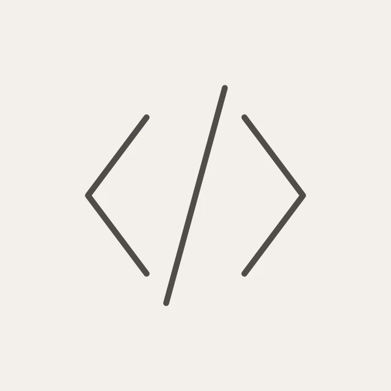</a><sub>code</sub></td>
  </tr>
  <tr>
    <td width="12.5%" align="center"><a href="assets/icons/user.svg"></a><sub>user</sub></td>
    <td width="12.5%" align="center"><a href="assets/icons/heart.svg"></a><sub>heart</sub></td>
    <td width="12.5%" align="center"><a href="assets/icons/brain.svg"></a><sub>brain</sub></td>
    <td width="12.5%" align="center"><a href="assets/icons/briefcase.svg"></a><sub>briefcase</sub></td>
    <td width="12.5%" align="center"><a href="assets/icons/device-laptop.svg"></a><sub>device-laptop</sub></td>
    <td width="12.5%" align="center"><a href="assets/icons/presentation.svg"></a><sub>presentation</sub></td>
    <td width="12.5%" align="center"><a href="assets/icons/settings.svg"></a><sub>settings</sub></td>
    <td width="12.5%" align="center"><a href="assets/icons/arrow-right.svg">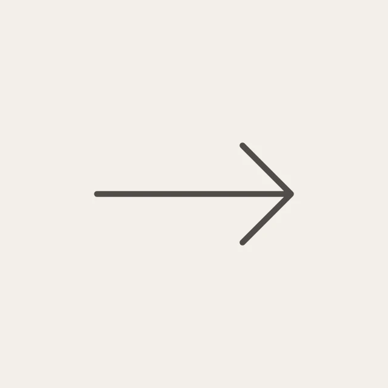</a><sub>arrow-right</sub></td>
  </tr>
</table>

### 三套主题配色

同一版式（K2 · 痛点→解法→成效）在三套登记主题下的效果；换主题只换配色与字体气质，不动版式：

<table>
  <tr>
    <td width="33.33%" valign="top"><a href="references/catalog-thumbnails/page-gallery-paper-ink-ai-frames-layout-k2.webp">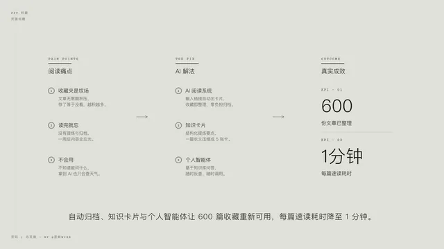</a><sub><b>纸墨</b> · 默认；冷灰纸底、克制红色焦点，适合研究、分析、内部分享</sub></td>
    <td width="33.33%" valign="top"><a href="references/catalog-thumbnails/palettes/scheme-k-hermes/page-gallery-paper-ink-ai-frames-layout-k2.webp">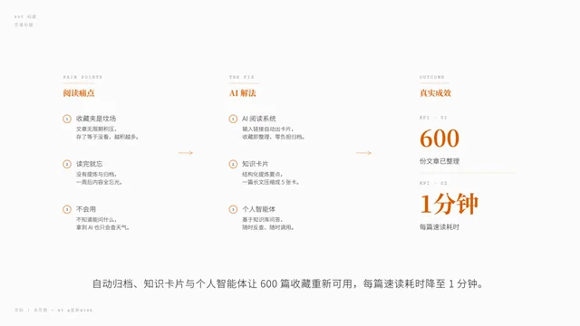</a><sub><b>爱马仕橙</b> · 正白纸、暖橙焦点，适合品牌、商业、编辑感内容</sub></td>
    <td width="33.33%" valign="top"><a href="references/catalog-thumbnails/palettes/scheme-l-klein/page-gallery-paper-ink-ai-frames-layout-k2.webp">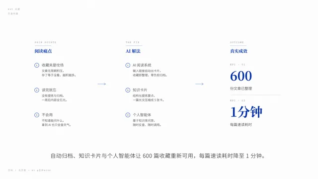</a><sub><b>克莱因蓝</b> · 正白纸、克莱因蓝焦点，适合科技、产品、发布表达</sub></td>
  </tr>
</table>

## 推荐模型

- 建议环境：Codex、ZCode、Kimi CLI、Claude Code；
- 适配模型：GLM-5.3 Flash、Qwen3.8-Flash或同级别及以上模型；
- 创造力推荐：GPT 5.6 Sol High 及以上、GLM 5.3、Kimi K3、Qwen 3.8max。

## 安装

把这句话发给你的 Agent 即可：

```text
帮我安装这个 skill：https://github.com/WiseWong6/wise-ppt
```

Codex 默认目录更新：`git -C ~/.codex/skills/wise-ppt pull --ff-only`。其他 Agent 的目录、手动安装和故障处理见 [用户指南](USER-GUIDE.md)。

## 快速开始

一句话 + 你的资料（PDF / 链接 / 口语稿 / 成型 PPT），一站式生成 PPT：

```text
/wise-ppt 把这份 PDF 做成 10 页路演 deck，输出到 /absolute/path/decks/
```

建议先让 Agent 进入 plan 模式。

## 关于作者

全网同名 **@歪斯Wise**，持续分享 AI 创作、Agent 工作流、视觉设计与效率工具。

<p>
  <a href="https://x.com/killthewhys">X / Twitter</a> ·
  <a href="https://www.xiaohongshu.com/user/profile/61f3ea4f000000001000db73">小红书</a> ·
  <a href="https://github.com/WiseWong6/wise-skills">Wise Skills</a>
</p>

<p></p>

## License

[AGPL-3.0](LICENSE) © 2026 Wise Wong

第三方资产（Apache ECharts、PPT Component Atlas、Tabler Icons 纸墨重绘、思源字体等）保留原许可，清单见 [NOTICE](NOTICE)。
