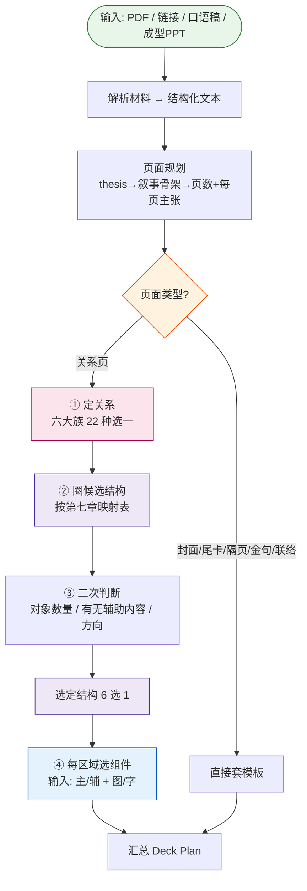

# Skill 设计文档:内容 → 页面规划 → 关系 → 结构 → 组件

> 目标:设计一个 Skill,把原始材料(PDF / 链接 / 口语稿 / 成型PPT)转化为可渲染的 Deck Plan。
> 本文档持续微调。

---

## 一、整体流程



---

## 二、四个阶段说明

| 阶段 | 做什么 | 输出 |
|------|--------|------|
| **① 材料解析** | PDF/链接/口语稿/PPT → 统一成结构化文本;若为成型PPT则审计现有页数与论点 | 原始内容池 |
| **② 页面规划** | 定 thesis → 选叙事骨架 → 主张链定页数(规则见第三章) | **页数 + 每页主张句** |
| **③ 页面分流** | 非关系页(封面/尾卡/隔页/金句/联络)直接套模板;关系页进入④ | 页面类型 |
| **④ 逐页四步** | 定关系 → 圈候选结构 → 二次判断 → 选组件 | **每页的关系+结构+组件** |

---

## 三、页面规划层:从内容池到页清单

> 阶段②的规则。材料解析(①)产出内容池;本章决定**切几页、每页主张什么、按什么顺序讲**,输出页清单,交给页面分流(③)和逐页四步(④)。
> 骨架取自 wise-ppt 的 deck-planning(thesis 先行、叙事选型、页数唯一目标、主张链自检),扔掉它的记账机器(complexity_units 账本、planning_basis 三模式、确认数组)——判定靠规则和自检,不靠字段记账。

### 3.1 先定 thesis:整份 deck 一句可争辩的话

- thesis 是**判断**,不是主题:"AI 做 PPT 千篇一律,因为缺的是设计判断"是 thesis;"AI 做 PPT 的方法介绍"是主题。
- 标题 ≠ thesis:标题给场景,thesis 定方向;后面每页主张句都是 thesis 的分步展开,thesis 不成立,整份 deck 重想。
- 自检:**thesis 能被反对吗?** 反驳不了的不是 thesis("我们要做好产品"是废话)。

### 3.2 叙事骨架定页序

| 叙事型 | 骨架 | thesis 长什么样 |
|---|---|---|
| 问题→方案 problem-solution | 痛点 → 根因 → 方案 → 效果 | "X 坏了,得这么修" |
| 情境→冲突→解答 SCR | 现状 → 变化带来的麻烦 → 应对 | "世界变了,老办法不行了" |
| 时间线 chronology | 阶段一 → 阶段二 → 阶段三 | "X 是这样一步步走到的 / 要分三步走" |
| 论点→证据 argument-evidence | 主张 → 证据 1/2/3 → 收束 | "X 成立,证据在此" |
| 对比选型 comparison | 候选 A vs B vs C → 判据 → 结论 | "该选谁" |
| 漏斗收窄 funnel | 大面 → 逐步收窄 → 一个结论 | "从万千可能收敛到这一件事" |

- **页序跟着叙事骨架走,不跟素材原始顺序走**。照着原文档目录排页是最常见的病。
- 封面、隔页、金句、尾卡在规划层就排进页序 —— 它们是节奏工具,不是渲染完再补(何时插见 9.5 节奏启发;模板类型见第四章)。
- 拿不准选哪型,看 thesis 的动词:"要变"→ 问题→方案;"分几步走"→ 时间线;"该选谁"→ 对比。

### 3.3 页数怎么定

依据只有一条优先级链,输出**唯一目标页数**(不给区间):

**用户给了页数 > 内容结构 > 场景推荐**

- **用户给了**:直接采用。内容塞不下时回到 3.6 问用户(砍内容还是加页),不自作主张。
- **内容结构**:数"不可合并的结论"。一个结论一页;两个结论必须靠同一批证据才说得清 → 并一页;一个结论要三组都很重的证据 → 可拆两页。
- **场景推荐**:用户没给页数也没给时长时,按讲述时长粗估(1 页 ≈ 0.5~2 分钟讲述量,参考锚点、非硬合同),记录假设,不反问用户。

一页一主张,与第五章关键共识"每页 1 个主关系"同源:主张是内容层的"一个",关系是信息层的"一个"。

### 3.4 每页主张句怎么写

- **是完整句子,不是词组**:"五步编排链把原始资料变成可放映网页" ✓;"工作流介绍" ✗。
- **能被质疑**,不是分类标签:"版式图册提供结构候选,但内容关系拥有最终决定权" ✓;"版式图册介绍" ✗。
- **Ghost Deck 自检**:只读全部主张句,应该能读通完整故事 —— 相邻页有推进、结尾回答开头、没有两页重复同一结论。读不通就改页(改主张/换顺序),不是加页。
- 主张句由**底部题注(caption)承载**——页面无标题制(见 9.4):题注就是本页最重要的一句话,可以改写得更像钩子、断在语义处(见 9.1),但必须仍表达同一主张,不得漂移。

### 3.5 证据最小化 + must 内容着落

- **只留让主张成立的最少证据**:证据够主张成立就砍。素材多不是页数多的理由,是删料的机会。
- 每页一个**主角证据**,其余是配角 —— 与"每页 1 个主关系 + 最多 2 个辅关系"对齐(见第五章)。
- **must 内容逐条着落**:必上的内容(用户点名的数字/案例/结论)要么进某页,要么记一句删除理由;不允许无声消失。删了没记理由,验收按漏内容算。

### 3.6 何时停下来问用户

只有**用户的选择会真正改变 thesis、页序、重点或行动**时才停,最多三个问题。每个问题说清三件事:发生了什么、影响成品的什么、要在什么之间选(大白话,不出现字段名和术语)。

素材很长、页数很多、个别字段缺失 —— 都不是问的理由,自己拍板并记录假设。

### 3.7 输出物:页清单

每页一行:

```
{页码, 页面类型(关系页 / 封面·隔页·金句·尾卡·联络), 主张句, 内容要点(主/辅标记)}
```

页面类型交给第四章页面分流;关系页的"内容要点 + 主/辅"喂第五章定关系。非关系页到此走模板,不再进后续阶段。

> **验证方法**:拿 `references/six-page-example`(六页能力介绍)反推 —— 蒙住 deck-plan.json,只从素材推 thesis、叙事型、页数、主张链,与原产物对得上,规则才算可执行。

---

## 四、页面分类:关系页 vs 非关系页

进入"关系 → 结构 → 组件"流程前,先区分页面类型:

| 页面类型 | 走哪条路 | 说明 |
|---|---|---|
| **非关系页** | 直接套模板,不进关系/结构/组件流程 | 封面、尾卡、Outro、章节隔页、金句页、粒子主角页、联络尾页 |
| **关系页** | 进入关系 → 几何结构 → 组件 三段式 | 页面承载信息关系,需匹配版式和组件 |

> **只有关系页才进入版式、组件的选择。** 非关系页只承担节奏停顿、情绪定调、品牌落版等功能,走固定模板。

参考版式库(paper-ink/ai)中的非关系页示例:
- 封面:D1
- 尾卡:D2
- Outro:D3
- 章节隔页:D5
- 金句页:M2
- 粒子主角页:M1
- 联络尾页:D6

---

## 五、信息关系:六大族(MECE)

按第一性原理,信息之间的连接方式只有四种本质形态:
```
A ──→ B    有方向
A ── B     无方向但有连接
A └─ B     包含/从属
A | B      无关系,只是放一起
```
加上"只有 1 个对象""对齐比较"两种边界情况,穷尽为 **6 大族**。

### 判断流程(每页走一遍)

```
只有 1 个对象?           → 重心 Focus(焦点 / 示意)
多个对象,之间:
  没关系?                 → 并列 Parallel(陈列 / 并行 / 指标 / 分布)
  有包含/从属?            → 包含 Containment(层级 / 拆解 / 嵌套…)
  有方向(先后/因果)?     → 有序 Sequential
  要对齐看异同/对应?      → 比较 Comparison(对比 / 矩阵 / 排名…)
  只是有关联(无方向)?    → 连接 Connection
```

6 个分支,**互斥、穷尽**。数字是内容不是关系:数值页照样走六族判断 —— 排名 = 比较(同维度对齐看高低,乱序仍是对比),指标 / 分布 = 并列(无关系放一起);示意图 / 原型归重心·示意,不冒充证据。

### 六大族总表

| 族(中文) | Family(English) | 判断特征 |
|---|---|---|
| ① 重心 | Focus | 只有 1 个对象(焦点 / 示意) |
| ② 并列 | Parallel | 对象间无关系,放一起(陈列/并行/指标/分布) |
| ③ 包含 | Containment | 包含/从属,看边界 |
| ④ 有序 | Sequential | 有方向(A→B) |
| ⑤ 比较 | Comparison | 对齐并排看异同(对比/矩阵/排名) |
| ⑥ 连接 | Connection | 有关联但无方向、无包含 |

### 族内细分

| 族 | 关系(中文) | 语义 |
|---|---|---|
| ① 重心 Focus | 焦点 focus | 单一重心 |
| | 示意 illustration | 插图 / 原型展示,主体无竞品、无对照 |
| ② 并列 Parallel | 陈列 | 无结构罗列 |
| | 并行 parallel | 多条独立并行线 |
| | 指标 metric | 多个关键数字并排 |
| | 分布 distribution | 按位置/区域展开(地图 / 直方图) |
| ③ 包含 Containment | 层级 hierarchy | 上下级从属(谁管谁) |
| | 拆解 decomposition | 整体拆成部分 |
| | 部分整体 part-whole | 部分构成整体 |
| | 嵌套 nesting | 包含/嵌套/内外层 |
| ④ 有序 Sequential | 时序 sequence | 按时序推进 |
| | 流动 flow | 资源/状态流动 |
| | 循环 cycle | 首尾闭合 |
| | 汇聚 convergence | 多路径汇聚到一个结果 |
| | 漏斗 funnel | 从多到少收窄 |
| | 因果 causal | 原因导致结果 |
| ⑤ 比较 Comparison | 对比 comparison | 同维度看异同 |
| | 矩阵 matrix | 二维交叉 |
| | 映射 mapping | A↔B 对应/转换 |
| | 排名 ranking | 按数值大小对齐排序 |
| ⑥ 连接 Connection | 网络 network | 多对多连接 |
| | 证据 evidence | 结论与支撑证明关系 |

> 族是**判断入口**,族内细种是**精确匹配**。两层都保留,既 MECE 又不丢表达力。

### 易混关系辨析

| 三者 | 回答的问题 | 换掉成立吗? |
|---|---|---|
| 层级 | "谁归谁管?" | 是人/组织的**管辖**关系 |
| 拆解 | "整体由什么组成?" | 各部分**加起来=总数**,可量化 |
| 部分整体 | "哪些共同构成整体?" | 强调**共同构成**,非拆的动作 |

> 一句话:**层级看"管辖",拆解看"加总",部分整体看"构成"**。

### 关键共识

1. **不看长相看语义** —— 同样的树状图,可能是层级,也可能是拆解
2. **对比的核心是"维度对齐"**,不是版式
3. **因果的核心是"方向性"**,去掉方向信息就不成立
4. **关系决定版式,数量只决定容量** —— 每页 1 个主关系 + 最多 2 个辅关系
5. **一维分类不单列** —— 按语义归到拆解或层级(分类看标签,拆解看加总,层级看管辖)
6. **数字是内容不是关系** —— 数值页照样走六族:排名归比较(维度对齐,乱序仍是对比),指标/分布归并列(无关系放一起);示意图(插图/原型)归重心·示意,不冒充证据

### Catalog 的 SmartArt 浏览分类

微软 SmartArt 的分类先问“想表达什么”,再找布局,不是按图形外观命名。`references/catalog.html` 借用这套逻辑做**人工浏览投影**,不替换上面的六大族机器判断。官方说明见 [Choose a SmartArt graphic](https://support.microsoft.com/en-us/office/graphics-visuals/choose-a-smartart-graphic)。

| Catalog 入口 | 主要表达 | 与六大族的边界 |
|---|---|---|
| 列表 List | 无顺序、无强连接的并列信息 | 通常来自并列,也可收纳拆解后的等价单元 |
| 流程 Process | 步骤、阶段、时间线、因果或汇聚推进 | 对应有序,箭头/方向是关键 |
| 循环 Cycle | 首尾闭合、持续重复 | 从有序中单独抽出,便于找循环画法 |
| 层级 Hierarchy | 上下级、树状从属、分层 | 对应包含·层级 |
| 关系 Relationship | 非线性连接、对照、映射、中心辐射或包含 | 可跨比较/连接/包含,按主要阅读任务归一处 |
| 矩阵 Matrix | 二维交叉分类,或部分共同指向整体 | 常对应比较·矩阵或包含·部分整体 |
| 金字塔 Pyramid | 比例、层层收窄、由大到小 | 画法入口;实际关系仍可为层级/漏斗 |
| 图片 Picture | 图片、界面、原文或证据本体主导 | 是媒介入口,卡片仍保留示意/证据关系标签 |
| 数据 Data | 图表、指标、排名、地理分布 | Wise PPT 扩展;不是第七关系族,仍回到并列/比较/有序判断 |

> `All` 是聚合入口、`Office.com` 是来源入口、`Other` 是自定义兜底,都不作为本地 Catalog 的语义分类。每张版式、每个组件只进入一个主要浏览入口,关系标签继续显示真实语义。

---

## 六、几何结构清单

> **结构与组件分层**:结构 = 页面怎么切区域(矩形分块);组件 = 区域内画什么形状(放射、环形、蛇形、漏斗都是组件的形状,不是页面结构)。
> G1/G4/H1/J1 等版式的页面结构都是"单区",里面放一个大组件。

**版心与固定件(切分的前提)**:每页都有全 deck 统一的固定件 —— 左上角页眉(章节 kicker)、左下角页码/落款、底部题注行。固定件是外框不是内容区,**一律不算切分**(不论在上/下/左/右)。结构切的是**版心** = 页面减去固定件后的内容区;单区就是版心剩一整块,内容水平垂直居中。

| 结构 | 说明 |
|------|------|
| 单区 | 版心一整块,不再切分;组件水平垂直居中,形状自由(放射/环形/蛇形/漏斗/矩阵…) |
| 左右x等分 | 版心横向均分,x≥2 |
| 上下x等分 | 版心纵向均分,x≥2 |
| 左右不对称 | 版心横向不等分切一刀,任意一侧可再分(通常一主一辅) |
| 上下不对称 | 版心纵向不等分切一刀,任意一侧可再分;常见走法:大区+收束带 / 大区+辅×N / 辅+主区 |
| 网格 mxn | 版心均质分格陈列,含象限 2×2(A7 logo墙 7×4、F4 六宫格 2×3) |

### 矩阵(表格)不是页面结构(易混)

| | 特征 | 例子 | 对应关系 |
|---|---|---|---|
| **矩阵/表格** | 行列双语义在组件内部,是组件的画法 | K4、K1、E4 | 天然对应 **matrix 矩阵** |
| **网格** | 均质分格,格与格等价,只是陈列 | A7、F4 | 天然对应 **陈列/并行** |

> **矩阵(表格)是组件画法,不是页面切分。** 三栏行带矩阵 → 左右x等分(K4,三栏是切分,行带是栏内画法);整页矩阵 → 单区(F1 象限);矩阵 + 收束带/KPI 通栏 → 上下不对称(E4、K1)。与放射/环形/蛇形/漏斗同级:结构只认 6 种矩形分块,不设「表格」。

> 已删除冗余项:左右等分/上下等分(= x等分 x=2)、象限(= 网格 2×2)、上下N段(K1/E4 用"上下不对称"覆盖)、表格(= 组件画法,按页面切分归单区/左右x等分/上下不对称)。

> **固定件的尺度界限**:底部题注/出处带高度 ≤15% 仍视为固定件(归单区,A2 场景画);超过就是独立内容区,要参与切分。

> 可视化浏览:`references/catalog.html?tab=str`(单一结构 tab)。6 种切分各为一个可折叠章节,章节内按“定义/判断 → 空槽变体 → 对应真实示例”联看;每个空槽只挂 `ex` 映射的页面,加载时逐结构校验不漏归/不重归/不跨结构,承载关系 chips 也从示例关系标签实时推导。54 个关系页版式按结构字段程序化归入:单区 24 / 左右x等分 11 / 上下x等分 5 / 左右不对称 7 / 上下不对称 5 / 网格 2。空槽大图 17 张存于 `references/taxonomy-empty/`:10 张提取自 taxonomy(wise-ppt-page-expression)110 张成熟蓝图按槽位几何去重的空槽版式,7 张补造(taxonomy 无「上下等分」「网格」整类与「左右4等分」变体,见 v24/v25);9 种 taxonomy 拓扑全部落入 6 种结构,枚举无缺口。旧 `?tab=strex` 仅作兼容别名,自动归一到 `?tab=str`。

---

## 七、关系 → 结构 映射(候选集 + 二次判断)

> **模型:关系不锁定结构,关系圈定候选范围;二次判断在范围内选定。**

```
关系 → 圈出候选结构(2~4 种)
        ↓
二次判断(对象数量、有无辅助内容、方向偏好)
        ↓
      选定结构
```

### 各关系的候选结构集(经 60 版式反向验证)

| 关系 | 候选结构 | 版式例 |
|---|---|---|
| 焦点 focus | 单区 | — |
| 示意 illustration | 单区(插图/原型展示) | A2、A8 |
| 陈列 | 左右x等分 / 上下x等分 / 网格mxn | A5、A7、F4 |
| 并行 parallel | 左右x等分 / 单区(泳道图,时间轴贯穿) | I4、B3 |
| 指标 metric | 左右x等分(KPI 大数字横带) | C6 |
| 分布 distribution | 左右不对称(地图+数据栏) | C4 |
| 层级 hierarchy | 单区(树/同心环) / 上下x等分(分层栈) / 左右不对称(树+规格) | H3、F2 |
| 拆解 decomposition | 单区(放射) / 左右x等分 / 网格 / 上下x等分 / 左右不对称 / 上下不对称(上总额下四环) | G1、F3、F4、H4、F2、C5 |
| 部分整体 part-whole | 同拆解 | — |
| 嵌套 nesting | 单区(同心环/嵌套框) | H1、H2 |
| 时序 sequence | 单区(时间轴/阶梯/蜿蜒) / 左右x等分(步骤条) | B1、B5、B6、A9 |
| 流动 flow | 单区(流水线) / 上下x等分(双轨) | I1、I3 |
| 循环 cycle | 单区(圆环/蛇形);若带辅助内容 → 左右不对称 | J1、J2 |
| 汇聚 convergence | 单区(汇聚图) | N1 |
| 漏斗 funnel | 单区(漏斗图) / 左右不对称(漏斗 + 两侧标注) | O1 |
| 因果 causal | 上下x等分(因上果下) / 左右x等分(痛→解→效) / 左右不对称(左痛右解) | E3、K2、K3 |
| 对比 comparison | 左右x等分 / 上下x等分(前后双带) | E1、E2、E6 |
| 矩阵 matrix | 左右x等分(三栏行带矩阵) / 单区(整页矩阵) / 上下不对称(矩阵+收束带) | K4、F1、K1、E4 |
| 映射 mapping | 单区(弧线网) / 左右x等分(双列映射) | L2、E5 |
| 排名 ranking | 单区(排行柱图) | C7 |
| 网络 network | 单区(节点连线) | L1、L2 |
| 证据 evidence | 单区(证据墙) / 左右不对称(策略+证据) / 上下不对称(摘要+原文) | A1、A6、A4、A3 |

### 二次判断依据

1. **对象数量**:单个 → 单区(整版大图);多个 → 等分/网格各放一个
2. **有无辅助内容**:要放规格单/收束带/KPI带/说明栏 → 从单区/等分升级为主+辅(不对称)
3. **方向偏好**:横向阅读流(步骤、时间)→ 左右;纵向阅读流(层级、堆叠)→ 上下

---

## 八、组件匹配

### 选组件三段式(v83,组件优先/重绘兜底)

**第一段 · 优先选组件**:表B 圈候选 → routing-manifest 核对(component_id/frame/capacity/renderer_kinds)→ 过滤(关系→形状→容量→节奏)→ deck-plan ④列登记 `component_id{参数}`。
**第二段 · 组件物化**:snippet 注入(atlas 过 adapters/atlas.js 改写、native 依赖 --wp-compat-pi-* token)/ ECharts(createEChart+纸墨 option)/ 多槽一槽一组件;构建期静态展开,槽 div 带指纹属性;禁改 content 语义迎合组件。

> **预览遗产打穿(v88 立,v90 模板化)**:组件库 CSS 是按 600px 方卡预览写的,直接注入会缩在槽中间一小块。**槽结构照抄 SKILL.md 渲染合同的「组件槽标准样板」**(absolute 定位+内容自然流,无 flex/overflow/内层 wrapper——print 分页 pass 会重算它们),配套覆写汇总进 `registered-components.css` 尾部:
> 1. **方卡外壳**:`.swiss-card { width:600px; min-height:600px; flex-shrink:0 }` → `[data-layout-slot] .swiss-card { width:100%; min-height:0; height:auto }`;槽内若有历史 scale 层(固定宽+transform:scale)一并扁平化为 `width:100%`。
> 2. **内容内边距**:`.swiss-card__content` 的 padding → 0(定位与留白由槽 div 承担)。
> 3. **组件自带字档**:组件 CSS 原值字号(16/26px 等)一律覆写映射到全局字阶 token(`var(--type-*)`),按角色定档(金句主体 hero、年份/正文 body-small、署名 meta),禁原值直出。
> 4. **特度核算**:覆写选择器特度必须压过组件原规则(如 `.swiss-card .quote blockquote` 是 0,2,1,`[data-slot-role] blockquote` 只有 0,1,1 会输——首 deck 金句 26px 假装生效即此坑);写法 = 覆写选择器复述原规则的类链语境再追加槽属性。
> 5. 验收 = 浏览器实测:computed font-size 等于目标 token 值、槽内组件 bbox 满槽宽、水平垂直中线达标(9.2-7/9.2-8)。**视觉模型转述不可作为字号验收依据**(26px 会被转述成"大字"),一律量计算样式。
**第三段 · 重绘兜底**:语义/形状/容量均无合适组件才手绘,登记"重绘:理由",新画法回填表B。

> 背景:首副成品 deck 的④曾整链空转——表B 只贴了概念标签,页面全部现场手绘,组件池 108 条资产零使用(v83 修复)。根因是判定链走到"需要执行资产"的环节断了:①②③是判断题,查表即可;④是执行题,必须有物化路径。"兜底条款变成主干道"是④空转的信号。

### 组件定义(v8 暂定,待组件清单验证)

> 逐页四步的最后一步:结构 → 组件。


**组件 = 一种参数化画法。内容数量是参数,不是组件类型。**

- 指标带 = 1 个组件:2 个指标区域 2 等分,3 个 3 等分,4 个 4 等分
- 流程链 = 1 个组件:2 步画 2 节点,5 步画 5 节点
- **画法不同才是不同组件**:箭头链 / 蛇形回环 / 时间轴刻度 / 甘特条带是 4 个组件,哪怕都表达 flow

粒度(v10 修正):**分连接类和陈列类两种** ——

| 类型 | 粒度 | 例子 |
|---|---|---|
| **连接类**(块内有箭头/连线/包含) | 一个整体组件,不可拆 | 流程链、漏斗、树、地图 |
| **陈列类**(块内纯并列) | **单元组件 × N**,排布由结构负责 | 档案卡×3 + 左右3等分;指标单元×4 + 左右4等分;logo 单元×28 + 网格 |

> ⚠️ 不存在"指标带组件/卡片墙组件"这种阵列级组件 —— 那是"单元组件 + 等分结构"的组合。atlas 的 stats(4 格打包)是历史实现,概念上应视为单元×4。
> "一个结构块 = 一个组件"仍成立,但陈列类的"一个组件"指一个单元,同单元可重复填充多个等分位。

### 组件三属性

1. **关系**:表达什么关系(flow / comparison / matrix...)
2. **形状**:吃哪种区域(矮宽条 / 窄高条 / 近方形 / 整页)
3. **容量**:条目范围(如 2~7 步)

### 缩放标尺(v26 起第①层已落地)

组件不连续缩放,用"档位 + 门槛":

| 层 | 规则 | 状态 |
|---|---|---|
| ① 准入门槛 | 组件声明形状范围(min_width/min_height/宽高比范围),区域不在范围内 → 不进候选,换组件 | **已落地**:space_requirements + 逐组件真实 frame(scripts/_component_frames.py,55+26 显式表),frame 即生产排版画布,typed renderer 流式重排 |
| ② 字号档位 | 组件内字号固定几档(display/heading/body/meta token),内容数量决定用哪档(如指标带:2~3个→100px,4~5个→64px,6个→40px) | 渲染器内部 token 制,部分实现 |
| ③ 容量上限 | 字号降到最低档还装不下 → 超容量,不选此组件,换画法或拆页 | 已落地:capacity min/max + 文本密度校验 |

> "能缩多小" = 最低字号档 × 单条最小排版面积,到此为止。"能放多大" = 区域大选整页级组件,字号有上限,撑满即止。
> **验证方法**:拿 2~3 个真实组件(指标带、流程链)试切进不对称结构的小区域,看档位表是否成立。

**待办:**

- [x] 组件清单(已清洗合并,见 references/catalog.html 组件 tab;atlas 61 + echarts 12 → 35 组)
- [ ] 结构 → 组件映射规则(待定义)
- [x] 缩放标尺:第①层准入门槛与第③层容量上限已在生产落地(v26);第②层字号档位由渲染器 token 制承接
- [ ] 待验证:选组件时是否需要两个输入参数 —— ①主/辅(定视觉权重) ②图/字(定组件类型)。来自已有体系 blocks 层(importance / semantic_form),必要性未定,等组件清单来了一起验证。

### 组件清洗结果(v9)

**剔除项去向(不属于组件):**

| 原 atlas 项 | 去向 |
|---|---|
| cover 封面(#1)、toc-card 目录(#5)、quote 引用(#11) | 非关系页模板参考 |
| two-col(#7)、three-col(#8)、split-v(#9,#10) | 版式结构参考 —— 只切区域不承载信息,是「结构」不是组件 |

**合并规则:** 数量是参数(步数/环数/圆数/层数合并为一组),样式开关不产生新组件(arrow/smooth/inverted 等记为参数),画法不同才是不同组件。

**合并后 35 组组件**(文字排版 5 + 比较 7 + 流程时序 5 + 结构 8 + 数据 2 + ECharts 8):
- 流程链 ← 9 个变体合并(#25~33);同心圆 ← 5 个(#43~47);前后对比 ← 4 个(#16~19)
- 浏览: `references/catalog.html`(四个 tab:非关系页模板 / 关系页版式按 SmartArt 语义入口 / 结构(空槽变体与对应示例联看) / 组件按 SmartArt 语义入口)

---

## 九、设计规范:字号、间距、图片与节奏

> 前八章回答"画什么、画在哪",本章回答"怎么画得好看":字号怎么选、间距怎么给、图片怎么裁、节奏怎么排。**本章只收设计判断规则;具体数值(色板、字阶值、线宽、间距档)的唯一出处是主题 token 文件**(paper-ink → `themes/paper-ink/references/design-tokens.md`),本章只引用 token 名,不复制值。判断规则部分借鉴 guizang-ppt-skill(杂志×电纸屏 / 瑞士双风格)的设计规范,冲突之处一律以本体系为准(取舍见 9.6)。本章规则在页面生成与 Render Plan 校验时生效;9.5 节奏启发供阶段②③分流浪式参考。

> **总则三条(贯穿全章)**:① **结构优于装饰** —— 层级靠字阶、墨阶与网格留白表达,不靠阴影与浮动卡片;② **一 deck 一主题** —— 主题按内容调性选定后全 deck 不换,颜色只用主题白名单(既有规则),不按页面临时调色;③ **强调色上的文字必须可读** —— 浅色强调配深字,深色强调配浅字。

### 9.1 字号怎么选

字号是全局字阶,不从页面调参(既有共识)。选档规则补四条:

1. **大字档按标题字数选,先改短再降档**。封面宣言、隔页大字、金句按中文字数起点选档(按 paper-ink 字阶与版心一行宽度反推,起点参考、非硬合同):

| 中文字数 | 起点档位 | 说明 |
|---|---|---|
| ≤ 6 字 | `--type-display` | 一行占版心明显宽度 |
| 7~10 字 | `--type-hero` | 金句、大数据主值同档 |
| 11~16 字 | `--type-title` | 页面主标题档 |
| 17~24 字 | `--type-heading` | 长页题 / 提问档,两行内排完 |
| > 24 字 | 先改写 | 拆主副标 / 提炼钩子,不降档硬塞也不缩字硬排 |

> **先改短标题,再降档;降档只沿字阶跳,不取中间值**。标题不为大字号挤掉内容区,也不为塞长句子把正文档当标题用。多行标题手工断行,断点落在语义处,不交给自动换行。

2. **层级对比靠跨档,不靠相邻档微调**:主标与正文至少隔开两档(如 title 对 body);同页最大档唯一 —— 页内唯一 KPI 主值用 display/hero,同页不得出现第二个(既有制式,此处成文为通用规则)。大字宣言页可以拉到 8:1 量级(display-mark 对 body),常规页靠跨档即可,不设全局硬比例(取舍见 9.6)。
3. **正文只有 body 与 body-small 两级**(既有规则):label / meta / micro-secondary 是图题与档案码,不是正文;装不下先走容量与拆页,不把小字档当正文用。
4. **数字怎么写**:KPI 主值控制在 2~3 位,过长用 K / M / 万简写;单位字号明显小于数值、墨色淡一档、底边对齐;同组数字字号统一,突出靠墨阶或强调色,不加粗不放大;**没有真实数据就不用图表与 KPI 版式,不编造数值**(示意/概念不冒充数据,衔接第五章关键共识 6)。
5. **字体家族与 typography mode**(v82):家族语义分工 —— serif(大字宣言/金句/强调词/组件标题)、sans(正文/说明)、mono(眉题/页码/编号/英文码/KPI 数字)、brush(.kai 偶用);**mode 默认 `all-sans`:`--serif` 同样解析为黑体("思源黑+思源黑"),与 wise-ppt 生产合同对齐**;`mixed` / `all-serif` 须用户明确要求才用;mono 与 brush 三种 mode 下固定不变。字重不随 mode 变:大字 500、正文 300、功能数字 400。
6. **同类页同字档**(v88):同类页面全 deck 同档 —— 金句页一律按第 1 条选档(7~10 字 → hero),宣言/封面大字同理;跨档必须在 deck-plan 记理由(字数超档改写等)。组件注入不豁免:组件内文字的 computed font-size 必须落在全局字阶 token 上(见第八章预览遗产打穿 3),跨页同类页实测相等才算过。

### 9.2 配比、间距与空气感

1. **不对称切分给常用配比**:左右不对称常用 7:5(文字为主 + 辅助图)与 8:4 即 2:1(大段内容 + 小图/数据),主宽辅窄;上下不对称常用"大区 + 收束带"(走法见第六章)。对半均分是等分结构,不算不对称。
2. **标题与正文/图表之间要有明显空气层**:比内容内部行距大一个量级,取 `--space-10` 以上(推荐 `--space-16` ~ `--space-24` 档);标题贴着内容是层级塌陷。
3. **眉题与标题是从属关系,上下叠排**:章节 kicker / EN 眉题在大标题正上方,禁止左右并排成两列(栏头三段式是"栏题"制式,不受此条约束)。
4. **左右边线全页唯一**:页眉、主体、题注共用版心同一条左右边线;嵌套容器不得再叠水平内缩把内容缩进去(卡片内边距是内容衬距,不在此列)。
5. **间距走 token 与 grid gap**:用 `--space-*` 与网格间距表达,不靠逐元素 margin/padding 堆叠;对齐与 4px 基线规则见 design-tokens.md §5。
6. **表面处理互斥**:一张卡只用一种表面处理 —— 轻面板抬升 / 深纸凹陷 / 墨底反白 / 细线描边,四选一不叠加(如描边又填充)。
7. **可用高度内垂直居中**(v80 立,v81 精确化,v89 口径修正):可用高度上缘 = 眉题(.doc)底部;下缘分两种 —— **有底句(题注)页取底句顶部,无底句页(封面/金句/宣言/尾页)取页码(.folio)顶部**。居中对象 = **文字主体并集**(直接携带文本的叶子元素 + 分隔线;排除容器 padding 盒、空 wrapper、隐形元素 —— 容器并集会被透明留白与隐形元素骗过,v88 复盘实锤:quote 外盒居中但文字主体偏上 160px 仍判"绿");**必须浏览器实测**,|主体中线 − 区域中线| ≤ 3px;水平居中同理量**结构框**(结构容器/槽),文字主体在框内自然分布不苛求。
8. **水平居中 + 充分利用可用宽度**(v88,与第 7 条对偶):结构整体水平居中于版心,内容包围盒水平中线偏差同样**浏览器实测 ≤ 3px**;满宽型组件(时间轴/表格/流程链/指标带)槽宽 = 版心宽(约 1500,如 210~1710),不许缩在版心中间一小块;中心型组件(金句/放射/环形)按内容包围盒居中,但槽要够宽让大字上到选档表的应有档位。打穿组件预览遗产后方可判满宽(见第八章第二段)。

### 9.3 图片怎么用

**用途 → 标准比例**(比例跟槽位走,不跟原图走;禁原图任意比例,如 2592/1798):

| 用途 | 比例 |
|---|---|
| 封面 / 章节主视觉 | 16:9 |
| 通栏横幅 | 21:9 |
| 左文右图主图 | 16:10 或 4:3 |
| 图文混排小图 | 3:2 或 3:4(方图 1:1) |
| 网格 / 面板组 | 统一横图、同高度 |

**行为规则:**

| 规则 | 内容 |
|---|---|
| 图片是证据不是装饰 | 承载证据(evidence)/示意(illustration)关系,没有信息职责的图不放 |
| 同组同制 | 同一组图片同比例、同高度、同视觉缩放、同边距密度,不混档 |
| 对齐 | 图片顶缘对齐正文首行,不与大标题顶端齐平 |
| 裁切方向 | 照片只裁底部,不裁顶部与左右、不截主体(人脸取中);信息图/截图用 contain 防裁字,宁可留白不裁关键文字 |
| 白底信息图 | 容器用纸底,不用深底/灰框包白图 |
| 原始截图优先级 | 保真 > 程序化适配(目标比例画布 + 背景托底 + 等比缩放 + 按文字密度定内距) > 拆板 > 重生成;长条 UI 截图拆 2~3 面板,不满宽硬拉 |
| 背景托底 | 背景是托底不是主视觉:四角安静、无文字/图标/人物/边框/明显主体,任意比例裁切不露馅 |
| 生成图合同 | 不带页眉、页码、标题、角标、署名;给标题正文留可叠加空间,不满屏堆细节;图内文字语言跟随 deck 语言;容器制式走主题 image_frame |
| 文案与插图不重叠 | 插图区域内不排文字,封面亦然 —— 插图是插图,文字是文字,分区排布,不压字(v80) |

### 9.4 固定件与文字语义

| 位置 | 角色 | 稳定性 |
|---|---|---|
| 页眉(章节 kicker) | 栏目标签:标"这是哪一栏" | 跨多页可相同 |
| 页面主标题 | 本页钩子:标"这一页讲什么" | 每页独一份 |

> **页眉与页标题禁止同义互译** —— 页眉写"设计流程"、标题又写"设计的流程",两者互为翻译,一眼模板味。另:同一术语全 deck 只有一种写法,不中英来回换;行内强调走墨阶与字阶(标题尾段降一档墨色、英文词切字体),不新增颜色。folio 页码沿用运行时固定制式,页面内不另写页码。

#### 页面无标题制(v76,首个成品 deck 复盘确立)

**关系页不设页面大标题:页面的"最重要一句话"就是底部题注。**

| 层 | 唯一职责 | 禁止 |
|---|---|---|
| 顶部 | 只有左上角眉题(章节 kicker + 序号) | 页面大标题、FIG 式图号标签及其下划线 |
| 中部 | 组件本体,从眉题带之下直接开始 | 右下角 DECK NO. 式自创角标 |
| 底部 | 题注 = 页主张句(页码落款走 .folio 固定件) | 封面上放题注 |

- 主张句落底部不落页顶:读者先看组件,最后一句话收束 —— 与文档写作"先结论"相反,是本体系的页面叙事顺序,不要混。
- **一页只在一处说最重要的话**(v80):大字宣言/金句/焦点宣言页,主张已由页面本体承载,不加题注;非关系页(含联络尾页)一律零题注(与 v79 模板侧裁定同口径)。运行时"每页正文可选择"合同由 HTML 正文节点(素材行/出处行,带 data-content-ref)满足,不加题注。
- 封面/隔页/金句/尾卡保持**纯粹**:大字宣言 + 副题 + 素材出处行即可,不加题注、不加任何自创角标(金句页的出处行是内容,不是题注)。
- 组件尺寸按"无标题后的完整版心"重算:内容区上缘从眉题带之下(约 y160)开始,下缘到题注之上(约 y900),组件垂直居中其间,不按"有标题"的旧版心缩排。(精确居中口径见 9.2-7:上缘=眉题底,下缘=底句顶/页码顶,浏览器实测。)

### 9.5 页面节奏(判断启发,不是机械间隔)

1. **连续 3 个及以上重密度关系页 → 警惕**:优先考虑插非关系页(隔页/金句/呼吸页)给眼睛停顿;
2. **每幕起止用非关系页定调**:封面/隔页开场,金句/尾卡收束(衔接第四章模板);
3. **大字页与密集页交替**:大数字/金句/粒子页后面不接同量级大字页;
4. **同类切分非必要不重复**(v80):关系页结构全 deck 尽量各用一次;受 6 结构与页数所限必须重复时,同结构页间隔 ≥3 页且组件族不同,**相邻页禁止同结构**;同类组件同理。

> 节奏服务于叙事:以上是"何时该警惕"的信号,不是"每隔 N 页必须插"的公式(与 design-tokens.md"不得机械规定呼吸页"一致)。

### 9.6 不采纳清单(与 paper-ink 冲突的取舍)

| guizang 规则 | 不采纳理由 |
|---|---|
| 字重反比阶梯("越大越细,越小越粗") | paper-ink 刻意反向:大字 400/500、正文 300,层级靠墨阶与字阶表达(家族跟 typography mode,默认 all-sans) |
| light/dark 明暗页交替 + WebGL 背景 | paper-ink 单纸底,禁止整页深色底与平滑渐变 |
| vw/vh 相对字号 + min(Xvw,Yvh) 双约束 | 本体系是 1920×1080 定画布绝对坐标,字号是绝对值 token |
| Google Fonts / Lucide CDN | 资源本地化合同:字体本地 @font-face,图标走 WisePPT.icons registry(词汇表见 component-routing.md) |
| 22 版式登记制 | 自有 54 版式 + 6 结构 + 组件池体系更强;只吸收"版式多样性"精神(9.5-4) |
| 极致对比硬指标(主标:正文 ≥ 8:1、KPI 数字占屏宽 18-22%) | 收为 9.1-2 软规则:定画布字阶下常规页达不到(title 对 body ≈ 2.7:1),宣言页天然超过(display-mark 对 body ≈ 13:1),硬比例与字阶合同冲突 |
| 12/16 列通用网格 | 自有 6 种切分 + 空槽几何就是网格合同,不引入第二套列网格 |

> 衔接:组件内字号档位见第八章缩放标尺②;逐项验收见 `themes/paper-ink/references/visual-checklist.md`;数值与制式的最终解释在 `themes/paper-ink/references/design-tokens.md`。

---

## 修订记录

- **2026-08-16 v75**:Catalog 目录统一移到左侧。桌面端把 4 个主入口与当前页二级目录收进固定 220px 左栏；关系页版式和组件显示 9 个 SmartArt/Wise PPT 分组并随滚动高亮，结构显示 6 种切分并继续同步 `structure=` URL。右侧只保留说明与卡片，1280px 视口仍保持 3 列卡片；主入口切换回到内容顶部。≤900px 时导航回落为顶部双层横向滚动，卡片、分类数据、缩略图、浮层与变体路由均未改。
- **2026-08-16 v76**:首个成品 deck(two-answer-sheets)用户复盘五条,收敛为 9.4 新规「页面无标题制」:**关系页不设页面大标题,页面"最重要的一句话"就是底部题注**——主张句落底部不落页顶(读者先看组件、最后一句话收束,与文档写作"先结论"相反);顶部唯一家具是左上角眉题;封面/隔页/金句/尾卡保持纯粹(大字宣言+副题+素材行,不加题注不加角标,金句出处行是内容不是题注);**禁** FIG 式图号标签及其下划线、右下角 DECK NO. 式自创角标(均系首 deck 从 six-page-example 误抄/自创,非本体系规范);组件按无标题完整版心(y≈160-900)垂直居中重算。3.4 主张句条款同步改"由底部题注承载";SKILL.md 渲染合同红线同步。教训:**从参考样例借页面语言要先过设计规范——样例里有的(FIG 标签)不等于本体系要的;自创装饰(角标)更是返工源。页面家具三层职责表是最好的防线。**
- **2026-08-14 v26**:M1 粒子主角页定案归非关系页。v21 起存疑的"粒子效果件"结案:粒子是氛围 canvas 效果、不是关系页图形本体,提问式文案属情绪定调,整页按非关系页模板处理(D 系/M2 同类),不从版式抽组件。版式池 55→54(⑤关系组移出,单区 25→24,门禁同步),非关系页模板 7→8(新增粒子主角页类型);catalog 组件 tab 存疑区清空,组件 badge 回到纯计数 72。
- **2026-08-14 初版**:确定三阶段流程、6类核心关系 + 待定候选、8种几何结构、关系×数量×方向映射表。组件匹配待填充。
- **2026-08-14 v2**:关系层重构为六大族 MECE 体系。补入因果、陈列(共19种细种)。一维分类不单列。基于已有 17 种页面信息关系合同(decomposition/part-whole/nesting/focus/convergence/funnel/evidence/mapping 等)。
- **2026-08-14 v3**:反向验证 60 个版式,六大族全覆盖。新增"关系页 vs 非关系页"分类(非关系页直接套模板,不进关系流程)。
- **2026-08-14 v4**:几何结构重构。核心修正:结构与组件分层(放射/环形/蛇形/漏斗是组件形状,不是页面结构)。结构收敛为 7 种,新增网格 mxn(象限推广)和表格(行列双语义,对应 matrix),删除冗余项(左右/上下等分、象限、上下N段)。
- **2026-08-14 v5**:撤销"不足2(spatial_primitive 中间层)"。经 6 页示例验证:spatial_primitive 的 19 种原语把页面切分和组件形状混在一层(bilateral-split 是切分,radial-burst 是组件形状),我们的「结构+组件」两层已完整覆盖,不需要加中间层。
- **2026-08-14 v6**:重写「关系→结构」映射。模型修正为:关系圈定候选结构集(2~4种),二次判断(对象数量、有无辅助内容、方向)在范围内选定。补充 19 种关系的候选结构表(经 60 版式反向验证)。
- **2026-08-14 v7**:更新整体流程图。合并原三阶段为四阶段(新增"页面分流");逐页流程从"查表"改为"定关系→圈候选→二次判断→选组件";不足3降级为组件匹配的两个输入参数(主/辅、图/字)。新增 AGENTS.md 沟通与工作方式约定。
- **2026-08-14 v8**:组件定义暂定:组件=参数化画法,内容数量是参数不是类型;画法不同才是不同组件。粒度:一个结构块=一个组件。缩放标尺假设:不连续缩放,用"准入门槛+字号档位+容量上限"三层,待真实组件验证。
- **2026-08-14 v9**:组件清单清洗完成。atlas 61 + echarts 12 → 剔除 6 项(封面/目录/引用→非关系页模板;双栏/三栏/垂直分栏→结构参考)+ 合并变体 → 35 组。新建 references/catalog.html 总目录页(非关系页模板/关系页版式六大族/组件),三大资产一页浏览。
- **2026-08-14 v10**:接入 taxonomy 资产(native 墨线组件 33 个移植)。修正组件粒度:分连接类(整体不可拆)与陈列类(单元×N,排布归结构),"指标带/卡片墙"不是组件而是单元+结构的组合。反向抽取三分:已有实现(14,预览组件本体)/待新做(6)/可并入(5)。
- **2026-08-14 v10**:目录页配色统一纸墨。catalog.html 外框色值全部改引 themes/paper-ink/assets/design-tokens.css(纸 #DFE0D9 / 墨阶 / 强调红 #C0392B),六族彩色标签改为墨底反白;组件预览从裸 swiss 渲染改为过 paper-ink.atlas 适配器(srcdoc 直出,瑞士橙 #d95e00 全部洗成墨阶)。gallery-components 组件画册移除 Paper Ink/Swiss 切换按钮与 ?theme=swiss 入口,强制纸墨;swiss 主题与适配器保留在 themes/,暂不开放。
- **2026-08-14 v11**:catalog.html 新增「结构枚举」tab(版式与组件之间)。7 种切分各一节:SVG 抽象示意图(单行虚影画法自由 / 等分 x=2~4 / 主辅不对称含可再分 / 网格 2×2、2×3、7×4 / 表格行列双语义+收束带变体)+ 判断要点 + 承载关系 + 归入版式 chips(点击跳版式 tab 高亮)+ 代表版式实拍。归入从 FAMS 结构字段程序化解析,与版式 tab 永远一致;E4"上下2等分+底带"按行列双语义计表格。
- **2026-08-14 v12**:全量 55 版式实拍复查结构标签(逐张视觉核对页面真实切分)。改 2 处:B3 泳道路线图 上下3等分→单行(泳道横线是组件画法,时间轴贯穿所有泳道,页面是一张连通大图);O1 漏斗 单行→左右不对称(左 30% 步骤文字 + 中 40% 漏斗 + 右 30% 数据标注,主+辅+辅)。其余 53 张维持,含两处边界裁定:H3 分层栈维持上下4等分(满宽层带、列不对齐无列语义,不算表格);I3 双轨维持上下2等分(两层是独立内容区,中央箭头是组件连接)。同步第六章:并行候选改"左右x等分 / 单行(泳道图)",漏斗候选改"单行(漏斗图) / 左右不对称(漏斗+两侧标注)"。
- **2026-08-14 v13**:A2 场景画 上下不对称→单行(整页场景画 + 底部 10% 题注行,题注是大图附属不是独立内容区)。新增边界规则:顶部/底部仅一行题注带(≤15% 高)不算切分,归单行,写入第五章。结构枚举 tab 每节从"代表版式 + 编号列表"改为归入版式全部 iframe 展示。
- **2026-08-14 v14**:catalog 组件预览重构为页面原生渲染(atlas/native snippet 注入 + ECharts 页面内 init,废除全部预览 iframe,解决 file:// 嵌套限制与样式不统一);组件统一按六大族分组;新做 6 个待抽取组件入池(映射弧线网 L2/权重弧网 L1/三向放射图 G1/嵌套框 H2/排行柱图 C7/蛇形回环 J2,纸墨线稿,参数化容量),待抽取区清空,仅剩 5 项可并入待裁。
- **2026-08-14 v15**:关系层扩为七大族(新增 ⑦ 数据:排名/分布/指标;① 重心内新增"示意"细种);结构层收敛为 6 种(删「表格」,矩阵/表格降级为组件画法)。改 10 张:C7 排行柱图 对比(排名)→数据·排名;C6 KPI 横带 陈列→数据·指标;C4 分布地图 空间→数据·分布;A2 场景画、A8 后台 mock 证据/层级→重心·示意(A8 结构 左右不对称→单行);A3 文献摘引 上下2等分→上下不对称(上摘要下原文);C5 环形进度环 并行+部分整体→结构·拆解 + 上下不对称(上总额下四环);E4 前后对比矩阵 表格→上下不对称(矩阵+KPI通栏);K4 三栏行带矩阵 表格→左右3等分(三栏切分,行带是栏内组件画法);K1 维持上下不对称但关系改纯"矩阵"。结构归入计数:单行 25 / 左右x等分 11 / 上下x等分 5 / 左右不对称 7 / 上下不对称 5 / 网格 2。catalog 结构 tab 同步 6 节(上下不对称新增"上主下辅×4"示意图变体,并修正"上主下收束带"示意图比例:上主 68% 大矩阵 + 下 32% 窄收束带)。
- **2026-08-14 v16**:catalog 组件预览修复"画布套画布"。场馆(16:9 纸色)定为唯一画布:组件根画板(.swiss-card/.pi-card)强制透明,不再自带底色。缩放与居中改按"内容包围盒"(实际画了东西的框:文字 / 非透明背景 / 可见边框 / svg getBBox),不再按组件画板整盒 —— 修复大量组件画板内留白导致的内容偏上/偏左(如 swot #020、时间线 #039、流程链 #025 等 dy -30~-80),全部 64 个 atlas/native/新做组件内容盒水平垂直居中;resize / 切回组件 tab / 字体就绪后自动重排;ECharts 保持整画布图表不动。
- **2026-08-14 v17**:catalog 预览比例与性能收口。版式/组件外框统一原生 16:9;atlas/native/新做组件先在 1280×720 PPT 内层画布保持原尺寸居中,再按外框整体缩放,不再直接放大填满卡片。首屏移除约 2.91MiB 同步组件脚本:进入组件 tab 才加载 atlas/native,约 2.44MiB ECharts 资源延迟到首张图表接近视口;组件由 IntersectionObserver 每帧最多挂载 2 张,离屏动画暂停;版式 iframe 改为视口邻域挂载、远离后卸载;卡片启用 content-visibility,resize 用 requestAnimationFrame 节流并复用内层几何测量结果。
- **2026-08-14 v18**:撤销数据族,回归六大族。理由:数据族量的是"内容是不是数字",与语义六族不同维度,并列摆放不互斥(C6 KPI 同时命中陈列与指标、C7 排行同时命中有序与排名)。数字是内容不是关系,数值页照样走六族判断。并入去向:排名→比较(新增细种,排序是呈现选择,乱序仍是对比)、指标/分布→并列(新增细种),细种总数维持 22。删除"空间"标签:geo-map→分布,district-map→示意。族③"结构 Structure"改名"包含 Containment",避免与页面切分层的"结构"重名。catalog 版式 tab(六族重分组:C6/C4→并列,C7→比较)、组件 tab(新设重心·示意组,geo-map→并列组)、映射表、AGENTS.md 切分数(7→6)同步。
- **2026-08-14 v19**:结构层三项收口。① 新增「版心与固定件」前提:每页固定的左上角页眉 / 左下角页码 / 底部题注行是外框,一律不算切分;结构切的是版心 = 页面减固定件的内容区(原"题注带≤15%"边界规则升级为通用规则,15% 保留为固定件尺度上限)。② "单行"改名"单区"(版心一整块,组件水平垂直居中),消除"矮宽条带"误读;catalog FAMS 25 处结构标签、structKeyOf、STRUCTS 定义同步。③ 不对称定义去主辅化:左右/上下不对称 = 版心不等分切一刀、任意一侧可再分,主辅降级为判断提示 —— 与二次判断"有无辅助内容"衔接:不对称是果,主辅是因。
- **2026-08-14 v20**:抽取组件改为"抄原版"。6 个新做组件(映射弧线网/权重弧网/三向放射/嵌套框/排行柱图/蛇形回环)此前为手绘简化线稿,样式与原版差距大;现改为逐元素抄录原版 frames 的 scene:用脚本执行原版绘制 JS(stub DOM)序列化为静态 SVG,坐标/线宽/字号与原版完全一致,仅做三处机械替换(字体 var(--sans)/var(--mono)→var(--pi-*);hatch pattern id 加组件前缀防同页冲突;包 .pi-card 并内联覆盖其固定 600×600 防裁切)。卡片标签"新做组件"改"版式抄录"。教训:**从已验收的版式抽组件,抄图形本体,不重画**。
- **2026-08-14 v21**:反向抽取收口 + 抄录组件比例修正。① "可并入"4 项(J1 环形循环/J3 旅程曲线/B1 时间轴/H1 同心环)不并入 atlas 近似件,按抄原版方式独立入池(cycle-ring/journey-curve/timeline-axis/concentric-ring,归入有序·循环/时序与包含·嵌套组);M1 粒子件维持"存疑"单独列出(氛围 canvas 效果,非图形本体)。组件池 73→77。② 比例修正:抄录 scene 是整页 1920×1080 坐标系,直接进预览按原尺寸渲染会把浮层撑满。对照 taxonomy 画册组件基准(每组件声明 space_requirements 固有尺寸/长宽比,预览约占 2/3、四周留白):离线估算每个组件内容包围盒(几何精确+文字估宽),算各自缩放系数,svg 缩到内容约 880×520 标准盒(viewBox 保留整页坐标,几何不动)。视觉复检:宽向约 65~72%、留白舒服、无裁切。教训:**从版式抄组件,抄完要按组件固有尺寸重定标,不能带着整页坐标系进池**。
- **2026-08-14 v22**:Catalog 改用 SmartArt 的“按表达意图选类型”做人工浏览投影。关系页版式与组件统一分为 List / Process / Cycle / Hierarchy / Relationship / Matrix / Pyramid / Picture 八类,另加 Wise PPT 的 Data 扩展收纳图表、指标、排名与地图;`All / Office.com / Other` 不作为语义分类。六大族仍是机器关系合同,结构仍只认 6 种版心切分,SmartArt 分类不反向改写关系或结构。55 张关系页版式与 77 个组件各归一处,页面加载时检查总数与重复键。
- **2026-08-14 v23**:catalog tab 记忆:切 tab 时用 replaceState 把当前 tab 写进地址栏(?tab=),刷新即停在当前 tab,链接可直接分享;一次性的 scroll 深链参数用后即从地址栏清掉。初始化顺序改为"先应用 scroll 再切 tab",避免参数被提前清掉导致深链定位失效。
- **2026-08-14 v25**:组件目录逐卡修订 13 处,组件池 77→72(门禁同步)。① 摘牌 5 项:pain-list #091 / pipeline-strip #092 / arch-table-band #082 / vs #015 / radar #060(仅目录摘牌,数据文件条目保留以稳编号;雷达保留 ECharts 版)。② 改画 6 张:alert-box #012 四条→三条;fishbone #050 整体重绘为主骨+箭头头+上下各 3 肋骨各带 2 小骨的纸墨 SVG(颜色走 style 声明,绕过适配器选择器改色);infra-strip #093 补全为完整层带(上下规线+左层标+5 个细线图标能力件,画法对齐 H3 基础层);icon-grid #086 删底部说明句,两行内容各自在行带内居中;radial-progress #085 单元×N 改水平一排;process-loop #034 大圆虚线深一档(ink-25→45)。③ ECharts 三图几何校准(对 taxonomy 参考系量像素修):pie 盘径 34%→48%(卡片)/44%(详情),图例从贴画布底改到盘正下方;calendar cellSize 'auto' 在 16:9 宽画布把格子拉成 23~28px,改锁 11px 宽 + left:'center' 居中;sanky right 26% 是给右侧标签留的位,宽画布下不必,改 12%/11% 恢复水平居中。教训:**ECharts 组件从方画册移植到 16:9 画布,百分比与自适应参数不能照抄 —— 半径百分比基准是短边、'auto' 会按宽边拉伸、留白型 margin 要按画布宽重估,逐项量像素校准**。
- **2026-08-14 v24**:结构 tab 拆两个 + 小图换大图。「结构枚举」拆为「结构切分」(?tab=str)与「结构示例」(?tab=strex):前者是 6 种切分的定义(判断要点 + 空槽大图),后者是 55 版式按切分归组的全部实拍。结构切分弃用手绘 SVG 小示意图,改用 taxonomy 空槽版式大图(wise-ppt-page-expression 110 张成熟蓝图按槽位几何去重出 10 张,提取到 `references/taxonomy-empty/`,含同槽来源与拓扑 id,见 manifest.json)。覆盖度核对:9 种 taxonomy 拓扑(leaf / split-x-2/3.equal / split-x/y-2.dominant-start/end / recursive-y-equal-then-x / split-x-y3@1)全部落入 6 种结构,枚举无缺口;反向发现 taxonomy 空槽版式**没有「上下等分」与「网格」**(上下切分全是不对称,整版网格墙折叠成单槽 A1 的 37 源合并),这两种按同一空槽规格补造 6 张(x=2/3/4 与 2×2/2×3/4×7),卡片标注「补造」。教训:**结构枚举对齐空槽几何,不对齐手绘示意;比对参考系要用它的去重产物,不用逐蓝图原始数据**。
- **2026-08-14 v25**:结构切分的分点跟着结构示例走。① 每个空槽分点标注对应示例页(ex 字段,与「结构示例」tab 同一批数据),加载时逐结构校验闭合:示例页不漏归、不重归、不跨结构,违反即抛错(与 SMARTART 分类闭合门禁同级)。② 分点补齐:左右等分补 x=4 变体(示例 A9/C6,taxonomy 把多屏画廊/KPI 横带折叠成了单槽,补造第 7 张);网格 2×2 明确标注"象限特例,无示例页"(F1 象限是组件画法归单区)。③ 承载关系 chips 弃手写清单,改从本结构示例的关系标签实时推导(去括号限定、拆" + "与" / "复合标签)——修掉单区漂移(手写含"漏斗"但漏斗页 O1 在左右不对称,漏"对照"即 M1),左右等分补上 K4 的"矩阵"。单区分点 ex='all' 显示"单区全部 25 版式"。空槽大图 16→17 张(补造 6→7)。
- **2026-08-14 v26**:组件 frame 声明修复,消灭 600×600 强制方卡(生产 skill 侧)。① 根因:81 个 fixed 组件的 frame 是三处代码缺省值(Atlas 55 + Native 26 各一处,共 3 个例外),不是从源数据读的 —— 上游 atlas 本是 width:600/min-height:600 可增长方卡预览约定,Native 26 个从 16:9 页面样张烘焙时统一塞进 600×600 viewBox。② 定形:Atlas 按 vendor snippet 实测内容包围盒(浏览器逐个渲染,catalog contentBounds 口径)取比例;Native 按 spec 既有长宽比区间中心(样张血统手写值),profile-card/annotation-callout 沿用设计仓库自然画布,contact-card/radial-progress 用近期重排实测;统一按面积 ~420k px² 锚到生产尺度(宽 ≤1500、高 ≤720、短边 ≥60、取整 10px),落成 scripts/_component_frames.py 显式表(55+26),export_component 与两个 legacy spec 共同引用,缺省路径删除。③ 联动:space_requirements 区间只扩不缩(±2.2 倍 clamp [0.45,24])、min 宽高只降不升(0.75×frame,下限 240/140),文本密度校验不过的回退旧值(logo-cloud、swimlane-roadmap);typed renderer 本就是流式 CSS,frame 即生产排版画布,构图直接跟随重排。④ 结果:正方形 frame 78→8(只剩同心环/循环环等真方的),fixed/fluid 计数 81/27 不变;门禁换血:单区 1500×620 可进 102→102(细链/超细时间轴/竖构图退出,文档块/放射/图标格进入),横带 1500×300 27→47(横条组件首次进得了横带),窄栏 500×620 27→42(方形/竖构图进得了窄栏);画册 pipeline/steps 推荐由 process.default 换为 annotated/annotated-arrow;golden 示例与全量测试(453 过)刷新。⑤ 居中修复(用户复检指出 admin-console/watershed-axis/swimlane-roadmap/gantt-ink/icon-grid 偏心):catalog contentBounds 的 svg 分支从整体 getBBox 改为"可见元素联合盒"——累计 opacity<.35 的淡墨注脚不参与包围盒,防止注脚把盒拉偏致预览主体不居中;watershed-axis 注脚收进主体包络(y552→522/y556→526,两份 paper-ink-components.js 同步);26 个 native entry.frame 声明同步为真实画布。教训:**frame 是生产排版画布,不是预览画板尺寸;预览按内容包围盒居中时,"画了什么"要按视觉主体算,淡墨注脚不算**。待办:老 native snippet 证据仍是 600×600 方卡构图,按真实画布重绘另立项;gallery-components 旧画册的强制方形预览(1/1 thumb)属遗留页未动。
- **2026-08-14 v26**:修复浮层整页预览底部灰带。renderFrame(版式/空槽图弹窗)此前只按宽度缩放并锚在左上角,浮层舞台(约 1.61:1)比 16:9 更"高"时页面下方露出舞台底色 paper-deep(#D4D5CD),空槽图大面积留白时尤其显眼;改为 min(宽比,高比) 等比缩放 + 居中(translate 补偏),补边染 --paper 与页面同色,视觉无缝。组件弹窗(fitStage)本就是 min+居中,未受影响。
- **2026-08-14 v27**:catalog(资产目录页自身 chrome,非内嵌帧)配色回归 token + 字阶收敛 + 性能两修,向画册/六页示例的克制气质看齐。① 配色:卡片底 rgba(255,255,255,.45)→var(--paper-panel)(.22,此前比规范轻抬升面板重一倍,整页发白);选中 tab 纯白 #fff→paper-panel;浮层遮罩与 80px 大阴影的 rgba(20,20,18)(RGB 并非墨色 25,25,23)→color-mix(--ink 55%) 与 --shadow-specimen 硬投影,浮层箱改实底 --paper;深链定位闪环 --accent-red→--ink(强调色默认关闭);chips/家族 tag/关闭钮圆角 2px→0;C7 抄录件中从未被引用的 hatch30red 死定义删除(原版红 hatch 本就仅 accent 模式启用,目录默认态无红)。② 字阶:字号 8 档(10/11/12/13/14/17/20/22)收敛 4 档(13/15/18/20),10–12px 归 13(规范最小档);字重收敛 300/400/500,去满屏 600/700,层级改用墨阶 + letter-spacing 表达;卡片 id/tab 计数/家族 tag/组件英文名统一 Courier mono;fam-head 2px 黑底线→1px ink-25 发丝线,note 左粗条 3px→2px。③ NEW_MARKUP 组件 SVG 27 处非阶梯墨色文字落阶:.85→.8×5、.75→.7×1、.6→.55×16(图内标注即"图表标签 55%"档)、.5→.55×3,另两处 --type-body 正文→.7(正文 70% 档);元素 opacity= 属性不动(那是组件绘制语言,J3 原版帧同款,不属配色 token 体系)。④ 性能:iframe 滚出视口即 removeAttribute('src') 卸载改为一次性加载后保留——滚回来不再整帧重载(不闪白、不重复执行帧内绘制脚本),离屏绘制成本由 .card 的 content-visibility 兜底;浮层 ECharts 此前每次打开 echarts.init 新实例且从不 dispose(逐次泄漏),close 与重开前先 dispose。⑤ taxonomy-empty 7 张补造空槽图尾部重复闭合标签(</html> 后又跟一段 </div></div></body></html>)裁净。教训:**目录/工具页也是 deck 的脸,chrome 必须走同一套 token,嵌入的帧再好看也救不了外框乱;SVG 文字色与元素 opacity 分属两套体系,审计只盯色值会漏、盯 opacity 会误伤**。
- **2026-08-15 v28**:catalog 组件预览完成 Native 真实比例反归一化。根因不是卡片外框(外框已是 16:9),而是历史 native snippet 抽取时把内部坐标统一烘焙进 600×600 `.pi-card`/viewBox,导致 `entry.frame` 虽已声明真实宽高,预览仍按方卡构图。修复只作用于 catalog 原生预览链路:挂载与浮层统一读取 `entry.frame`;HTML 组件直接按声明宽高流式重排;SVG 用非等比坐标映射恢复原横纵空间,同时对文字、圆形节点和小型语义组做反向比例补偿,线条启用 `non-scaling-stroke`,因此位置回到真实比例但字形/圆点/线宽不被拉胖。`fitStage` 对已声明 frame 的 native 改以完整 frame 为 contain 边界,不再让历史内容 bbox 反向覆盖比例合同。浏览器回归:组件 tab 当前 28 张 native 卡片全部挂载,根画布实测纵横比逐张等于声明值(含 960×440 阶梯、580×720 联络卡、1050×140 指标横带),浮层沿用同一链路,控制台 0 error。范围边界:`gallery-components` 遗留 1:1 thumb 未改,本次只修用户指向的 `references/catalog.html?tab=cmp`。
- **2026-08-15 v29**:catalog 浮层支持左右切换。浮层左右边缘加 ‹ › 按钮(垂直居中,样式对齐关闭钮,到头禁用不循环),信息栏右侧加 `n / N` 计数;键盘 ←/→ 翻页、Esc 关闭保留。翻页序列 = 当前 tab 全部 `[data-modal]` 卡片按页面顺序连续翻(跨 SmartArt 分组接着翻),5 个 tab 各自独立(版式 54/组件 72/空槽 17/示例 54/模板 8)。翻页时幕后页面瞬时滚到当前卡(`scrollIntoView block:center`),关浮层正好停在看的那张,顺带触发该卡懒挂载。组件卡点开的"两段守卫"(第一下挂卡片预览、第二下进浮层)不变;键盘与按钮翻页绕过守卫直接渲染,渲染前按 spec 类型 await 对应懒加载资源(ec→ECharts 脚本,atlas/native→组件核心;数据已在位则直接渲染不闪占位),连续快翻用 token 防慢资源回写旧舞台——修掉翻到未挂载 ECharts 卡时的"渲染失败"。教训:**测试点卡片要点卡片信息区文字,点卡片中心会点进预览 iframe,事件进子页面、父页监听收不到,表现为"点击无反应"**。已知未动:浮层 ECharts 详情固定 1600×900 只按宽缩放,窄窗口下底部可能裁切。
- **2026-08-15 v30**:E6 前后双带演进页删底部金句条、双带等高。① 删金句:去掉 After 带下方的"竖条+一句话"(ai/general 各自文案),页面结论只留底部题注行,顺带清掉只被金句引用的死变量 SERIF。② 等高:Before 带 250→280(对齐 After 带),结构从"250/280 不等"回到目录标签宣称的"上下2等分";Before 头部行(徽章/标题/SCATTERED)随带上移 30,散件卡与右侧注记微调上移 15,After 带与全部内容零改动;整组 translate 由 -41.7 改 +20,版心仍居中(内容中心对齐"页眉底~题注顶"可用区中线 ≈505)。③ 合同同步:画廊帧改后用生产生成器(skill 侧 derive_registry_outputs,临时克隆树跑)重算 ai/general 两份 implementation 合同与 registry 两条登记——literal.027 全链路移除(字段/schema/默认值),canonical_fingerprint 与画廊文件 sha256 刷新,其余字段零变化;canonical-layouts 两个文件手工同步同几何,与画廊脚本经 token 反替换后逐字节一致。教训:**改画廊帧必须连带重算实现合同,指纹是逐字节的;canonical 帧不独立渲染(__wiseThemeToken 由生产管线注入),验证它用"反替换后与画廊脚本 diff",不用浏览器截图**。
- **2026-08-15 v31**:F4 图标六宫格对齐网格2×3空槽规范。原网格 440×330 格、1320 宽居中浮动(靠 translate -85.7 硬居中),与结构标签"网格2×3"宣称的页面切分对不上;现六格严格等分版心:列左缘 210/710/1210(格宽 500)、行顶 196/506(格高 310),即版心 1500×620 @ (210,196) 三列两行整除——与 taxonomy 空槽图 synth-grid-2x3 的槽位几何逐值一致(该几何即 space_contract 1500×620 的来源,F4 此前没对齐自己的合同)。构造线从"仅上下两条缘线"升级为"外框 + 双竖缝 + 横中线"淡虚线(同 dasharray 2 6 / opacity .22 词汇),六等分肉眼可见;translate 归零,格内容沿用原排(icon 居上、标题/英文/分隔线/两行说明),在 310 高格内上下留白 32/30。ai/general 双变体同步;实现合同重算仅 3 处指纹变化(字面零增减)。教训:**结构标签宣称的切分,要能对到空槽几何上;居中不该靠 translate 硬凑,先把版心除尽再谈居中**。
- **2026-08-15 v32**:合并组变体源码回归浮层 + #061 摘牌补记。① 背景:画册对账发现 atlas 26 个变体(#003-004/#017-019/#026-033/#035-037/#040-041/#044-047/#049/#053/#056/#058)与 ECharts 4 个变体(line-smooth/line-stacked/bar-dynamic-sort/scatter-to-bar-anim)被"合并 #XXX-YYY"藏了源码——目录只挂代表 snippet,生产 taxonomy 虽有全部条目但模型在目录层看不到变体画法(同心圆顶部/底部对齐是半圆叠层,真不同画法)。② 改法:SMARTART_COMPONENTS 14 个合并组(11 atlas + 3 ec)加 `vr` 变体表(spec+短标签,首项=代表),compCard 写入 `data-vr`、mtag 追加"变体×N";浮层信息栏标题右侧渲染变体 tab(墨底反白激活态,右对齐可换行),点击走同一 renderSpec 通道重渲该变体 snippet/option;‹ › 仍是跨卡片翻页不动,非合并组无 tab,翻页后 tab 随卡片重建。③ 门禁 assertVariantRefs:vr≥2、首项=卡片代表 spec、引用条目须真实存在(atlas 在 mountAllComponents 校验,ec 在卡片懒挂载与浮层 ensure 两处复检),违规抛错与分类闭合门禁同级。④ #061 radar-hex 六边形雷达图补记摘牌:与 #060 同因(雷达保留 ECharts 版),数据条目保留以稳编号——它此前是唯一"不在池且无删除记录"的画册项;其余画册缺项均为有意退役(7 项整页脚手架)或摘牌(v25 五项)。浏览器回归:同心圆 5 变体/流程链 9 变体逐个切换内容各异、ECharts 折线 3 变体重渲正常、‹ › 翻页后变体 tab 正确复位、门禁零报错。
- **2026-08-15 v33**:catalog atlas 预览按标准盒放大(用户复检指出 venn #052 等全族过小)。① 根因两层:上游 swiss-card 画板是 600×600 方形预览遗产,组件画完普遍只占 480 宽且不少天生细条(流程链 480×52);`fitStage` 缩放公式 `min(1280/bw,720/bh,1)` 末项封顶 1.0 只缩不放。实测 61 条目 scale 全 1.00、画布占比 1.5%~30.3%,对照 native 平均 42.8%(中位宽 890)——25 张 atlas 卡全数偏小,且连 taxonomy 自声明的 space_requirements 都达不到(旅程图声明最小 760×280,预览 309×56)。② 修法(只动 catalog 预览链路,catalog.html 与 catalog-center-test.html 同步):atlas 挂载(卡片 mountStage + 浮层 renderSpec 含变体切换)给 host 打 `dataset.scaleUp`,`fitStage` 据此把上限从 1.0 改为 `max(1,min(880/bw,520/bh))` —— contain 进 880×520 组件标准盒(与 native/抄录同盒),只放大不缩小(超盒高的 #006/#056/#061 维持原样);native/抄录维持 1.0 封顶,已重定标成果不被吹大。③ 验证:改后 fitStage/contentBounds 原样抽进一次性审计页跑全量,61 atlas + 3 native 对照 sActual=sExpected 逐条 OK,native 全 1.000,venn 260×180→750×520(42.3%,恰在 native 均值);细条组件保持真形(流程链 880×95)。教训:**1.0 封顶是给"已重定标组件"的保护,放开它必须按来源族放(atlas 放、native/抄录不放),全局放开会吹大别人的定标成果;vendor 方形画板是预览约定,不是组件尺寸合同**。
- **2026-08-15 v34**:弹窗(浮层)全量居中修复,用户复检指出 radial-progress #085 与 geo-map 不水平垂直居中。① 全量实测(临时壳页自动逐个点开 89 个弹窗量"实际绘制内容中心 vs 舞台中心",像素级复核两张):三类病灶——(a) ECharts 11 张全部顶贴边(1600×900 只按宽缩放、钉在 top:0,舞台 1178×729 非 16:9,底部空 66px),即 v29 已知未动项;(b) native #085 等按声明 frame 居中但内容只占 frame 一部分(#085 的 950×440 框内容只占上部约四成,偏上 102px)——根因是 reshapeNativeSvg 按整块 viewBox(600×600)取均匀比例并锚定左上,而 frame 是按内容包围盒比例定的,两者错位;(c) atlas 若干张(#012/#016/#043 等)偏 15~102px——contentBounds 的 svg 分支在入场淡入播完前测量,动画元素当前 opacity≈0 被当淡墨剔除,包围盒退化为整体 getBBox(含注脚)拉偏。② 修法(均在 catalog.html):ECharts 弹窗改 min(宽比,高比) contain + translate 居中(与 renderFrame 同式);native 弹窗不再套声明框(声明框仍是卡片预览/生产的比例合同),按 snippet 原生比例渲染、contentBounds 量实际绘制内容居中,与 atlas/抄录弹窗一致,另在入场动画放完(约 1.1s)后复量一次兜时序;contentBounds svg 分支补动画感知(svg 内有动画播放时跳过淡墨过滤,先按全量几何粗定位,复量再收紧);卡片挂载同样补动画后复量(refitAfterMotion)。③ 验证:修复后 89 个弹窗(72 组件 + 8 模板 + 8 版式取样 + 3 结构示例)复测全部 0 偏移,iframe 类 17 张本就居中未动;#085 与 geo-map 像素级复核内容主体落于舞台中部。教训:**"按框居中"只有当内容铺满框才等价于"按内容居中",frame 比例合同与内容实际占比是两回事,审阅视图以肉眼所见为准;测量入场动画中的几何,opacity 不可信,要么动画感知要么动画后复量**。遗留:卡片预览里 native 内容仍按 frame 定位(内容不满框时同样偏小偏上,视觉影响小于弹窗),如需让内容铺满声明框要改 reshapeNativeSvg 按内容包围盒取比例——影响卡片预览与生产链路的定标语义,另立项拍板。
- **2026-08-15 v35**:Native 组件比例链路回归修复。v28 直接把历史 600×600 整块 viewBox 非等比撑到 entry.frame,但多数 snippet 的真实内容只占方画板一部分,等于把内容自带比例重复拉伸;v34 又让弹窗绕开声明 frame,导致同一组件卡片与详情是两种构图。现统一为“先取 SVG 实际绘制内容联合盒并留 2.5% 安全边 → 再映射声明 frame”:裁掉历史方画板留白后才计算横纵补偿,文字/圆点/小型语义组与线宽保护不变;Native 浮层恢复 applyDeclaredFrame,卡片与详情共用同一 DOM 变换,只允许外层整体缩放不同。原始 gallery-paper-ink/ai 帧、组件 snippet、分类与变体数据均不改。
- **2026-08-15 v36**:Catalog「结构切分 / 结构示例」合并为单一「结构」tab。6 类结构改为一次最多展开一类的章节;每个空槽变体左侧固定展示空槽,右侧只展示 `ex` 映射的真实版式,直接形成“判断 → 空槽 → 示例”阅读链。保留原 STRUCTS/byStruct 与不漏、不重、不跨结构门禁,计数仍为 6 类 / 17 空槽 / 54 示例;网格章节就地保留“网格 ≠ 表格”边界。旧 `?tab=strex` 自动归一到 `?tab=str`,新增 `structure=` 章节深链;收起章节或离开结构 tab 时卸载该章 iframe,返回时重新懒挂载;浮层翻页只纳入当前可见卡片。生产 blueprint registry、taxonomy 空槽源、54 个版式帧与组件池均不改。
- **2026-08-15 v37**:Catalog 静态缩略图性能闭环。① 根因:旧列表虽懒挂载,仍会在首屏启动 8 个整页 iframe 并解码约 39 MB 中文字体,实测 `file://` 冷启动约 6.96s;滚动/切页后 iframe 与组件实例驻留,JS heap 持续增长。② 改法:205 张卡片全部改为 `640×360` WebP facade,133 个页面卡映射去重为 79 张,72 个组件映射为 72 张,共 151 张/约 0.77 MB;当前页签首行 `eager/high`,其余 `loading=lazy + decoding=async`,固定宽高并保留 `content-visibility`。Catalog 外壳内联轻量纸墨色值并使用系统字体,不再首屏加载完整 design-tokens/思源字体;组件数据、Atlas/Native 与 ECharts 只在首次打开对应浮层或 `?thumbgen=1` 时加载。③ 交互:点击先原位放大同一张缩略图,后台只创建一个实时 iframe 或组件舞台,完成后淡入覆盖;翻页/关闭先 dispose ECharts 并清空旧 DOM,关闭后 iframe 归零;变体 tab、‹ ›、方向键、Esc、`?tab=`、`structure=` 与旧 `?tab=strex` 兼容不变。④ 缓存工具:`python3 references/build_catalog_thumbnails.py` 增量生成,`--check` 校验 151 映射/碰撞/WebP 尺寸/摘要/源与共享依赖过期,`--audit` 同时跑真实 `file://` 与临时 HTTP 的首屏、内存、浮层、翻页、变体和 ECharts 回归;固定随机种子,等待字体和渲染就绪,quality=82。缩略图只是不入侵生产源的缓存,原始 HTML/组件仍是唯一事实源。⑤ 本轮验收:`--check` 151/151 通过;二次生成 151 命中、0 重做;`--audit` 实测 `file:// load=46.1ms`、HTTP `72.1ms`、全页签滚动两轮 heap `3.55 MB`,首屏字体/组件/ECharts 请求 0,列表 iframe 0,浮层最多 1,关闭归零,控制台错误 0。未另产截图或临时审计页。
- **2026-08-15 v38**:Atlas 组件视觉语言对齐纸墨版式规范。① 先按设计规范与 `themes/paper-ink/references/component-adapters.md` 对 61 条 vendor snippet 做浏览器计算样式审计:既有适配层已经把彩色、渐变、阴影和 >1.6px 粗线归零,主要偏差不是颜色,而是上游 600px specimen 自带的 5.5–200px 任意字号、600/700/900 重字和少数方卡挤压。② 只改共享适配器 `themes/paper-ink/adapters/atlas.js`,vendor 源、组件结构、数据与阅读顺序不动:所有字号按语义与邻近值吸附到 paper-ink type roles,字重收敛到正文 300 / 功能数字与标题 400;代码块 #014 跟随 Native HTML 合同改直角细线;#006 表单、#055 平台架构、#056 复杂垂直架构放宽为 840px 横向槽位并压缩内部纵向密度,解决最小字 8px、四列标签越格和内容高 571px 超出 880×520 标准盒。③ 61 条实时 DOM 复测:最小可见字号 13px、最大字重 400、饱和色 0、>1.6px 线 0、阴影 0、标准盒超界 0、隐藏裁切 0;循环、同心圆、Venn 的圆形仍作为表达结构保留,不误删为“装饰性圆角”。④ 共享依赖摘要使 72 张组件 facade 全部过期,用现有生成器重建;79 张页面缩略图命中缓存不重做,151 张 manifest 重新闭合。教训:**Atlas 与版式“不像”时先查计算样式再动手;颜色与线条已达标就不要重复洗色,真正该修的是共享字阶、字重和装不下 13px 下限的槽位比例,不能逐组件手补 61 份。**
- **2026-08-15 v39**:Catalog 列表卡片收回单一基础款。组件卡从“atlas #002-004 合并、变体×3”改为只暴露 `atlas #002` 基础列表卡,移除长列表 #003 与工作流 #004 的浮层变体入口;卡片仍保留“单元×N”的参数化容量说明。vendor 源条目不删除,只调整 Catalog 可选入口,其他组件分组、计数与生产路由不动。
- **2026-08-15 v40**:Atlas #012 提示框收紧三行间距。三条 `.alert-box` 的纵向外边距由上下各 20px 改为 8px,相邻条目实际空隙由约 40px 收至 16px;框内 padding、图标与文字间距、标题/正文层级、颜色和线条均保持不动。
- **2026-08-15 v41**:Catalog Atlas #013 终端框在页面中的整体占比缩小 30%。组件配置新增 `pageScale:.7`,`fitStage` 增加通用页面占比参数并在自动 contain 放大完成后统一乘入,因此卡片缩略图、实时浮层和构建缩略图三条预览链路都稳定显示为原尺寸的 70%,不会再被 Atlas 标准盒放大逻辑抵消。终端框源码、内部字线比例、生产路由与其他组件默认比例均不改。
- **2026-08-15 v42**:Atlas #014 代码块左上角窗口控件恢复可辨语义。上游红/黄/绿圆点经纸墨洗色后变成三个相同黑点,现保持单色纸墨语言,改为 14px 细线圆形按钮并分别内绘“× / − / 方框”,对应关闭、最小化、全屏;不恢复高饱和交通灯色,代码内容、头栏布局、面板比例和动效顺序均不改。
- **2026-08-15 v44**:Catalog Atlas #014 代码块在页面中的整体占比缩小 20%。复用 v41 的通用 `pageScale` 参数并设为 `.8`,卡片缩略图、实时浮层和构建缩略图均在自动 contain 后显示为原尺寸的 80%;关闭/最小化/全屏控件、代码内容、内部字线比例、组件源码与生产路由均不改。
- **2026-08-15 v44-structure**:Catalog 结构页交互收口。① 六类导航固定在 Catalog 页头下方,切到长列表后仍可随时换结构;动态测量页头/二级导航高度,章节定位与左侧空槽 sticky 同步避让,不再靠固定 126px。② 章节从“可全部收起的手风琴”改为“始终恰好选中一类的页内 tab”:顶部导航与章节标题共用同一状态,当前类重复点击不清空页面,切换类后 URL `structure=`、按钮选中态和展开内容一致。③ 从其他主 tab 返回结构时把当前类重新写回 URL,刷新不再回到单区;六类导航补 Arrow/Home/End 键盘切换与焦点样式。结构分类、17 张空槽、54 个示例、缩略图和浮层渲染均未改。
- **2026-08-15 v45**:Native #086 图标格阵删除六宫格下方的 mono 页脚“SIX CAPABILITIES · GRID 2 × 3”,保留六格内的标题、英文码和两行说明;目录页 `pageScale` 设为 `1.1`,组件在 16:9 页面中的整体占比放大 10%,内部六格比例、线条、颜色与生产路由均不改。
- **2026-08-15 v46**:Catalog 组件浮层右下角变体交互重做。原 2~9 个黑白 tab 全量平铺,长组会换行并抢占标题栏;现收为一个紧凑的“变体 + 当前名称 + 01/09”选择器,点击后菜单向上展开,选中项仅用淡底与左侧墨线标识;支持键盘上下导航与 Esc 收起。组内变体仍重渲对应源码,浮层两侧箭头仍只负责跨卡片翻页,无变体的卡片不显示选择器。
- **2026-08-15 v47**:Catalog 时间线组件收口。① Atlas #039-041 `timeline` 因字体与整体比例不符合 paper-ink 规范,从目录候选池摘牌;上游 vendor 数据与生产路由保留,不破坏编号和历史合同。② `timeline-axis` 从“水平时间轴”升级为横/竖两变体:横排保留 B1 原版逐元素抄录;竖排沿用同一批年份、节点、阶段文案、细线刻度与 2023 重点节点,重排为“左年份 / 中轴线 / 右说明”,不旋转文字。变体选择器门禁扩展支持 `new:*` 抄录源,组件卡数 72→71。
- **2026-08-15 v48**:Atlas #050 鱼骨图按 paper-ink 13px 最小字阶重排标注。根因是旧 SVG 按 6.5–11.5px 排的字位被共享 Atlas adapter 合规收敛到 13px 后,12 条次因标注与小骨/肋骨相交,上下中英类别标题也局部叠字。现将上半标注放到左伸小骨外端,下半小骨改向右伸并把文字放在外端,中英标题拉开 23–24px 基线距;“结果”从整块纯墨底改为纸底 + 1px ink-55 细边 + 淡 hatch,结构、数量、字阶和其他 Atlas 组件不动。
- **2026-08-15 v50**:Catalog Atlas #034-037 循环流程统一收细并缩小 20%。三角/四边/五边变体的大圆虚线不再用浏览器会量化到 1px 的 CSS border,改为 SVG mask 发丝虚线;节点圆框改为 0.4px inset 线,闭环变体轨道改为 0.8px non-scaling stroke,四个变体的圆线视觉重量统一。组件卡设 `pageScale:.8`,并让通用 `componentPageScale` 从合并卡的 `vr` 继承比例,因此 #034-037 在卡片、浮层和缩略图三条链路都显示为原占比 80%;节点数量、文字和变体入口不动。
- **2026-08-15 v49**:Catalog 结构页 17 个空槽变体统一校正列标题 Y 轴。左侧“taxonomy 空槽版式 · N 个对应示例”和右侧“对应示例 · N”进入与内容共用的两列 grid 首行,使用相同字阶、行高并按中心线对齐;桌面端标题与下方左右内容列严格同轨,窄屏按“左标题→左空槽→右标题→右示例”顺序堆叠。结构数据、空槽、示例和交互均不改。
- **2026-08-16 v51**:Catalog 两张架构图卡收紧比例、字号与线条。`architecture #054` 和合并卡 `arch-platform #055–056` 统一设 `pageScale:.9`,标准与复杂垂直变体继承同一 90% 占比;三个真实预览内的层标、芯片、模块标题和条目全部统一为 paper-ink 13px,模块标题仅以 400 字重区分;原先会被浏览器量化为 1px 的矩形 border 改为 0.5px inset 发丝线,层级结构、文案、颜色与其他 Atlas 组件不动。
- **2026-08-16 v52**:Atlas #057–058 思维导图连线改为跟随节点几何。原 snippet 的 SVG 线网把 448×239 / 568×320 坐标写死,节点经 paper-ink 字阶与边框适配后尺寸改变,横排首尾分支线已偏离真实中心约 13 个坐标单位,竖排主干和三级线也仍按旧盒位穿入。现隐藏旧 overlay,由根节点、分支容器、二/三级节点的伪元素动态接线;横排四支等分后逐支对中,竖排两级主干分别取 80px / 50px 间隔中点,线只接到节点边框,不再穿过色块。节点文字、字号、配色、数量与变体入口不动。
- **2026-08-16 v53**:Catalog Atlas #043–047 同心圆变体去重并统一缩小 10%。逐变体比对最终 DOM 几何后,只有 #043 与 #045 完全重复:三层圆盒、三个文字盒和文案坐标逐值一致;保留代表项 #043,从 Catalog 变体入口移除 #045。#044 的上半环文字、#046 的圆顶对齐、#047 的圆底对齐几何均不同,继续保留;卡片从变体×5收为变体×4,并设 `pageScale:.9`,四个保留变体在卡片、浮层和缩略图中统一显示为原占比 90%。vendor #045 数据与生产路由保留,其他组件不动。
- **2026-08-16 v54**:Catalog Atlas #052–053 韦恩图缩小 20% 并收淡圆轮廓。双圆与三圆变体统一设 `pageScale:.8`,在卡片、浮层与缩略图中显示为原占比 80%。原适配层虽声明 `border-width:.4px`,Chromium 最终仍量化为 1px / ink-55;现去掉 border,改为 `0.5px inset / ink-25` 圆形内描边,再经 80% 页面比例后视觉线宽约为原来 40%。圆数、相交位置、填充、文字和变体入口不动。
- **2026-08-16 v55**:Catalog Atlas `before-after` 前后对比从 #016–019 四变体收回为单一“验证”款。代表入口改为 `atlas #019`,移除默认 #016、箭头 #017、无背景 #018 的浮层变体选择,卡片与缩略图首次加载也直接使用验证版;vendor 源条目与生产路由保留,不破坏历史编号和既有调用。
- **2026-08-16 v56**:Catalog Atlas #020 SWOT 分析整体缩小 20%。组件配置新增 `pageScale:.8`,在 Atlas 自动 contain 后统一乘入页面占比,使卡片缩略图、实时浮层与构建缩略图均显示为原尺寸的 80%;四象限结构、文字、线条、颜色、组件源码与生产路由均不改。
- **2026-08-16 v57**:Catalog Atlas #022 对比表格整体缩小 10%。组件配置新增 `pageScale:.9`,在 Atlas 自动 contain 后统一乘入页面占比,使卡片缩略图、实时浮层与构建缩略图均显示为原尺寸的 90%;表格内容、列宽、字号、线条、颜色、组件源码与生产路由均不改。
- **2026-08-16 v58**:Catalog Atlas #023 矩阵四格锁定等宽并整体缩小 20%。原样例在当前短文案下四格实测均为 429px,但 vendor 的 `1fr 1fr` 仍保留内容最小宽度,长文案可能撑开单列;现适配层改为 `repeat(2,minmax(0,1fr))`,并给四格统一 `width:100%;min-width:0;box-sizing:border-box`,确保内容变化后仍严格等宽。组件卡同时设 `pageScale:.8`,卡片、浮层与缩略图显示为原占比 80%;文案、配色、线条、动效和生产路由不动。
- **2026-08-16 v59**:Atlas #051 冰山图不再修补旧彩色拼贴结构,直接重绘为 480×360 纸墨 SVG。新构图用一条明确水位线区分 10% 可见与 90% 隐藏,单一冰山轮廓保持上小下大,右侧沿深度依次标注“可见现象 / 行为模式 / 系统根因”;整体只用纸面、淡 hatch、ink-25/55/80 发丝线和合规字阶,删除旧左右 callout、彩色 facet、渐变水线和阴影兜底的专项适配。组件语义、编号与生产路由不变。
- **2026-08-16 v60**:Native #068 手机屏步骤画廊的 SVG 原生画布与参考源均为 600×600,此前生产组件误声明为 870×480,目录的 native 反归一化因此把 170×360 手机外框横向拉宽成近方形。组件 frame 恢复为 600×600,屏内内容、两屏步骤关系与生产路由不变;挂载后手机高宽比重新保持约 2.12:1。
- **2026-08-16 v61**:Atlas #059 指标单元在 Catalog 页面统一缩放为 80%,保留“打包 4 格、概念上单元×4”的组件语义与生产路由;指标值区域改用 flex-end 视觉底边对齐,修正滚动数字“8”与小字号单位“项”相差约 11px 的底边漂移。
- **2026-08-16 v62**:Native #089 自适应指标横带增加 3 条 Catalog 预览记录,展示“召回命中率 / 平均响应时间 / 人工成本下降”三指标三等分。生产 snippet 仍只保留一个 `data-repeat-unit="metric"` 模板和 2–4 项容量合同;Catalog 挂载层按 `previewRecords` 克隆示例,不把示例数量写死进 renderer。
- **2026-08-16 v63**:ECharts 饼图的纸墨主题 adapter 将标签引导线第二段 `labelLine.length2` 从运行时默认 30px 收为 15px,左右水平延长线缩短 50%;第一段 15px 引导线、扇区比例、标签字阶与数据绑定保持不变。
- **2026-08-16 v64**:atlas #014 代码块恢复 12px 圆角窗口；外框统一裁切，标题栏只保留上圆角、代码区只保留下圆角，延续既有细线纸墨边框、三个语义窗口按钮与 80% 组件比例。
- **2026-08-16 v66**:Atlas 组件视觉系统按 Paper Ink 规范整体收敛：24 个在用代表组件及共用 adapter 对齐 Native 的标准数据墨阶（12%–55%）、4px 间距网格和 48px 默认内边距；标题识别优先于轴/标签元信息，表头/表格正文恢复 15px 层级；普通 cell/step/node/item/layer 从深纸块降为轻面板，流程与金字塔只保留最深一档反白；终端头部移除 Emoji 灯泡并改为本地 mono 信息符号。组件数据、节点顺序、比例语义、已确认单卡变体与 Native 源码均不改。
- **2026-08-16 v65**:Atlas #051 冰山图二次重绘几何。v59 版山尖为锯齿多峰、水下本体转折规整,不像可信冰山;现改为"主峰+左侧肩峰"双峰山尖(78px 高),水下龙骨顶边与山尖底边同宽(154–296),水面以下先外扩至最宽(118–338,约水下 1/3 深处)再收成底部龙骨,整个冰山为水面线处的连续体,不再出现水下宽出一级的台阶;受光统一自右:山尖主峰左侧 deep 阴影面、龙骨右上 panel 亮面、左下 hatch 面;水位线下整片水域加 10% 透明度水平细纹(7px 间距),让 10/90 体积差一眼可读。水位线 y=130、左侧 10%/90% 标签位置与 text 元素顺序不变,适配器 nth-of-type 错位规则无需改动;组件语义、编号与生产路由不变。
- **2026-08-16 v67**:Atlas 全族比例与字阶从“几何、文字一起放大”拆成两套尺度。Catalog 对所有 Atlas 代表项统一叠乘 82% 几何比例，既有单卡 70%/80%/90% 要求继续保留；`fitStage` 仍允许旧 600×600 specimen 按内容包围盒放大，但对 Paper Ink 字阶做反向补偿，不再把 13–26px 标签和标题同步吹到 30–80px。adapter 同时把普通正文收敛到 15/16/18px、标题收敛到 18/22/26px、元信息收敛到 13/15px，仅指标值保留 36–52px。Native、ECharts、抄录组件、组件数据与结构均不改。
- **2026-08-16 v68**:Atlas #057–058 思维导图修复横排连线断点。根因是 4px 网格适配把横排根节点间距量化为 52px、子节点间距量化为 20px，但 v52 的伪元素连线仍保留 50px / 18px，两个竖向接点各短 2px；同时四个分支之间的 32px gap 未计入横线端点，首尾各短 12px。现横排以同一组 CSS 变量同时驱动布局间距和连线长度，横线端点按“四列宽度扣除三段 gap”计算后落到首尾节点中心；竖排几何实测连续，保持不动。节点、文字、比例、颜色和其他 Atlas 组件均不改。
- **2026-08-16 v69**:Catalog 组件页的 71 张代表卡改用一套全局连续展示编号。编号按当前 SmartArt 分组和卡片顺序固定为 `catalog #001–#071`，卡片说明、浮层标题、缩略图无障碍文本与 `data-catalog-no` 共用同一编号；加载时新增连续性和唯一性门禁。Atlas / Native / ECharts / 版式抄录的原始 `data-spec`、源编号和变体路由保持不变，仅将卡片上“合并 #025–033”一类旧源号改为“合并 9 个源变体”，避免同时出现两套可见编号。版式 A1–O1、结构空槽代码及生产组件身份均不改。
- **2026-08-16 v70**:Catalog #002 `form-card` 修复全局 Atlas 字阶启发式误判。`.form-field-value` 因类名含 `value` 被当成 36–52px 指标值，撑高内容后又触发 contain 字阶补偿，最终把 840px 横向规格单压成细长竖条并裁掉上下内容。现为表单标题、元信息、提示语、字段值和动作区显式绑定合规字阶；前三个字段改为三等分同排，备注独占第二行，字段高度收敛为 72/64px。`catalog #002` 编号、`atlas:6` 路由、字段顺序、文案与其他组件均不改。
- **2026-08-16 v67**:生产图标词汇表立为第三张有限菜单(与六大族、六种结构同级)。背景:13 个图标 kind 只活在生产脚本里,AI 不可见、默认全 neutral,"换图标"操作空转。做法:① 形状来源严格取 Font Awesome Free regular(非实心免费子集,CC BY 4.0,NOTICE 补署名),按 paper-ink 细线语言重绘(24×24 中心线几何、直角圆帽无填充;FA 给形,纸墨给线);② 词表 13→29:7 个按 FA 重绘(chart/message/people/database/document/check/clock),6 个 FA regular 无对应语义保留手绘(neutral/search/shield/link/settings/layers),新增 16 个(lightbulb/flag/compass/map/calendar/building/handshake/eye/send/mail/star/question/bell/edit/money/like);③ component-routing.md 增「图标词汇表」节(29 行 kind×语义×何时选×来源 + 选型规则:按内容语义选、拿不准用 neutral、同组条目不混用),枚举即校验,未写仍回退 neutral;④ 视觉验收 32px 生产尺寸 + ×3 放大逐个复检 5 轮,handshake 重画 5 版才达标。教训:24px 细线画"双手交叠"类复杂手势,横条搭扣+指节线比连续轮廓可靠;视觉复检对 flag/star 这类坐标数学对称的图形会来回横跳,判定以坐标复核为准。遗留:内容→图标的语义自动映射未做(仍靠 AI 按表选词),FA regular 严格子集没有 shield/search/link/settings/layers,五个语义以手绘件长期占位。
- **2026-08-16 v70**:新增第八章「设计规范:字号、间距、图片与节奏」,把 guizang-ppt-skill(歸藏网页 PPT skill,杂志×电纸屏/瑞士双风格)的设计判断规则并入本体系。取舍原则:**搬判断规则,不搬数值** —— 颜色/字阶/线宽/间距的值仍以 themes/paper-ink/references/design-tokens.md 为唯一出处,新章只引用 token 名。并入五块:① 字号选档(大字档按中文字数起点选档表 + 层级跨档对比 + 正文两级既有规则成文);② 间距空气感(标题与内容留 --space-16~24 量级空气层、眉题上下叠不左右排、间距走 token 与 grid gap);③ 图片六条(证据定位、标准比例清单、同组同制、裁切方向、长截图拆板、生成图不带页面家具);④ 文字语义(页眉与页标题禁同义互译、术语全 deck 一种写法);⑤ 页面节奏四条判断启发(连续重密度警惕插非关系页、幕起止定调、大字页与密集页交替、同类切分/组件不连续 3 页)。与 paper-ink 冲突的五项入 8.6 不采纳清单(字重反比阶梯/明暗页交替/vw-vh 双约束/CDN 字体图标/版式登记制)。design-tokens.md、theme.json、catalog 与画廊零改动;guizang 的动效与翻页机制不在设计规范范围,未纳入。教训:**吸收外部 skill 的设计规范,先分清"判断规则"与"数值合同"两层 —— 判断规则进流程文档,数值永远只有主题 token 一个出处,冲突一律以本体系为准。**
- **2026-08-16 v68**:图标词汇表按用户裁定改机制+扩量+收线。① 机制从"封闭词表"改"登记制":FA Free regular 全集 163 个本地化为生产 skill `capabilities/vendors/font-awesome-regular/` 参考库(CC BY 4.0,NOTICE 署名+README 使用规约),内置 60 个已登记 kind 是高频集不是上限;不够用时流程固定 = 去参考库(或官网 regular+free 检索)找空心图标 → 按重绘规范补画(24×24 中心线、直角圆帽无填充、线宽 1.2,FA 给形纸墨给线) → 登记 `_ICON_KINDS`/`_ICON_PATHS`(标 fa:xxx) → 同步 routing 文档表 → 视觉复检后进生产;禁止直接分发 FA 原始 SVG、禁止实心/Pro 图形。② 词表 29→60:新增 31 个(copy/clone/folder/bookmark/image/keyboard/newspaper/sticky/list/select/add/remove/trash/person/window/hourglass/identity/contacts/payment/hidden/save/heart/comment/discussion/play/pause/stop/up/down/dislike/gem,优先矩形/圆/直线系保质量)。③ 线宽 1.55→1.2,对齐 component-adapters"SVG 主轮廓 1.2px"档(原值超标)。④ 视觉复检:31 个新件 64px 单独成页逐个通过。教训:60 个密排一页时视觉复检模型会模板化摆烂(31 个全部同一句"不通过",连已验收的 like 也被否)——密图全否等于噪音,必须分批放大单页复检。
- **2026-08-16 v71**:第八章设计规范查漏补全(guizang 源全量过筛,含 screenshot-framing / image-prompts / swiss-layout-lock 三份此前未读文件,补 11 条遗漏)。① 章首新增总则三条:结构优于装饰 / 一 deck 一主题(颜色只用主题白名单) / 强调色上的文字必须可读(浅强调配深字、深强调配浅字)。② 8.1 补:多行标题手工断行断在语义处;宣言页对比可达 8:1 量级而常规页靠跨档;新增第 4 条"数字怎么写"(KPI 主值 2~3 位、K/M/万简写,单位小于数值且淡一档底边对齐,同组数字统一字号、突出靠墨阶/强调色不加粗,无真实数据不用图表版式不编数值)。③ 8.2 改名「配比、间距与空气感」,补:不对称切分常用配比 7:5 与 8:4(2:1);左右边线全页唯一(页眉/主体/题注共用版心边线,嵌套不再水平内缩,卡片内边距除外);表面处理互斥(轻面板/深纸底/墨底反白/细线描边四选一不叠加)。④ 8.3 扩成"用途→比例"映射表(主视觉 16:9、通栏横幅 21:9、左文右图 16:10 或 4:3、小图 3:2 或 3:4、网格统一横图)+ 八条行为规则(同组同比例同高同缩放同边距密度、图片顶缘对齐正文首行不对齐标题顶端、白底信息图用纸底容器、原始截图处理优先级 保真>程序化适配(目标比例画布+背景托底+按文字密度定内距)>拆板>重生成、背景托底四角安静无文字主体、生成图留可叠加空间且图内文字跟随 deck 语言)。⑤ 8.4 补行内强调走墨阶与字阶。⑥ 8.6 补两行:极致对比硬指标(≥8:1、KPI 屏宽 18-22% 收为软规则,硬比例与字阶合同冲突);12/16 列通用网格(自有 6 切分+空槽几何即网格合同)。剩余未纳入内容均属"怎么做 PPT"机制(WebGL/Motion 动效/翻页引擎/validator)或主题数值合同,不进本章。design-tokens.md、theme.json、catalog 仍零改动。
- **2026-08-16 v72**:Catalog #010 `journey` 旅程图只缩小路径上的节点圆点。普通节点外环/内核半径由 12/8px 收为 9.5/6.5px，重点节点由 15/12px 收为 12/9.5px，约缩小 20%；旅程整体 72% 宽度、曲线路径、五个节点坐标、决策徽标、阶段标签、颜色与 `atlas:38` 路由均保持不动。
- **2026-08-16 v73**:Catalog #015 Native `step-rise` 阶梯爬升图收紧五组节点字阶。年份从 12px 收为 10px，阶段名从 15px 收为 12px，说明从 10.5px 收为 9px；三层仍保持“年份 mono / 阶段名主墨 / 说明 ink-70”的层级，阶梯线、五个节点、标签坐标、内容、960×440 frame 与 `native:63` 路由均不改。
- **2026-08-16 v74**:新增第三章「页面规划层」,把阶段②从一行占位展开为完整规则章;原三~八章顺延为四~九章(8.x 小节改 9.x),正文交叉引用同步(mermaid"第七章映射表"、9.1/9.4/9.5 指向、五/六/四章互引),修订记录历史条目不改。骨架取自 wise-ppt deck-planning:**取** thesis 先行(判断不是主题、能被反对)、六种叙事型定页序(问题→方案/SCR/时间线/论点→证据/对比选型/漏斗收窄;页序跟骨架不跟素材目录,封面隔页金句规划期就排进页序)、页数唯一目标(用户给了 > 内容结构 > 场景推荐;数"不可合并的结论",一页一主张)、主张句写法(完整句子/可质疑/Ghost Deck 自检:只读主张链应读通完整故事,读不通改页不加页;主张句是页标题的语义合同)、证据最小化 + must 逐条着落(删了没记理由按漏内容算)、何时问用户(只有真改变 thesis/页序/重点/行动才停,最多三问,大白话);**扔** complexity_units 账本、planning_basis 三模式、confirmation 数组 —— 判定靠规则与自检,不靠字段记账。输出物 = 页清单{页码, 页面类型, 主张句, 主辅要点},喂第四章分流与第五章定关系。验证:references/six-page-example 反推通过 —— thesis/叙事型(problem-solution)/页数(用户给 6 = 不可合并结论 6,双路闭合)/六条主张链全部对上;唯一差异:原例第六页联络走关系页链路,本体系按第四章分流走 D6 联络尾页模板,属两套体系口径差异非规则冲突。第一章 mermaid 与第二章表格②措辞同步"页面规划";文档标题改"内容 → 页面规划 → 关系 → 结构 → 组件";AGENTS.md 核心链路同步。教训:**吸收 wise-ppt 的规划层,先分清"判定规则"与"记账字段"——规则进章节让 AI 照着走,记账只在有机器校验消费它时才有价值。**
- **2026-08-16 v76**:Catalog #034 Atlas `venn` 两个变体的集合文案移出交集区域。双圆“技术 / 设计”分别落在左右独占弧区；三圆“技术 / 设计 / 业务”分别落在上、左下、右下独占区。圆的位置、直径、交集面积、0.5px ink-25 内描边、80% 整体比例、文案内容与 `atlas:52–53` 路由均不改。
- **2026-08-16 v77**:Catalog #063 Native `radial-progress` 删除截图所示的顶部装饰说明：英文 `CAPACITY ALLOCATION · FY2026`、下方横线与两端圆点一并移除。四个环形指标单元、百分比、分类标签、水平排布、950×440 frame、`单元×N` 语义与 `native:85` 路由均不改。
- **2026-08-16 v78**:Catalog #065 ECharts `pie` 饼图的标签水平引导线再次缩短 50%，Paper Ink adapter 的 `labelLine.length2` 从 15px 收为 7.5px。第一段斜向引导线、标签位置、饼图半径、扇区数据、字阶和其他 ECharts 图表均不改。
- **2026-08-16 v69**:图标机制按用户裁定二次反转:撤销 v67/v68 的内置词表,改为「找空心 → 重画」规则制。裁定:不预画图标库、不留预览产物,skill 只携带规则——要用图标时去 Font Awesome Free regular(严格非实心)找形状,按纸墨规范当场重绘。落地:① FA regular 全集 163 个本地参考库(capabilities/vendors/font-awesome-regular/,CC BY 4.0,NOTICE 署名);② icon 字段从枚举改为重绘 SVG 几何片段,grammar 门禁(scripts/_icon_grammar.py,legacy/semantic 两层共用):仅 path/circle/rect/line 自闭合元素+几何属性白名单、1~6 元素、绝对坐标 0~24 域、相对步长限幅、12~480 字符,样式(fill/stroke/线宽)一律禁止,线宽 1.2/圆帽/墨色由 renderer CSS 统一;③ 删除两套复制的 13 图标词表、semantic 层关键词自动推断(explicit-replaced/explicit-kept)与 neutral 兜底——icon 必填、无默认,与"不存在 default component"原则对齐;④ legacy 层 media 条目 lead 图标改 renderer 自有内置片段(4 个 FA 重绘,属呈现件非词表);⑤ result-acceptance 验收页删"图标替换收据"区(推断机制的产物),保留真实渲染;⑥ routing manifest 再生(108 组件)、asset taxonomy 再生、strict-v3 示例重 compose;测试 4 处改写(枚举值→片段、负例改样式注入、推断断言删除),v6 回归夹具补 icon 片段。教训:re.S 正则删代码块会吞相邻函数(_safe_locator 被吃,git checkout 后改精确锚点重做);SVG path 的 d 属性里相对命令增量(v-10/c.6-4.1)不是绝对坐标,grammar 必须按命令字母分绝对/相对查界,否则合法片段全被误杀;改 registry 后主题示例 render-plan 的 input_receipts 会连锁过期,必须重新 compose。
- **2026-08-16 v70**:FA regular 163 个图标逐个手绘成库,交人工验收。背景:用户否决机械描边方案(把 FA 填充轮廓直接 stroke,线条显宽、细节糊),要求逐个重绘。做法:① 生成器 `make_redrawn.py` 收口全部 163 个 24×24 中心线片段(复用此前已验收 50 个;表情族 39 个用"头圆+眼/嘴/眉/附件"参数化拼装保证族内一致;圆钮/方钮/文件/日历/文件夹/信封/评论/手势/棋子各族逐个设计;散件 11 个单独画);② 产物 `redrawn-24.json`(163 条)+ `acceptance.html`(1:1 32px 与大图 52px 双档,纸墨底);③ 分 6 批(28/批)视觉复检,点名 2 处不通过:face-grin-tears(泪滴与嘴部重叠→泪滴上收)、hand-lizard(手指糊→重画为蜥手轮廓+眼点),修复后终版。教训:整页 163 个一次复检必触发视觉模型模板化摆烂,28 个一批是可靠上限;表情族参数化(拼装而非逐个画)是大规模族类的正解,39 张脸一次过检。遗留:这批是"验收候选库",尚未接线进生产 icon 字段(需拍板:grammar 480 字符上限是否放宽/是否回到词表机制)。
- **2026-08-16 v79**:非关系页模板 D2/D6/M2/M1 删底部文案并版心居中,对齐 v76「封面/隔页/金句/尾卡保持纯粹」裁定。删:D2 底部整组文字(sub-en 署名行 + next-cn 下一章句 + 中缝分隔线 + FIG 图注)、D6/M2/M1 的 .caption 底句;保留各页主组件、构造标记与固定件(眉题/页码)。随后各页主组件整体(含构造框/小标/图注)在版心 x[150,1770]×y[120,960](中心 960,540)水平垂直居中:D2 粒子字 CY 483.8→603.8(textBaseline=middle 使 minY+maxY=2·CY,构图块中心恒为 CY−64,与字高无关)、M2 环 CY 473.8→503.8 + 小标 621.8→651.8、M1 HERO.y 379→408 + 对照行 297→326、D6 主组 translate(0 -8.7)→(25 5)(左右边距 175/175)。M1 的 FIG 图注按"挂在主角正下方、属主角标注"保留未删。缩略图 4 张重建,--check 150/150 通过。D4 目录页同款底句系章节顺序说明(功能性),保留;general/frames 副本与 capabilities 实现层 JSON 不在 catalog tpl 显示链路,未动。
- **2026-08-16 v80**:成品 deck 第二轮复盘四条入规范。① 9.4 补「一页只在一处说最重要的话」:大字宣言/金句/焦点宣言页与非关系页(含联络尾页)零题注,运行时"每页正文可选择"合同由 HTML 正文节点(素材行/出处行,带 data-content-ref)满足 —— 与 v79 模板侧同口径闭环。② 9.2 新增第 7 条「可用高度内垂直居中」:组件按内容包围盒在眉题底与题注顶(约 y160-900,无题注页下缘取 .folio 上)之间垂直居中,逐页量 bbox,不按画布中线估。③ 9.3 行为规则补「文案与插图不重叠」:插图区内不排文字,封面亦然。④ 9.5 第 4 条升级「同类切分非必要不重复」:结构全 deck 尽量各用一次,必须重复时间隔 ≥3 页且组件族不同,相邻页禁同结构(原"不连续 3 页"收紧)。同步:SKILL.md 渲染合同红线;deck two-answer-sheets 二次重排(p04 拆解改左右不对称圆盘+支柱列、p07 节奏改上下不对称双区、p11 常数改网格2×2,p03/06/08/09/12 逐页 bbox 居中校准,封面图文分区零重叠)。教训:**版式多样性是全 deck 预算问题不是逐页问题——8 个关系页对 6 种结构,先做结构分配再逐页选组件,重复才可能压到最少且间隔最远。**
- **2026-08-16 v82**:对齐 wise-ppt typography 默认(用户指出)。此前误把六页示例的 `mixed` 当默认:wise-ppt 生产合同明确"paper-ink 默认 all-sans、用户未明确要求不得偏离",示例的 mixed 是演示物例外;且本 skill 文档此前**根本没有 typography mode 条款**,导致首 deck 直接抄示例用了 mixed。修正:① 9.1 新增第 5 条「字体家族与 typography mode」:家族语义分工(serif 大字/金句/强调词、sans 正文、mono 眉题/页码/编号/KPI 数字、brush .kai),**默认 all-sans(--serif 同解析为黑体,"思源黑+思源黑")**,mixed/all-serif 须用户点名,mono/brush 三模式固定;字重 500/400/300 不随 mode 变。② 9.6 字重反比阶梯的不采纳理由改为不绑家族表述。③ SKILL.md 渲染合同红线同步。④ deck two-answer-sheets 切 all-sans,黑体字宽变化后逐页复测垂直居中并重出 PDF。教训:**吸收参考物时分清"生产合同默认"与"示例的特殊选择"——示例偏离合同时,以合同为准,并把合同条款显式写进自己的规范,不能靠抄示例隐式继承。**
- **2026-08-16 v81**:垂直居中口径精确化(用户以 p05 出题实测驱动)。v80 的"约 y160-900"仍是估值,浏览器实测 13 页全部偏移:无底句页(01/05/10/12/13)按 900 为下缘布点,而真下缘是页码(.folio)顶 ≈1018,全部偏上(p05/p10 达 84px);有底句页题注顶实际 ≈916 而非 900,全部偏下 15-28px。修正:① 9.2-7 改为精确口径——上缘=眉题(.doc)底,下缘=**有底句页取底句顶部、无底句页取页码顶部**(两种计算逻辑),内容包围盒排除全部家具;② 验收线 |内容中线−区域中线| ≤ 3px,且**必须浏览器实测**(临时审计页逐页量 bbox/上下缘),禁止常数估值;③ deck 13 页按实测 Δ 平移(svg translateY + HTML 出处行同步),复测全部 ≤1.5px,check 与 PDF 重验通过。教训:**"垂直居中"这类几何合同,规范里写的坐标常数会在真机上漂(字体行高、caption 行数都影响上下缘)——凡几何验收一律实测,常数只当初始布点。**
- **2026-08-16 v83**:④选组件环节修复为「组件优先/重绘兜底」三段式(用户裁定"有组件优先选组件,没有合适的可以重绘")。诊断:首副成品 deck 的④整链空转——表B 只贴概念标签,13 页全部现场手绘,组件池 108 条资产零使用;根因是①②③为判断题(查表即可)、④为执行题(需物化路径),skill 未定义物化环节,渲染合同把手绘定义成主干道,"仍无解才手绘并回填"的兜底条款成了唯一路径且从未触发回填。修复:第八章新增「选组件三段式」——优先选组件(表B→routing-manifest 核对→登记 component_id{参数})→组件物化(snippet 注入/ECharts/多槽一槽一组件,构建期静态展开,槽 div 指纹属性,禁改 content 迎合组件)→重绘兜底(登记理由+回填表B);SKILL.md ④同步三段式,deck assets 清单扩 components/registered-components.css/vendors/echarts。三路调查支撑:routing-manifest 108 条全 ready(vs/timeline 目录摘牌但 manifest 现役);9 个关系页无一需从零重绘(4 页单组件落位/5 页组合或覆写);物化复刻 wise-ppt 静态展开模式(fixed frame contain-fit、scoped CSS 汇总)。教训:**表驱动能覆盖判断题,覆盖不了执行题——凡流程环节需要消费资产,必须有显式物化路径和"用了什么资产"的登记,否则该环节必然退化成现场发挥。**
- **2026-08-16 v84**:Catalog 结构页信息架构 MECE 整改(用户指出"每个结构一大串、顶部又重复、不 MECE,下拉框计数也要调")。诊断五处重复:① 页首两条 note 与单区 desc 互相重复("版心一整块居中"、"放射环形漏斗矩阵是组件画法"两处各说一遍);② 每结构 desc 是混装长段落(切法+特例+来源+误判防护一句不断);③ rels 关系标签连排无样式(单区挂 13 个关系,渲染成一串连排字,且关系→结构多对多本无信息量);④ 变体区三处说同一件事(左列标题"N 个对应示例"+右列标题"对应示例 · N"+空槽卡 meta 再写 src 和示例清单),空槽卡还把 variant-head 刚说过的 code+cap 再抄一遍;⑤ 计数口径混用("示例/版式"同义漂移)。整改:① 页首合并为一条,只讲全局事实(定义/固定件/形状归属/候选圈定流程/空槽来源/54 归属校验);② STRUCTS 数据 desc 拆 cut+note 两字段,信息块改「判断/切法/备注」标签三行(判断先行);③ 删 relsOf 与 s-rels/chip 死样式;④ 变体区只留 variant-head 标题,空槽卡去脚注、来源收成缩略图下一行,计数只在右列「对应版式 · N」出现一次;⑤ 折叠头改「N 张空槽 · N 个版式」并全页统一"版式"叫法(弹层 mtag 保留完整来源+对应清单,实现"扫读页面上每信息恰出现一次、点开才见细节")。改动仅 catalog.html 展示层:STRUCTS 的 ex 数据、闭合门禁、空槽文件、版式归入零改动;浏览器实测单区/网格(补造+空状态)/820px 窄屏堆叠均通过。教训:**目录页信息分层——全局事实只在页首、每结构只讲自己的判断与切法、数量只在出现实物的那一列说一次;长段落先拆字段再上模板,连排标签若无样式与信息量两不沾,直接删。**
- **2026-08-16 v85**:生产图标系统改为 Tabler Outline v3.46.0 + registry v2，v70 的 Font Awesome 逐枚手绘方案正式废弃。根因是 24×24 几何与统一 1.2 线宽只能得到同粗描边，无法达到 F4/A7/E6 的主线、细节线、淡墨线和节点层级。落地：① 固定并完整本地化 5,130 枚 Tabler Outline SVG，记录归档 URL/SHA-256/MIT LICENSE/NOTICE，无 CDN、字体或 npm 运行时；② 189 个既有公开名 100% 兼容（65 同名、124 显式 alias），内容仍只写 `icon:"name"`，`WisePPT.createIcon(name)` 不变；③ 导入器按真实几何包围盒缩放居中到 64×64 的 8–56 安全框，只保留白名单几何，并为每个公开名建立显式 role 覆盖；④ Paper Ink 用 main 1.2/.80、detail .8/.55、hairline .55/.35、emphasis 1.6/.90、ink-dot 实心/.70，默认图标 40px 且 icon-grid 去外围方框；Swiss 继续统一 1.2 线宽与不透明墨色，不继承纸墨分层；⑤ Builder 从页面 `data-icon-name` 收集真实引用，只写 deck-local registry 子集；未知名、样式注入、外链、越界、元素超限与损坏 SVG 全部 fail closed；⑥ 新验收页按文档/人物/数据/流程/媒体/AI 分组，每批≤24，40px/64px 同屏。旧 `font-awesome-regular/`、`make_redrawn.py`、`redrawn-24.json` 与旧验收页删除，不保留双轨。
- **2026-08-16 v86**:Catalog 其余三个页签顶部 note 按 v84 同口径收口(用户点名 tpl 页说明"也思考下优化")。诊断:① tpl note 职能清单"节奏停顿、情绪定调、品牌落版、导航"与每张卡的功能标签逐字重复,却缺两个真全局事实(这些页何时定页序、"直接套模板"的操作含义);② lyt note 把九类入口定义连排写一遍("列表=无顺序并列;流程=…"),每个分组标题行 desc 已各有一句定义,"数据"扩展句又与⑨组 desc 重复;③ cmp note 结尾""数据"是 Wise PPT 对 SmartArt 的扩展"在 lyt note 与组件⑨组名"(Wise PPT 扩展)"共说三遍。整改(统一模式:粗体一句话定位 + 只讲本页全局事实,定义跟着分组标题走、职能跟着卡片走):① tpl 收成一句"不走流程,页面规划期就排进页序,直接套模板:换文字,不换版式与固定件";② lyt 收成"这页是浏览入口不是正式分类:借 SmartArt 九个入口逛 54 张版式,定义见各组标题;每卡仍标六大族关系标签,选版式以六大族为准";③ cmp 收成三件事"参数化画法定义 + 同语义入口分组一组件一主入口 + catalog #001–#071 编号","数据"句删。四页签 note 均一句话可读完,浏览器逐页签核对文字与首屏排版通过。教训:**note 只说"这页是什么、怎么用"两件事;分组标题或卡片上已写着的话,note 一句不提。**
- **2026-08-16 v87**:Catalog 非关系页模板页加左栏二级目录(用户点名"按封面、目录、过渡、联络分组")。分组落地为五组:封面(D1)/目录(D4)/过渡(D5 隔页、M1 提问、M2 金句)/收尾(D2 粒子尾卡、D3 极简 Outro)/联络(D6)——用户四类之外补"收尾"一类收纳两张尾卡,八卡不漏不重。实现:NON_REL 平表改 NON_REL_GROUPS 五组(平表由 flatMap 派生,#c-tpl 计数不变),主区单节"画册模板"改五个 fam-section(data-catalog-section),paper-ink 出处折进页首 note;tpl-nav 单按钮改五个二级目录按钮,滚动高亮删掉 tpl 单节特例走 lyt/cmp 同一条通用逻辑。顺手修一个该逻辑的老毛病:末节比视口矮时滚到底也到不了 32px 阈值线,高亮永远停在倒数第二节(此前 lyt⑨数据/cmp 末组同病)——贴底(innerHeight+scrollY≥scrollHeight-4)时直接选中末节。浏览器实测:五组渲染与侧栏计数(1/1/3/2/1)、点"联络"跳转+高亮、lyt 顶部①列表/底部⑨数据高亮均通过。教训:**滚动间谍式导航的阈值判据只对"能滚到顶"的节成立,任何最后一节都要单独兜底;分组本身就是目录,主区结构与侧栏目录应同源生成,不各写一份。**
- **2026-08-16 v88**:成品 deck 水平居中与跨页字号修复固化(用户复盘"水平居中没处理,3/5/6 页没用满空间;10/12/05 跨页字号不同",验收流程"修完我看完ok你再优化skill",本轮自检通过后落规)。① 9.2 新增第 8 条「水平居中+充分利用可用宽度」:与 9.2-7 垂直口径对偶,水平中线同样浏览器实测 ≤3px;满宽型组件槽宽=版心宽,中心型组件按内容包围盒居中但槽宽须撑得起应有字档。② 第八章第二段新增「预览遗产打穿」清单:600px 方卡外壳/内容 padding/自带字档三类必须槽级覆写,特度须压过组件原规则(首 deck 金句 26px 假生效即 `[data-slot-role]` (0,1,1) 输给 `.swiss-card .quote` (0,2,1) 的特度坑),验收量 computed font-size,**视觉模型转述不可当字号验收依据**。③ 9.1 新增第 6 条「同类页同字档」:金句页全 deck 同档(7~10 字→hero),组件注入不豁免,跨页实测相等。④ SKILL.md 渲染合同红线同步。deck 侧(仓库外 two-answer-sheets)同步修复:swiss-card 满槽+扁平化 4 处 scale 层、quote-hero 覆写提特度后金句 26px→76px,CDP 实测 13 页垂直居中全 ≤3px、组件页水平中线全 0、p05=p10=76px,check/PDF 重验通过。教训:**组件物化的"注入"只是第一步,组件 CSS 的预览遗产(方卡/字档/特度)会把覆写悄悄压回去——覆写生效与否只能量计算样式,不能看截图猜;水平与垂直是对偶合同,立一条就要同时立另一条。**
- **2026-08-16 v89**:Catalog 四页签页首 note 统一改为「定位一句一行 + 细则一行」两行式(用户给样例:非关系页那行在"…流程,"后断行,其余页签同办)。tpl 按用户原文在粗体定位句后加 <br>;lyt 粗体原含两句,顺手收短为定位句"这页是浏览入口,不是正式分类。",两句细则全部移到第二行;str/cmp 在粗体定义句后加 <br>。纯展示层断行,四条 note 文字内容除 lyt 粗体收句外零改动,浏览器截图核对分行生效。
- **2026-08-16 v90**:Catalog 结构页变体区"对应版式 · N"标题上提,与变体标题同排对齐(用户指出"对应版式 · 24 这类文案要对齐标题『版心一块,组件居中』")。此前该计数悬在右列卡片网格上头,与左列变体标题差一整行。改法:新增 .variant-head-row 双列头行(列宽与 variant-body 完全同模板 minmax(310px,.9fr)/minmax(0,1.7fr)+18px 列距,基线对齐),左侧放原 code+cap 标题,右侧放"对应版式 · N";variant-examples 里不再带标题,右列直接铺卡片。浏览器量坐标验证:标题 y=333 与计数 y=336 同排(16px/13px 基线差 3px),计数左缘 x=724 与版式网格左缘 x=724 严格对齐;移动端头行随体行一起换单列。文字与数据零改动,纯结构页展示层。
- **2026-08-16 v91**:Catalog 新增「图标」资产页签，完整列出本地固定的 Tabler Outline v3.46.0 共 5,130 枚，而非只展示已进入生产注册表的 165 个来源。页面通过独立 `icon-catalog-data.js` 支持 `file://`，可按母库名/189 个兼容公开名搜索，并按已登记、待重绘、进行中、候选、通过、退回筛选；每次只物化 120 张卡，避免一次渲染全库。重绘不再采用 v85 的机械归一化结果作为质量终点：在 vendor 下新增 `redraw-v3` 独立工作区、5,130 枚闭合工作清单、逐批状态账本和 fail-closed 提交器，明确 F4/A7/E6 为金样、64 网格/五种墨色角色/视觉居中/最长边/元素与注入门禁；默认 12 枚一批，先 30 枚高频样本，候选只能进入 `candidate`，Claude Code 不得自动批准或修改工作区外文件。
- **2026-08-16 v92**:Catalog 弹窗信息条序号前置(用户点名"序号 37 / 54 要在最前面,然后垂直居中于标题")。#layer-count span 从行尾挪到 .layer-info 第一个位置,标题、变体选择器依次在后;#layer-variants 的 margin-left:auto 不动,变体仍靠右。.layer-count 加 flex:none,标题再长只自己省略截断,不挤压序号。垂直居中由 .layer-info 既有 align-items:center 保证,序号与标题同行同 13px 天然对齐,无需新样式。纯浮层展示层,列表与数据零改动。
- **2026-08-16 v93**:Catalog 结构页折叠头支持二次点击收起(用户报 bug"二次点击不会收起")。原实现是"页内 tab"语义:toggle 点击处理器对已展开的节直接 no-op(始终恰好展开一类),用户直觉是手风琴。修复:setStructureOpen 接受 key=null 收起全部(所有 section 去掉 is-open、aria-expanded 全 false、panel 全 hidden);已展开的标题被点 → 收起,收起态再点 → 重新展开并滚回该节;侧栏二级目录保持"必开"语义不变(导航意图);收起时 URL 删掉 structure 参数、侧栏高亮清空,switchTab 的 URL 同步改为"有开节才写 structure"。currentStructureKey 无开节时返回 null(此前兜底 INITIAL_STRUCTURE_KEY,会让 URL 谎报状态)。浏览器实测:展开→点标题收起(0 开/0 expanded/无参)→再点展开(1/1/structure=single)→收起态点侧栏"②左右等分"打开 heq。纯交互层,数据与渲染零改动。
- **2026-08-16 v94**:Catalog #063 `radial-progress` 恢复 C5 血统并修正圆环漂移。v25 把 C5 环列阵压进 600×600 历史方卡,再由 catalog 反归一化到 950×440,圆环位置会受内容包围盒与非等比映射影响;卡片标签还误写成 `单元×N / 陈列`。修复:Native 证据 SVG 改为真实 950×440 viewBox,四环在同一 y=180 中轴等距排布且整体保持圆形,保留环下中英文标签与共享合计基线;按用户复检删除上区“全年团队可用精力 / 100 份 / 按四类日常工作进行拆解”全部三行。Catalog 标签改为 `源 C5 · 环列阵 / 拆解`;生产路由 ID、1–4 data-point 容量和 C5 `topology.split-y-2.dominant-end` 版式合同不变。
- **2026-08-16 v95**:图标目录分组口径纠正。v91 把 5,130 个来源全塞进同一状态列表,导致现有 `acceptance.html` 中 189 枚纸墨成品没有以成品图出现,且母库无语义分类。现改为两大组:①「现有纸墨成品」189 枚(对应 165 个 Tabler 来源),直接读取现有 registry v2 渲染 40px/64px 双档,严格复用验收页六类及原计数:文档 76、人物 52、数据 12、流程 21、媒体 18、AI 10;②「未重绘母图」4,965 枚,不凭名称猜类别,直接解析每份 Tabler v3.46.0 SVG 头部自带的 `category/tags`,形成 41 个官方分类并附中文浏览名。左栏先分两组再列各自分类,搜索同时覆盖名称、来源名、category 和 tags;Tab 计数明确为 `189/5130`。重绘 v3 的进行中/候选状态作为升级进度叠加,不抹掉既有成品身份。
- **2026-08-16 v96**:图标分类从“只在侧栏过滤”改为与组件页一致的主页面分区。右侧现有成品直接铺出文档/人物/数据/流程/媒体/AI 六个 `fam-section`,每节显示标题、数量和 40px/64px 双档卡片；切到未重绘后,右侧依次铺出 41 个 Tabler 官方分类区,每节显示中文名、官方英文 category、总数和图标网格。为避免 4,965 个 SVG 一次进入 DOM,未重绘每类先物化 24 枚并提供该类独立“展开全部”,图片继续 `loading=lazy`;侧栏分类按钮只负责切组/滚到右侧对应章节,不再把分类藏成单选过滤器。搜索结果仍按分类保留章节结构,不会退化为无分组长列表。

- **2026-08-16 v89**:成品 deck 第三轮复盘固化(用户:"03看不见内容了,06水平垂直居中不对,05、10也是,12的字号要和05、10一致")。诊断三连:① v88 的"垂直居中全绿"是**假绿**——审计用容器并集,quote 外盒(600px 遗产+透明 padding)居中但文字主体偏上 160px,swiss-card 的 min-height:600 遗产在 !important 碾压下才真正失效;② p03 时间轴悬浮槽外 170px 且 screen 截图无墨(白字/布局双病灶),槽 flex+overflow:hidden 在 print 分页 pass 里再叠加移位致 PDF 内容消失;③ p12 宣言 96px 违反选档表(10 字应 hero 76)。修复:① 9.2-7 居中口径修正为**文字主体并集**(排除容器 padding 盒与隐形元素),水平量结构框、垂直量文字主体;② 组件槽改**显式几何**(absolute 定位 + 内容自然流,去 flex 居中/overflow/内层 wrapper),swiss-card 遗产用 !important 四连(width/min-height/height/aspect-ratio)碾压;③ **print 分页稳定化**:槽放开 overflow + 分页残差逐槽 print-only 补偿(实测像素回填 top),print 与 screen 主体差压到 ≤15px;④ p12 换 hero 档与金句页一致。验收:screen 文字主体口径 13 页复测 + CDP/CLI 双 print 管线 pdftotext bbox + 150dpi 像素带分析(40dpi 采样会误报小字丢失,复核须 ≥150dpi)。教训:**居中验收的度量对象必须与视觉主体一致——容器盒、文字主体、结构框是三个不同的框,用错框的"实测通过"比不实测更危险;print 是独立布局 pass,screen 全绿不代表 PDF 全绿,须双管线验收。**

- **2026-08-16 v90**:三轮返工复盘落地为工具与模板(用户:"之前发生了什么事,是否和skill有关,出方案优化skill")。诊断:规则已够(v88/v89),翻车根源是**验收手段不可靠**——视觉模型转述两轮假确认、审计口径现场漂移(每轮新写脚本每轮新 bug:忘切放映模式/细线误滤/槽 div 进并集/40dpi 误报/词框行框级系统差),且从未对 PDF 本体验收(用户看 PDF,我验 DOM)。落地:① **runtime/audit-deck.sh**——验收工具产品化:screen 报告(文字主体并集≤3px+同 slot-role 字档一致+SVG 图形并入主体)+PDF 报告(与 export 同款 CLI 管线,150dpi 浓墨像素带≤35px+词层存在性防隐形+页数核对),复用判断覆盖 css/js mtime;② **组件槽标准模板**(SKILL.md 渲染合同):显式几何、无 flex/overflow 依赖、print 残差补偿位——从"清单"升级为"照抄的结构";③ **交付三件套**:check(error)→export(页数)→audit(几何/字号/可见性),全绿才算交付;**PDF 是最终裁判**+视觉转述只作异常线索,写进验收纪律。实测:两份报告在首例 deck 上 13 页 screen 全绿、PDF 12/13 过(仅 p09 -37 如实报红——该页文字在面板内堆顶的存量设计问题,已列重做清单;工具不放过正是价值)。教训:**审计的价值一半在度量、一半在口径稳定——口径漂移的审计比不审计更危险;工具要抓灾难级(隐形/丢内容/百px偏移),不追目视不辨的噪声(20~35px print 残差),阈值即敏感度,定档要诚实。**
