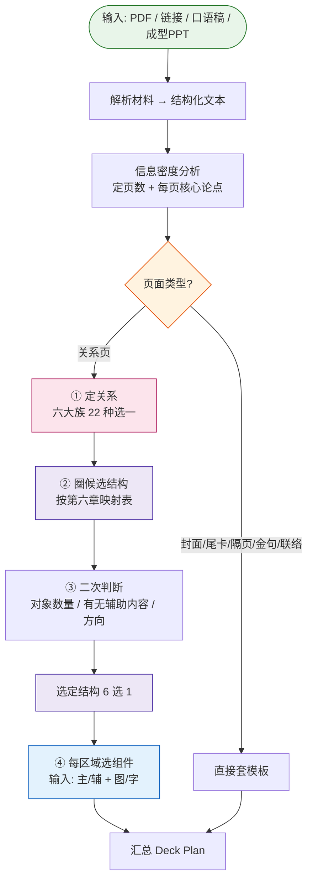

# Skill 设计文档:内容 → 关系 → 结构 → 组件

> 目标:设计一个 Skill,把原始材料(PDF / 链接 / 口语稿 / 成型PPT)转化为可渲染的 Deck Plan。
> 本文档持续微调。

---

## 一、整体流程



---

## 二、四个阶段说明

| 阶段 | 做什么 | 输出 |
|------|--------|------|
| **① 材料解析** | PDF/链接/口语稿/PPT → 统一成结构化文本;若为成型PPT则审计现有页数与论点 | 原始内容池 |
| **② 信息密度分析** | 提取核心论点 + 评估支撑密度,决定页数增删/合并/补充 | **页数 + 每页论点** |
| **③ 页面分流** | 非关系页(封面/尾卡/隔页/金句/联络)直接套模板;关系页进入④ | 页面类型 |
| **④ 逐页四步** | 定关系 → 圈候选结构 → 二次判断 → 选组件 | **每页的关系+结构+组件** |

---

## 三、页面分类:关系页 vs 非关系页

进入"关系 → 结构 → 组件"流程前,先区分页面类型:

| 页面类型 | 走哪条路 | 说明 |
|---|---|---|
| **非关系页** | 直接套模板,不进关系/结构/组件流程 | 封面、尾卡、Outro、章节隔页、金句页、粒子主角页、联络尾页 |
| **关系页** | 进入关系 → 几何结构 → 组件 三段式 | 页面承载信息关系,需匹配版式和组件 |

> **只有关系页才进入版式、组件的选择。** 非关系页只承担节奏停顿、情绪定调、品牌落版等功能,走固定模板。

参考版式库(paper-ink/ai)中的非关系页示例:
- 封面:D1
- 尾卡:D2
- Outro:D3
- 章节隔页:D5
- 金句页:M2
- 粒子主角页:M1
- 联络尾页:D6

---

## 四、信息关系:六大族(MECE)

按第一性原理,信息之间的连接方式只有四种本质形态:
```
A ──→ B    有方向
A ── B     无方向但有连接
A └─ B     包含/从属
A | B      无关系,只是放一起
```
加上"只有 1 个对象""对齐比较"两种边界情况,穷尽为 **6 大族**。

### 判断流程(每页走一遍)

```
只有 1 个对象?           → 重心 Focus(焦点 / 示意)
多个对象,之间:
  没关系?                 → 并列 Parallel(陈列 / 并行 / 指标 / 分布)
  有包含/从属?            → 包含 Containment(层级 / 拆解 / 嵌套…)
  有方向(先后/因果)?     → 有序 Sequential
  要对齐看异同/对应?      → 比较 Comparison(对比 / 矩阵 / 排名…)
  只是有关联(无方向)?    → 连接 Connection
```

6 个分支,**互斥、穷尽**。数字是内容不是关系:数值页照样走六族判断 —— 排名 = 比较(同维度对齐看高低,乱序仍是对比),指标 / 分布 = 并列(无关系放一起);示意图 / 原型归重心·示意,不冒充证据。

### 六大族总表

| 族(中文) | Family(English) | 判断特征 |
|---|---|---|
| ① 重心 | Focus | 只有 1 个对象(焦点 / 示意) |
| ② 并列 | Parallel | 对象间无关系,放一起(陈列/并行/指标/分布) |
| ③ 包含 | Containment | 包含/从属,看边界 |
| ④ 有序 | Sequential | 有方向(A→B) |
| ⑤ 比较 | Comparison | 对齐并排看异同(对比/矩阵/排名) |
| ⑥ 连接 | Connection | 有关联但无方向、无包含 |

### 族内细分

| 族 | 关系(中文) | 语义 |
|---|---|---|
| ① 重心 Focus | 焦点 focus | 单一重心 |
| | 示意 illustration | 插图 / 原型展示,主体无竞品、无对照 |
| ② 并列 Parallel | 陈列 | 无结构罗列 |
| | 并行 parallel | 多条独立并行线 |
| | 指标 metric | 多个关键数字并排 |
| | 分布 distribution | 按位置/区域展开(地图 / 直方图) |
| ③ 包含 Containment | 层级 hierarchy | 上下级从属(谁管谁) |
| | 拆解 decomposition | 整体拆成部分 |
| | 部分整体 part-whole | 部分构成整体 |
| | 嵌套 nesting | 包含/嵌套/内外层 |
| ④ 有序 Sequential | 时序 sequence | 按时序推进 |
| | 流动 flow | 资源/状态流动 |
| | 循环 cycle | 首尾闭合 |
| | 汇聚 convergence | 多路径汇聚到一个结果 |
| | 漏斗 funnel | 从多到少收窄 |
| | 因果 causal | 原因导致结果 |
| ⑤ 比较 Comparison | 对比 comparison | 同维度看异同 |
| | 矩阵 matrix | 二维交叉 |
| | 映射 mapping | A↔B 对应/转换 |
| | 排名 ranking | 按数值大小对齐排序 |
| ⑥ 连接 Connection | 网络 network | 多对多连接 |
| | 证据 evidence | 结论与支撑证明关系 |

> 族是**判断入口**,族内细种是**精确匹配**。两层都保留,既 MECE 又不丢表达力。

### 易混关系辨析

| 三者 | 回答的问题 | 换掉成立吗? |
|---|---|---|
| 层级 | "谁归谁管?" | 是人/组织的**管辖**关系 |
| 拆解 | "整体由什么组成?" | 各部分**加起来=总数**,可量化 |
| 部分整体 | "哪些共同构成整体?" | 强调**共同构成**,非拆的动作 |

> 一句话:**层级看"管辖",拆解看"加总",部分整体看"构成"**。

### 关键共识

1. **不看长相看语义** —— 同样的树状图,可能是层级,也可能是拆解
2. **对比的核心是"维度对齐"**,不是版式
3. **因果的核心是"方向性"**,去掉方向信息就不成立
4. **关系决定版式,数量只决定容量** —— 每页 1 个主关系 + 最多 2 个辅关系
5. **一维分类不单列** —— 按语义归到拆解或层级(分类看标签,拆解看加总,层级看管辖)
6. **数字是内容不是关系** —— 数值页照样走六族:排名归比较(维度对齐,乱序仍是对比),指标/分布归并列(无关系放一起);示意图(插图/原型)归重心·示意,不冒充证据

### Catalog 的 SmartArt 浏览分类

微软 SmartArt 的分类先问“想表达什么”,再找布局,不是按图形外观命名。`references/catalog.html` 借用这套逻辑做**人工浏览投影**,不替换上面的六大族机器判断。官方说明见 [Choose a SmartArt graphic](https://support.microsoft.com/en-us/office/graphics-visuals/choose-a-smartart-graphic)。

| Catalog 入口 | 主要表达 | 与六大族的边界 |
|---|---|---|
| 列表 List | 无顺序、无强连接的并列信息 | 通常来自并列,也可收纳拆解后的等价单元 |
| 流程 Process | 步骤、阶段、时间线、因果或汇聚推进 | 对应有序,箭头/方向是关键 |
| 循环 Cycle | 首尾闭合、持续重复 | 从有序中单独抽出,便于找循环画法 |
| 层级 Hierarchy | 上下级、树状从属、分层 | 对应包含·层级 |
| 关系 Relationship | 非线性连接、对照、映射、中心辐射或包含 | 可跨比较/连接/包含,按主要阅读任务归一处 |
| 矩阵 Matrix | 二维交叉分类,或部分共同指向整体 | 常对应比较·矩阵或包含·部分整体 |
| 金字塔 Pyramid | 比例、层层收窄、由大到小 | 画法入口;实际关系仍可为层级/漏斗 |
| 图片 Picture | 图片、界面、原文或证据本体主导 | 是媒介入口,卡片仍保留示意/证据关系标签 |
| 数据 Data | 图表、指标、排名、地理分布 | Wise PPT 扩展;不是第七关系族,仍回到并列/比较/有序判断 |

> `All` 是聚合入口、`Office.com` 是来源入口、`Other` 是自定义兜底,都不作为本地 Catalog 的语义分类。每张版式、每个组件只进入一个主要浏览入口,关系标签继续显示真实语义。

---

## 五、几何结构清单

> **结构与组件分层**:结构 = 页面怎么切区域(矩形分块);组件 = 区域内画什么形状(放射、环形、蛇形、漏斗都是组件的形状,不是页面结构)。
> G1/G4/H1/J1 等版式的页面结构都是"单区",里面放一个大组件。

**版心与固定件(切分的前提)**:每页都有全 deck 统一的固定件 —— 左上角页眉(章节 kicker)、左下角页码/落款、底部题注行。固定件是外框不是内容区,**一律不算切分**(不论在上/下/左/右)。结构切的是**版心** = 页面减去固定件后的内容区;单区就是版心剩一整块,内容水平垂直居中。

| 结构 | 说明 |
|------|------|
| 单区 | 版心一整块,不再切分;组件水平垂直居中,形状自由(放射/环形/蛇形/漏斗/矩阵…) |
| 左右x等分 | 版心横向均分,x≥2 |
| 上下x等分 | 版心纵向均分,x≥2 |
| 左右不对称 | 版心横向不等分切一刀,任意一侧可再分(通常一主一辅) |
| 上下不对称 | 版心纵向不等分切一刀,任意一侧可再分;常见走法:大区+收束带 / 大区+辅×N / 辅+主区 |
| 网格 mxn | 版心均质分格陈列,含象限 2×2(A7 logo墙 7×4、F4 六宫格 2×3) |

### 矩阵(表格)不是页面结构(易混)

| | 特征 | 例子 | 对应关系 |
|---|---|---|---|
| **矩阵/表格** | 行列双语义在组件内部,是组件的画法 | K4、K1、E4 | 天然对应 **matrix 矩阵** |
| **网格** | 均质分格,格与格等价,只是陈列 | A7、F4 | 天然对应 **陈列/并行** |

> **矩阵(表格)是组件画法,不是页面切分。** 三栏行带矩阵 → 左右x等分(K4,三栏是切分,行带是栏内画法);整页矩阵 → 单区(F1 象限);矩阵 + 收束带/KPI 通栏 → 上下不对称(E4、K1)。与放射/环形/蛇形/漏斗同级:结构只认 6 种矩形分块,不设「表格」。

> 已删除冗余项:左右等分/上下等分(= x等分 x=2)、象限(= 网格 2×2)、上下N段(K1/E4 用"上下不对称"覆盖)、表格(= 组件画法,按页面切分归单区/左右x等分/上下不对称)。

> **固定件的尺度界限**:底部题注/出处带高度 ≤15% 仍视为固定件(归单区,A2 场景画);超过就是独立内容区,要参与切分。

> 可视化浏览:`references/catalog.html?tab=str`(单一结构 tab)。6 种切分各为一个可折叠章节,章节内按“定义/判断 → 空槽变体 → 对应真实示例”联看;每个空槽只挂 `ex` 映射的页面,加载时逐结构校验不漏归/不重归/不跨结构,承载关系 chips 也从示例关系标签实时推导。54 个关系页版式按结构字段程序化归入:单区 24 / 左右x等分 11 / 上下x等分 5 / 左右不对称 7 / 上下不对称 5 / 网格 2。空槽大图 17 张存于 `references/taxonomy-empty/`:10 张提取自 taxonomy(wise-ppt-page-expression)110 张成熟蓝图按槽位几何去重的空槽版式,7 张补造(taxonomy 无「上下等分」「网格」整类与「左右4等分」变体,见 v24/v25);9 种 taxonomy 拓扑全部落入 6 种结构,枚举无缺口。旧 `?tab=strex` 仅作兼容别名,自动归一到 `?tab=str`。

---

## 六、关系 → 结构 映射(候选集 + 二次判断)

> **模型:关系不锁定结构,关系圈定候选范围;二次判断在范围内选定。**

```
关系 → 圈出候选结构(2~4 种)
        ↓
二次判断(对象数量、有无辅助内容、方向偏好)
        ↓
      选定结构
```

### 各关系的候选结构集(经 60 版式反向验证)

| 关系 | 候选结构 | 版式例 |
|---|---|---|
| 焦点 focus | 单区 | — |
| 示意 illustration | 单区(插图/原型展示) | A2、A8 |
| 陈列 | 左右x等分 / 上下x等分 / 网格mxn | A5、A7、F4 |
| 并行 parallel | 左右x等分 / 单区(泳道图,时间轴贯穿) | I4、B3 |
| 指标 metric | 左右x等分(KPI 大数字横带) | C6 |
| 分布 distribution | 左右不对称(地图+数据栏) | C4 |
| 层级 hierarchy | 单区(树/同心环) / 上下x等分(分层栈) / 左右不对称(树+规格) | H3、F2 |
| 拆解 decomposition | 单区(放射) / 左右x等分 / 网格 / 上下x等分 / 左右不对称 / 上下不对称(上总额下四环) | G1、F3、F4、H4、F2、C5 |
| 部分整体 part-whole | 同拆解 | — |
| 嵌套 nesting | 单区(同心环/嵌套框) | H1、H2 |
| 时序 sequence | 单区(时间轴/阶梯/蜿蜒) / 左右x等分(步骤条) | B1、B5、B6、A9 |
| 流动 flow | 单区(流水线) / 上下x等分(双轨) | I1、I3 |
| 循环 cycle | 单区(圆环/蛇形);若带辅助内容 → 左右不对称 | J1、J2 |
| 汇聚 convergence | 单区(汇聚图) | N1 |
| 漏斗 funnel | 单区(漏斗图) / 左右不对称(漏斗 + 两侧标注) | O1 |
| 因果 causal | 上下x等分(因上果下) / 左右x等分(痛→解→效) / 左右不对称(左痛右解) | E3、K2、K3 |
| 对比 comparison | 左右x等分 / 上下x等分(前后双带) | E1、E2、E6 |
| 矩阵 matrix | 左右x等分(三栏行带矩阵) / 单区(整页矩阵) / 上下不对称(矩阵+收束带) | K4、F1、K1、E4 |
| 映射 mapping | 单区(弧线网) / 左右x等分(双列映射) | L2、E5 |
| 排名 ranking | 单区(排行柱图) | C7 |
| 网络 network | 单区(节点连线) | L1、L2 |
| 证据 evidence | 单区(证据墙) / 左右不对称(策略+证据) / 上下不对称(摘要+原文) | A1、A6、A4、A3 |

### 二次判断依据

1. **对象数量**:单个 → 单区(整版大图);多个 → 等分/网格各放一个
2. **有无辅助内容**:要放规格单/收束带/KPI带/说明栏 → 从单区/等分升级为主+辅(不对称)
3. **方向偏好**:横向阅读流(步骤、时间)→ 左右;纵向阅读流(层级、堆叠)→ 上下

---

## 七、组件匹配(待填充)

> 逐页四步的最后一步:结构 → 组件。

### 组件定义(v8 暂定,待组件清单验证)

**组件 = 一种参数化画法。内容数量是参数,不是组件类型。**

- 指标带 = 1 个组件:2 个指标区域 2 等分,3 个 3 等分,4 个 4 等分
- 流程链 = 1 个组件:2 步画 2 节点,5 步画 5 节点
- **画法不同才是不同组件**:箭头链 / 蛇形回环 / 时间轴刻度 / 甘特条带是 4 个组件,哪怕都表达 flow

粒度(v10 修正):**分连接类和陈列类两种** ——

| 类型 | 粒度 | 例子 |
|---|---|---|
| **连接类**(块内有箭头/连线/包含) | 一个整体组件,不可拆 | 流程链、漏斗、树、地图 |
| **陈列类**(块内纯并列) | **单元组件 × N**,排布由结构负责 | 档案卡×3 + 左右3等分;指标单元×4 + 左右4等分;logo 单元×28 + 网格 |

> ⚠️ 不存在"指标带组件/卡片墙组件"这种阵列级组件 —— 那是"单元组件 + 等分结构"的组合。atlas 的 stats(4 格打包)是历史实现,概念上应视为单元×4。
> "一个结构块 = 一个组件"仍成立,但陈列类的"一个组件"指一个单元,同单元可重复填充多个等分位。

### 组件三属性

1. **关系**:表达什么关系(flow / comparison / matrix...)
2. **形状**:吃哪种区域(矮宽条 / 窄高条 / 近方形 / 整页)
3. **容量**:条目范围(如 2~7 步)

### 缩放标尺(v26 起第①层已落地)

组件不连续缩放,用"档位 + 门槛":

| 层 | 规则 | 状态 |
|---|---|---|
| ① 准入门槛 | 组件声明形状范围(min_width/min_height/宽高比范围),区域不在范围内 → 不进候选,换组件 | **已落地**:space_requirements + 逐组件真实 frame(scripts/_component_frames.py,55+26 显式表),frame 即生产排版画布,typed renderer 流式重排 |
| ② 字号档位 | 组件内字号固定几档(display/heading/body/meta token),内容数量决定用哪档(如指标带:2~3个→100px,4~5个→64px,6个→40px) | 渲染器内部 token 制,部分实现 |
| ③ 容量上限 | 字号降到最低档还装不下 → 超容量,不选此组件,换画法或拆页 | 已落地:capacity min/max + 文本密度校验 |

> "能缩多小" = 最低字号档 × 单条最小排版面积,到此为止。"能放多大" = 区域大选整页级组件,字号有上限,撑满即止。
> **验证方法**:拿 2~3 个真实组件(指标带、流程链)试切进不对称结构的小区域,看档位表是否成立。

**待办:**

- [x] 组件清单(已清洗合并,见 references/catalog.html 组件 tab;atlas 61 + echarts 12 → 35 组)
- [ ] 结构 → 组件映射规则(待定义)
- [x] 缩放标尺:第①层准入门槛与第③层容量上限已在生产落地(v26);第②层字号档位由渲染器 token 制承接
- [ ] 待验证:选组件时是否需要两个输入参数 —— ①主/辅(定视觉权重) ②图/字(定组件类型)。来自已有体系 blocks 层(importance / semantic_form),必要性未定,等组件清单来了一起验证。

### 组件清洗结果(v9)

**剔除项去向(不属于组件):**

| 原 atlas 项 | 去向 |
|---|---|
| cover 封面(#1)、toc-card 目录(#5)、quote 引用(#11) | 非关系页模板参考 |
| two-col(#7)、three-col(#8)、split-v(#9,#10) | 版式结构参考 —— 只切区域不承载信息,是「结构」不是组件 |

**合并规则:** 数量是参数(步数/环数/圆数/层数合并为一组),样式开关不产生新组件(arrow/smooth/inverted 等记为参数),画法不同才是不同组件。

**合并后 35 组组件**(文字排版 5 + 比较 7 + 流程时序 5 + 结构 8 + 数据 2 + ECharts 8):
- 流程链 ← 9 个变体合并(#25~33);同心圆 ← 5 个(#43~47);前后对比 ← 4 个(#16~19)
- 浏览: `references/catalog.html`(四个 tab:非关系页模板 / 关系页版式按 SmartArt 语义入口 / 结构(空槽变体与对应示例联看) / 组件按 SmartArt 语义入口)

---

## 修订记录

- **2026-08-14 v26**:M1 粒子主角页定案归非关系页。v21 起存疑的"粒子效果件"结案:粒子是氛围 canvas 效果、不是关系页图形本体,提问式文案属情绪定调,整页按非关系页模板处理(D 系/M2 同类),不从版式抽组件。版式池 55→54(⑤关系组移出,单区 25→24,门禁同步),非关系页模板 7→8(新增粒子主角页类型);catalog 组件 tab 存疑区清空,组件 badge 回到纯计数 72。
- **2026-08-14 初版**:确定三阶段流程、6类核心关系 + 待定候选、8种几何结构、关系×数量×方向映射表。组件匹配待填充。
- **2026-08-14 v2**:关系层重构为六大族 MECE 体系。补入因果、陈列(共19种细种)。一维分类不单列。基于已有 17 种页面信息关系合同(decomposition/part-whole/nesting/focus/convergence/funnel/evidence/mapping 等)。
- **2026-08-14 v3**:反向验证 60 个版式,六大族全覆盖。新增"关系页 vs 非关系页"分类(非关系页直接套模板,不进关系流程)。
- **2026-08-14 v4**:几何结构重构。核心修正:结构与组件分层(放射/环形/蛇形/漏斗是组件形状,不是页面结构)。结构收敛为 7 种,新增网格 mxn(象限推广)和表格(行列双语义,对应 matrix),删除冗余项(左右/上下等分、象限、上下N段)。
- **2026-08-14 v5**:撤销"不足2(spatial_primitive 中间层)"。经 6 页示例验证:spatial_primitive 的 19 种原语把页面切分和组件形状混在一层(bilateral-split 是切分,radial-burst 是组件形状),我们的「结构+组件」两层已完整覆盖,不需要加中间层。
- **2026-08-14 v6**:重写「关系→结构」映射。模型修正为:关系圈定候选结构集(2~4种),二次判断(对象数量、有无辅助内容、方向)在范围内选定。补充 19 种关系的候选结构表(经 60 版式反向验证)。
- **2026-08-14 v7**:更新整体流程图。合并原三阶段为四阶段(新增"页面分流");逐页流程从"查表"改为"定关系→圈候选→二次判断→选组件";不足3降级为组件匹配的两个输入参数(主/辅、图/字)。新增 AGENTS.md 沟通与工作方式约定。
- **2026-08-14 v8**:组件定义暂定:组件=参数化画法,内容数量是参数不是类型;画法不同才是不同组件。粒度:一个结构块=一个组件。缩放标尺假设:不连续缩放,用"准入门槛+字号档位+容量上限"三层,待真实组件验证。
- **2026-08-14 v9**:组件清单清洗完成。atlas 61 + echarts 12 → 剔除 6 项(封面/目录/引用→非关系页模板;双栏/三栏/垂直分栏→结构参考)+ 合并变体 → 35 组。新建 references/catalog.html 总目录页(非关系页模板/关系页版式六大族/组件),三大资产一页浏览。
- **2026-08-14 v10**:接入 taxonomy 资产(native 墨线组件 33 个移植)。修正组件粒度:分连接类(整体不可拆)与陈列类(单元×N,排布归结构),"指标带/卡片墙"不是组件而是单元+结构的组合。反向抽取三分:已有实现(14,预览组件本体)/待新做(6)/可并入(5)。
- **2026-08-14 v10**:目录页配色统一纸墨。catalog.html 外框色值全部改引 themes/paper-ink/assets/design-tokens.css(纸 #DFE0D9 / 墨阶 / 强调红 #C0392B),六族彩色标签改为墨底反白;组件预览从裸 swiss 渲染改为过 paper-ink.atlas 适配器(srcdoc 直出,瑞士橙 #d95e00 全部洗成墨阶)。gallery-components 组件画册移除 Paper Ink/Swiss 切换按钮与 ?theme=swiss 入口,强制纸墨;swiss 主题与适配器保留在 themes/,暂不开放。
- **2026-08-14 v11**:catalog.html 新增「结构枚举」tab(版式与组件之间)。7 种切分各一节:SVG 抽象示意图(单行虚影画法自由 / 等分 x=2~4 / 主辅不对称含可再分 / 网格 2×2、2×3、7×4 / 表格行列双语义+收束带变体)+ 判断要点 + 承载关系 + 归入版式 chips(点击跳版式 tab 高亮)+ 代表版式实拍。归入从 FAMS 结构字段程序化解析,与版式 tab 永远一致;E4"上下2等分+底带"按行列双语义计表格。
- **2026-08-14 v12**:全量 55 版式实拍复查结构标签(逐张视觉核对页面真实切分)。改 2 处:B3 泳道路线图 上下3等分→单行(泳道横线是组件画法,时间轴贯穿所有泳道,页面是一张连通大图);O1 漏斗 单行→左右不对称(左 30% 步骤文字 + 中 40% 漏斗 + 右 30% 数据标注,主+辅+辅)。其余 53 张维持,含两处边界裁定:H3 分层栈维持上下4等分(满宽层带、列不对齐无列语义,不算表格);I3 双轨维持上下2等分(两层是独立内容区,中央箭头是组件连接)。同步第六章:并行候选改"左右x等分 / 单行(泳道图)",漏斗候选改"单行(漏斗图) / 左右不对称(漏斗+两侧标注)"。
- **2026-08-14 v13**:A2 场景画 上下不对称→单行(整页场景画 + 底部 10% 题注行,题注是大图附属不是独立内容区)。新增边界规则:顶部/底部仅一行题注带(≤15% 高)不算切分,归单行,写入第五章。结构枚举 tab 每节从"代表版式 + 编号列表"改为归入版式全部 iframe 展示。
- **2026-08-14 v14**:catalog 组件预览重构为页面原生渲染(atlas/native snippet 注入 + ECharts 页面内 init,废除全部预览 iframe,解决 file:// 嵌套限制与样式不统一);组件统一按六大族分组;新做 6 个待抽取组件入池(映射弧线网 L2/权重弧网 L1/三向放射图 G1/嵌套框 H2/排行柱图 C7/蛇形回环 J2,纸墨线稿,参数化容量),待抽取区清空,仅剩 5 项可并入待裁。
- **2026-08-14 v15**:关系层扩为七大族(新增 ⑦ 数据:排名/分布/指标;① 重心内新增"示意"细种);结构层收敛为 6 种(删「表格」,矩阵/表格降级为组件画法)。改 10 张:C7 排行柱图 对比(排名)→数据·排名;C6 KPI 横带 陈列→数据·指标;C4 分布地图 空间→数据·分布;A2 场景画、A8 后台 mock 证据/层级→重心·示意(A8 结构 左右不对称→单行);A3 文献摘引 上下2等分→上下不对称(上摘要下原文);C5 环形进度环 并行+部分整体→结构·拆解 + 上下不对称(上总额下四环);E4 前后对比矩阵 表格→上下不对称(矩阵+KPI通栏);K4 三栏行带矩阵 表格→左右3等分(三栏切分,行带是栏内组件画法);K1 维持上下不对称但关系改纯"矩阵"。结构归入计数:单行 25 / 左右x等分 11 / 上下x等分 5 / 左右不对称 7 / 上下不对称 5 / 网格 2。catalog 结构 tab 同步 6 节(上下不对称新增"上主下辅×4"示意图变体,并修正"上主下收束带"示意图比例:上主 68% 大矩阵 + 下 32% 窄收束带)。
- **2026-08-14 v16**:catalog 组件预览修复"画布套画布"。场馆(16:9 纸色)定为唯一画布:组件根画板(.swiss-card/.pi-card)强制透明,不再自带底色。缩放与居中改按"内容包围盒"(实际画了东西的框:文字 / 非透明背景 / 可见边框 / svg getBBox),不再按组件画板整盒 —— 修复大量组件画板内留白导致的内容偏上/偏左(如 swot #020、时间线 #039、流程链 #025 等 dy -30~-80),全部 64 个 atlas/native/新做组件内容盒水平垂直居中;resize / 切回组件 tab / 字体就绪后自动重排;ECharts 保持整画布图表不动。
- **2026-08-14 v17**:catalog 预览比例与性能收口。版式/组件外框统一原生 16:9;atlas/native/新做组件先在 1280×720 PPT 内层画布保持原尺寸居中,再按外框整体缩放,不再直接放大填满卡片。首屏移除约 2.91MiB 同步组件脚本:进入组件 tab 才加载 atlas/native,约 2.44MiB ECharts 资源延迟到首张图表接近视口;组件由 IntersectionObserver 每帧最多挂载 2 张,离屏动画暂停;版式 iframe 改为视口邻域挂载、远离后卸载;卡片启用 content-visibility,resize 用 requestAnimationFrame 节流并复用内层几何测量结果。
- **2026-08-14 v18**:撤销数据族,回归六大族。理由:数据族量的是"内容是不是数字",与语义六族不同维度,并列摆放不互斥(C6 KPI 同时命中陈列与指标、C7 排行同时命中有序与排名)。数字是内容不是关系,数值页照样走六族判断。并入去向:排名→比较(新增细种,排序是呈现选择,乱序仍是对比)、指标/分布→并列(新增细种),细种总数维持 22。删除"空间"标签:geo-map→分布,district-map→示意。族③"结构 Structure"改名"包含 Containment",避免与页面切分层的"结构"重名。catalog 版式 tab(六族重分组:C6/C4→并列,C7→比较)、组件 tab(新设重心·示意组,geo-map→并列组)、映射表、AGENTS.md 切分数(7→6)同步。
- **2026-08-14 v19**:结构层三项收口。① 新增「版心与固定件」前提:每页固定的左上角页眉 / 左下角页码 / 底部题注行是外框,一律不算切分;结构切的是版心 = 页面减固定件的内容区(原"题注带≤15%"边界规则升级为通用规则,15% 保留为固定件尺度上限)。② "单行"改名"单区"(版心一整块,组件水平垂直居中),消除"矮宽条带"误读;catalog FAMS 25 处结构标签、structKeyOf、STRUCTS 定义同步。③ 不对称定义去主辅化:左右/上下不对称 = 版心不等分切一刀、任意一侧可再分,主辅降级为判断提示 —— 与二次判断"有无辅助内容"衔接:不对称是果,主辅是因。
- **2026-08-14 v20**:抽取组件改为"抄原版"。6 个新做组件(映射弧线网/权重弧网/三向放射/嵌套框/排行柱图/蛇形回环)此前为手绘简化线稿,样式与原版差距大;现改为逐元素抄录原版 frames 的 scene:用脚本执行原版绘制 JS(stub DOM)序列化为静态 SVG,坐标/线宽/字号与原版完全一致,仅做三处机械替换(字体 var(--sans)/var(--mono)→var(--pi-*);hatch pattern id 加组件前缀防同页冲突;包 .pi-card 并内联覆盖其固定 600×600 防裁切)。卡片标签"新做组件"改"版式抄录"。教训:**从已验收的版式抽组件,抄图形本体,不重画**。
- **2026-08-14 v21**:反向抽取收口 + 抄录组件比例修正。① "可并入"4 项(J1 环形循环/J3 旅程曲线/B1 时间轴/H1 同心环)不并入 atlas 近似件,按抄原版方式独立入池(cycle-ring/journey-curve/timeline-axis/concentric-ring,归入有序·循环/时序与包含·嵌套组);M1 粒子件维持"存疑"单独列出(氛围 canvas 效果,非图形本体)。组件池 73→77。② 比例修正:抄录 scene 是整页 1920×1080 坐标系,直接进预览按原尺寸渲染会把浮层撑满。对照 taxonomy 画册组件基准(每组件声明 space_requirements 固有尺寸/长宽比,预览约占 2/3、四周留白):离线估算每个组件内容包围盒(几何精确+文字估宽),算各自缩放系数,svg 缩到内容约 880×520 标准盒(viewBox 保留整页坐标,几何不动)。视觉复检:宽向约 65~72%、留白舒服、无裁切。教训:**从版式抄组件,抄完要按组件固有尺寸重定标,不能带着整页坐标系进池**。
- **2026-08-14 v22**:Catalog 改用 SmartArt 的“按表达意图选类型”做人工浏览投影。关系页版式与组件统一分为 List / Process / Cycle / Hierarchy / Relationship / Matrix / Pyramid / Picture 八类,另加 Wise PPT 的 Data 扩展收纳图表、指标、排名与地图;`All / Office.com / Other` 不作为语义分类。六大族仍是机器关系合同,结构仍只认 6 种版心切分,SmartArt 分类不反向改写关系或结构。55 张关系页版式与 77 个组件各归一处,页面加载时检查总数与重复键。
- **2026-08-14 v23**:catalog tab 记忆:切 tab 时用 replaceState 把当前 tab 写进地址栏(?tab=),刷新即停在当前 tab,链接可直接分享;一次性的 scroll 深链参数用后即从地址栏清掉。初始化顺序改为"先应用 scroll 再切 tab",避免参数被提前清掉导致深链定位失效。
- **2026-08-14 v25**:组件目录逐卡修订 13 处,组件池 77→72(门禁同步)。① 摘牌 5 项:pain-list #091 / pipeline-strip #092 / arch-table-band #082 / vs #015 / radar #060(仅目录摘牌,数据文件条目保留以稳编号;雷达保留 ECharts 版)。② 改画 6 张:alert-box #012 四条→三条;fishbone #050 整体重绘为主骨+箭头头+上下各 3 肋骨各带 2 小骨的纸墨 SVG(颜色走 style 声明,绕过适配器选择器改色);infra-strip #093 补全为完整层带(上下规线+左层标+5 个细线图标能力件,画法对齐 H3 基础层);icon-grid #086 删底部说明句,两行内容各自在行带内居中;radial-progress #085 单元×N 改水平一排;process-loop #034 大圆虚线深一档(ink-25→45)。③ ECharts 三图几何校准(对 taxonomy 参考系量像素修):pie 盘径 34%→48%(卡片)/44%(详情),图例从贴画布底改到盘正下方;calendar cellSize 'auto' 在 16:9 宽画布把格子拉成 23~28px,改锁 11px 宽 + left:'center' 居中;sanky right 26% 是给右侧标签留的位,宽画布下不必,改 12%/11% 恢复水平居中。教训:**ECharts 组件从方画册移植到 16:9 画布,百分比与自适应参数不能照抄 —— 半径百分比基准是短边、'auto' 会按宽边拉伸、留白型 margin 要按画布宽重估,逐项量像素校准**。
- **2026-08-14 v24**:结构 tab 拆两个 + 小图换大图。「结构枚举」拆为「结构切分」(?tab=str)与「结构示例」(?tab=strex):前者是 6 种切分的定义(判断要点 + 空槽大图),后者是 55 版式按切分归组的全部实拍。结构切分弃用手绘 SVG 小示意图,改用 taxonomy 空槽版式大图(wise-ppt-page-expression 110 张成熟蓝图按槽位几何去重出 10 张,提取到 `references/taxonomy-empty/`,含同槽来源与拓扑 id,见 manifest.json)。覆盖度核对:9 种 taxonomy 拓扑(leaf / split-x-2/3.equal / split-x/y-2.dominant-start/end / recursive-y-equal-then-x / split-x-y3@1)全部落入 6 种结构,枚举无缺口;反向发现 taxonomy 空槽版式**没有「上下等分」与「网格」**(上下切分全是不对称,整版网格墙折叠成单槽 A1 的 37 源合并),这两种按同一空槽规格补造 6 张(x=2/3/4 与 2×2/2×3/4×7),卡片标注「补造」。教训:**结构枚举对齐空槽几何,不对齐手绘示意;比对参考系要用它的去重产物,不用逐蓝图原始数据**。
- **2026-08-14 v25**:结构切分的分点跟着结构示例走。① 每个空槽分点标注对应示例页(ex 字段,与「结构示例」tab 同一批数据),加载时逐结构校验闭合:示例页不漏归、不重归、不跨结构,违反即抛错(与 SMARTART 分类闭合门禁同级)。② 分点补齐:左右等分补 x=4 变体(示例 A9/C6,taxonomy 把多屏画廊/KPI 横带折叠成了单槽,补造第 7 张);网格 2×2 明确标注"象限特例,无示例页"(F1 象限是组件画法归单区)。③ 承载关系 chips 弃手写清单,改从本结构示例的关系标签实时推导(去括号限定、拆" + "与" / "复合标签)——修掉单区漂移(手写含"漏斗"但漏斗页 O1 在左右不对称,漏"对照"即 M1),左右等分补上 K4 的"矩阵"。单区分点 ex='all' 显示"单区全部 25 版式"。空槽大图 16→17 张(补造 6→7)。
- **2026-08-14 v26**:组件 frame 声明修复,消灭 600×600 强制方卡(生产 skill 侧)。① 根因:81 个 fixed 组件的 frame 是三处代码缺省值(Atlas 55 + Native 26 各一处,共 3 个例外),不是从源数据读的 —— 上游 atlas 本是 width:600/min-height:600 可增长方卡预览约定,Native 26 个从 16:9 页面样张烘焙时统一塞进 600×600 viewBox。② 定形:Atlas 按 vendor snippet 实测内容包围盒(浏览器逐个渲染,catalog contentBounds 口径)取比例;Native 按 spec 既有长宽比区间中心(样张血统手写值),profile-card/annotation-callout 沿用设计仓库自然画布,contact-card/radial-progress 用近期重排实测;统一按面积 ~420k px² 锚到生产尺度(宽 ≤1500、高 ≤720、短边 ≥60、取整 10px),落成 scripts/_component_frames.py 显式表(55+26),export_component 与两个 legacy spec 共同引用,缺省路径删除。③ 联动:space_requirements 区间只扩不缩(±2.2 倍 clamp [0.45,24])、min 宽高只降不升(0.75×frame,下限 240/140),文本密度校验不过的回退旧值(logo-cloud、swimlane-roadmap);typed renderer 本就是流式 CSS,frame 即生产排版画布,构图直接跟随重排。④ 结果:正方形 frame 78→8(只剩同心环/循环环等真方的),fixed/fluid 计数 81/27 不变;门禁换血:单区 1500×620 可进 102→102(细链/超细时间轴/竖构图退出,文档块/放射/图标格进入),横带 1500×300 27→47(横条组件首次进得了横带),窄栏 500×620 27→42(方形/竖构图进得了窄栏);画册 pipeline/steps 推荐由 process.default 换为 annotated/annotated-arrow;golden 示例与全量测试(453 过)刷新。⑤ 居中修复(用户复检指出 admin-console/watershed-axis/swimlane-roadmap/gantt-ink/icon-grid 偏心):catalog contentBounds 的 svg 分支从整体 getBBox 改为"可见元素联合盒"——累计 opacity<.35 的淡墨注脚不参与包围盒,防止注脚把盒拉偏致预览主体不居中;watershed-axis 注脚收进主体包络(y552→522/y556→526,两份 paper-ink-components.js 同步);26 个 native entry.frame 声明同步为真实画布。教训:**frame 是生产排版画布,不是预览画板尺寸;预览按内容包围盒居中时,"画了什么"要按视觉主体算,淡墨注脚不算**。待办:老 native snippet 证据仍是 600×600 方卡构图,按真实画布重绘另立项;gallery-components 旧画册的强制方形预览(1/1 thumb)属遗留页未动。
- **2026-08-14 v26**:修复浮层整页预览底部灰带。renderFrame(版式/空槽图弹窗)此前只按宽度缩放并锚在左上角,浮层舞台(约 1.61:1)比 16:9 更"高"时页面下方露出舞台底色 paper-deep(#D4D5CD),空槽图大面积留白时尤其显眼;改为 min(宽比,高比) 等比缩放 + 居中(translate 补偏),补边染 --paper 与页面同色,视觉无缝。组件弹窗(fitStage)本就是 min+居中,未受影响。
- **2026-08-14 v27**:catalog(资产目录页自身 chrome,非内嵌帧)配色回归 token + 字阶收敛 + 性能两修,向画册/六页示例的克制气质看齐。① 配色:卡片底 rgba(255,255,255,.45)→var(--paper-panel)(.22,此前比规范轻抬升面板重一倍,整页发白);选中 tab 纯白 #fff→paper-panel;浮层遮罩与 80px 大阴影的 rgba(20,20,18)(RGB 并非墨色 25,25,23)→color-mix(--ink 55%) 与 --shadow-specimen 硬投影,浮层箱改实底 --paper;深链定位闪环 --accent-red→--ink(强调色默认关闭);chips/家族 tag/关闭钮圆角 2px→0;C7 抄录件中从未被引用的 hatch30red 死定义删除(原版红 hatch 本就仅 accent 模式启用,目录默认态无红)。② 字阶:字号 8 档(10/11/12/13/14/17/20/22)收敛 4 档(13/15/18/20),10–12px 归 13(规范最小档);字重收敛 300/400/500,去满屏 600/700,层级改用墨阶 + letter-spacing 表达;卡片 id/tab 计数/家族 tag/组件英文名统一 Courier mono;fam-head 2px 黑底线→1px ink-25 发丝线,note 左粗条 3px→2px。③ NEW_MARKUP 组件 SVG 27 处非阶梯墨色文字落阶:.85→.8×5、.75→.7×1、.6→.55×16(图内标注即"图表标签 55%"档)、.5→.55×3,另两处 --type-body 正文→.7(正文 70% 档);元素 opacity= 属性不动(那是组件绘制语言,J3 原版帧同款,不属配色 token 体系)。④ 性能:iframe 滚出视口即 removeAttribute('src') 卸载改为一次性加载后保留——滚回来不再整帧重载(不闪白、不重复执行帧内绘制脚本),离屏绘制成本由 .card 的 content-visibility 兜底;浮层 ECharts 此前每次打开 echarts.init 新实例且从不 dispose(逐次泄漏),close 与重开前先 dispose。⑤ taxonomy-empty 7 张补造空槽图尾部重复闭合标签(</html> 后又跟一段 </div></div></body></html>)裁净。教训:**目录/工具页也是 deck 的脸,chrome 必须走同一套 token,嵌入的帧再好看也救不了外框乱;SVG 文字色与元素 opacity 分属两套体系,审计只盯色值会漏、盯 opacity 会误伤**。
- **2026-08-15 v28**:catalog 组件预览完成 Native 真实比例反归一化。根因不是卡片外框(外框已是 16:9),而是历史 native snippet 抽取时把内部坐标统一烘焙进 600×600 `.pi-card`/viewBox,导致 `entry.frame` 虽已声明真实宽高,预览仍按方卡构图。修复只作用于 catalog 原生预览链路:挂载与浮层统一读取 `entry.frame`;HTML 组件直接按声明宽高流式重排;SVG 用非等比坐标映射恢复原横纵空间,同时对文字、圆形节点和小型语义组做反向比例补偿,线条启用 `non-scaling-stroke`,因此位置回到真实比例但字形/圆点/线宽不被拉胖。`fitStage` 对已声明 frame 的 native 改以完整 frame 为 contain 边界,不再让历史内容 bbox 反向覆盖比例合同。浏览器回归:组件 tab 当前 28 张 native 卡片全部挂载,根画布实测纵横比逐张等于声明值(含 960×440 阶梯、580×720 联络卡、1050×140 指标横带),浮层沿用同一链路,控制台 0 error。范围边界:`gallery-components` 遗留 1:1 thumb 未改,本次只修用户指向的 `references/catalog.html?tab=cmp`。
- **2026-08-15 v29**:catalog 浮层支持左右切换。浮层左右边缘加 ‹ › 按钮(垂直居中,样式对齐关闭钮,到头禁用不循环),信息栏右侧加 `n / N` 计数;键盘 ←/→ 翻页、Esc 关闭保留。翻页序列 = 当前 tab 全部 `[data-modal]` 卡片按页面顺序连续翻(跨 SmartArt 分组接着翻),5 个 tab 各自独立(版式 54/组件 72/空槽 17/示例 54/模板 8)。翻页时幕后页面瞬时滚到当前卡(`scrollIntoView block:center`),关浮层正好停在看的那张,顺带触发该卡懒挂载。组件卡点开的"两段守卫"(第一下挂卡片预览、第二下进浮层)不变;键盘与按钮翻页绕过守卫直接渲染,渲染前按 spec 类型 await 对应懒加载资源(ec→ECharts 脚本,atlas/native→组件核心;数据已在位则直接渲染不闪占位),连续快翻用 token 防慢资源回写旧舞台——修掉翻到未挂载 ECharts 卡时的"渲染失败"。教训:**测试点卡片要点卡片信息区文字,点卡片中心会点进预览 iframe,事件进子页面、父页监听收不到,表现为"点击无反应"**。已知未动:浮层 ECharts 详情固定 1600×900 只按宽缩放,窄窗口下底部可能裁切。
- **2026-08-15 v30**:E6 前后双带演进页删底部金句条、双带等高。① 删金句:去掉 After 带下方的"竖条+一句话"(ai/general 各自文案),页面结论只留底部题注行,顺带清掉只被金句引用的死变量 SERIF。② 等高:Before 带 250→280(对齐 After 带),结构从"250/280 不等"回到目录标签宣称的"上下2等分";Before 头部行(徽章/标题/SCATTERED)随带上移 30,散件卡与右侧注记微调上移 15,After 带与全部内容零改动;整组 translate 由 -41.7 改 +20,版心仍居中(内容中心对齐"页眉底~题注顶"可用区中线 ≈505)。③ 合同同步:画廊帧改后用生产生成器(skill 侧 derive_registry_outputs,临时克隆树跑)重算 ai/general 两份 implementation 合同与 registry 两条登记——literal.027 全链路移除(字段/schema/默认值),canonical_fingerprint 与画廊文件 sha256 刷新,其余字段零变化;canonical-layouts 两个文件手工同步同几何,与画廊脚本经 token 反替换后逐字节一致。教训:**改画廊帧必须连带重算实现合同,指纹是逐字节的;canonical 帧不独立渲染(__wiseThemeToken 由生产管线注入),验证它用"反替换后与画廊脚本 diff",不用浏览器截图**。
- **2026-08-15 v31**:F4 图标六宫格对齐网格2×3空槽规范。原网格 440×330 格、1320 宽居中浮动(靠 translate -85.7 硬居中),与结构标签"网格2×3"宣称的页面切分对不上;现六格严格等分版心:列左缘 210/710/1210(格宽 500)、行顶 196/506(格高 310),即版心 1500×620 @ (210,196) 三列两行整除——与 taxonomy 空槽图 synth-grid-2x3 的槽位几何逐值一致(该几何即 space_contract 1500×620 的来源,F4 此前没对齐自己的合同)。构造线从"仅上下两条缘线"升级为"外框 + 双竖缝 + 横中线"淡虚线(同 dasharray 2 6 / opacity .22 词汇),六等分肉眼可见;translate 归零,格内容沿用原排(icon 居上、标题/英文/分隔线/两行说明),在 310 高格内上下留白 32/30。ai/general 双变体同步;实现合同重算仅 3 处指纹变化(字面零增减)。教训:**结构标签宣称的切分,要能对到空槽几何上;居中不该靠 translate 硬凑,先把版心除尽再谈居中**。
- **2026-08-15 v32**:合并组变体源码回归浮层 + #061 摘牌补记。① 背景:画册对账发现 atlas 26 个变体(#003-004/#017-019/#026-033/#035-037/#040-041/#044-047/#049/#053/#056/#058)与 ECharts 4 个变体(line-smooth/line-stacked/bar-dynamic-sort/scatter-to-bar-anim)被"合并 #XXX-YYY"藏了源码——目录只挂代表 snippet,生产 taxonomy 虽有全部条目但模型在目录层看不到变体画法(同心圆顶部/底部对齐是半圆叠层,真不同画法)。② 改法:SMARTART_COMPONENTS 14 个合并组(11 atlas + 3 ec)加 `vr` 变体表(spec+短标签,首项=代表),compCard 写入 `data-vr`、mtag 追加"变体×N";浮层信息栏标题右侧渲染变体 tab(墨底反白激活态,右对齐可换行),点击走同一 renderSpec 通道重渲该变体 snippet/option;‹ › 仍是跨卡片翻页不动,非合并组无 tab,翻页后 tab 随卡片重建。③ 门禁 assertVariantRefs:vr≥2、首项=卡片代表 spec、引用条目须真实存在(atlas 在 mountAllComponents 校验,ec 在卡片懒挂载与浮层 ensure 两处复检),违规抛错与分类闭合门禁同级。④ #061 radar-hex 六边形雷达图补记摘牌:与 #060 同因(雷达保留 ECharts 版),数据条目保留以稳编号——它此前是唯一"不在池且无删除记录"的画册项;其余画册缺项均为有意退役(7 项整页脚手架)或摘牌(v25 五项)。浏览器回归:同心圆 5 变体/流程链 9 变体逐个切换内容各异、ECharts 折线 3 变体重渲正常、‹ › 翻页后变体 tab 正确复位、门禁零报错。
- **2026-08-15 v33**:catalog atlas 预览按标准盒放大(用户复检指出 venn #052 等全族过小)。① 根因两层:上游 swiss-card 画板是 600×600 方形预览遗产,组件画完普遍只占 480 宽且不少天生细条(流程链 480×52);`fitStage` 缩放公式 `min(1280/bw,720/bh,1)` 末项封顶 1.0 只缩不放。实测 61 条目 scale 全 1.00、画布占比 1.5%~30.3%,对照 native 平均 42.8%(中位宽 890)——25 张 atlas 卡全数偏小,且连 taxonomy 自声明的 space_requirements 都达不到(旅程图声明最小 760×280,预览 309×56)。② 修法(只动 catalog 预览链路,catalog.html 与 catalog-center-test.html 同步):atlas 挂载(卡片 mountStage + 浮层 renderSpec 含变体切换)给 host 打 `dataset.scaleUp`,`fitStage` 据此把上限从 1.0 改为 `max(1,min(880/bw,520/bh))` —— contain 进 880×520 组件标准盒(与 native/抄录同盒),只放大不缩小(超盒高的 #006/#056/#061 维持原样);native/抄录维持 1.0 封顶,已重定标成果不被吹大。③ 验证:改后 fitStage/contentBounds 原样抽进一次性审计页跑全量,61 atlas + 3 native 对照 sActual=sExpected 逐条 OK,native 全 1.000,venn 260×180→750×520(42.3%,恰在 native 均值);细条组件保持真形(流程链 880×95)。教训:**1.0 封顶是给"已重定标组件"的保护,放开它必须按来源族放(atlas 放、native/抄录不放),全局放开会吹大别人的定标成果;vendor 方形画板是预览约定,不是组件尺寸合同**。
- **2026-08-15 v34**:弹窗(浮层)全量居中修复,用户复检指出 radial-progress #085 与 geo-map 不水平垂直居中。① 全量实测(临时壳页自动逐个点开 89 个弹窗量"实际绘制内容中心 vs 舞台中心",像素级复核两张):三类病灶——(a) ECharts 11 张全部顶贴边(1600×900 只按宽缩放、钉在 top:0,舞台 1178×729 非 16:9,底部空 66px),即 v29 已知未动项;(b) native #085 等按声明 frame 居中但内容只占 frame 一部分(#085 的 950×440 框内容只占上部约四成,偏上 102px)——根因是 reshapeNativeSvg 按整块 viewBox(600×600)取均匀比例并锚定左上,而 frame 是按内容包围盒比例定的,两者错位;(c) atlas 若干张(#012/#016/#043 等)偏 15~102px——contentBounds 的 svg 分支在入场淡入播完前测量,动画元素当前 opacity≈0 被当淡墨剔除,包围盒退化为整体 getBBox(含注脚)拉偏。② 修法(均在 catalog.html):ECharts 弹窗改 min(宽比,高比) contain + translate 居中(与 renderFrame 同式);native 弹窗不再套声明框(声明框仍是卡片预览/生产的比例合同),按 snippet 原生比例渲染、contentBounds 量实际绘制内容居中,与 atlas/抄录弹窗一致,另在入场动画放完(约 1.1s)后复量一次兜时序;contentBounds svg 分支补动画感知(svg 内有动画播放时跳过淡墨过滤,先按全量几何粗定位,复量再收紧);卡片挂载同样补动画后复量(refitAfterMotion)。③ 验证:修复后 89 个弹窗(72 组件 + 8 模板 + 8 版式取样 + 3 结构示例)复测全部 0 偏移,iframe 类 17 张本就居中未动;#085 与 geo-map 像素级复核内容主体落于舞台中部。教训:**"按框居中"只有当内容铺满框才等价于"按内容居中",frame 比例合同与内容实际占比是两回事,审阅视图以肉眼所见为准;测量入场动画中的几何,opacity 不可信,要么动画感知要么动画后复量**。遗留:卡片预览里 native 内容仍按 frame 定位(内容不满框时同样偏小偏上,视觉影响小于弹窗),如需让内容铺满声明框要改 reshapeNativeSvg 按内容包围盒取比例——影响卡片预览与生产链路的定标语义,另立项拍板。
- **2026-08-15 v35**:Native 组件比例链路回归修复。v28 直接把历史 600×600 整块 viewBox 非等比撑到 entry.frame,但多数 snippet 的真实内容只占方画板一部分,等于把内容自带比例重复拉伸;v34 又让弹窗绕开声明 frame,导致同一组件卡片与详情是两种构图。现统一为“先取 SVG 实际绘制内容联合盒并留 2.5% 安全边 → 再映射声明 frame”:裁掉历史方画板留白后才计算横纵补偿,文字/圆点/小型语义组与线宽保护不变;Native 浮层恢复 applyDeclaredFrame,卡片与详情共用同一 DOM 变换,只允许外层整体缩放不同。原始 gallery-paper-ink/ai 帧、组件 snippet、分类与变体数据均不改。
- **2026-08-15 v36**:Catalog「结构切分 / 结构示例」合并为单一「结构」tab。6 类结构改为一次最多展开一类的章节;每个空槽变体左侧固定展示空槽,右侧只展示 `ex` 映射的真实版式,直接形成“判断 → 空槽 → 示例”阅读链。保留原 STRUCTS/byStruct 与不漏、不重、不跨结构门禁,计数仍为 6 类 / 17 空槽 / 54 示例;网格章节就地保留“网格 ≠ 表格”边界。旧 `?tab=strex` 自动归一到 `?tab=str`,新增 `structure=` 章节深链;收起章节或离开结构 tab 时卸载该章 iframe,返回时重新懒挂载;浮层翻页只纳入当前可见卡片。生产 blueprint registry、taxonomy 空槽源、54 个版式帧与组件池均不改。
- **2026-08-15 v37**:Catalog 静态缩略图性能闭环。① 根因:旧列表虽懒挂载,仍会在首屏启动 8 个整页 iframe 并解码约 39 MB 中文字体,实测 `file://` 冷启动约 6.96s;滚动/切页后 iframe 与组件实例驻留,JS heap 持续增长。② 改法:205 张卡片全部改为 `640×360` WebP facade,133 个页面卡映射去重为 79 张,72 个组件映射为 72 张,共 151 张/约 0.77 MB;当前页签首行 `eager/high`,其余 `loading=lazy + decoding=async`,固定宽高并保留 `content-visibility`。Catalog 外壳内联轻量纸墨色值并使用系统字体,不再首屏加载完整 design-tokens/思源字体;组件数据、Atlas/Native 与 ECharts 只在首次打开对应浮层或 `?thumbgen=1` 时加载。③ 交互:点击先原位放大同一张缩略图,后台只创建一个实时 iframe 或组件舞台,完成后淡入覆盖;翻页/关闭先 dispose ECharts 并清空旧 DOM,关闭后 iframe 归零;变体 tab、‹ ›、方向键、Esc、`?tab=`、`structure=` 与旧 `?tab=strex` 兼容不变。④ 缓存工具:`python3 references/build_catalog_thumbnails.py` 增量生成,`--check` 校验 151 映射/碰撞/WebP 尺寸/摘要/源与共享依赖过期,`--audit` 同时跑真实 `file://` 与临时 HTTP 的首屏、内存、浮层、翻页、变体和 ECharts 回归;固定随机种子,等待字体和渲染就绪,quality=82。缩略图只是不入侵生产源的缓存,原始 HTML/组件仍是唯一事实源。⑤ 本轮验收:`--check` 151/151 通过;二次生成 151 命中、0 重做;`--audit` 实测 `file:// load=46.1ms`、HTTP `72.1ms`、全页签滚动两轮 heap `3.55 MB`,首屏字体/组件/ECharts 请求 0,列表 iframe 0,浮层最多 1,关闭归零,控制台错误 0。未另产截图或临时审计页。
- **2026-08-15 v38**:Atlas 组件视觉语言对齐纸墨版式规范。① 先按设计规范与 `themes/paper-ink/references/component-adapters.md` 对 61 条 vendor snippet 做浏览器计算样式审计:既有适配层已经把彩色、渐变、阴影和 >1.6px 粗线归零,主要偏差不是颜色,而是上游 600px specimen 自带的 5.5–200px 任意字号、600/700/900 重字和少数方卡挤压。② 只改共享适配器 `themes/paper-ink/adapters/atlas.js`,vendor 源、组件结构、数据与阅读顺序不动:所有字号按语义与邻近值吸附到 paper-ink type roles,字重收敛到正文 300 / 功能数字与标题 400;代码块 #014 跟随 Native HTML 合同改直角细线;#006 表单、#055 平台架构、#056 复杂垂直架构放宽为 840px 横向槽位并压缩内部纵向密度,解决最小字 8px、四列标签越格和内容高 571px 超出 880×520 标准盒。③ 61 条实时 DOM 复测:最小可见字号 13px、最大字重 400、饱和色 0、>1.6px 线 0、阴影 0、标准盒超界 0、隐藏裁切 0;循环、同心圆、Venn 的圆形仍作为表达结构保留,不误删为“装饰性圆角”。④ 共享依赖摘要使 72 张组件 facade 全部过期,用现有生成器重建;79 张页面缩略图命中缓存不重做,151 张 manifest 重新闭合。教训:**Atlas 与版式“不像”时先查计算样式再动手;颜色与线条已达标就不要重复洗色,真正该修的是共享字阶、字重和装不下 13px 下限的槽位比例,不能逐组件手补 61 份。**
- **2026-08-15 v39**:Catalog 列表卡片收回单一基础款。组件卡从“atlas #002-004 合并、变体×3”改为只暴露 `atlas #002` 基础列表卡,移除长列表 #003 与工作流 #004 的浮层变体入口;卡片仍保留“单元×N”的参数化容量说明。vendor 源条目不删除,只调整 Catalog 可选入口,其他组件分组、计数与生产路由不动。
- **2026-08-15 v40**:Atlas #012 提示框收紧三行间距。三条 `.alert-box` 的纵向外边距由上下各 20px 改为 8px,相邻条目实际空隙由约 40px 收至 16px;框内 padding、图标与文字间距、标题/正文层级、颜色和线条均保持不动。
- **2026-08-15 v41**:Catalog Atlas #013 终端框在页面中的整体占比缩小 30%。组件配置新增 `pageScale:.7`,`fitStage` 增加通用页面占比参数并在自动 contain 放大完成后统一乘入,因此卡片缩略图、实时浮层和构建缩略图三条预览链路都稳定显示为原尺寸的 70%,不会再被 Atlas 标准盒放大逻辑抵消。终端框源码、内部字线比例、生产路由与其他组件默认比例均不改。
- **2026-08-15 v42**:Atlas #014 代码块左上角窗口控件恢复可辨语义。上游红/黄/绿圆点经纸墨洗色后变成三个相同黑点,现保持单色纸墨语言,改为 14px 细线圆形按钮并分别内绘“× / − / 方框”,对应关闭、最小化、全屏;不恢复高饱和交通灯色,代码内容、头栏布局、面板比例和动效顺序均不改。
- **2026-08-15 v44**:Catalog Atlas #014 代码块在页面中的整体占比缩小 20%。复用 v41 的通用 `pageScale` 参数并设为 `.8`,卡片缩略图、实时浮层和构建缩略图均在自动 contain 后显示为原尺寸的 80%;关闭/最小化/全屏控件、代码内容、内部字线比例、组件源码与生产路由均不改。
- **2026-08-15 v44-structure**:Catalog 结构页交互收口。① 六类导航固定在 Catalog 页头下方,切到长列表后仍可随时换结构;动态测量页头/二级导航高度,章节定位与左侧空槽 sticky 同步避让,不再靠固定 126px。② 章节从“可全部收起的手风琴”改为“始终恰好选中一类的页内 tab”:顶部导航与章节标题共用同一状态,当前类重复点击不清空页面,切换类后 URL `structure=`、按钮选中态和展开内容一致。③ 从其他主 tab 返回结构时把当前类重新写回 URL,刷新不再回到单区;六类导航补 Arrow/Home/End 键盘切换与焦点样式。结构分类、17 张空槽、54 个示例、缩略图和浮层渲染均未改。
- **2026-08-15 v45**:Native #086 图标格阵删除六宫格下方的 mono 页脚“SIX CAPABILITIES · GRID 2 × 3”,保留六格内的标题、英文码和两行说明;目录页 `pageScale` 设为 `1.1`,组件在 16:9 页面中的整体占比放大 10%,内部六格比例、线条、颜色与生产路由均不改。
- **2026-08-15 v46**:Catalog 组件浮层右下角变体交互重做。原 2~9 个黑白 tab 全量平铺,长组会换行并抢占标题栏;现收为一个紧凑的“变体 + 当前名称 + 01/09”选择器,点击后菜单向上展开,选中项仅用淡底与左侧墨线标识;支持键盘上下导航与 Esc 收起。组内变体仍重渲对应源码,浮层两侧箭头仍只负责跨卡片翻页,无变体的卡片不显示选择器。
- **2026-08-15 v47**:Catalog 时间线组件收口。① Atlas #039-041 `timeline` 因字体与整体比例不符合 paper-ink 规范,从目录候选池摘牌;上游 vendor 数据与生产路由保留,不破坏编号和历史合同。② `timeline-axis` 从“水平时间轴”升级为横/竖两变体:横排保留 B1 原版逐元素抄录;竖排沿用同一批年份、节点、阶段文案、细线刻度与 2023 重点节点,重排为“左年份 / 中轴线 / 右说明”,不旋转文字。变体选择器门禁扩展支持 `new:*` 抄录源,组件卡数 72→71。
- **2026-08-15 v48**:Atlas #050 鱼骨图按 paper-ink 13px 最小字阶重排标注。根因是旧 SVG 按 6.5–11.5px 排的字位被共享 Atlas adapter 合规收敛到 13px 后,12 条次因标注与小骨/肋骨相交,上下中英类别标题也局部叠字。现将上半标注放到左伸小骨外端,下半小骨改向右伸并把文字放在外端,中英标题拉开 23–24px 基线距;“结果”从整块纯墨底改为纸底 + 1px ink-55 细边 + 淡 hatch,结构、数量、字阶和其他 Atlas 组件不动。
- **2026-08-15 v50**:Catalog Atlas #034-037 循环流程统一收细并缩小 20%。三角/四边/五边变体的大圆虚线不再用浏览器会量化到 1px 的 CSS border,改为 SVG mask 发丝虚线;节点圆框改为 0.4px inset 线,闭环变体轨道改为 0.8px non-scaling stroke,四个变体的圆线视觉重量统一。组件卡设 `pageScale:.8`,并让通用 `componentPageScale` 从合并卡的 `vr` 继承比例,因此 #034-037 在卡片、浮层和缩略图三条链路都显示为原占比 80%;节点数量、文字和变体入口不动。
- **2026-08-15 v49**:Catalog 结构页 17 个空槽变体统一校正列标题 Y 轴。左侧“taxonomy 空槽版式 · N 个对应示例”和右侧“对应示例 · N”进入与内容共用的两列 grid 首行,使用相同字阶、行高并按中心线对齐;桌面端标题与下方左右内容列严格同轨,窄屏按“左标题→左空槽→右标题→右示例”顺序堆叠。结构数据、空槽、示例和交互均不改。
- **2026-08-16 v51**:Catalog 两张架构图卡收紧比例、字号与线条。`architecture #054` 和合并卡 `arch-platform #055–056` 统一设 `pageScale:.9`,标准与复杂垂直变体继承同一 90% 占比;三个真实预览内的层标、芯片、模块标题和条目全部统一为 paper-ink 13px,模块标题仅以 400 字重区分;原先会被浏览器量化为 1px 的矩形 border 改为 0.5px inset 发丝线,层级结构、文案、颜色与其他 Atlas 组件不动。
- **2026-08-16 v52**:Atlas #057–058 思维导图连线改为跟随节点几何。原 snippet 的 SVG 线网把 448×239 / 568×320 坐标写死,节点经 paper-ink 字阶与边框适配后尺寸改变,横排首尾分支线已偏离真实中心约 13 个坐标单位,竖排主干和三级线也仍按旧盒位穿入。现隐藏旧 overlay,由根节点、分支容器、二/三级节点的伪元素动态接线;横排四支等分后逐支对中,竖排两级主干分别取 80px / 50px 间隔中点,线只接到节点边框,不再穿过色块。节点文字、字号、配色、数量与变体入口不动。
- **2026-08-16 v53**:Catalog Atlas #043–047 同心圆变体去重并统一缩小 10%。逐变体比对最终 DOM 几何后,只有 #043 与 #045 完全重复:三层圆盒、三个文字盒和文案坐标逐值一致;保留代表项 #043,从 Catalog 变体入口移除 #045。#044 的上半环文字、#046 的圆顶对齐、#047 的圆底对齐几何均不同,继续保留;卡片从变体×5收为变体×4,并设 `pageScale:.9`,四个保留变体在卡片、浮层和缩略图中统一显示为原占比 90%。vendor #045 数据与生产路由保留,其他组件不动。
- **2026-08-16 v54**:Catalog Atlas #052–053 韦恩图缩小 20% 并收淡圆轮廓。双圆与三圆变体统一设 `pageScale:.8`,在卡片、浮层与缩略图中显示为原占比 80%。原适配层虽声明 `border-width:.4px`,Chromium 最终仍量化为 1px / ink-55;现去掉 border,改为 `0.5px inset / ink-25` 圆形内描边,再经 80% 页面比例后视觉线宽约为原来 40%。圆数、相交位置、填充、文字和变体入口不动。
- **2026-08-16 v55**:Catalog Atlas `before-after` 前后对比从 #016–019 四变体收回为单一“验证”款。代表入口改为 `atlas #019`,移除默认 #016、箭头 #017、无背景 #018 的浮层变体选择,卡片与缩略图首次加载也直接使用验证版;vendor 源条目与生产路由保留,不破坏历史编号和既有调用。
- **2026-08-16 v56**:Catalog Atlas #020 SWOT 分析整体缩小 20%。组件配置新增 `pageScale:.8`,在 Atlas 自动 contain 后统一乘入页面占比,使卡片缩略图、实时浮层与构建缩略图均显示为原尺寸的 80%;四象限结构、文字、线条、颜色、组件源码与生产路由均不改。
- **2026-08-16 v57**:Catalog Atlas #022 对比表格整体缩小 10%。组件配置新增 `pageScale:.9`,在 Atlas 自动 contain 后统一乘入页面占比,使卡片缩略图、实时浮层与构建缩略图均显示为原尺寸的 90%;表格内容、列宽、字号、线条、颜色、组件源码与生产路由均不改。
- **2026-08-16 v58**:Catalog Atlas #023 矩阵四格锁定等宽并整体缩小 20%。原样例在当前短文案下四格实测均为 429px,但 vendor 的 `1fr 1fr` 仍保留内容最小宽度,长文案可能撑开单列;现适配层改为 `repeat(2,minmax(0,1fr))`,并给四格统一 `width:100%;min-width:0;box-sizing:border-box`,确保内容变化后仍严格等宽。组件卡同时设 `pageScale:.8`,卡片、浮层与缩略图显示为原占比 80%;文案、配色、线条、动效和生产路由不动。
- **2026-08-16 v59**:Atlas #051 冰山图不再修补旧彩色拼贴结构,直接重绘为 480×360 纸墨 SVG。新构图用一条明确水位线区分 10% 可见与 90% 隐藏,单一冰山轮廓保持上小下大,右侧沿深度依次标注“可见现象 / 行为模式 / 系统根因”;整体只用纸面、淡 hatch、ink-25/55/80 发丝线和合规字阶,删除旧左右 callout、彩色 facet、渐变水线和阴影兜底的专项适配。组件语义、编号与生产路由不变。
- **2026-08-16 v60**:Native #068 手机屏步骤画廊的 SVG 原生画布与参考源均为 600×600,此前生产组件误声明为 870×480,目录的 native 反归一化因此把 170×360 手机外框横向拉宽成近方形。组件 frame 恢复为 600×600,屏内内容、两屏步骤关系与生产路由不变;挂载后手机高宽比重新保持约 2.12:1。
- **2026-08-16 v61**:Atlas #059 指标单元在 Catalog 页面统一缩放为 80%,保留“打包 4 格、概念上单元×4”的组件语义与生产路由;指标值区域改用 flex-end 视觉底边对齐,修正滚动数字“8”与小字号单位“项”相差约 11px 的底边漂移。
- **2026-08-16 v62**:Native #089 自适应指标横带增加 3 条 Catalog 预览记录,展示“召回命中率 / 平均响应时间 / 人工成本下降”三指标三等分。生产 snippet 仍只保留一个 `data-repeat-unit="metric"` 模板和 2–4 项容量合同;Catalog 挂载层按 `previewRecords` 克隆示例,不把示例数量写死进 renderer。
- **2026-08-16 v63**:ECharts 饼图的纸墨主题 adapter 将标签引导线第二段 `labelLine.length2` 从运行时默认 30px 收为 15px,左右水平延长线缩短 50%;第一段 15px 引导线、扇区比例、标签字阶与数据绑定保持不变。
- **2026-08-16 v64**:atlas #014 代码块恢复 12px 圆角窗口；外框统一裁切，标题栏只保留上圆角、代码区只保留下圆角，延续既有细线纸墨边框、三个语义窗口按钮与 80% 组件比例。
- **2026-08-16 v66**:Atlas 组件视觉系统按 Paper Ink 规范整体收敛：24 个在用代表组件及共用 adapter 对齐 Native 的标准数据墨阶（12%–55%）、4px 间距网格和 48px 默认内边距；标题识别优先于轴/标签元信息，表头/表格正文恢复 15px 层级；普通 cell/step/node/item/layer 从深纸块降为轻面板，流程与金字塔只保留最深一档反白；终端头部移除 Emoji 灯泡并改为本地 mono 信息符号。组件数据、节点顺序、比例语义、已确认单卡变体与 Native 源码均不改。
- **2026-08-16 v65**:Atlas #051 冰山图二次重绘几何。v59 版山尖为锯齿多峰、水下本体转折规整,不像可信冰山;现改为"主峰+左侧肩峰"双峰山尖(78px 高),水下龙骨顶边与山尖底边同宽(154–296),水面以下先外扩至最宽(118–338,约水下 1/3 深处)再收成底部龙骨,整个冰山为水面线处的连续体,不再出现水下宽出一级的台阶;受光统一自右:山尖主峰左侧 deep 阴影面、龙骨右上 panel 亮面、左下 hatch 面;水位线下整片水域加 10% 透明度水平细纹(7px 间距),让 10/90 体积差一眼可读。水位线 y=130、左侧 10%/90% 标签位置与 text 元素顺序不变,适配器 nth-of-type 错位规则无需改动;组件语义、编号与生产路由不变。
