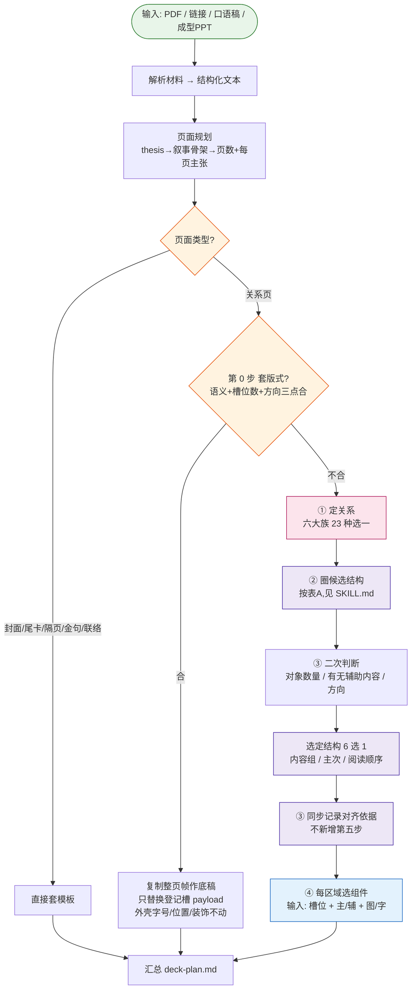

# Skill 设计文档:内容 → 页面规划 → 关系 → 结构 → 组件

> 目标:设计一个 Skill,把原始材料(PDF / 链接 / 口语稿 / 成型PPT)转化为可渲染的 Deck Plan。
> 本文档持续微调。
> **分工(与 SKILL.md 同一口径)**:SKILL.md 是**执行唯一权威**(表A/表B/红线/样板/交付);本文档是方法论出处(各章判定理由与设计原则)+修订记录。两边的表格与红线不再互抄,以 SKILL.md 为准。

---

## 一、整体流程



---

## 二、四个阶段说明

| 阶段 | 做什么 | 输出 |
|------|--------|------|
| **① 材料解析** | PDF/链接/口语稿/PPT → 统一成结构化文本;若为成型PPT则审计现有页数与论点 | 原始内容池 |
| **② 页面规划** | 定 thesis → 选叙事骨架 → 主张链定页数(规则见第三章) | **页数 + 每页主张句** |
| **③ 页面分流** | 非关系页(封面/尾卡/隔页/金句/联络)直接套模板;关系页进入④ | 页面类型 |
| **④ 逐页四步** | 定关系 → 圈候选结构 → 二次判断并确定对齐 → 选组件 | **每页的关系+结构+对齐+组件** |

---

## 三、页面规划层:从内容池到页清单

> 阶段②的规则。材料解析(①)产出内容池;本章决定**切几页、每页主张什么、按什么顺序讲**,输出页清单,交给页面分流(③)和逐页四步(④)。
> 骨架取自 wise-ppt 的 deck-planning(thesis 先行、叙事选型、页数唯一目标、主张链自检),扔掉它的记账机器(complexity_units 账本、planning_basis 三模式、确认数组)——判定靠规则和自检,不靠字段记账。

### 3.1 先定 thesis:整份 deck 一句可争辩的话

- thesis 是**判断**,不是主题:"AI 做 PPT 千篇一律,因为缺的是设计判断"是 thesis;"AI 做 PPT 的方法介绍"是主题。
- 标题 ≠ thesis:标题给场景,thesis 定方向;后面每页主张句都是 thesis 的分步展开,thesis 不成立,整份 deck 重想。
- 自检:**thesis 能被反对吗?** 反驳不了的不是 thesis("我们要做好产品"是废话)。

### 3.2 叙事骨架定页序

| 叙事型 | 骨架 | thesis 长什么样 |
|---|---|---|
| 问题→方案 problem-solution | 痛点 → 根因 → 方案 → 效果 | "X 坏了,得这么修" |
| 情境→冲突→解答 SCR | 现状 → 变化带来的麻烦 → 应对 | "世界变了,老办法不行了" |
| 时间线 chronology | 阶段一 → 阶段二 → 阶段三 | "X 是这样一步步走到的 / 要分三步走" |
| 论点→证据 argument-evidence | 主张 → 证据 1/2/3 → 收束 | "X 成立,证据在此" |
| 对比选型 comparison | 候选 A vs B vs C → 判据 → 结论 | "该选谁" |
| 漏斗收窄 funnel | 大面 → 逐步收窄 → 一个结论 | "从万千可能收敛到这一件事" |

- **页序跟着叙事骨架走,不跟素材原始顺序走**。照着原文档目录排页是最常见的病。
- 封面、隔页、金句、尾卡在规划层就排进页序 —— 它们是节奏工具,不是渲染完再补(何时插见 9.5 节奏启发;模板类型见第四章)。
- 拿不准选哪型,看 thesis 的动词:"要变"→ 问题→方案;"分几步走"→ 时间线;"该选谁"→ 对比。

### 3.3 页数怎么定

依据只有一条优先级链,输出**唯一目标页数**(不给区间):

**用户给了页数 > 内容结构 > 场景推荐**

- **用户给了**:直接采用。内容塞不下时回到 3.6 问用户(砍内容还是加页),不自作主张。
- **内容结构**:数"不可合并的结论"。一个结论一页;两个结论必须靠同一批证据才说得清 → 并一页;一个结论要三组都很重的证据 → 可拆两页。
- **场景推荐**:用户没给页数也没给时长时,按讲述时长粗估(1 页 ≈ 0.5~2 分钟讲述量,参考锚点、非硬合同),记录假设,不反问用户。

一页一主张,与第五章关键共识"每页 1 个主关系"同源:主张是内容层的"一个",关系是信息层的"一个"。

### 3.4 每页主张句怎么写

- **是完整句子,不是词组**:"五步编排链把原始资料变成可放映网页" ✓;"工作流介绍" ✗。
- **能被质疑**,不是分类标签:"版式图册提供结构候选,但内容关系拥有最终决定权" ✓;"版式图册介绍" ✗。
- **Ghost Deck 自检**:只读全部主张句,应该能读通完整故事 —— 相邻页有推进、结尾回答开头、没有两页重复同一结论。读不通就改页(改主张/换顺序),不是加页。
- 主张句由**底部题注(caption)承载**——页面无标题制(见 9.4):题注就是本页最重要的一句话,可以改写得更像钩子、断在语义处(见 9.1),但必须仍表达同一主张,不得漂移。
- **长度 ≤28 全角当量**(汉字类=1、半角=0.7,`data-page-title` 同口径):主张句还兼职画册视图的卡标题 `SNN · 主张句`(mono 13px,三列卡片在 1440~1600px 视口宽 437~491px,一行容量 ≈32 当量,前缀 `S03 · ` 占 ~4.2 当量)。超预算标题换两行,所在卡片被撑高 19px,同章各卡行高、摘要基线全部参差(实测 no-metric-gain:S03=42/S04=40 当量在 1600px 即换行,S06~S08 33~35 当量在 1440px 跟着换)。超了先砍修饰词、再拆主张,不加页;画册 CSS 另有单行省略兜底,超预算文本悬停卡可见全文。

### 3.5 证据最小化 + must 内容着落

- **只留让主张成立的最少证据**:证据够主张成立就砍。素材多不是页数多的理由,是删料的机会。
- 每页一个**主角证据**,其余是配角 —— 与"每页 1 个主关系 + 最多 2 个辅关系"对齐(见第五章)。
- **must 内容逐条着落**:必上的内容(用户点名的数字/案例/结论)要么进某页,要么记一句删除理由;不允许无声消失。删了没记理由,验收按漏内容算。

### 3.6 何时停下来问用户

只有**用户的选择会真正改变 thesis、页序、重点或行动**时才停,最多三个问题。每个问题说清三件事:发生了什么、影响成品的什么、要在什么之间选(大白话,不出现字段名和术语)。

素材很长、页数很多、个别字段缺失 —— 都不是问的理由,自己拍板并记录假设。

### 3.7 输出物:页清单

每页一行:

```
{页码, 页面类型(关系页 / 封面·隔页·金句·尾卡·联络), 主张句, 内容要点(主/辅标记)}
```

页面类型交给第四章页面分流;关系页的"内容要点 + 主/辅"喂第五章定关系。非关系页到此走模板,不再进后续阶段。

> **验证方法**:拿 `themes/paper-ink/examples/wise-ppt-story-six-page`(六页能力介绍)反推 —— 蒙住 deck-plan.md,只从素材推 thesis、叙事型、页数、主张链,与原产物对得上,规则才算可执行。

---

## 四、页面分类:关系页 vs 非关系页

进入"关系 → 结构 → 组件"流程前,先区分页面类型:

| 页面类型 | 走哪条路 | 说明 |
|---|---|---|
| **非关系页** | 直接套模板,不进关系/结构/组件流程 | 封面、目录、尾卡、Outro、章节隔页、秩序环过渡页、粒子主角页、联络尾页 |
| **关系页** | 先试套版式,再进关系 → 几何结构 → 组件 三段式 | 页面承载信息关系,需匹配版式和组件 |

> **只有关系页才进入版式、组件的选择。** 非关系页只承担节奏停顿、情绪定调、品牌落版等功能,走固定模板。

参考版式库(paper-ink/ai)中的非关系页示例:
- 封面:D1 / D7 / D8 / D10
- 目录:D4 / D9
- 尾卡:D2
- Outro:D3
- 章节隔页:D5
- 秩序环过渡页:M2（仅眉题、页码、`motif-label` 可写文字；真实金句走 focus/quote 内容页）
- 粒子主角页:M1
- 联络尾页:D6

---

## 五、信息关系:六大族(MECE)

按第一性原理,信息之间的连接方式只有四种本质形态:
```
A ──→ B    有方向
A ── B     无方向但有连接
A └─ B     包含/从属
A | B      无关系,只是放一起
```
加上"只有 1 个对象""对齐比较"两种边界情况,穷尽为 **6 大族**。

### 判断流程(每页走一遍)

```
只有 1 个对象?           → 重心 Focus(焦点 / 示意)
多个对象,之间:
  没关系?                 → 并列 Parallel(陈列 / 并行 / 指标 / 分布)
  有包含/从属?            → 包含 Containment(层级 / 拆解 / 嵌套…)
  有方向(先后/因果)?     → 有序 Sequential
  要对齐看异同/对应?      → 比较 Comparison(对比 / 矩阵 / 排名…)
  只是有关联(无方向)?    → 连接 Connection
```

6 个分支,**互斥、穷尽**。数字是内容不是关系:数值页照样走六族判断 —— 排名 = 比较(同维度对齐看高低,乱序仍是对比),指标 / 分布 = 并列(无关系放一起);示意图 / 原型归重心·示意,不冒充证据。

### 六大族总表

| 族(中文) | Family(English) | 判断特征 |
|---|---|---|
| ① 重心 | Focus | 只有 1 个对象(焦点 / 示意) |
| ② 并列 | Parallel | 对象间无关系,放一起(陈列/并行/指标/分布) |
| ③ 包含 | Containment | 包含/从属,看边界 |
| ④ 有序 | Sequential | 有方向(A→B) |
| ⑤ 比较 | Comparison | 对齐并排看异同(对比/矩阵/排名) |
| ⑥ 连接 | Connection | 有关联但无方向、无包含 |

### 族内细分

| 族 | 关系(中文) | 语义 |
|---|---|---|
| ① 重心 Focus | 焦点 focus | 单一重心 |
| | 示意 illustration | 插图 / 原型展示,主体无竞品、无对照 |
| ② 并列 Parallel | 陈列 | 无结构罗列 |
| | 并行 parallel | 多条独立并行线 |
| | 指标 metric | 多个关键数字并排 |
| | 分布 distribution | 按位置/区域展开(地图 / 直方图) |
| ③ 包含 Containment | 层级 hierarchy | 上下级从属(谁管谁) |
| | 拆解 decomposition | 整体拆成部分 |
| | 部分整体 part-whole | 部分构成整体 |
| | 嵌套 nesting | 包含/嵌套/内外层 |
| ④ 有序 Sequential | 时序 sequence | 按时序推进 |
| | 流动 flow | 资源/状态流动 |
| | 循环 cycle | 首尾闭合 |
| | 汇聚 convergence | 多路径汇聚到一个结果 |
| | 漏斗 funnel | 从多到少收窄 |
| | 因果 causal | 原因导致结果 |
| ⑤ 比较 Comparison | 对比 comparison | 同维度看异同 |
| | 矩阵 matrix | 二维交叉 |
| | 映射 mapping | A↔B 对应/转换 |
| | 排名 ranking | 按数值大小对齐排序 |
| ⑥ 连接 Connection | 网络 network | 多对多连接 |
| | 交叠 overlap | 集合之间存在共同区域 |
| | 证据 evidence | 结论与支撑证明关系 |

> 族是**判断入口**,族内细种是**精确匹配**。两层都保留,既 MECE 又不丢表达力。

### 易混关系辨析

| 三者 | 回答的问题 | 换掉成立吗? |
|---|---|---|
| 层级 | "谁归谁管?" | 是人/组织的**管辖**关系 |
| 拆解 | "整体由什么组成?" | 各部分**加起来=总数**,可量化 |
| 部分整体 | "哪些共同构成整体?" | 强调**共同构成**,非拆的动作 |

> 一句话:**层级看"管辖",拆解看"加总",部分整体看"构成"**。

| 两者 | 回答的问题 | 判断边界 |
|---|---|---|
| 交叠 overlap | “哪些部分被共同拥有?” | 共同区域本身就是信息，适合韦恩集合 |
| 对比 comparison | “同一维度下哪里相同、哪里不同?” | 重点是维度对齐，不要求对象真的共享成员 |

### 关键共识

1. **不看长相看语义** —— 同样的树状图,可能是层级,也可能是拆解
2. **对比的核心是"维度对齐"**,不是版式
3. **因果的核心是"方向性"**,去掉方向信息就不成立
4. **关系决定版式,数量只决定容量** —— 每页 1 个主关系 + 最多 2 个辅关系
5. **一维分类不单列** —— 按语义归到拆解或层级(分类看标签,拆解看加总,层级看管辖)
6. **数字是内容不是关系** —— 数值页照样走六族:排名归比较(维度对齐,乱序仍是对比),指标/分布归并列(无关系放一起);示意图(插图/原型)归重心·示意,不冒充证据

### Catalog 的 SmartArt 浏览分类

微软 SmartArt 的分类先问“想表达什么”,再找布局,不是按图形外观命名。`references/catalog.html` 借用这套逻辑做**人工浏览投影**,不替换上面的六大族机器判断。官方说明见 [Choose a SmartArt graphic](https://support.microsoft.com/en-us/office/graphics-visuals/choose-a-smartart-graphic)。

| Catalog 入口 | 主要表达 | 与六大族的边界 |
|---|---|---|
| 列表 List | 无顺序、无强连接的并列信息 | 通常来自并列,也可收纳拆解后的等价单元 |
| 流程 Process | 步骤、阶段、时间线、因果或汇聚推进 | 对应有序,箭头/方向是关键 |
| 循环 Cycle | 首尾闭合、持续重复 | 从有序中单独抽出,便于找循环画法 |
| 层级 Hierarchy | 上下级、树状从属、分层 | 对应包含·层级 |
| 关系 Relationship | 非线性连接、对照、映射、中心辐射或包含 | 可跨比较/连接/包含,按主要阅读任务归一处 |
| 矩阵 Matrix | 二维交叉分类,或部分共同指向整体 | 常对应比较·矩阵或包含·部分整体 |
| 金字塔 Pyramid | 比例、层层收窄、由大到小 | 画法入口;实际关系仍可为层级/漏斗 |
| 图片 Picture | 图片、界面、原文或证据本体主导 | 是媒介入口,卡片仍保留示意/证据关系标签 |
| 数据 Data | 图表、指标、排名、地理分布 | Wise PPT 扩展;不是第七关系族,仍回到并列/比较/有序判断 |

> `All` 是聚合入口、`Office.com` 是来源入口、`Other` 是自定义兜底,都不作为本地 Catalog 的语义分类。每张版式、每个组件只进入一个主要浏览入口,关系标签继续显示真实语义。

---

## 六、几何结构清单

> **结构与组件分层**:结构 = 页面怎么切区域(矩形分块);组件 = 区域内画什么形状(放射、环形、蛇形、漏斗都是组件的形状,不是页面结构)。
> G1/G4/H1/J1 等版式的页面结构都是"单区",里面放一个大组件。

**版心与固定件(切分的前提)**:每页都有全 deck 统一的固定件 —— 左上角页眉(章节 kicker)、左下角页码/落款、底部题注行。固定件是外框不是内容区,**一律不算切分**(不论在上/下/左/右)。结构切的是**版心** = 页面减去固定件后的内容区;单区就是版心剩一整块,内容水平垂直居中。

| 结构 | 说明 |
|------|------|
| 单区 | 版心一整块,不再切分;组件水平垂直居中,形状自由(放射/环形/蛇形/漏斗/矩阵…) |
| 左右x等分 | 版心横向均分,x≥2 |
| 上下x等分 | 版心纵向均分,x≥2 |
| 左右不对称 | 版心横向不等分切一刀,任意一侧可再分(通常一主一辅) |
| 上下不对称 | 版心纵向不等分切一刀,任意一侧可再分;常见走法:大区+收束带 / 大区+辅×N / 辅+主区 |
| 网格 mxn | 版心切成多个可独立换数据、独立验收的均质槽位(Q4 四组证据卡阵 2×2) |

### 矩阵(表格)不是页面结构(易混)

| | 特征 | 例子 | 对应关系 |
|---|---|---|---|
| **矩阵/表格** | 行列双语义在组件内部,是组件的画法 | F1、K1、E4 | 天然对应 **matrix 矩阵** |
| **网格** | 页面真的有多个独立槽位,每槽可单独换组件/数据 | Q4 | 常对应 **陈列/证据** |

> **矩阵(表格)是组件画法,不是页面切分。** 三栏行带矩阵 → 左右x等分(K4,三栏是切分,行带是栏内画法);整页矩阵/链阵 → 单区(F1、K1);矩阵 + 收束带/KPI 通栏 → 上下不对称(E4)。与放射/环形/蛇形/漏斗同级:结构只认 6 种矩形分块,不设「表格」。

> 已删除冗余项:左右等分/上下等分(= x等分 x=2)、象限(= 单区内二维组件)、上下N段(组件内层带不冒充页面槽位)、表格(= 组件画法,按页面切分归单区/左右x等分/上下不对称)。

> **固定件的尺度界限**:底部题注/出处带高度 ≤15% 仍视为固定件(归单区,A2 场景画);超过就是独立内容区,要参与切分。

> 可视化浏览:`references/catalog.html?tab=str`(单一结构 tab)。6 种切分各为一个可折叠章节,章节内按“定义/判断 → 空槽变体 → 对应真实示例”联看;每个空槽只挂 `ex` 映射的页面,加载时逐结构校验不漏归/不重归/不跨结构,承载关系 chips 也从示例关系标签实时推导。68 个关系页版式按结构字段程序化归入:单区 41 / 左右x等分 8 / 上下x等分 3 / 左右不对称 8 / 上下不对称 5 / 网格 3。空槽大图 17 张存于 `references/taxonomy-empty/`:10 张提取自 taxonomy(wise-ppt-page-expression)110 张成熟蓝图按槽位几何去重的空槽版式,7 张补造(taxonomy 无「上下等分」「网格」整类与「左右4等分」变体,见 v24/v25);9 种 taxonomy 拓扑全部落入 6 种结构,枚举无缺口。旧 `?tab=strex` 仅作兼容别名,自动归一到 `?tab=str`。

---

## 七、关系 → 结构 映射(候选集 + 二次判断)

> **模型:关系不锁定结构,关系圈定候选范围;二次判断在范围内选定。**

```
关系 → 圈出候选结构(2~4 种)
        ↓
二次判断(对象数量、有无辅助内容、方向偏好)
        ↓
      选定结构
```

### 各关系的候选结构集

**全文见 SKILL.md「表A · 关系 → 结构候选」**(经 60 版式反向验证;版式号 G3 为历史退役位)。本章不再复制表格,理由与判定方法在下面两节。

### 二次判断依据

1. **对象数量**:单个 → 单区(整版大图);多个 → 等分/网格各放一个
2. **有无辅助内容**:要放规格单/收束带/KPI带/说明栏 → 从单区/等分升级为主+辅(不对称)
3. **方向偏好**:横向阅读流(步骤、时间)→ 左右;纵向阅读流(层级、堆叠)→ 上下

### 对齐:把关系翻译成空间锚点

> **对齐是信息关系的空间证据;先对齐关系,再对齐元素。** 共同边说明同级,轴线说明秩序,连接点说明依赖,留白说明边界。没有关系依据的整齐,不叫对齐。

对齐不另起第五步,而是第③步选定结构后的必做判断。完整链路固定为:

`关系 → 内容分组 → 主次 → 阅读顺序 → 结构 → 对齐锚点 → 槽位 → 组件 → 最终配平`

#### 两套顺序不要混

- **规划顺序**:先定关系与内容组,再定主次和阅读顺序,最后选择结构轴与锚点。不能先把元素摆整齐,再反推它们是什么关系。
- **几何审查顺序**:`包含 → 不压线 → 不重叠 → 不穿越 → 关系对齐 → 阅读顺序 → 间距与配平`。边界和冲突没过,不讨论间距是否漂亮。

#### 六大族如何落锚点

| 关系族 | 主要锚点 | 空间证据 |
|---|---|---|
| 重心 Focus | 内容区中心或明确侧边 | 唯一主角稳定占据阅读入口;金句、唯一命题、大数据才适合中心型对齐 |
| 并列 Parallel | 共同边、共同底线、等距偏移 | 同级对象共边/等距,但不因为整齐而抹平真实主次 |
| 包含 Containment | 容器边界、内边距、归属重叠 | 子项完整落在父载体内;骑线节点等重叠必须说明归属 |
| 有序 Sequential | 推进轴、轨道、连接点 | 时间轴、流程、因果沿阅读方向锚定,不改成整体居中 |
| 比较 Comparison | 共同基线、镜像轴、维度对应 | 对照项共享可比较的起点或基线,让异同可以直接扫读 |
| 连接 Connection | 路径、端点、结论—证据依附线 | 节点属于连接路径;证据沿主结论的阅读路线展开 |

时间轴对齐时间主轴,流程对齐推进方向和连接点,UI 对齐字段/容器/操作层级,证据墙对齐共同边或比较基线,非对称页对齐主角与证据的结构线。**不是所有页面都应该居中。**

#### 第③步必须记录四件事

1. **内容组**:哪些内容必须共同阅读;组件内部标签不是页面级槽位。
2. **主次**:谁是 primary、谁是 support;主次页不强求均分或镜像。
3. **阅读顺序**:观众先看哪里、再看哪里;顺序必须覆盖全部内容组,不能有孤岛。
4. **对齐依据**:对齐哪些对象、为什么对齐、采用共同边/底线/偏移/区间中心/镜像/路径中的哪一种。

#### 四条防退化规则

1. **主次优先于均匀**:同级内容才等宽等距;support 依附 primary 的阅读路径,不能为了对称抢主角。
2. **先整体成组,再整体移动**:禁止标题挪 2px、图标挪 3px、正文再挪 5px。最终配平只允许完整内容组整体位移。
3. **关系锚点优先于 4px 网格**:无明确关系目标的整体位移走 4px 网格;已有共同边、侧边、中心或连接点时用精确坐标,不能为贴网格破坏关系。
4. **数学居中只属于中心型页面**:已有顶/底/侧边/连接锚点时不得再做居中;没有其他锚点的单一内容组才允许最终视觉配平。

#### 几何契约与审查五问

页面用 `wise-ppt-geometry@1` 把上面的判断落成可测量关系:边界/冲突关系先写,对齐关系后写。`primitive` 只记录本章选定的六种结构或第四章的非关系模板,不是新增的“空间原语”决策层。

审查只问五个问题:

1. 我对齐的是哪些对象?
2. 它们为什么应该对齐?
3. 使用的是共同边、底线、偏移、中心、镜像还是路径锚点?
4. 这种对齐是否强化了主次和阅读顺序?
5. 去掉辅助线后,观众还能否看懂它们的关系?

---

## 八、组件匹配

### 选组件三段式(组件优先/重绘兜底)

**第一段 · 优先选组件**:表B 圈候选 → routing-manifest 核对(component_id/relation_keys/frame/capacity/renderer_kinds)→ 过滤(关系→形状→容量→节奏)→ deck-plan ④列登记 `component_id{参数}`。
**第二段 · 组件物化**:snippet 注入(atlas 过 adapters/atlas.js 改写、native 依赖 --wp-compat-pi-* token)/ ECharts(createEChart+纸墨 option)/ 多槽一槽一组件;构建期静态展开,槽 div 带指纹属性;禁改 content 语义迎合组件。

> **预览遗产打穿**:组件库 CSS 是按 600px 方卡预览写的,直接注入会缩在槽中间一小块。执行细则(方卡外壳覆写、padding 归零、字档映射、特度核算、computed 验收)**全文见 SKILL.md 渲染合同「组件槽标准样板」与红线**,本章不复制代码,只留判定理由:预览遗产有三层(600px 外壳/自带 padding/自带字档),覆写必须用 `!important` 四连(width/min-height/height/aspect-ratio)碾压并压过组件原选择器特度——v88 金句 26px 假生效与 v89 假绿两次事故均源于此。

**第三段 · 重绘兜底**:语义/形状/容量均无合适组件才手绘,登记"重绘:理由",新画法回填表B。重绘不能绕过槽位不适配:只要问题是容量或几何,固定回退顺序为`换组件 → 换结构/变体 → 删除非必要辅助内容并更新 deck-plan → 拆页`;禁止缩字、拉伸组件、裁切、越过安全区、隐藏 must 内容或改写语义来迎合组件。

> 背景:首副成品 deck 的④曾整链空转——表B 只贴了概念标签,页面全部现场手绘,组件池 108 条资产零使用(v83 修复)。根因是判定链走到"需要执行资产"的环节断了:①②③是判断题,查表即可;④是执行题,必须有物化路径。"兜底条款变成主干道"是④空转的信号。

### 组件定义(v8 暂定,待组件清单验证)

> 逐页四步的最后一步:结构 → 组件。


**组件 = 一种参数化画法。内容数量是参数,不是组件类型。**

- 指标带 = 1 个组件:2 个指标区域 2 等分,3 个 3 等分,4 个 4 等分
- 流程链 = 1 个组件:2 步画 2 节点,5 步画 5 节点
- **画法不同才是不同组件**:箭头链 / 蛇形回环 / 时间轴刻度 / 甘特条带是 4 个组件,哪怕都表达 flow

粒度(v10 修正):**分连接类和陈列类两种** ——

| 类型 | 粒度 | 例子 |
|---|---|---|
| **连接类**(块内有箭头/连线/包含) | 一个整体组件,不可拆 | 流程链、漏斗、树、地图 |
| **陈列类**(块内纯并列) | **单元组件 × N**,排布由结构负责 | 档案卡×3 + 左右3等分;指标单元×4 + 左右4等分;logo 单元×28 + 网格 |

> 陈列默认仍是"单元组件 + 等分结构"。只有组件自己声明内部重复合同、容量和完整几何时才可作为阵列级组件，例如 `metric-strip` 自己拥有 2–4 个指标；此时整带占一个槽，不能再拆成多个页面槽。
> "一个结构块 = 一个组件"仍成立,但陈列类的"一个组件"指一个单元,同单元可重复填充多个等分位。

### 组件三属性

1. **关系**:表达什么关系(flow / comparison / matrix...)
2. **形状**:吃哪种区域(矮宽条 / 窄高条 / 近方形 / 整页)
3. **容量**:条目范围(如 2~7 步)

### 缩放标尺(v26 起第①层已落地)

组件不连续缩放,用"档位 + 门槛":

| 层 | 规则 | 状态 |
|---|---|---|
| ① 准入门槛 | 组件声明形状范围(min_width/min_height/宽高比范围),区域不在范围内 → 不进候选,换组件 | **已落地**:space_requirements + 逐组件真实 frame(scripts/_component_frames.py,55+26 显式表),frame 即生产排版画布,typed renderer 流式重排 |
| ② 字号档位 | 组件内字号固定几档(display/heading/body/meta token),内容数量决定用哪档(如指标带:2~3个→100px,4~5个→64px,6个→40px) | 渲染器内部 token 制,部分实现 |
| ③ 容量上限 | 字号降到最低档还装不下 → 超容量,不选此组件,换画法或拆页 | 已落地:capacity min/max + 文本密度校验 |

> "能缩多小" = 最低字号档 × 单条最小排版面积,到此为止。"能放多大" = 区域大选整页级组件,字号有上限,撑满即止。
> **验证方法**:拿 2~3 个真实组件(指标带、流程链)试切进不对称结构的小区域,看档位表是否成立。

**待办:**

- [x] 组件清单(已清洗合并,见 references/catalog.html 组件 tab;atlas 61 + echarts 12 → 35 组)
- [ ] 结构 → 组件映射规则(待定义)
- [x] 缩放标尺:第①层准入门槛与第③层容量上限已在生产落地(v26);第②层字号档位由渲染器 token 制承接
- [ ] 待验证:选组件时是否需要两个输入参数 —— ①主/辅(定视觉权重) ②图/字(定组件类型)。来自已有体系 blocks 层(importance / semantic_form),必要性未定,等组件清单来了一起验证。

### 组件清洗结果(v9,历史快照;现役池以 routing-manifest 126 条为准)

**剔除项去向(不属于组件):**

| 原 atlas 项 | 去向 |
|---|---|
| cover 封面(#1)、toc-card 目录(#5)、quote 引用(#11) | 非关系页模板参考 |
| two-col(#7)、three-col(#8)、split-v(#9,#10) | 版式结构参考 —— 只切区域不承载信息,是「结构」不是组件 |

**合并规则:** 数量是参数(步数/环数/圆数/层数合并为一组),样式开关不产生新组件(arrow/smooth/inverted 等记为参数),画法不同才是不同组件。

**合并后 35 组组件**(文字排版 5 + 比较 7 + 流程时序 5 + 结构 8 + 数据 2 + ECharts 8):
- 流程链 ← 9 个变体合并(#25~33);同心圆 ← 5 个(#43~47);前后对比 ← 4 个(#16~19)
- 浏览: `references/catalog.html`(四个 tab:非关系页模板 / 关系页版式按 SmartArt 语义入口 / 结构(空槽变体与对应示例联看) / 组件按 SmartArt 语义入口)

---

## 九、设计规范:字号、间距、图片与节奏

> 前八章回答"画什么、画在哪",本章回答"怎么画得好看":字号怎么选、间距怎么给、图片怎么裁、节奏怎么排。**本章只收设计判断规则;数值的机器唯一出处是本仓库 `themes/paper-ink/assets/design-tokens.css`**(`themes/paper-ink/references/design-tokens.md` 是它的人读文档镜像),本章只引用 token 名,不复制值。判断规则部分借鉴 guizang-ppt-skill(杂志×电纸屏 / 瑞士双风格)的设计规范,冲突之处一律以本体系为准(取舍见 9.6)。本章规则在页面生成与 Render Plan 校验时生效;9.5 节奏启发供阶段②③分流浪式参考。

> **总则三条(贯穿全章)**:① **结构优于装饰** —— 层级靠字阶、墨阶与网格留白表达,不靠阴影与浮动卡片;② **一 deck 一主题** —— 主题按内容调性选定后全 deck 不换,颜色只用主题白名单(既有规则),不按页面临时调色;③ **强调色上的文字必须可读** —— 浅色强调配深字,深色强调配浅字。

### 9.1 字号怎么选

字号是全局字阶,不从页面调参(既有共识)。选档规则补四条:

1. **大字档按标题字数选,先改短再降档**(规则全文已收为 SKILL.md 渲染合同红线,此处不再复制)。设计理由:封面宣言、隔页大字、金句的档位可按 paper-ink 字阶与版心一行宽度反推,所以能写成机械查表;标题不为大字号挤掉内容区,也不为塞长句子把正文档当标题用。

2. **层级对比靠跨档,不靠相邻档微调**:主标与正文至少隔开两档(如 title 对 body);同页最大档唯一 —— 页内唯一 KPI 主值用 display/hero,同页不得出现第二个(既有制式,此处成文为通用规则)。大字宣言页可以拉到 8:1 量级(display-mark 对 body),常规页靠跨档即可,不设全局硬比例(取舍见 9.6)。
3. **正文只有 body 与 body-small 两级**(既有规则):label / meta / micro-secondary 是图题与档案码,不是正文;装不下先走容量与拆页,不把小字档当正文用。
4. **数字怎么写**(规则全文见 SKILL.md 红线"KPI 主值 2~3 位"条,此处不再复制)。定这条的出发点:数字页的可信度比漂亮重要——**没有真实数据就不用图表与 KPI 版式,不编造数值**(示意/概念不冒充数据,衔接第五章关键共识 6)。
5. **字体家族**(v82):家族语义分工 —— serif(大字宣言/金句/强调词/组件标题)、sans(正文/说明)、mono(眉题/页码/编号/英文码/KPI 数字)、brush(.kai 偶用);字重不随 mode 变:大字 500、正文 300、功能数字 400。typography mode 执行口径(默认 all-sans 等)见 SKILL.md 红线,不再复制。
6. **同类页同字档**(v88;规则全文见 SKILL.md 红线,不再复制)。定这条的理由:同类页字档跳变比单页字档偏小更显业余;组件注入不豁免——组件内文字的 computed font-size 必须落在全局字阶 token 上(见第八章预览遗产打穿 3)。

### 9.2 配比、间距与空气感

1. **不对称切分给常用配比**:左右不对称常用 7:5(文字为主 + 辅助图)与 8:4 即 2:1(大段内容 + 小图/数据),主宽辅窄;上下不对称常用"大区 + 收束带"(走法见第六章)。对半均分是等分结构,不算不对称。
2. **标题与正文/图表之间要有明显空气层**:比内容内部行距大一个量级,取 `--space-10` 以上(推荐 `--space-16` ~ `--space-24` 档);标题贴着内容是层级塌陷。
3. **眉题与标题是从属关系,上下叠排**:章节 kicker / EN 眉题在大标题正上方,禁止左右并排成两列(栏头三段式是"栏题"制式,不受此条约束)。
4. **左右边线全页唯一**:页眉、主体、题注共用版心同一条左右边线;嵌套容器不得再叠水平内缩把内容缩进去(卡片内边距是内容衬距,不在此列)。
5. **间距走 token 与 grid gap**:用 `--space-*` 与网格间距表达,不靠逐元素 margin/padding 堆叠;对齐与 4px 基线规则见 design-tokens.md §5。
6. **表面处理互斥**:一张卡只用一种表面处理 —— 轻面板抬升 / 深纸凹陷 / 墨底反白 / 细线描边,四选一不叠加(如描边又填充)。
7. **可用高度内垂直居中**(v80 立,v81 精确化,v89 口径修正;执行口径——可用区上下缘、≤3px 实测——见 SKILL.md 红线"关系对齐与最终配平"条,不再复制)。立这条的教训:居中对象必须是**文字主体并集**而非容器并集——容器并集会被透明留白与隐形元素骗过(v88 复盘实锤:quote 外盒居中但文字主体偏上 160px 仍判"绿");验收必须浏览器实测,视觉转述不算数。
8. **水平居中 + 充分利用可用宽度**(v88,与第 7 条对偶;执行口径同上):满宽型组件(时间轴/表格/流程链/指标带)槽宽 = 版心宽(约 1500,如 210~1710),不许缩在版心中间一小块;中心型组件(金句/放射/环形)按内容包围盒居中,但槽要够宽让大字上到应有档位。打穿组件预览遗产后方可判满宽(见第八章第二段)。

### 9.3 图片怎么用

**用途 → 标准比例**(比例跟槽位走,不跟原图走;禁原图任意比例,如 2592/1798):

| 用途 | 比例 |
|---|---|
| 封面 / 章节主视觉 | 16:9 |
| 通栏横幅 | 21:9 |
| 左文右图主图 | 16:10 或 4:3 |
| 图文混排小图 | 3:2 或 3:4(方图 1:1) |
| 网格 / 面板组 | 统一横图、同高度 |

**行为规则:**

| 规则 | 内容 |
|---|---|
| 图片是证据不是装饰 | 承载证据(evidence)/示意(illustration)关系,没有信息职责的图不放 |
| 同组同制 | 同一组图片同比例、同高度、同视觉缩放、同边距密度,不混档 |
| 对齐 | 图片顶缘对齐正文首行,不与大标题顶端齐平 |
| 裁切方向 | 照片只裁底部,不裁顶部与左右、不截主体(人脸取中);信息图/截图用 contain 防裁字,宁可留白不裁关键文字 |
| 白底信息图 | 容器用纸底,不用深底/灰框包白图 |
| 原始截图优先级 | 保真 > 程序化适配(目标比例画布 + 背景托底 + 等比缩放 + 按文字密度定内距) > 拆板 > 重生成;长条 UI 截图拆 2~3 面板,不满宽硬拉 |
| 背景托底 | 背景是托底不是主视觉:四角安静、无文字/图标/人物/边框/明显主体,任意比例裁切不露馅 |
| 生成图合同 | 不带页眉、页码、标题、角标、署名;给标题正文留可叠加空间,不满屏堆细节;图内文字语言跟随 deck 语言;容器制式走主题 image_frame |
| 文案与插图不重叠 | 插图区域内不排文字,封面亦然 —— 插图是插图,文字是文字,分区排布,不压字(v80) |

### 9.4 固定件与文字语义

| 位置 | 角色 | 稳定性 |
|---|---|---|
| 页眉(章节 kicker) | 栏目标签:标"这是哪一栏" | 跨多页可相同 |
| 页面主标题 | 本页钩子:标"这一页讲什么" | 每页独一份 |

> **页眉与页标题禁止同义互译** —— 页眉写"设计流程"、标题又写"设计的流程",两者互为翻译,一眼模板味。另:同一术语全 deck 只有一种写法,不中英来回换;行内强调走墨阶与字阶(标题尾段降一档墨色、英文词切字体),不新增颜色。folio 页码沿用运行时固定制式,页面内不另写页码。

#### 页面无标题制(v76,首个成品 deck 复盘确立)

**关系页不设页面大标题:页面的"最重要一句话"就是底部题注。** 规则全文(顶部/中部/底部三层职责、禁 FIG 式图号标签、零题注页清单)见 SKILL.md 红线"页面无标题制"条,不再复制。设计理由:

- 主张句落底部不落页顶:读者先看组件,最后一句话收束 —— 与文档写作"先结论"相反,是本体系的页面叙事顺序,不要混。
- **一页只在一处说最重要的话**(v80):大字宣言/金句/焦点宣言页,主张已由页面本体承载;封面/隔页/尾卡保持纯粹。真实金句使用 focus/quote 内容页；M2 是无正文的秩序环过渡模板，不得把引语或出处塞进 `canvas/marks`。
- 组件尺寸按"无标题后的完整版心"重算:内容区上缘从眉题带之下开始,下缘到题注之上,组件垂直居中其间,不按"有标题"的旧版心缩排(精确居中口径见 9.2-7)。

### 9.5 页面节奏(判断启发,不是机械间隔)

执行口径已改为成品合同 v2:相邻关系页主关系相同硬失败；同一“六结构 primitive + 视觉族”或同一组件三页内复读失败；大字页不连续；过渡模板 D5/M1/M2 紧接收尾 D2/D3/D6 默认失败。原始结构名相同本身不再构成失败，避免把“时间轴单区”和“放射单区”误判为同格式。详见 SKILL.md 红线"节奏"条。

1. **每幕起止用非关系页定调**:封面/隔页开场,金句/尾卡收束(衔接第四章模板);
2. 节奏问题优先用"插非关系页"解决,而不是硬拆内容页。

> 节奏服务于叙事:以上是"何时该警惕"的信号,不是"每隔 N 页必须插"的公式(与 design-tokens.md"不得机械规定呼吸页"一致)。

### 9.6 不采纳清单(与 paper-ink 冲突的取舍)

| guizang 规则 | 不采纳理由 |
|---|---|
| 字重反比阶梯("越大越细,越小越粗") | paper-ink 刻意反向:大字 400/500、正文 300,层级靠墨阶与字阶表达(家族跟 typography mode,默认 all-sans) |
| light/dark 明暗页交替 + WebGL 背景 | paper-ink 单纸底,禁止整页深色底与平滑渐变 |
| vw/vh 相对字号 + min(Xvw,Yvh) 双约束 | 本体系是 1920×1080 定画布绝对坐标,字号是绝对值 token |
| Google Fonts / Lucide CDN | 资源本地化合同:字体本地 @font-face,图标走 WisePPT.icons registry(词汇表见 component-routing.md) |
| 22 版式登记制 | 自有 60 版式 + 6 结构 + 组件池体系更强;只吸收"版式多样性"精神(9.5-4) |
| 极致对比硬指标(主标:正文 ≥ 8:1、KPI 数字占屏宽 18-22%) | 收为 9.1-2 软规则:定画布字阶下常规页达不到(title 对 body ≈ 2.7:1),宣言页天然超过(display-mark 对 body ≈ 13:1),硬比例与字阶合同冲突 |
| 12/16 列通用网格 | 自有 6 种切分 + 空槽几何就是网格合同,不引入第二套列网格 |

> 衔接:组件内字号档位见第八章缩放标尺②;逐项验收见 `themes/paper-ink/references/visual-checklist.md`;数值与制式的最终解释在 `themes/paper-ink/references/design-tokens.md`。

### 9.7 线条档位(组件图形的线宽与墨色合同,v107)

组件图形用线只有四档,线宽与墨色**同向联动**;档位按最终放映页(1280×720)上的**有效线宽**验收。atlas 系组件产自 600px 方卡、放映时整体放大约 ×2(字号有反向补偿、线宽没有),所以它的自然值按"屏上一半"书写:

| 档位 | native/new(真实画布自然值) | atlas(600 方卡自然值) | 屏上有效 | 墨色 | 例 |
|---|---|---|---|---|---|
| 发丝线 | 0.5–0.7px | 0.4–0.6px | ~0.6–1.1px | ink-45~55 | #32 同心圆、#34 韦恩集合圆、#009 标注说明框、#045 象限格 |
| 结构线 | 0.8–1px | 0.8–1px | ~1px | ink-45~55 | #025 循环轨道虚线、#028/#029 架构芯片与连线、#039 不可能三角 |
| 主框线 | 1.1–1.4px | 0.6px | ~1.1–1.4px | **ink-80 @全值** | #18 画廊卡、#37 卫星圆、#030 导图子节点、#025 循环节点环 |
| 强调主线 | 1.8–2.2px | —(避免) | ~2px | ink @全值 | #72 时间轴主骨、#37 中心墨核;**每组件最多一条** |

三条铁律:
1. **细线必淡、主线必浓**(按屏上有效值联动):0.5–0.7px 搭 ink≤45;≥1.1px(有效)搭 ink-80 全值。不允许"细而全黑",也不允许"粗而半透明"。
2. **形状语义分工**:集合圆(venn/同心圆)是"概念的容器"→ 发丝淡线;节点圆(卫星/循环/导图子节点)与卡片盒是"实体"→ 主框浓线;轨道/网格/基线永远最淡,虚线专表"路径";实心块(根节点、数据阶梯)不用外框线。
3. **强调唯一**:实心反白块或 ≥1.8px 主线,每组件只允许一处,其余退为纸面线稿。同一组圆禁止按色相分工(旧 atlas 的橙/黑/灰多色圆即典型违规),集合间差异只准用墨阶与交叠表达。

适配落地口径(`themes/paper-ink/adapters/atlas.js`):通用转换按"原值亮度"判档——浅色/低透明边框(有效 alpha ≤ .35,如 #e5e5e5、#ddd、rgba(ink,.1x))自动落发丝档 0.6px + ink-25,深色/饱和色维持主框档 1px + ink-80;SVG 描边宽 0.6/1/1.2 对应三档。禁用彩色描边与彩色雾面填充(#d95e00 一律入墨阶)。

---

## 修订记录

- **2026-08-16 v75**:Catalog 目录统一移到左侧。桌面端把 4 个主入口与当前页二级目录收进固定 220px 左栏；关系页版式和组件显示 9 个 SmartArt/Wise PPT 分组并随滚动高亮，结构显示 6 种切分并继续同步 `structure=` URL。右侧只保留说明与卡片，1280px 视口仍保持 3 列卡片；主入口切换回到内容顶部。≤900px 时导航回落为顶部双层横向滚动，卡片、分类数据、缩略图、浮层与变体路由均未改。
- **2026-08-16 v76**:首个成品 deck(two-answer-sheets)用户复盘五条,收敛为 9.4 新规「页面无标题制」:**关系页不设页面大标题,页面"最重要的一句话"就是底部题注**——主张句落底部不落页顶(读者先看组件、最后一句话收束,与文档写作"先结论"相反);顶部唯一家具是左上角眉题;封面/隔页/金句/尾卡保持纯粹(大字宣言+副题+素材行,不加题注不加角标,金句出处行是内容不是题注);**禁** FIG 式图号标签及其下划线、右下角 DECK NO. 式自创角标(均系首 deck 从 six-page-example 误抄/自创,非本体系规范);组件按无标题完整版心(y≈160-900)垂直居中重算。3.4 主张句条款同步改"由底部题注承载";SKILL.md 渲染合同红线同步。教训:**从参考样例借页面语言要先过设计规范——样例里有的(FIG 标签)不等于本体系要的;自创装饰(角标)更是返工源。页面家具三层职责表是最好的防线。**
- **2026-08-14 v26**:M1 粒子主角页定案归非关系页。v21 起存疑的"粒子效果件"结案:粒子是氛围 canvas 效果、不是关系页图形本体,提问式文案属情绪定调,整页按非关系页模板处理(D 系/M2 同类),不从版式抽组件。版式池 55→54(⑤关系组移出,单区 25→24,门禁同步),非关系页模板 7→8(新增粒子主角页类型);catalog 组件 tab 存疑区清空,组件 badge 回到纯计数 72。
- **2026-08-14 初版**:确定三阶段流程、6类核心关系 + 待定候选、8种几何结构、关系×数量×方向映射表。组件匹配待填充。
- **2026-08-14 v2**:关系层重构为六大族 MECE 体系。补入因果、陈列(共19种细种)。一维分类不单列。基于已有 17 种页面信息关系合同(decomposition/part-whole/nesting/focus/convergence/funnel/evidence/mapping 等)。
- **2026-08-14 v3**:反向验证 60 个版式,六大族全覆盖。新增"关系页 vs 非关系页"分类(非关系页直接套模板,不进关系流程)。
- **2026-08-14 v4**:几何结构重构。核心修正:结构与组件分层(放射/环形/蛇形/漏斗是组件形状,不是页面结构)。结构收敛为 7 种,新增网格 mxn(象限推广)和表格(行列双语义,对应 matrix),删除冗余项(左右/上下等分、象限、上下N段)。
- **2026-08-14 v5**:撤销"不足2(spatial_primitive 中间层)"。经 6 页示例验证:spatial_primitive 的 19 种原语把页面切分和组件形状混在一层(bilateral-split 是切分,radial-burst 是组件形状),我们的「结构+组件」两层已完整覆盖,不需要加中间层。
- **2026-08-14 v6**:重写「关系→结构」映射。模型修正为:关系圈定候选结构集(2~4种),二次判断(对象数量、有无辅助内容、方向)在范围内选定。补充 19 种关系的候选结构表(经 60 版式反向验证)。
- **2026-08-14 v7**:更新整体流程图。合并原三阶段为四阶段(新增"页面分流");逐页流程从"查表"改为"定关系→圈候选→二次判断→选组件";不足3降级为组件匹配的两个输入参数(主/辅、图/字)。新增 AGENTS.md 沟通与工作方式约定。
- **2026-08-14 v8**:组件定义暂定:组件=参数化画法,内容数量是参数不是类型;画法不同才是不同组件。粒度:一个结构块=一个组件。缩放标尺假设:不连续缩放,用"准入门槛+字号档位+容量上限"三层,待真实组件验证。
- **2026-08-14 v9**:组件清单清洗完成。atlas 61 + echarts 12 → 剔除 6 项(封面/目录/引用→非关系页模板;双栏/三栏/垂直分栏→结构参考)+ 合并变体 → 35 组。新建 references/catalog.html 总目录页(非关系页模板/关系页版式六大族/组件),三大资产一页浏览。
- **2026-08-14 v10**:接入 taxonomy 资产(native 墨线组件 33 个移植)。修正组件粒度:分连接类(整体不可拆)与陈列类(单元×N,排布归结构),"指标带/卡片墙"不是组件而是单元+结构的组合。反向抽取三分:已有实现(14,预览组件本体)/待新做(6)/可并入(5)。
- **2026-08-14 v10**:目录页配色统一纸墨。catalog.html 外框色值全部改引 themes/paper-ink/assets/design-tokens.css(纸 #DFE0D9 / 墨阶 / 强调红 #C0392B),六族彩色标签改为墨底反白;组件预览从裸 swiss 渲染改为过 paper-ink.atlas 适配器(srcdoc 直出,瑞士橙 #d95e00 全部洗成墨阶)。gallery-components 组件画册移除 Paper Ink/Swiss 切换按钮与 ?theme=swiss 入口,强制纸墨;swiss 主题与适配器保留在 themes/,暂不开放。
- **2026-08-14 v11**:catalog.html 新增「结构枚举」tab(版式与组件之间)。7 种切分各一节:SVG 抽象示意图(单行虚影画法自由 / 等分 x=2~4 / 主辅不对称含可再分 / 网格 2×2、2×3、7×4 / 表格行列双语义+收束带变体)+ 判断要点 + 承载关系 + 归入版式 chips(点击跳版式 tab 高亮)+ 代表版式实拍。归入从 FAMS 结构字段程序化解析,与版式 tab 永远一致;E4"上下2等分+底带"按行列双语义计表格。
- **2026-08-14 v12**:全量 55 版式实拍复查结构标签(逐张视觉核对页面真实切分)。改 2 处:B3 泳道路线图 上下3等分→单行(泳道横线是组件画法,时间轴贯穿所有泳道,页面是一张连通大图);O1 漏斗 单行→左右不对称(左 30% 步骤文字 + 中 40% 漏斗 + 右 30% 数据标注,主+辅+辅)。其余 53 张维持,含两处边界裁定:H3 分层栈维持上下4等分(满宽层带、列不对齐无列语义,不算表格);I3 双轨维持上下2等分(两层是独立内容区,中央箭头是组件连接)。同步第六章:并行候选改"左右x等分 / 单行(泳道图)",漏斗候选改"单行(漏斗图) / 左右不对称(漏斗+两侧标注)"。
- **2026-08-14 v13**:A2 场景画 上下不对称→单行(整页场景画 + 底部 10% 题注行,题注是大图附属不是独立内容区)。新增边界规则:顶部/底部仅一行题注带(≤15% 高)不算切分,归单行,写入第五章。结构枚举 tab 每节从"代表版式 + 编号列表"改为归入版式全部 iframe 展示。
- **2026-08-14 v14**:catalog 组件预览重构为页面原生渲染(atlas/native snippet 注入 + ECharts 页面内 init,废除全部预览 iframe,解决 file:// 嵌套限制与样式不统一);组件统一按六大族分组;新做 6 个待抽取组件入池(映射弧线网 L2/权重弧网 L1/三向放射图 G1/嵌套框 H2/排行柱图 C7/蛇形回环 J2,纸墨线稿,参数化容量),待抽取区清空,仅剩 5 项可并入待裁。
- **2026-08-14 v15**:关系层扩为七大族(新增 ⑦ 数据:排名/分布/指标;① 重心内新增"示意"细种);结构层收敛为 6 种(删「表格」,矩阵/表格降级为组件画法)。改 10 张:C7 排行柱图 对比(排名)→数据·排名;C6 KPI 横带 陈列→数据·指标;C4 分布地图 空间→数据·分布;A2 场景画、A8 后台 mock 证据/层级→重心·示意(A8 结构 左右不对称→单行);A3 文献摘引 上下2等分→上下不对称(上摘要下原文);C5 环形进度环 并行+部分整体→结构·拆解 + 上下不对称(上总额下四环);E4 前后对比矩阵 表格→上下不对称(矩阵+KPI通栏);K4 三栏行带矩阵 表格→左右3等分(三栏切分,行带是栏内组件画法);K1 维持上下不对称但关系改纯"矩阵"。结构归入计数:单行 25 / 左右x等分 11 / 上下x等分 5 / 左右不对称 7 / 上下不对称 5 / 网格 2。catalog 结构 tab 同步 6 节(上下不对称新增"上主下辅×4"示意图变体,并修正"上主下收束带"示意图比例:上主 68% 大矩阵 + 下 32% 窄收束带)。
- **2026-08-14 v16**:catalog 组件预览修复"画布套画布"。场馆(16:9 纸色)定为唯一画布:组件根画板(.swiss-card/.pi-card)强制透明,不再自带底色。缩放与居中改按"内容包围盒"(实际画了东西的框:文字 / 非透明背景 / 可见边框 / svg getBBox),不再按组件画板整盒 —— 修复大量组件画板内留白导致的内容偏上/偏左(如 swot #020、时间线 #039、流程链 #025 等 dy -30~-80),全部 64 个 atlas/native/新做组件内容盒水平垂直居中;resize / 切回组件 tab / 字体就绪后自动重排;ECharts 保持整画布图表不动。
- **2026-08-14 v17**:catalog 预览比例与性能收口。版式/组件外框统一原生 16:9;atlas/native/新做组件先在 1280×720 PPT 内层画布保持原尺寸居中,再按外框整体缩放,不再直接放大填满卡片。首屏移除约 2.91MiB 同步组件脚本:进入组件 tab 才加载 atlas/native,约 2.44MiB ECharts 资源延迟到首张图表接近视口;组件由 IntersectionObserver 每帧最多挂载 2 张,离屏动画暂停;版式 iframe 改为视口邻域挂载、远离后卸载;卡片启用 content-visibility,resize 用 requestAnimationFrame 节流并复用内层几何测量结果。
- **2026-08-14 v18**:撤销数据族,回归六大族。理由:数据族量的是"内容是不是数字",与语义六族不同维度,并列摆放不互斥(C6 KPI 同时命中陈列与指标、C7 排行同时命中有序与排名)。数字是内容不是关系,数值页照样走六族判断。并入去向:排名→比较(新增细种,排序是呈现选择,乱序仍是对比)、指标/分布→并列(新增细种),细种总数维持 22。删除"空间"标签:geo-map→分布,district-map→示意。族③"结构 Structure"改名"包含 Containment",避免与页面切分层的"结构"重名。catalog 版式 tab(六族重分组:C6/C4→并列,C7→比较)、组件 tab(新设重心·示意组,geo-map→并列组)、映射表、AGENTS.md 切分数(7→6)同步。
- **2026-08-14 v19**:结构层三项收口。① 新增「版心与固定件」前提:每页固定的左上角页眉 / 左下角页码 / 底部题注行是外框,一律不算切分;结构切的是版心 = 页面减固定件的内容区(原"题注带≤15%"边界规则升级为通用规则,15% 保留为固定件尺度上限)。② "单行"改名"单区"(版心一整块,组件水平垂直居中),消除"矮宽条带"误读;catalog FAMS 25 处结构标签、structKeyOf、STRUCTS 定义同步。③ 不对称定义去主辅化:左右/上下不对称 = 版心不等分切一刀、任意一侧可再分,主辅降级为判断提示 —— 与二次判断"有无辅助内容"衔接:不对称是果,主辅是因。
- **2026-08-14 v20**:抽取组件改为"抄原版"。6 个新做组件(映射弧线网/权重弧网/三向放射/嵌套框/排行柱图/蛇形回环)此前为手绘简化线稿,样式与原版差距大;现改为逐元素抄录原版 frames 的 scene:用脚本执行原版绘制 JS(stub DOM)序列化为静态 SVG,坐标/线宽/字号与原版完全一致,仅做三处机械替换(字体 var(--sans)/var(--mono)→var(--pi-*);hatch pattern id 加组件前缀防同页冲突;包 .pi-card 并内联覆盖其固定 600×600 防裁切)。卡片标签"新做组件"改"版式抄录"。教训:**从已验收的版式抽组件,抄图形本体,不重画**。
- **2026-08-14 v21**:反向抽取收口 + 抄录组件比例修正。① "可并入"4 项(J1 环形循环/J3 旅程曲线/B1 时间轴/H1 同心环)不并入 atlas 近似件,按抄原版方式独立入池(cycle-ring/journey-curve/timeline-axis/concentric-ring,归入有序·循环/时序与包含·嵌套组);M1 粒子件维持"存疑"单独列出(氛围 canvas 效果,非图形本体)。组件池 73→77。② 比例修正:抄录 scene 是整页 1920×1080 坐标系,直接进预览按原尺寸渲染会把浮层撑满。对照 taxonomy 画册组件基准(每组件声明 space_requirements 固有尺寸/长宽比,预览约占 2/3、四周留白):离线估算每个组件内容包围盒(几何精确+文字估宽),算各自缩放系数,svg 缩到内容约 880×520 标准盒(viewBox 保留整页坐标,几何不动)。视觉复检:宽向约 65~72%、留白舒服、无裁切。教训:**从版式抄组件,抄完要按组件固有尺寸重定标,不能带着整页坐标系进池**。
- **2026-08-14 v22**:Catalog 改用 SmartArt 的“按表达意图选类型”做人工浏览投影。关系页版式与组件统一分为 List / Process / Cycle / Hierarchy / Relationship / Matrix / Pyramid / Picture 八类,另加 Wise PPT 的 Data 扩展收纳图表、指标、排名与地图;`All / Office.com / Other` 不作为语义分类。六大族仍是机器关系合同,结构仍只认 6 种版心切分,SmartArt 分类不反向改写关系或结构。55 张关系页版式与 77 个组件各归一处,页面加载时检查总数与重复键。
- **2026-08-14 v23**:catalog tab 记忆:切 tab 时用 replaceState 把当前 tab 写进地址栏(?tab=),刷新即停在当前 tab,链接可直接分享;一次性的 scroll 深链参数用后即从地址栏清掉。初始化顺序改为"先应用 scroll 再切 tab",避免参数被提前清掉导致深链定位失效。
- **2026-08-14 v25**:组件目录逐卡修订 13 处,组件池 77→72(门禁同步)。① 摘牌 5 项:pain-list #091 / pipeline-strip #092 / arch-table-band #082 / vs #015 / radar #060(仅目录摘牌,数据文件条目保留以稳编号;雷达保留 ECharts 版)。② 改画 6 张:alert-box #012 四条→三条;fishbone #050 整体重绘为主骨+箭头头+上下各 3 肋骨各带 2 小骨的纸墨 SVG(颜色走 style 声明,绕过适配器选择器改色);infra-strip #093 补全为完整层带(上下规线+左层标+5 个细线图标能力件,画法对齐 H3 基础层);icon-grid #086 删底部说明句,两行内容各自在行带内居中;radial-progress #085 单元×N 改水平一排;process-loop #034 大圆虚线深一档(ink-25→45)。③ ECharts 三图几何校准(对 taxonomy 参考系量像素修):pie 盘径 34%→48%(卡片)/44%(详情),图例从贴画布底改到盘正下方;calendar cellSize 'auto' 在 16:9 宽画布把格子拉成 23~28px,改锁 11px 宽 + left:'center' 居中;sanky right 26% 是给右侧标签留的位,宽画布下不必,改 12%/11% 恢复水平居中。教训:**ECharts 组件从方画册移植到 16:9 画布,百分比与自适应参数不能照抄 —— 半径百分比基准是短边、'auto' 会按宽边拉伸、留白型 margin 要按画布宽重估,逐项量像素校准**。
- **2026-08-14 v24**:结构 tab 拆两个 + 小图换大图。「结构枚举」拆为「结构切分」(?tab=str)与「结构示例」(?tab=strex):前者是 6 种切分的定义(判断要点 + 空槽大图),后者是 55 版式按切分归组的全部实拍。结构切分弃用手绘 SVG 小示意图,改用 taxonomy 空槽版式大图(wise-ppt-page-expression 110 张成熟蓝图按槽位几何去重出 10 张,提取到 `references/taxonomy-empty/`,含同槽来源与拓扑 id,见 manifest.json)。覆盖度核对:9 种 taxonomy 拓扑(leaf / split-x-2/3.equal / split-x/y-2.dominant-start/end / recursive-y-equal-then-x / split-x-y3@1)全部落入 6 种结构,枚举无缺口;反向发现 taxonomy 空槽版式**没有「上下等分」与「网格」**(上下切分全是不对称,整版网格墙折叠成单槽 A1 的 37 源合并),这两种按同一空槽规格补造 6 张(x=2/3/4 与 2×2/2×3/4×7),卡片标注「补造」。教训:**结构枚举对齐空槽几何,不对齐手绘示意;比对参考系要用它的去重产物,不用逐蓝图原始数据**。
- **2026-08-14 v25**:结构切分的分点跟着结构示例走。① 每个空槽分点标注对应示例页(ex 字段,与「结构示例」tab 同一批数据),加载时逐结构校验闭合:示例页不漏归、不重归、不跨结构,违反即抛错(与 SMARTART 分类闭合门禁同级)。② 分点补齐:左右等分补 x=4 变体(示例 A9/C6,taxonomy 把多屏画廊/KPI 横带折叠成了单槽,补造第 7 张);网格 2×2 明确标注"象限特例,无示例页"(F1 象限是组件画法归单区)。③ 承载关系 chips 弃手写清单,改从本结构示例的关系标签实时推导(去括号限定、拆" + "与" / "复合标签)——修掉单区漂移(手写含"漏斗"但漏斗页 O1 在左右不对称,漏"对照"即 M1),左右等分补上 K4 的"矩阵"。单区分点 ex='all' 显示"单区全部 25 版式"。空槽大图 16→17 张(补造 6→7)。
- **2026-08-14 v26**:组件 frame 声明修复,消灭 600×600 强制方卡(生产 skill 侧)。① 根因:81 个 fixed 组件的 frame 是三处代码缺省值(Atlas 55 + Native 26 各一处,共 3 个例外),不是从源数据读的 —— 上游 atlas 本是 width:600/min-height:600 可增长方卡预览约定,Native 26 个从 16:9 页面样张烘焙时统一塞进 600×600 viewBox。② 定形:Atlas 按 vendor snippet 实测内容包围盒(浏览器逐个渲染,catalog contentBounds 口径)取比例;Native 按 spec 既有长宽比区间中心(样张血统手写值),profile-card/annotation-callout 沿用设计仓库自然画布,contact-card/radial-progress 用近期重排实测;统一按面积 ~420k px² 锚到生产尺度(宽 ≤1500、高 ≤720、短边 ≥60、取整 10px),落成 scripts/_component_frames.py 显式表(55+26),export_component 与两个 legacy spec 共同引用,缺省路径删除。③ 联动:space_requirements 区间只扩不缩(±2.2 倍 clamp [0.45,24])、min 宽高只降不升(0.75×frame,下限 240/140),文本密度校验不过的回退旧值(logo-cloud、swimlane-roadmap);typed renderer 本就是流式 CSS,frame 即生产排版画布,构图直接跟随重排。④ 结果:正方形 frame 78→8(只剩同心环/循环环等真方的),fixed/fluid 计数 81/27 不变;门禁换血:单区 1500×620 可进 102→102(细链/超细时间轴/竖构图退出,文档块/放射/图标格进入),横带 1500×300 27→47(横条组件首次进得了横带),窄栏 500×620 27→42(方形/竖构图进得了窄栏);画册 pipeline/steps 推荐由 process.default 换为 annotated/annotated-arrow;golden 示例与全量测试(453 过)刷新。⑤ 居中修复(用户复检指出 admin-console/watershed-axis/swimlane-roadmap/gantt-ink/icon-grid 偏心):catalog contentBounds 的 svg 分支从整体 getBBox 改为"可见元素联合盒"——累计 opacity<.35 的淡墨注脚不参与包围盒,防止注脚把盒拉偏致预览主体不居中;watershed-axis 注脚收进主体包络(y552→522/y556→526,两份 paper-ink-components.js 同步);26 个 native entry.frame 声明同步为真实画布。教训:**frame 是生产排版画布,不是预览画板尺寸;预览按内容包围盒居中时,"画了什么"要按视觉主体算,淡墨注脚不算**。待办:老 native snippet 证据仍是 600×600 方卡构图,按真实画布重绘另立项;gallery-components 旧画册的强制方形预览(1/1 thumb)属遗留页未动。
- **2026-08-14 v26**:修复浮层整页预览底部灰带。renderFrame(版式/空槽图弹窗)此前只按宽度缩放并锚在左上角,浮层舞台(约 1.61:1)比 16:9 更"高"时页面下方露出舞台底色 paper-deep(#D4D5CD),空槽图大面积留白时尤其显眼;改为 min(宽比,高比) 等比缩放 + 居中(translate 补偏),补边染 --paper 与页面同色,视觉无缝。组件弹窗(fitStage)本就是 min+居中,未受影响。
- **2026-08-14 v27**:catalog(资产目录页自身 chrome,非内嵌帧)配色回归 token + 字阶收敛 + 性能两修,向画册/六页示例的克制气质看齐。① 配色:卡片底 rgba(255,255,255,.45)→var(--paper-panel)(.22,此前比规范轻抬升面板重一倍,整页发白);选中 tab 纯白 #fff→paper-panel;浮层遮罩与 80px 大阴影的 rgba(20,20,18)(RGB 并非墨色 25,25,23)→color-mix(--ink 55%) 与 --shadow-specimen 硬投影,浮层箱改实底 --paper;深链定位闪环 --accent-red→--ink(强调色默认关闭);chips/家族 tag/关闭钮圆角 2px→0;C7 抄录件中从未被引用的 hatch30red 死定义删除(原版红 hatch 本就仅 accent 模式启用,目录默认态无红)。② 字阶:字号 8 档(10/11/12/13/14/17/20/22)收敛 4 档(13/15/18/20),10–12px 归 13(规范最小档);字重收敛 300/400/500,去满屏 600/700,层级改用墨阶 + letter-spacing 表达;卡片 id/tab 计数/家族 tag/组件英文名统一 Courier mono;fam-head 2px 黑底线→1px ink-25 发丝线,note 左粗条 3px→2px。③ NEW_MARKUP 组件 SVG 27 处非阶梯墨色文字落阶:.85→.8×5、.75→.7×1、.6→.55×16(图内标注即"图表标签 55%"档)、.5→.55×3,另两处 --type-body 正文→.7(正文 70% 档);元素 opacity= 属性不动(那是组件绘制语言,J3 原版帧同款,不属配色 token 体系)。④ 性能:iframe 滚出视口即 removeAttribute('src') 卸载改为一次性加载后保留——滚回来不再整帧重载(不闪白、不重复执行帧内绘制脚本),离屏绘制成本由 .card 的 content-visibility 兜底;浮层 ECharts 此前每次打开 echarts.init 新实例且从不 dispose(逐次泄漏),close 与重开前先 dispose。⑤ taxonomy-empty 7 张补造空槽图尾部重复闭合标签(</html> 后又跟一段 </div></div></body></html>)裁净。教训:**目录/工具页也是 deck 的脸,chrome 必须走同一套 token,嵌入的帧再好看也救不了外框乱;SVG 文字色与元素 opacity 分属两套体系,审计只盯色值会漏、盯 opacity 会误伤**。
- **2026-08-15 v28**:catalog 组件预览完成 Native 真实比例反归一化。根因不是卡片外框(外框已是 16:9),而是历史 native snippet 抽取时把内部坐标统一烘焙进 600×600 `.pi-card`/viewBox,导致 `entry.frame` 虽已声明真实宽高,预览仍按方卡构图。修复只作用于 catalog 原生预览链路:挂载与浮层统一读取 `entry.frame`;HTML 组件直接按声明宽高流式重排;SVG 用非等比坐标映射恢复原横纵空间,同时对文字、圆形节点和小型语义组做反向比例补偿,线条启用 `non-scaling-stroke`,因此位置回到真实比例但字形/圆点/线宽不被拉胖。`fitStage` 对已声明 frame 的 native 改以完整 frame 为 contain 边界,不再让历史内容 bbox 反向覆盖比例合同。浏览器回归:组件 tab 当前 28 张 native 卡片全部挂载,根画布实测纵横比逐张等于声明值(含 960×440 阶梯、580×720 联络卡、1050×140 指标横带),浮层沿用同一链路,控制台 0 error。范围边界:`gallery-components` 遗留 1:1 thumb 未改,本次只修用户指向的 `references/catalog.html?tab=cmp`。
- **2026-08-15 v29**:catalog 浮层支持左右切换。浮层左右边缘加 ‹ › 按钮(垂直居中,样式对齐关闭钮,到头禁用不循环),信息栏右侧加 `n / N` 计数;键盘 ←/→ 翻页、Esc 关闭保留。翻页序列 = 当前 tab 全部 `[data-modal]` 卡片按页面顺序连续翻(跨 SmartArt 分组接着翻),5 个 tab 各自独立(版式 54/组件 72/空槽 17/示例 54/模板 8)。翻页时幕后页面瞬时滚到当前卡(`scrollIntoView block:center`),关浮层正好停在看的那张,顺带触发该卡懒挂载。组件卡点开的"两段守卫"(第一下挂卡片预览、第二下进浮层)不变;键盘与按钮翻页绕过守卫直接渲染,渲染前按 spec 类型 await 对应懒加载资源(ec→ECharts 脚本,atlas/native→组件核心;数据已在位则直接渲染不闪占位),连续快翻用 token 防慢资源回写旧舞台——修掉翻到未挂载 ECharts 卡时的"渲染失败"。教训:**测试点卡片要点卡片信息区文字,点卡片中心会点进预览 iframe,事件进子页面、父页监听收不到,表现为"点击无反应"**。已知未动:浮层 ECharts 详情固定 1600×900 只按宽缩放,窄窗口下底部可能裁切。
- **2026-08-15 v30**:E6 前后双带演进页删底部金句条、双带等高。① 删金句:去掉 After 带下方的"竖条+一句话"(ai/general 各自文案),页面结论只留底部题注行,顺带清掉只被金句引用的死变量 SERIF。② 等高:Before 带 250→280(对齐 After 带),结构从"250/280 不等"回到目录标签宣称的"上下2等分";Before 头部行(徽章/标题/SCATTERED)随带上移 30,散件卡与右侧注记微调上移 15,After 带与全部内容零改动;整组 translate 由 -41.7 改 +20,版心仍居中(内容中心对齐"页眉底~题注顶"可用区中线 ≈505)。③ 合同同步:画廊帧改后用生产生成器(skill 侧 derive_registry_outputs,临时克隆树跑)重算 ai/general 两份 implementation 合同与 registry 两条登记——literal.027 全链路移除(字段/schema/默认值),canonical_fingerprint 与画廊文件 sha256 刷新,其余字段零变化;canonical-layouts 两个文件手工同步同几何,与画廊脚本经 token 反替换后逐字节一致。教训:**改画廊帧必须连带重算实现合同,指纹是逐字节的;canonical 帧不独立渲染(__wiseThemeToken 由生产管线注入),验证它用"反替换后与画廊脚本 diff",不用浏览器截图**。
- **2026-08-15 v31**:F4 图标六宫格对齐网格2×3空槽规范。原网格 440×330 格、1320 宽居中浮动(靠 translate -85.7 硬居中),与结构标签"网格2×3"宣称的页面切分对不上;现六格严格等分版心:列左缘 210/710/1210(格宽 500)、行顶 196/506(格高 310),即版心 1500×620 @ (210,196) 三列两行整除——与 taxonomy 空槽图 synth-grid-2x3 的槽位几何逐值一致(该几何即 space_contract 1500×620 的来源,F4 此前没对齐自己的合同)。构造线从"仅上下两条缘线"升级为"外框 + 双竖缝 + 横中线"淡虚线(同 dasharray 2 6 / opacity .22 词汇),六等分肉眼可见;translate 归零,格内容沿用原排(icon 居上、标题/英文/分隔线/两行说明),在 310 高格内上下留白 32/30。ai/general 双变体同步;实现合同重算仅 3 处指纹变化(字面零增减)。教训:**结构标签宣称的切分,要能对到空槽几何上;居中不该靠 translate 硬凑,先把版心除尽再谈居中**。
- **2026-08-15 v32**:合并组变体源码回归浮层 + #061 摘牌补记。① 背景:画册对账发现 atlas 26 个变体(#003-004/#017-019/#026-033/#035-037/#040-041/#044-047/#049/#053/#056/#058)与 ECharts 4 个变体(line-smooth/line-stacked/bar-dynamic-sort/scatter-to-bar-anim)被"合并 #XXX-YYY"藏了源码——目录只挂代表 snippet,生产 taxonomy 虽有全部条目但模型在目录层看不到变体画法(同心圆顶部/底部对齐是半圆叠层,真不同画法)。② 改法:SMARTART_COMPONENTS 14 个合并组(11 atlas + 3 ec)加 `vr` 变体表(spec+短标签,首项=代表),compCard 写入 `data-vr`、mtag 追加"变体×N";浮层信息栏标题右侧渲染变体 tab(墨底反白激活态,右对齐可换行),点击走同一 renderSpec 通道重渲该变体 snippet/option;‹ › 仍是跨卡片翻页不动,非合并组无 tab,翻页后 tab 随卡片重建。③ 门禁 assertVariantRefs:vr≥2、首项=卡片代表 spec、引用条目须真实存在(atlas 在 mountAllComponents 校验,ec 在卡片懒挂载与浮层 ensure 两处复检),违规抛错与分类闭合门禁同级。④ #061 radar-hex 六边形雷达图补记摘牌:与 #060 同因(雷达保留 ECharts 版),数据条目保留以稳编号——它此前是唯一"不在池且无删除记录"的画册项;其余画册缺项均为有意退役(7 项整页脚手架)或摘牌(v25 五项)。浏览器回归:同心圆 5 变体/流程链 9 变体逐个切换内容各异、ECharts 折线 3 变体重渲正常、‹ › 翻页后变体 tab 正确复位、门禁零报错。
- **2026-08-15 v33**:catalog atlas 预览按标准盒放大(用户复检指出 venn #052 等全族过小)。① 根因两层:上游 swiss-card 画板是 600×600 方形预览遗产,组件画完普遍只占 480 宽且不少天生细条(流程链 480×52);`fitStage` 缩放公式 `min(1280/bw,720/bh,1)` 末项封顶 1.0 只缩不放。实测 61 条目 scale 全 1.00、画布占比 1.5%~30.3%,对照 native 平均 42.8%(中位宽 890)——25 张 atlas 卡全数偏小,且连 taxonomy 自声明的 space_requirements 都达不到(旅程图声明最小 760×280,预览 309×56)。② 修法(只动 catalog 预览链路,catalog.html 与 catalog-center-test.html 同步):atlas 挂载(卡片 mountStage + 浮层 renderSpec 含变体切换)给 host 打 `dataset.scaleUp`,`fitStage` 据此把上限从 1.0 改为 `max(1,min(880/bw,520/bh))` —— contain 进 880×520 组件标准盒(与 native/抄录同盒),只放大不缩小(超盒高的 #006/#056/#061 维持原样);native/抄录维持 1.0 封顶,已重定标成果不被吹大。③ 验证:改后 fitStage/contentBounds 原样抽进一次性审计页跑全量,61 atlas + 3 native 对照 sActual=sExpected 逐条 OK,native 全 1.000,venn 260×180→750×520(42.3%,恰在 native 均值);细条组件保持真形(流程链 880×95)。教训:**1.0 封顶是给"已重定标组件"的保护,放开它必须按来源族放(atlas 放、native/抄录不放),全局放开会吹大别人的定标成果;vendor 方形画板是预览约定,不是组件尺寸合同**。
- **2026-08-15 v34**:弹窗(浮层)全量居中修复,用户复检指出 radial-progress #085 与 geo-map 不水平垂直居中。① 全量实测(临时壳页自动逐个点开 89 个弹窗量"实际绘制内容中心 vs 舞台中心",像素级复核两张):三类病灶——(a) ECharts 11 张全部顶贴边(1600×900 只按宽缩放、钉在 top:0,舞台 1178×729 非 16:9,底部空 66px),即 v29 已知未动项;(b) native #085 等按声明 frame 居中但内容只占 frame 一部分(#085 的 950×440 框内容只占上部约四成,偏上 102px)——根因是 reshapeNativeSvg 按整块 viewBox(600×600)取均匀比例并锚定左上,而 frame 是按内容包围盒比例定的,两者错位;(c) atlas 若干张(#012/#016/#043 等)偏 15~102px——contentBounds 的 svg 分支在入场淡入播完前测量,动画元素当前 opacity≈0 被当淡墨剔除,包围盒退化为整体 getBBox(含注脚)拉偏。② 修法(均在 catalog.html):ECharts 弹窗改 min(宽比,高比) contain + translate 居中(与 renderFrame 同式);native 弹窗不再套声明框(声明框仍是卡片预览/生产的比例合同),按 snippet 原生比例渲染、contentBounds 量实际绘制内容居中,与 atlas/抄录弹窗一致,另在入场动画放完(约 1.1s)后复量一次兜时序;contentBounds svg 分支补动画感知(svg 内有动画播放时跳过淡墨过滤,先按全量几何粗定位,复量再收紧);卡片挂载同样补动画后复量(refitAfterMotion)。③ 验证:修复后 89 个弹窗(72 组件 + 8 模板 + 8 版式取样 + 3 结构示例)复测全部 0 偏移,iframe 类 17 张本就居中未动;#085 与 geo-map 像素级复核内容主体落于舞台中部。教训:**"按框居中"只有当内容铺满框才等价于"按内容居中",frame 比例合同与内容实际占比是两回事,审阅视图以肉眼所见为准;测量入场动画中的几何,opacity 不可信,要么动画感知要么动画后复量**。遗留:卡片预览里 native 内容仍按 frame 定位(内容不满框时同样偏小偏上,视觉影响小于弹窗),如需让内容铺满声明框要改 reshapeNativeSvg 按内容包围盒取比例——影响卡片预览与生产链路的定标语义,另立项拍板。
- **2026-08-15 v35**:Native 组件比例链路回归修复。v28 直接把历史 600×600 整块 viewBox 非等比撑到 entry.frame,但多数 snippet 的真实内容只占方画板一部分,等于把内容自带比例重复拉伸;v34 又让弹窗绕开声明 frame,导致同一组件卡片与详情是两种构图。现统一为“先取 SVG 实际绘制内容联合盒并留 2.5% 安全边 → 再映射声明 frame”:裁掉历史方画板留白后才计算横纵补偿,文字/圆点/小型语义组与线宽保护不变;Native 浮层恢复 applyDeclaredFrame,卡片与详情共用同一 DOM 变换,只允许外层整体缩放不同。原始 gallery-paper-ink/ai 帧、组件 snippet、分类与变体数据均不改。
- **2026-08-15 v36**:Catalog「结构切分 / 结构示例」合并为单一「结构」tab。6 类结构改为一次最多展开一类的章节;每个空槽变体左侧固定展示空槽,右侧只展示 `ex` 映射的真实版式,直接形成“判断 → 空槽 → 示例”阅读链。保留原 STRUCTS/byStruct 与不漏、不重、不跨结构门禁,计数仍为 6 类 / 17 空槽 / 54 示例;网格章节就地保留“网格 ≠ 表格”边界。旧 `?tab=strex` 自动归一到 `?tab=str`,新增 `structure=` 章节深链;收起章节或离开结构 tab 时卸载该章 iframe,返回时重新懒挂载;浮层翻页只纳入当前可见卡片。生产 blueprint registry、taxonomy 空槽源、54 个版式帧与组件池均不改。
- **2026-08-15 v37**:Catalog 静态缩略图性能闭环。① 根因:旧列表虽懒挂载,仍会在首屏启动 8 个整页 iframe 并解码约 39 MB 中文字体,实测 `file://` 冷启动约 6.96s;滚动/切页后 iframe 与组件实例驻留,JS heap 持续增长。② 改法:205 张卡片全部改为 `640×360` WebP facade,133 个页面卡映射去重为 79 张,72 个组件映射为 72 张,共 151 张/约 0.77 MB;当前页签首行 `eager/high`,其余 `loading=lazy + decoding=async`,固定宽高并保留 `content-visibility`。Catalog 外壳内联轻量纸墨色值并使用系统字体,不再首屏加载完整 design-tokens/思源字体;组件数据、Atlas/Native 与 ECharts 只在首次打开对应浮层或 `?thumbgen=1` 时加载。③ 交互:点击先原位放大同一张缩略图,后台只创建一个实时 iframe 或组件舞台,完成后淡入覆盖;翻页/关闭先 dispose ECharts 并清空旧 DOM,关闭后 iframe 归零;变体 tab、‹ ›、方向键、Esc、`?tab=`、`structure=` 与旧 `?tab=strex` 兼容不变。④ 缓存工具:`python3 references/build_catalog_thumbnails.py` 增量生成,`--check` 校验 151 映射/碰撞/WebP 尺寸/摘要/源与共享依赖过期,`--audit` 同时跑真实 `file://` 与临时 HTTP 的首屏、内存、浮层、翻页、变体和 ECharts 回归;固定随机种子,等待字体和渲染就绪,quality=82。缩略图只是不入侵生产源的缓存,原始 HTML/组件仍是唯一事实源。⑤ 本轮验收:`--check` 151/151 通过;二次生成 151 命中、0 重做;`--audit` 实测 `file:// load=46.1ms`、HTTP `72.1ms`、全页签滚动两轮 heap `3.55 MB`,首屏字体/组件/ECharts 请求 0,列表 iframe 0,浮层最多 1,关闭归零,控制台错误 0。未另产截图或临时审计页。
- **2026-08-15 v38**:Atlas 组件视觉语言对齐纸墨版式规范。① 先按设计规范与 `themes/paper-ink/references/component-adapters.md` 对 61 条 vendor snippet 做浏览器计算样式审计:既有适配层已经把彩色、渐变、阴影和 >1.6px 粗线归零,主要偏差不是颜色,而是上游 600px specimen 自带的 5.5–200px 任意字号、600/700/900 重字和少数方卡挤压。② 只改共享适配器 `themes/paper-ink/adapters/atlas.js`,vendor 源、组件结构、数据与阅读顺序不动:所有字号按语义与邻近值吸附到 paper-ink type roles,字重收敛到正文 300 / 功能数字与标题 400;代码块 #014 跟随 Native HTML 合同改直角细线;#006 表单、#055 平台架构、#056 复杂垂直架构放宽为 840px 横向槽位并压缩内部纵向密度,解决最小字 8px、四列标签越格和内容高 571px 超出 880×520 标准盒。③ 61 条实时 DOM 复测:最小可见字号 13px、最大字重 400、饱和色 0、>1.6px 线 0、阴影 0、标准盒超界 0、隐藏裁切 0;循环、同心圆、Venn 的圆形仍作为表达结构保留,不误删为“装饰性圆角”。④ 共享依赖摘要使 72 张组件 facade 全部过期,用现有生成器重建;79 张页面缩略图命中缓存不重做,151 张 manifest 重新闭合。教训:**Atlas 与版式“不像”时先查计算样式再动手;颜色与线条已达标就不要重复洗色,真正该修的是共享字阶、字重和装不下 13px 下限的槽位比例,不能逐组件手补 61 份。**
- **2026-08-15 v39**:Catalog 列表卡片收回单一基础款。组件卡从“atlas #002-004 合并、变体×3”改为只暴露 `atlas #002` 基础列表卡,移除长列表 #003 与工作流 #004 的浮层变体入口;卡片仍保留“单元×N”的参数化容量说明。vendor 源条目不删除,只调整 Catalog 可选入口,其他组件分组、计数与生产路由不动。
- **2026-08-15 v40**:Atlas #012 提示框收紧三行间距。三条 `.alert-box` 的纵向外边距由上下各 20px 改为 8px,相邻条目实际空隙由约 40px 收至 16px;框内 padding、图标与文字间距、标题/正文层级、颜色和线条均保持不动。
- **2026-08-15 v41**:Catalog Atlas #013 终端框在页面中的整体占比缩小 30%。组件配置新增 `pageScale:.7`,`fitStage` 增加通用页面占比参数并在自动 contain 放大完成后统一乘入,因此卡片缩略图、实时浮层和构建缩略图三条预览链路都稳定显示为原尺寸的 70%,不会再被 Atlas 标准盒放大逻辑抵消。终端框源码、内部字线比例、生产路由与其他组件默认比例均不改。
- **2026-08-15 v42**:Atlas #014 代码块左上角窗口控件恢复可辨语义。上游红/黄/绿圆点经纸墨洗色后变成三个相同黑点,现保持单色纸墨语言,改为 14px 细线圆形按钮并分别内绘“× / − / 方框”,对应关闭、最小化、全屏;不恢复高饱和交通灯色,代码内容、头栏布局、面板比例和动效顺序均不改。
- **2026-08-15 v44**:Catalog Atlas #014 代码块在页面中的整体占比缩小 20%。复用 v41 的通用 `pageScale` 参数并设为 `.8`,卡片缩略图、实时浮层和构建缩略图均在自动 contain 后显示为原尺寸的 80%;关闭/最小化/全屏控件、代码内容、内部字线比例、组件源码与生产路由均不改。
- **2026-08-15 v44-structure**:Catalog 结构页交互收口。① 六类导航固定在 Catalog 页头下方,切到长列表后仍可随时换结构;动态测量页头/二级导航高度,章节定位与左侧空槽 sticky 同步避让,不再靠固定 126px。② 章节从“可全部收起的手风琴”改为“始终恰好选中一类的页内 tab”:顶部导航与章节标题共用同一状态,当前类重复点击不清空页面,切换类后 URL `structure=`、按钮选中态和展开内容一致。③ 从其他主 tab 返回结构时把当前类重新写回 URL,刷新不再回到单区;六类导航补 Arrow/Home/End 键盘切换与焦点样式。结构分类、17 张空槽、54 个示例、缩略图和浮层渲染均未改。
- **2026-08-15 v45**:Native #086 图标格阵删除六宫格下方的 mono 页脚“SIX CAPABILITIES · GRID 2 × 3”,保留六格内的标题、英文码和两行说明;目录页 `pageScale` 设为 `1.1`,组件在 16:9 页面中的整体占比放大 10%,内部六格比例、线条、颜色与生产路由均不改。
- **2026-08-15 v46**:Catalog 组件浮层右下角变体交互重做。原 2~9 个黑白 tab 全量平铺,长组会换行并抢占标题栏;现收为一个紧凑的“变体 + 当前名称 + 01/09”选择器,点击后菜单向上展开,选中项仅用淡底与左侧墨线标识;支持键盘上下导航与 Esc 收起。组内变体仍重渲对应源码,浮层两侧箭头仍只负责跨卡片翻页,无变体的卡片不显示选择器。
- **2026-08-15 v47**:Catalog 时间线组件收口。① Atlas #039-041 `timeline` 因字体与整体比例不符合 paper-ink 规范,从目录候选池摘牌;上游 vendor 数据与生产路由保留,不破坏编号和历史合同。② `timeline-axis` 从“水平时间轴”升级为横/竖两变体:横排保留 B1 原版逐元素抄录;竖排沿用同一批年份、节点、阶段文案、细线刻度与 2023 重点节点,重排为“左年份 / 中轴线 / 右说明”,不旋转文字。变体选择器门禁扩展支持 `new:*` 抄录源,组件卡数 72→71。
- **2026-08-15 v48**:Atlas #050 鱼骨图按 paper-ink 13px 最小字阶重排标注。根因是旧 SVG 按 6.5–11.5px 排的字位被共享 Atlas adapter 合规收敛到 13px 后,12 条次因标注与小骨/肋骨相交,上下中英类别标题也局部叠字。现将上半标注放到左伸小骨外端,下半小骨改向右伸并把文字放在外端,中英标题拉开 23–24px 基线距;“结果”从整块纯墨底改为纸底 + 1px ink-55 细边 + 淡 hatch,结构、数量、字阶和其他 Atlas 组件不动。
- **2026-08-15 v50**:Catalog Atlas #034-037 循环流程统一收细并缩小 20%。三角/四边/五边变体的大圆虚线不再用浏览器会量化到 1px 的 CSS border,改为 SVG mask 发丝虚线;节点圆框改为 0.4px inset 线,闭环变体轨道改为 0.8px non-scaling stroke,四个变体的圆线视觉重量统一。组件卡设 `pageScale:.8`,并让通用 `componentPageScale` 从合并卡的 `vr` 继承比例,因此 #034-037 在卡片、浮层和缩略图三条链路都显示为原占比 80%;节点数量、文字和变体入口不动。
- **2026-08-15 v49**:Catalog 结构页 17 个空槽变体统一校正列标题 Y 轴。左侧“taxonomy 空槽版式 · N 个对应示例”和右侧“对应示例 · N”进入与内容共用的两列 grid 首行,使用相同字阶、行高并按中心线对齐;桌面端标题与下方左右内容列严格同轨,窄屏按“左标题→左空槽→右标题→右示例”顺序堆叠。结构数据、空槽、示例和交互均不改。
- **2026-08-16 v51**:Catalog 两张架构图卡收紧比例、字号与线条。`architecture #054` 和合并卡 `arch-platform #055–056` 统一设 `pageScale:.9`,标准与复杂垂直变体继承同一 90% 占比;三个真实预览内的层标、芯片、模块标题和条目全部统一为 paper-ink 13px,模块标题仅以 400 字重区分;原先会被浏览器量化为 1px 的矩形 border 改为 0.5px inset 发丝线,层级结构、文案、颜色与其他 Atlas 组件不动。
- **2026-08-16 v52**:Atlas #057–058 思维导图连线改为跟随节点几何。原 snippet 的 SVG 线网把 448×239 / 568×320 坐标写死,节点经 paper-ink 字阶与边框适配后尺寸改变,横排首尾分支线已偏离真实中心约 13 个坐标单位,竖排主干和三级线也仍按旧盒位穿入。现隐藏旧 overlay,由根节点、分支容器、二/三级节点的伪元素动态接线;横排四支等分后逐支对中,竖排两级主干分别取 80px / 50px 间隔中点,线只接到节点边框,不再穿过色块。节点文字、字号、配色、数量与变体入口不动。
- **2026-08-16 v53**:Catalog Atlas #043–047 同心圆变体去重并统一缩小 10%。逐变体比对最终 DOM 几何后,只有 #043 与 #045 完全重复:三层圆盒、三个文字盒和文案坐标逐值一致;保留代表项 #043,从 Catalog 变体入口移除 #045。#044 的上半环文字、#046 的圆顶对齐、#047 的圆底对齐几何均不同,继续保留;卡片从变体×5收为变体×4,并设 `pageScale:.9`,四个保留变体在卡片、浮层和缩略图中统一显示为原占比 90%。vendor #045 数据与生产路由保留,其他组件不动。
- **2026-08-16 v54**:Catalog Atlas #052–053 韦恩图缩小 20% 并收淡圆轮廓。双圆与三圆变体统一设 `pageScale:.8`,在卡片、浮层与缩略图中显示为原占比 80%。原适配层虽声明 `border-width:.4px`,Chromium 最终仍量化为 1px / ink-55;现去掉 border,改为 `0.5px inset / ink-25` 圆形内描边,再经 80% 页面比例后视觉线宽约为原来 40%。圆数、相交位置、填充、文字和变体入口不动。
- **2026-08-16 v55**:Catalog Atlas `before-after` 前后对比从 #016–019 四变体收回为单一“验证”款。代表入口改为 `atlas #019`,移除默认 #016、箭头 #017、无背景 #018 的浮层变体选择,卡片与缩略图首次加载也直接使用验证版;vendor 源条目与生产路由保留,不破坏历史编号和既有调用。
- **2026-08-16 v56**:Catalog Atlas #020 SWOT 分析整体缩小 20%。组件配置新增 `pageScale:.8`,在 Atlas 自动 contain 后统一乘入页面占比,使卡片缩略图、实时浮层与构建缩略图均显示为原尺寸的 80%;四象限结构、文字、线条、颜色、组件源码与生产路由均不改。
- **2026-08-16 v57**:Catalog Atlas #022 对比表格整体缩小 10%。组件配置新增 `pageScale:.9`,在 Atlas 自动 contain 后统一乘入页面占比,使卡片缩略图、实时浮层与构建缩略图均显示为原尺寸的 90%;表格内容、列宽、字号、线条、颜色、组件源码与生产路由均不改。
- **2026-08-16 v58**:Catalog Atlas #023 矩阵四格锁定等宽并整体缩小 20%。原样例在当前短文案下四格实测均为 429px,但 vendor 的 `1fr 1fr` 仍保留内容最小宽度,长文案可能撑开单列;现适配层改为 `repeat(2,minmax(0,1fr))`,并给四格统一 `width:100%;min-width:0;box-sizing:border-box`,确保内容变化后仍严格等宽。组件卡同时设 `pageScale:.8`,卡片、浮层与缩略图显示为原占比 80%;文案、配色、线条、动效和生产路由不动。
- **2026-08-16 v59**:Atlas #051 冰山图不再修补旧彩色拼贴结构,直接重绘为 480×360 纸墨 SVG。新构图用一条明确水位线区分 10% 可见与 90% 隐藏,单一冰山轮廓保持上小下大,右侧沿深度依次标注“可见现象 / 行为模式 / 系统根因”;整体只用纸面、淡 hatch、ink-25/55/80 发丝线和合规字阶,删除旧左右 callout、彩色 facet、渐变水线和阴影兜底的专项适配。组件语义、编号与生产路由不变。
- **2026-08-16 v60**:Native #068 手机屏步骤画廊的 SVG 原生画布与参考源均为 600×600,此前生产组件误声明为 870×480,目录的 native 反归一化因此把 170×360 手机外框横向拉宽成近方形。组件 frame 恢复为 600×600,屏内内容、两屏步骤关系与生产路由不变;挂载后手机高宽比重新保持约 2.12:1。
- **2026-08-16 v61**:Atlas #059 指标单元在 Catalog 页面统一缩放为 80%,保留“打包 4 格、概念上单元×4”的组件语义与生产路由;指标值区域改用 flex-end 视觉底边对齐,修正滚动数字“8”与小字号单位“项”相差约 11px 的底边漂移。
- **2026-08-16 v62**:Native #089 自适应指标横带增加 3 条 Catalog 预览记录,展示“召回命中率 / 平均响应时间 / 人工成本下降”三指标三等分。生产 snippet 仍只保留一个 `data-repeat-unit="metric"` 模板和 2–4 项容量合同;Catalog 挂载层按 `previewRecords` 克隆示例,不把示例数量写死进 renderer。
- **2026-08-16 v63**:ECharts 饼图的纸墨主题 adapter 将标签引导线第二段 `labelLine.length2` 从运行时默认 30px 收为 15px,左右水平延长线缩短 50%;第一段 15px 引导线、扇区比例、标签字阶与数据绑定保持不变。
- **2026-08-16 v64**:atlas #014 代码块恢复 12px 圆角窗口；外框统一裁切，标题栏只保留上圆角、代码区只保留下圆角，延续既有细线纸墨边框、三个语义窗口按钮与 80% 组件比例。
- **2026-08-16 v66**:Atlas 组件视觉系统按 Paper Ink 规范整体收敛：24 个在用代表组件及共用 adapter 对齐 Native 的标准数据墨阶（12%–55%）、4px 间距网格和 48px 默认内边距；标题识别优先于轴/标签元信息，表头/表格正文恢复 15px 层级；普通 cell/step/node/item/layer 从深纸块降为轻面板，流程与金字塔只保留最深一档反白；终端头部移除 Emoji 灯泡并改为本地 mono 信息符号。组件数据、节点顺序、比例语义、已确认单卡变体与 Native 源码均不改。
- **2026-08-16 v65**:Atlas #051 冰山图二次重绘几何。v59 版山尖为锯齿多峰、水下本体转折规整,不像可信冰山;现改为"主峰+左侧肩峰"双峰山尖(78px 高),水下龙骨顶边与山尖底边同宽(154–296),水面以下先外扩至最宽(118–338,约水下 1/3 深处)再收成底部龙骨,整个冰山为水面线处的连续体,不再出现水下宽出一级的台阶;受光统一自右:山尖主峰左侧 deep 阴影面、龙骨右上 panel 亮面、左下 hatch 面;水位线下整片水域加 10% 透明度水平细纹(7px 间距),让 10/90 体积差一眼可读。水位线 y=130、左侧 10%/90% 标签位置与 text 元素顺序不变,适配器 nth-of-type 错位规则无需改动;组件语义、编号与生产路由不变。
- **2026-08-16 v67**:Atlas 全族比例与字阶从“几何、文字一起放大”拆成两套尺度。Catalog 对所有 Atlas 代表项统一叠乘 82% 几何比例，既有单卡 70%/80%/90% 要求继续保留；`fitStage` 仍允许旧 600×600 specimen 按内容包围盒放大，但对 Paper Ink 字阶做反向补偿，不再把 13–26px 标签和标题同步吹到 30–80px。adapter 同时把普通正文收敛到 15/16/18px、标题收敛到 18/22/26px、元信息收敛到 13/15px，仅指标值保留 36–52px。Native、ECharts、抄录组件、组件数据与结构均不改。
- **2026-08-16 v68**:Atlas #057–058 思维导图修复横排连线断点。根因是 4px 网格适配把横排根节点间距量化为 52px、子节点间距量化为 20px，但 v52 的伪元素连线仍保留 50px / 18px，两个竖向接点各短 2px；同时四个分支之间的 32px gap 未计入横线端点，首尾各短 12px。现横排以同一组 CSS 变量同时驱动布局间距和连线长度，横线端点按“四列宽度扣除三段 gap”计算后落到首尾节点中心；竖排几何实测连续，保持不动。节点、文字、比例、颜色和其他 Atlas 组件均不改。
- **2026-08-16 v69**:Catalog 组件页的 71 张代表卡改用一套全局连续展示编号。编号按当前 SmartArt 分组和卡片顺序固定为 `catalog #001–#071`，卡片说明、浮层标题、缩略图无障碍文本与 `data-catalog-no` 共用同一编号；加载时新增连续性和唯一性门禁。Atlas / Native / ECharts / 版式抄录的原始 `data-spec`、源编号和变体路由保持不变，仅将卡片上“合并 #025–033”一类旧源号改为“合并 9 个源变体”，避免同时出现两套可见编号。版式 A1–O1、结构空槽代码及生产组件身份均不改。
- **2026-08-16 v70**:Catalog #002 `form-card` 修复全局 Atlas 字阶启发式误判。`.form-field-value` 因类名含 `value` 被当成 36–52px 指标值，撑高内容后又触发 contain 字阶补偿，最终把 840px 横向规格单压成细长竖条并裁掉上下内容。现为表单标题、元信息、提示语、字段值和动作区显式绑定合规字阶；前三个字段改为三等分同排，备注独占第二行，字段高度收敛为 72/64px。`catalog #002` 编号、`atlas:6` 路由、字段顺序、文案与其他组件均不改。
- **2026-08-16 v67**:生产图标词汇表立为第三张有限菜单(与六大族、六种结构同级)。背景:13 个图标 kind 只活在生产脚本里,AI 不可见、默认全 neutral,"换图标"操作空转。做法:① 形状来源严格取 Font Awesome Free regular(非实心免费子集,CC BY 4.0,NOTICE 补署名),按 paper-ink 细线语言重绘(24×24 中心线几何、直角圆帽无填充;FA 给形,纸墨给线);② 词表 13→29:7 个按 FA 重绘(chart/message/people/database/document/check/clock),6 个 FA regular 无对应语义保留手绘(neutral/search/shield/link/settings/layers),新增 16 个(lightbulb/flag/compass/map/calendar/building/handshake/eye/send/mail/star/question/bell/edit/money/like);③ component-routing.md 增「图标词汇表」节(29 行 kind×语义×何时选×来源 + 选型规则:按内容语义选、拿不准用 neutral、同组条目不混用),枚举即校验,未写仍回退 neutral;④ 视觉验收 32px 生产尺寸 + ×3 放大逐个复检 5 轮,handshake 重画 5 版才达标。教训:24px 细线画"双手交叠"类复杂手势,横条搭扣+指节线比连续轮廓可靠;视觉复检对 flag/star 这类坐标数学对称的图形会来回横跳,判定以坐标复核为准。遗留:内容→图标的语义自动映射未做(仍靠 AI 按表选词),FA regular 严格子集没有 shield/search/link/settings/layers,五个语义以手绘件长期占位。
- **2026-08-16 v70**:新增第八章「设计规范:字号、间距、图片与节奏」,把 guizang-ppt-skill(歸藏网页 PPT skill,杂志×电纸屏/瑞士双风格)的设计判断规则并入本体系。取舍原则:**搬判断规则,不搬数值** —— 颜色/字阶/线宽/间距的值仍以 themes/paper-ink/references/design-tokens.md 为唯一出处,新章只引用 token 名。并入五块:① 字号选档(大字档按中文字数起点选档表 + 层级跨档对比 + 正文两级既有规则成文);② 间距空气感(标题与内容留 --space-16~24 量级空气层、眉题上下叠不左右排、间距走 token 与 grid gap);③ 图片六条(证据定位、标准比例清单、同组同制、裁切方向、长截图拆板、生成图不带页面家具);④ 文字语义(页眉与页标题禁同义互译、术语全 deck 一种写法);⑤ 页面节奏四条判断启发(连续重密度警惕插非关系页、幕起止定调、大字页与密集页交替、同类切分/组件不连续 3 页)。与 paper-ink 冲突的五项入 8.6 不采纳清单(字重反比阶梯/明暗页交替/vw-vh 双约束/CDN 字体图标/版式登记制)。design-tokens.md、theme.json、catalog 与画廊零改动;guizang 的动效与翻页机制不在设计规范范围,未纳入。教训:**吸收外部 skill 的设计规范,先分清"判断规则"与"数值合同"两层 —— 判断规则进流程文档,数值永远只有主题 token 一个出处,冲突一律以本体系为准。**
- **2026-08-16 v68**:图标词汇表按用户裁定改机制+扩量+收线。① 机制从"封闭词表"改"登记制":FA Free regular 全集 163 个本地化为生产 skill `capabilities/vendors/font-awesome-regular/` 参考库(CC BY 4.0,NOTICE 署名+README 使用规约),内置 60 个已登记 kind 是高频集不是上限;不够用时流程固定 = 去参考库(或官网 regular+free 检索)找空心图标 → 按重绘规范补画(24×24 中心线、直角圆帽无填充、线宽 1.2,FA 给形纸墨给线) → 登记 `_ICON_KINDS`/`_ICON_PATHS`(标 fa:xxx) → 同步 routing 文档表 → 视觉复检后进生产;禁止直接分发 FA 原始 SVG、禁止实心/Pro 图形。② 词表 29→60:新增 31 个(copy/clone/folder/bookmark/image/keyboard/newspaper/sticky/list/select/add/remove/trash/person/window/hourglass/identity/contacts/payment/hidden/save/heart/comment/discussion/play/pause/stop/up/down/dislike/gem,优先矩形/圆/直线系保质量)。③ 线宽 1.55→1.2,对齐 component-adapters"SVG 主轮廓 1.2px"档(原值超标)。④ 视觉复检:31 个新件 64px 单独成页逐个通过。教训:60 个密排一页时视觉复检模型会模板化摆烂(31 个全部同一句"不通过",连已验收的 like 也被否)——密图全否等于噪音,必须分批放大单页复检。
- **2026-08-16 v71**:第八章设计规范查漏补全(guizang 源全量过筛,含 screenshot-framing / image-prompts / swiss-layout-lock 三份此前未读文件,补 11 条遗漏)。① 章首新增总则三条:结构优于装饰 / 一 deck 一主题(颜色只用主题白名单) / 强调色上的文字必须可读(浅强调配深字、深强调配浅字)。② 8.1 补:多行标题手工断行断在语义处;宣言页对比可达 8:1 量级而常规页靠跨档;新增第 4 条"数字怎么写"(KPI 主值 2~3 位、K/M/万简写,单位小于数值且淡一档底边对齐,同组数字统一字号、突出靠墨阶/强调色不加粗,无真实数据不用图表版式不编数值)。③ 8.2 改名「配比、间距与空气感」,补:不对称切分常用配比 7:5 与 8:4(2:1);左右边线全页唯一(页眉/主体/题注共用版心边线,嵌套不再水平内缩,卡片内边距除外);表面处理互斥(轻面板/深纸底/墨底反白/细线描边四选一不叠加)。④ 8.3 扩成"用途→比例"映射表(主视觉 16:9、通栏横幅 21:9、左文右图 16:10 或 4:3、小图 3:2 或 3:4、网格统一横图)+ 八条行为规则(同组同比例同高同缩放同边距密度、图片顶缘对齐正文首行不对齐标题顶端、白底信息图用纸底容器、原始截图处理优先级 保真>程序化适配(目标比例画布+背景托底+按文字密度定内距)>拆板>重生成、背景托底四角安静无文字主体、生成图留可叠加空间且图内文字跟随 deck 语言)。⑤ 8.4 补行内强调走墨阶与字阶。⑥ 8.6 补两行:极致对比硬指标(≥8:1、KPI 屏宽 18-22% 收为软规则,硬比例与字阶合同冲突);12/16 列通用网格(自有 6 切分+空槽几何即网格合同)。剩余未纳入内容均属"怎么做 PPT"机制(WebGL/Motion 动效/翻页引擎/validator)或主题数值合同,不进本章。design-tokens.md、theme.json、catalog 仍零改动。
- **2026-08-16 v72**:Catalog #010 `journey` 旅程图只缩小路径上的节点圆点。普通节点外环/内核半径由 12/8px 收为 9.5/6.5px，重点节点由 15/12px 收为 12/9.5px，约缩小 20%；旅程整体 72% 宽度、曲线路径、五个节点坐标、决策徽标、阶段标签、颜色与 `atlas:38` 路由均保持不动。
- **2026-08-16 v73**:Catalog #015 Native `step-rise` 阶梯爬升图收紧五组节点字阶。年份从 12px 收为 10px，阶段名从 15px 收为 12px，说明从 10.5px 收为 9px；三层仍保持“年份 mono / 阶段名主墨 / 说明 ink-70”的层级，阶梯线、五个节点、标签坐标、内容、960×440 frame 与 `native:63` 路由均不改。
- **2026-08-16 v74**:新增第三章「页面规划层」,把阶段②从一行占位展开为完整规则章;原三~八章顺延为四~九章(8.x 小节改 9.x),正文交叉引用同步(mermaid"第七章映射表"、9.1/9.4/9.5 指向、五/六/四章互引),修订记录历史条目不改。骨架取自 wise-ppt deck-planning:**取** thesis 先行(判断不是主题、能被反对)、六种叙事型定页序(问题→方案/SCR/时间线/论点→证据/对比选型/漏斗收窄;页序跟骨架不跟素材目录,封面隔页金句规划期就排进页序)、页数唯一目标(用户给了 > 内容结构 > 场景推荐;数"不可合并的结论",一页一主张)、主张句写法(完整句子/可质疑/Ghost Deck 自检:只读主张链应读通完整故事,读不通改页不加页;主张句是页标题的语义合同)、证据最小化 + must 逐条着落(删了没记理由按漏内容算)、何时问用户(只有真改变 thesis/页序/重点/行动才停,最多三问,大白话);**扔** complexity_units 账本、planning_basis 三模式、confirmation 数组 —— 判定靠规则与自检,不靠字段记账。输出物 = 页清单{页码, 页面类型, 主张句, 主辅要点},喂第四章分流与第五章定关系。验证:references/six-page-example 反推通过 —— thesis/叙事型(problem-solution)/页数(用户给 6 = 不可合并结论 6,双路闭合)/六条主张链全部对上;唯一差异:原例第六页联络走关系页链路,本体系按第四章分流走 D6 联络尾页模板,属两套体系口径差异非规则冲突。第一章 mermaid 与第二章表格②措辞同步"页面规划";文档标题改"内容 → 页面规划 → 关系 → 结构 → 组件";AGENTS.md 核心链路同步。教训:**吸收 wise-ppt 的规划层,先分清"判定规则"与"记账字段"——规则进章节让 AI 照着走,记账只在有机器校验消费它时才有价值。**
- **2026-08-16 v76**:Catalog #034 Atlas `venn` 两个变体的集合文案移出交集区域。双圆“技术 / 设计”分别落在左右独占弧区；三圆“技术 / 设计 / 业务”分别落在上、左下、右下独占区。圆的位置、直径、交集面积、0.5px ink-25 内描边、80% 整体比例、文案内容与 `atlas:52–53` 路由均不改。
- **2026-08-16 v77**:Catalog #063 Native `radial-progress` 删除截图所示的顶部装饰说明：英文 `CAPACITY ALLOCATION · FY2026`、下方横线与两端圆点一并移除。四个环形指标单元、百分比、分类标签、水平排布、950×440 frame、`单元×N` 语义与 `native:85` 路由均不改。
- **2026-08-16 v78**:Catalog #065 ECharts `pie` 饼图的标签水平引导线再次缩短 50%，Paper Ink adapter 的 `labelLine.length2` 从 15px 收为 7.5px。第一段斜向引导线、标签位置、饼图半径、扇区数据、字阶和其他 ECharts 图表均不改。
- **2026-08-16 v69**:图标机制按用户裁定二次反转:撤销 v67/v68 的内置词表,改为「找空心 → 重画」规则制。裁定:不预画图标库、不留预览产物,skill 只携带规则——要用图标时去 Font Awesome Free regular(严格非实心)找形状,按纸墨规范当场重绘。落地:① FA regular 全集 163 个本地参考库(capabilities/vendors/font-awesome-regular/,CC BY 4.0,NOTICE 署名);② icon 字段从枚举改为重绘 SVG 几何片段,grammar 门禁(scripts/_icon_grammar.py,legacy/semantic 两层共用):仅 path/circle/rect/line 自闭合元素+几何属性白名单、1~6 元素、绝对坐标 0~24 域、相对步长限幅、12~480 字符,样式(fill/stroke/线宽)一律禁止,线宽 1.2/圆帽/墨色由 renderer CSS 统一;③ 删除两套复制的 13 图标词表、semantic 层关键词自动推断(explicit-replaced/explicit-kept)与 neutral 兜底——icon 必填、无默认,与"不存在 default component"原则对齐;④ legacy 层 media 条目 lead 图标改 renderer 自有内置片段(4 个 FA 重绘,属呈现件非词表);⑤ result-acceptance 验收页删"图标替换收据"区(推断机制的产物),保留真实渲染;⑥ routing manifest 再生(108 组件)、asset taxonomy 再生、strict-v3 示例重 compose;测试 4 处改写(枚举值→片段、负例改样式注入、推断断言删除),v6 回归夹具补 icon 片段。教训:re.S 正则删代码块会吞相邻函数(_safe_locator 被吃,git checkout 后改精确锚点重做);SVG path 的 d 属性里相对命令增量(v-10/c.6-4.1)不是绝对坐标,grammar 必须按命令字母分绝对/相对查界,否则合法片段全被误杀;改 registry 后主题示例 render-plan 的 input_receipts 会连锁过期,必须重新 compose。
- **2026-08-16 v70**:FA regular 163 个图标逐个手绘成库,交人工验收。背景:用户否决机械描边方案(把 FA 填充轮廓直接 stroke,线条显宽、细节糊),要求逐个重绘。做法:① 生成器 `make_redrawn.py` 收口全部 163 个 24×24 中心线片段(复用此前已验收 50 个;表情族 39 个用"头圆+眼/嘴/眉/附件"参数化拼装保证族内一致;圆钮/方钮/文件/日历/文件夹/信封/评论/手势/棋子各族逐个设计;散件 11 个单独画);② 产物 `redrawn-24.json`(163 条)+ `acceptance.html`(1:1 32px 与大图 52px 双档,纸墨底);③ 分 6 批(28/批)视觉复检,点名 2 处不通过:face-grin-tears(泪滴与嘴部重叠→泪滴上收)、hand-lizard(手指糊→重画为蜥手轮廓+眼点),修复后终版。教训:整页 163 个一次复检必触发视觉模型模板化摆烂,28 个一批是可靠上限;表情族参数化(拼装而非逐个画)是大规模族类的正解,39 张脸一次过检。遗留:这批是"验收候选库",尚未接线进生产 icon 字段(需拍板:grammar 480 字符上限是否放宽/是否回到词表机制)。
- **2026-08-16 v79**:非关系页模板 D2/D6/M2/M1 删底部文案并版心居中,对齐 v76「封面/隔页/金句/尾卡保持纯粹」裁定。删:D2 底部整组文字(sub-en 署名行 + next-cn 下一章句 + 中缝分隔线 + FIG 图注)、D6/M2/M1 的 .caption 底句;保留各页主组件、构造标记与固定件(眉题/页码)。随后各页主组件整体(含构造框/小标/图注)在版心 x[150,1770]×y[120,960](中心 960,540)水平垂直居中:D2 粒子字 CY 483.8→603.8(textBaseline=middle 使 minY+maxY=2·CY,构图块中心恒为 CY−64,与字高无关)、M2 环 CY 473.8→503.8 + 小标 621.8→651.8、M1 HERO.y 379→408 + 对照行 297→326、D6 主组 translate(0 -8.7)→(25 5)(左右边距 175/175)。M1 的 FIG 图注按"挂在主角正下方、属主角标注"保留未删。缩略图 4 张重建,--check 150/150 通过。D4 目录页同款底句系章节顺序说明(功能性),保留;general/frames 副本与 capabilities 实现层 JSON 不在 catalog tpl 显示链路,未动。
- **2026-08-16 v80**:成品 deck 第二轮复盘四条入规范。① 9.4 补「一页只在一处说最重要的话」:大字宣言/金句/焦点宣言页与非关系页(含联络尾页)零题注,运行时"每页正文可选择"合同由 HTML 正文节点(素材行/出处行,带 data-content-ref)满足 —— 与 v79 模板侧同口径闭环。② 9.2 新增第 7 条「可用高度内垂直居中」:组件按内容包围盒在眉题底与题注顶(约 y160-900,无题注页下缘取 .folio 上)之间垂直居中,逐页量 bbox,不按画布中线估。③ 9.3 行为规则补「文案与插图不重叠」:插图区内不排文字,封面亦然。④ 9.5 第 4 条升级「同类切分非必要不重复」:结构全 deck 尽量各用一次,必须重复时间隔 ≥3 页且组件族不同,相邻页禁同结构(原"不连续 3 页"收紧)。同步:SKILL.md 渲染合同红线;deck two-answer-sheets 二次重排(p04 拆解改左右不对称圆盘+支柱列、p07 节奏改上下不对称双区、p11 常数改网格2×2,p03/06/08/09/12 逐页 bbox 居中校准,封面图文分区零重叠)。教训:**版式多样性是全 deck 预算问题不是逐页问题——8 个关系页对 6 种结构,先做结构分配再逐页选组件,重复才可能压到最少且间隔最远。**
- **2026-08-16 v82**:对齐 wise-ppt typography 默认(用户指出)。此前误把六页示例的 `mixed` 当默认:wise-ppt 生产合同明确"paper-ink 默认 all-sans、用户未明确要求不得偏离",示例的 mixed 是演示物例外;且本 skill 文档此前**根本没有 typography mode 条款**,导致首 deck 直接抄示例用了 mixed。修正:① 9.1 新增第 5 条「字体家族与 typography mode」:家族语义分工(serif 大字/金句/强调词、sans 正文、mono 眉题/页码/编号/KPI 数字、brush .kai),**默认 all-sans(--serif 同解析为黑体,"思源黑+思源黑")**,mixed/all-serif 须用户点名,mono/brush 三模式固定;字重 500/400/300 不随 mode 变。② 9.6 字重反比阶梯的不采纳理由改为不绑家族表述。③ SKILL.md 渲染合同红线同步。④ deck two-answer-sheets 切 all-sans,黑体字宽变化后逐页复测垂直居中并重出 PDF。教训:**吸收参考物时分清"生产合同默认"与"示例的特殊选择"——示例偏离合同时,以合同为准,并把合同条款显式写进自己的规范,不能靠抄示例隐式继承。**
- **2026-08-16 v81**:垂直居中口径精确化(用户以 p05 出题实测驱动)。v80 的"约 y160-900"仍是估值,浏览器实测 13 页全部偏移:无底句页(01/05/10/12/13)按 900 为下缘布点,而真下缘是页码(.folio)顶 ≈1018,全部偏上(p05/p10 达 84px);有底句页题注顶实际 ≈916 而非 900,全部偏下 15-28px。修正:① 9.2-7 改为精确口径——上缘=眉题(.doc)底,下缘=**有底句页取底句顶部、无底句页取页码顶部**(两种计算逻辑),内容包围盒排除全部家具;② 验收线 |内容中线−区域中线| ≤ 3px,且**必须浏览器实测**(临时审计页逐页量 bbox/上下缘),禁止常数估值;③ deck 13 页按实测 Δ 平移(svg translateY + HTML 出处行同步),复测全部 ≤1.5px,check 与 PDF 重验通过。教训:**"垂直居中"这类几何合同,规范里写的坐标常数会在真机上漂(字体行高、caption 行数都影响上下缘)——凡几何验收一律实测,常数只当初始布点。**
- **2026-08-16 v83**:④选组件环节修复为「组件优先/重绘兜底」三段式(用户裁定"有组件优先选组件,没有合适的可以重绘")。诊断:首副成品 deck 的④整链空转——表B 只贴概念标签,13 页全部现场手绘,组件池 108 条资产零使用;根因是①②③为判断题(查表即可)、④为执行题(需物化路径),skill 未定义物化环节,渲染合同把手绘定义成主干道,"仍无解才手绘并回填"的兜底条款成了唯一路径且从未触发回填。修复:第八章新增「选组件三段式」——优先选组件(表B→routing-manifest 核对→登记 component_id{参数})→组件物化(snippet 注入/ECharts/多槽一槽一组件,构建期静态展开,槽 div 指纹属性,禁改 content 迎合组件)→重绘兜底(登记理由+回填表B);SKILL.md ④同步三段式,deck assets 清单扩 components/registered-components.css/vendors/echarts。三路调查支撑:routing-manifest 108 条全 ready(vs/timeline 目录摘牌但 manifest 现役);9 个关系页无一需从零重绘(4 页单组件落位/5 页组合或覆写);物化复刻 wise-ppt 静态展开模式(fixed frame contain-fit、scoped CSS 汇总)。教训:**表驱动能覆盖判断题,覆盖不了执行题——凡流程环节需要消费资产,必须有显式物化路径和"用了什么资产"的登记,否则该环节必然退化成现场发挥。**
- **2026-08-16 v84**:Catalog 结构页信息架构 MECE 整改(用户指出"每个结构一大串、顶部又重复、不 MECE,下拉框计数也要调")。诊断五处重复:① 页首两条 note 与单区 desc 互相重复("版心一整块居中"、"放射环形漏斗矩阵是组件画法"两处各说一遍);② 每结构 desc 是混装长段落(切法+特例+来源+误判防护一句不断);③ rels 关系标签连排无样式(单区挂 13 个关系,渲染成一串连排字,且关系→结构多对多本无信息量);④ 变体区三处说同一件事(左列标题"N 个对应示例"+右列标题"对应示例 · N"+空槽卡 meta 再写 src 和示例清单),空槽卡还把 variant-head 刚说过的 code+cap 再抄一遍;⑤ 计数口径混用("示例/版式"同义漂移)。整改:① 页首合并为一条,只讲全局事实(定义/固定件/形状归属/候选圈定流程/空槽来源/54 归属校验);② STRUCTS 数据 desc 拆 cut+note 两字段,信息块改「判断/切法/备注」标签三行(判断先行);③ 删 relsOf 与 s-rels/chip 死样式;④ 变体区只留 variant-head 标题,空槽卡去脚注、来源收成缩略图下一行,计数只在右列「对应版式 · N」出现一次;⑤ 折叠头改「N 张空槽 · N 个版式」并全页统一"版式"叫法(弹层 mtag 保留完整来源+对应清单,实现"扫读页面上每信息恰出现一次、点开才见细节")。改动仅 catalog.html 展示层:STRUCTS 的 ex 数据、闭合门禁、空槽文件、版式归入零改动;浏览器实测单区/网格(补造+空状态)/820px 窄屏堆叠均通过。教训:**目录页信息分层——全局事实只在页首、每结构只讲自己的判断与切法、数量只在出现实物的那一列说一次;长段落先拆字段再上模板,连排标签若无样式与信息量两不沾,直接删。**
- **2026-08-16 v85**:生产图标系统改为 Tabler Outline v3.46.0 + registry v2，v70 的 Font Awesome 逐枚手绘方案正式废弃。根因是 24×24 几何与统一 1.2 线宽只能得到同粗描边，无法达到 F4/A7/E6 的主线、细节线、淡墨线和节点层级。落地：① 固定并完整本地化 5,130 枚 Tabler Outline SVG，记录归档 URL/SHA-256/MIT LICENSE/NOTICE，无 CDN、字体或 npm 运行时；② 189 个既有公开名 100% 兼容（65 同名、124 显式 alias），内容仍只写 `icon:"name"`，`WisePPT.createIcon(name)` 不变；③ 导入器按真实几何包围盒缩放居中到 64×64 的 8–56 安全框，只保留白名单几何，并为每个公开名建立显式 role 覆盖；④ Paper Ink 用 main 1.2/.80、detail .8/.55、hairline .55/.35、emphasis 1.6/.90、ink-dot 实心/.70，默认图标 40px 且 icon-grid 去外围方框；Swiss 继续统一 1.2 线宽与不透明墨色，不继承纸墨分层；⑤ Builder 从页面 `data-icon-name` 收集真实引用，只写 deck-local registry 子集；未知名、样式注入、外链、越界、元素超限与损坏 SVG 全部 fail closed；⑥ 新验收页按文档/人物/数据/流程/媒体/AI 分组，每批≤24，40px/64px 同屏。旧 `font-awesome-regular/`、`make_redrawn.py`、`redrawn-24.json` 与旧验收页删除，不保留双轨。
- **2026-08-16 v86**:Catalog 其余三个页签顶部 note 按 v84 同口径收口(用户点名 tpl 页说明"也思考下优化")。诊断:① tpl note 职能清单"节奏停顿、情绪定调、品牌落版、导航"与每张卡的功能标签逐字重复,却缺两个真全局事实(这些页何时定页序、"直接套模板"的操作含义);② lyt note 把九类入口定义连排写一遍("列表=无顺序并列;流程=…"),每个分组标题行 desc 已各有一句定义,"数据"扩展句又与⑨组 desc 重复;③ cmp note 结尾""数据"是 Wise PPT 对 SmartArt 的扩展"在 lyt note 与组件⑨组名"(Wise PPT 扩展)"共说三遍。整改(统一模式:粗体一句话定位 + 只讲本页全局事实,定义跟着分组标题走、职能跟着卡片走):① tpl 收成一句"不走流程,页面规划期就排进页序,直接套模板:换文字,不换版式与固定件";② lyt 收成"这页是浏览入口不是正式分类:借 SmartArt 九个入口逛 54 张版式,定义见各组标题;每卡仍标六大族关系标签,选版式以六大族为准";③ cmp 收成三件事"参数化画法定义 + 同语义入口分组一组件一主入口 + catalog #001–#071 编号","数据"句删。四页签 note 均一句话可读完,浏览器逐页签核对文字与首屏排版通过。教训:**note 只说"这页是什么、怎么用"两件事;分组标题或卡片上已写着的话,note 一句不提。**
- **2026-08-16 v87**:Catalog 非关系页模板页加左栏二级目录(用户点名"按封面、目录、过渡、联络分组")。分组落地为五组:封面(D1)/目录(D4)/过渡(D5 隔页、M1 提问、M2 金句)/收尾(D2 粒子尾卡、D3 极简 Outro)/联络(D6)——用户四类之外补"收尾"一类收纳两张尾卡,八卡不漏不重。实现:NON_REL 平表改 NON_REL_GROUPS 五组(平表由 flatMap 派生,#c-tpl 计数不变),主区单节"画册模板"改五个 fam-section(data-catalog-section),paper-ink 出处折进页首 note;tpl-nav 单按钮改五个二级目录按钮,滚动高亮删掉 tpl 单节特例走 lyt/cmp 同一条通用逻辑。顺手修一个该逻辑的老毛病:末节比视口矮时滚到底也到不了 32px 阈值线,高亮永远停在倒数第二节(此前 lyt⑨数据/cmp 末组同病)——贴底(innerHeight+scrollY≥scrollHeight-4)时直接选中末节。浏览器实测:五组渲染与侧栏计数(1/1/3/2/1)、点"联络"跳转+高亮、lyt 顶部①列表/底部⑨数据高亮均通过。教训:**滚动间谍式导航的阈值判据只对"能滚到顶"的节成立,任何最后一节都要单独兜底;分组本身就是目录,主区结构与侧栏目录应同源生成,不各写一份。**
- **2026-08-16 v88**:成品 deck 水平居中与跨页字号修复固化(用户复盘"水平居中没处理,3/5/6 页没用满空间;10/12/05 跨页字号不同",验收流程"修完我看完ok你再优化skill",本轮自检通过后落规)。① 9.2 新增第 8 条「水平居中+充分利用可用宽度」:与 9.2-7 垂直口径对偶,水平中线同样浏览器实测 ≤3px;满宽型组件槽宽=版心宽,中心型组件按内容包围盒居中但槽宽须撑得起应有字档。② 第八章第二段新增「预览遗产打穿」清单:600px 方卡外壳/内容 padding/自带字档三类必须槽级覆写,特度须压过组件原规则(首 deck 金句 26px 假生效即 `[data-slot-role]` (0,1,1) 输给 `.swiss-card .quote` (0,2,1) 的特度坑),验收量 computed font-size,**视觉模型转述不可当字号验收依据**。③ 9.1 新增第 6 条「同类页同字档」:金句页全 deck 同档(7~10 字→hero),组件注入不豁免,跨页实测相等。④ SKILL.md 渲染合同红线同步。deck 侧(仓库外 two-answer-sheets)同步修复:swiss-card 满槽+扁平化 4 处 scale 层、quote-hero 覆写提特度后金句 26px→76px,CDP 实测 13 页垂直居中全 ≤3px、组件页水平中线全 0、p05=p10=76px,check/PDF 重验通过。教训:**组件物化的"注入"只是第一步,组件 CSS 的预览遗产(方卡/字档/特度)会把覆写悄悄压回去——覆写生效与否只能量计算样式,不能看截图猜;水平与垂直是对偶合同,立一条就要同时立另一条。**
- **2026-08-16 v89**:Catalog 四页签页首 note 统一改为「定位一句一行 + 细则一行」两行式(用户给样例:非关系页那行在"…流程,"后断行,其余页签同办)。tpl 按用户原文在粗体定位句后加 <br>;lyt 粗体原含两句,顺手收短为定位句"这页是浏览入口,不是正式分类。",两句细则全部移到第二行;str/cmp 在粗体定义句后加 <br>。纯展示层断行,四条 note 文字内容除 lyt 粗体收句外零改动,浏览器截图核对分行生效。
- **2026-08-16 v90**:Catalog 结构页变体区"对应版式 · N"标题上提,与变体标题同排对齐(用户指出"对应版式 · 24 这类文案要对齐标题『版心一块,组件居中』")。此前该计数悬在右列卡片网格上头,与左列变体标题差一整行。改法:新增 .variant-head-row 双列头行(列宽与 variant-body 完全同模板 minmax(310px,.9fr)/minmax(0,1.7fr)+18px 列距,基线对齐),左侧放原 code+cap 标题,右侧放"对应版式 · N";variant-examples 里不再带标题,右列直接铺卡片。浏览器量坐标验证:标题 y=333 与计数 y=336 同排(16px/13px 基线差 3px),计数左缘 x=724 与版式网格左缘 x=724 严格对齐;移动端头行随体行一起换单列。文字与数据零改动,纯结构页展示层。
- **2026-08-16 v91**:Catalog 新增「图标」资产页签，完整列出本地固定的 Tabler Outline v3.46.0 共 5,130 枚，而非只展示已进入生产注册表的 165 个来源。页面通过独立 `icon-catalog-data.js` 支持 `file://`，可按母库名/189 个兼容公开名搜索，并按已登记、待重绘、进行中、候选、通过、退回筛选；每次只物化 120 张卡，避免一次渲染全库。重绘不再采用 v85 的机械归一化结果作为质量终点：在 vendor 下新增 `redraw-v3` 独立工作区、5,130 枚闭合工作清单、逐批状态账本和 fail-closed 提交器，明确 F4/A7/E6 为金样、64 网格/五种墨色角色/视觉居中/最长边/元素与注入门禁；默认 12 枚一批，先 30 枚高频样本，候选只能进入 `candidate`，Claude Code 不得自动批准或修改工作区外文件。
- **2026-08-16 v92**:Catalog 弹窗信息条序号前置(用户点名"序号 37 / 54 要在最前面,然后垂直居中于标题")。#layer-count span 从行尾挪到 .layer-info 第一个位置,标题、变体选择器依次在后;#layer-variants 的 margin-left:auto 不动,变体仍靠右。.layer-count 加 flex:none,标题再长只自己省略截断,不挤压序号。垂直居中由 .layer-info 既有 align-items:center 保证,序号与标题同行同 13px 天然对齐,无需新样式。纯浮层展示层,列表与数据零改动。
- **2026-08-16 v93**:Catalog 结构页折叠头支持二次点击收起(用户报 bug"二次点击不会收起")。原实现是"页内 tab"语义:toggle 点击处理器对已展开的节直接 no-op(始终恰好展开一类),用户直觉是手风琴。修复:setStructureOpen 接受 key=null 收起全部(所有 section 去掉 is-open、aria-expanded 全 false、panel 全 hidden);已展开的标题被点 → 收起,收起态再点 → 重新展开并滚回该节;侧栏二级目录保持"必开"语义不变(导航意图);收起时 URL 删掉 structure 参数、侧栏高亮清空,switchTab 的 URL 同步改为"有开节才写 structure"。currentStructureKey 无开节时返回 null(此前兜底 INITIAL_STRUCTURE_KEY,会让 URL 谎报状态)。浏览器实测:展开→点标题收起(0 开/0 expanded/无参)→再点展开(1/1/structure=single)→收起态点侧栏"②左右等分"打开 heq。纯交互层,数据与渲染零改动。
- **2026-08-16 v94**:Catalog #063 `radial-progress` 恢复 C5 血统并修正圆环漂移。v25 把 C5 环列阵压进 600×600 历史方卡,再由 catalog 反归一化到 950×440,圆环位置会受内容包围盒与非等比映射影响;卡片标签还误写成 `单元×N / 陈列`。修复:Native 证据 SVG 改为真实 950×440 viewBox,四环在同一 y=180 中轴等距排布且整体保持圆形,保留环下中英文标签与共享合计基线;按用户复检删除上区“全年团队可用精力 / 100 份 / 按四类日常工作进行拆解”全部三行。Catalog 标签改为 `源 C5 · 环列阵 / 拆解`;生产路由 ID、1–4 data-point 容量和 C5 `topology.split-y-2.dominant-end` 版式合同不变。
- **2026-08-16 v95**:图标目录分组口径纠正。v91 把 5,130 个来源全塞进同一状态列表,导致现有 `acceptance.html` 中 189 枚纸墨成品没有以成品图出现,且母库无语义分类。现改为两大组:①「现有纸墨成品」189 枚(对应 165 个 Tabler 来源),直接读取现有 registry v2 渲染 40px/64px 双档,严格复用验收页六类及原计数:文档 76、人物 52、数据 12、流程 21、媒体 18、AI 10;②「未重绘母图」4,965 枚,不凭名称猜类别,直接解析每份 Tabler v3.46.0 SVG 头部自带的 `category/tags`,形成 41 个官方分类并附中文浏览名。左栏先分两组再列各自分类,搜索同时覆盖名称、来源名、category 和 tags;Tab 计数明确为 `189/5130`。重绘 v3 的进行中/候选状态作为升级进度叠加,不抹掉既有成品身份。
- **2026-08-16 v96**:图标分类从“只在侧栏过滤”改为与组件页一致的主页面分区。右侧现有成品直接铺出文档/人物/数据/流程/媒体/AI 六个 `fam-section`,每节显示标题、数量和 40px/64px 双档卡片；切到未重绘后,右侧依次铺出 41 个 Tabler 官方分类区,每节显示中文名、官方英文 category、总数和图标网格。为避免 4,965 个 SVG 一次进入 DOM,未重绘每类先物化 24 枚并提供该类独立“展开全部”,图片继续 `loading=lazy`;侧栏分类按钮只负责切组/滚到右侧对应章节,不再把分类藏成单选过滤器。搜索结果仍按分类保留章节结构,不会退化为无分组长列表。
- **2026-08-16 v97**:第三方资产署名从“仓库根 NOTICE 有记录”升级为生产合同。Tabler 图标的 `SOURCE.json`、registry 顶层来源、图册说明/卡片、机械验收页和 redraw-v3 任务统一显示 `Tabler Icons v3.46.0 by Paweł Kuna · MIT`;每枚记录继续保留原始 icon 名、SHA-256 与固定上游 URL，Paper Ink 重绘不得改写成 AI 原创。ECharts 新增 vendor `SOURCE.json + NOTICE`,catalog 顶层来源对象和图册卡片可见署名，13 个官方改编示例继续逐份保留 `source_url/upstream_license/source_note`;builder 在生产包中随 Tabler 注册表和 ECharts 运行时复制各自 `LICENSE/NOTICE/SOURCE.json`，使离线 HTML/PDF 附属资产也能追溯原库、版本、作者/版权、许可与来源链接。

- **2026-08-16 v89**:成品 deck 第三轮复盘固化(用户:"03看不见内容了,06水平垂直居中不对,05、10也是,12的字号要和05、10一致")。诊断三连:① v88 的"垂直居中全绿"是**假绿**——审计用容器并集,quote 外盒(600px 遗产+透明 padding)居中但文字主体偏上 160px,swiss-card 的 min-height:600 遗产在 !important 碾压下才真正失效;② p03 时间轴悬浮槽外 170px 且 screen 截图无墨(白字/布局双病灶),槽 flex+overflow:hidden 在 print 分页 pass 里再叠加移位致 PDF 内容消失;③ p12 宣言 96px 违反选档表(10 字应 hero 76)。修复:① 9.2-7 居中口径修正为**文字主体并集**(排除容器 padding 盒与隐形元素),水平量结构框、垂直量文字主体;② 组件槽改**显式几何**(absolute 定位 + 内容自然流,去 flex 居中/overflow/内层 wrapper),swiss-card 遗产用 !important 四连(width/min-height/height/aspect-ratio)碾压;③ **print 分页稳定化**:槽放开 overflow + 分页残差逐槽 print-only 补偿(实测像素回填 top),print 与 screen 主体差压到 ≤15px;④ p12 换 hero 档与金句页一致。验收:screen 文字主体口径 13 页复测 + CDP/CLI 双 print 管线 pdftotext bbox + 150dpi 像素带分析(40dpi 采样会误报小字丢失,复核须 ≥150dpi)。教训:**居中验收的度量对象必须与视觉主体一致——容器盒、文字主体、结构框是三个不同的框,用错框的"实测通过"比不实测更危险;print 是独立布局 pass,screen 全绿不代表 PDF 全绿,须双管线验收。**

- **2026-08-16 v90**:三轮返工复盘落地为工具与模板(用户:"之前发生了什么事,是否和skill有关,出方案优化skill")。诊断:规则已够(v88/v89),翻车根源是**验收手段不可靠**——视觉模型转述两轮假确认、审计口径现场漂移(每轮新写脚本每轮新 bug:忘切放映模式/细线误滤/槽 div 进并集/40dpi 误报/词框行框级系统差),且从未对 PDF 本体验收(用户看 PDF,我验 DOM)。落地:① **runtime/audit-deck.sh**——验收工具产品化:screen 报告(文字主体并集≤3px+同 slot-role 字档一致+SVG 图形并入主体)+PDF 报告(与 export 同款 CLI 管线,150dpi 浓墨像素带≤35px+词层存在性防隐形+页数核对),复用判断覆盖 css/js mtime;② **组件槽标准模板**(SKILL.md 渲染合同):显式几何、无 flex/overflow 依赖、print 残差补偿位——从"清单"升级为"照抄的结构";③ **交付三件套**:check(error)→export(页数)→audit(几何/字号/可见性),全绿才算交付;**PDF 是最终裁判**+视觉转述只作异常线索,写进验收纪律。实测:两份报告在首例 deck 上 13 页 screen 全绿、PDF 12/13 过(仅 p09 -37 如实报红——该页文字在面板内堆顶的存量设计问题,已列重做清单;工具不放过正是价值)。教训:**审计的价值一半在度量、一半在口径稳定——口径漂移的审计比不审计更危险;工具要抓灾难级(隐形/丢内容/百px偏移),不追目视不辨的噪声(20~35px print 残差),阈值即敏感度,定档要诚实。**

- **2026-08-16 v97**:Catalog 卡片信息区统一两行式(用户点名"所有卡片统一成 2 行:序号+标题,第二行承载其他信息",先改关系页/非关系页/结构)。落地:① 新增 .card-head 首行(id 序号 + nm 标题基线同排,标题超长省略号),.meta 次行承载其余信息;原 .card-info .id/.nm 旧样式保留,组件页签的反向抽取卡(extractCard)仍走旧三行结构,不破;② layoutCard(tpl/lyt 共用)与 structureExampleCard(str 示例卡)改两行结构;③ 顺手修语义错标:非关系页第三字段是职能,原 meta 写"结构:品牌落版"系共用模板误标,改"职能:"前缀(弹层 mtag 同步)。浏览器实测:tpl 8/8、lyt 54/54、str 54 张示例卡全部带 .card-head,17 张空槽蓝图本就无信息区不受影响。遗留:组件页签 compCard 现为三行(en+nm / code·来源 / 关系标签),图标卡已两行,组件卡下一批统一。教训:**共用渲染函数省事,但字段语义跟着模板走就会张冠李戴(职能被标成结构)——拆行时顺手核对每个字段叫什么。**

- **2026-08-16 v98**:Catalog 组件页卡片并入两行式,上条 v97 遗留清账(用户:"不需要 · atlas · 单元×N 之类的了,序号+标题即可;第二行就是现在的标签,标签样式也统一")。落地:① compCard 首行改共用 .card-head(#001 序号 + 中文名),删 en 英文名与 param 行("catalog #001 · atlas · 单元×N");来源/note/变体数不丢——完整保留在浮层 data-mtitle/mtag,点开可见;② 次行只留关系标签,.rel 改 mono 12px 细边 + 字距 .04em,与 fam-head .tag / icon-badge 统一同一套标签语言;③ 顺手清死代码:compCard 的 extra 形参(无调用方)、.comp-info .en/.param/.merged 死样式;④ ECharts 署名行(asset-attribution,并行会话在删)原样保留未动。浏览器实测:71/71 卡带新首行(首卡 #001 列表卡片 + [陈列]),多标签卡 #009 流程链 = [时序][流动],en/param 元素 0 残留,浮层路由属性不变,署名 9 张 ec 卡仍在。反向抽取 EXTRACT_GROUPS 为空数组本就不渲染,无需改。教训:**卡片上删字段先找下家(浮层/分组标题)再删,信息不消失只是分层;并行会话正在删的行原样绕开,不代删。**
- **2026-08-16 v99**:图标逐批重绘交接与人工批准收口。新增可直接交给任意本地编码代理的 `AI-REDRAW-PROMPT.md`,把 F4/A7/E6 金样、64 网格、五级纸墨角色、来源署名、受控 JSON、失败条件和“每批 candidate 后必须停手”等要求写成完整执行合同；提示词会先读 `progress.json`,续接活动批次或在无待审批次时领取下一批,不会重复处理已批准成果。队列新增显式 `approve --reviewer` 人工收据命令,仅接受已经 `submit + validate` 的 candidate；batch-0001 的 12 枚候选经用户确认后已记录为 `approved`,剩余 5,118 枚仍为 todo。修复矩形层属性排序导致首次 SVG 与 JSON 回读预览字节不一致的问题,预览输出改为按属性名确定性排序并补回归测试。来源继续固定为 `Tabler Icons by Paweł Kuna · v3.46.0 · MIT License`,不得改写成 AI 原创。
- **2026-08-16 v100**:Catalog 组件页签⑨组名去掉"(Wise PPT 扩展)"后缀(用户:"组件侧边栏 数据,不需要有 wise ppt 扩展,删掉文案")。`fam` 字符串同时渲染侧栏按钮与分组标题,一处改两处生效,组名统一为"⑨ 数据 · Data"。lyt 页⑨组 desc("Wise PPT 扩展:图表、指标、排名或地理分布")是 v86 定下的分组定义行,两处代码注释是内部说明,均不动。纯字符串改动,grep 复核可见文案仅剩 lyt 组 desc 一处。

- **2026-08-16 v101**:Catalog 图标卡删第二行(用户:"图标的第二行几乎没用,第二行不要了")。existing/unredrawn 两渲染器都只留预览 + 名称行,删 .icon-card-meta 整行(现有成品牌 + 重绘状态徽章 + "分组 · 来源 · Tabler/MIT"来源串);Tabler 署名不丢——页签 note 的页级署名(v97 加的"Tabler Icons v3.46.0 by Paweł Kuna · MIT License")、SOURCE.json、验收页仍在。同步清死代码:ICON_STATUS_LABEL 常量、.icon-card-meta/.icon-badge/.icon-public 样式,.icon-card 高度合同从 168px(min-height+intrinsic)收为 140px(intrinsic)并去 min-height,grid 行模板 92px auto auto → 92px auto。验证:现有成品 189 卡 0 meta/0 徽章;未重绘组因测试环境点击通道故障,直调页面渲染函数验证输出无 meta/无徽章、无残留引用不抛错。教训:**分类/状态信息先问"分组标题是否已说"——分类在 fam-section 标题、状态在重绘账本,卡片第二行确实零增量;http 验证 ico 页签要把服务器起在仓库上级目录(../../wise-ppt 是兄弟目录)。**

- **2026-08-16 v102**:修 v98 引入的首行样式分叉(用户:"组件第一行和结构的第一行不一致,序号色还有字号,标题色")。根因:序号的排版(mono/13px/ink-3/字距 .12em)全挂在 `.card-info .id` 上,组件卡容器是 `.comp-info`,选择器够不着——组件 #001 退化成无衬线、默认字号、全墨色。修复:把 id/nm 排版整体上收到 `.card-head .id/.nm` 自身,card-info(版式/结构/非关系)与 comp-info(组件)两个容器天然同款;.card-info .id 保留给 extractCard 旧结构,冗余的 .comp-info .nm 删除。CDP 量计算样式逐项复核:四页签序号均为 Menlo 13px/rgba(25,25,23,.55)/字距 1.56px,标题均 15px/400/全墨。教训:**"共用结构"必须连样式一起共用——HTML 用了同一个 .card-head 但排版样式留在旧容器选择器上,等于只统一了骨架没统一皮肤;跨容器复用组件时,样式要挂在组件自身而非任一父容器。**
- **2026-08-16 v103**:补齐 Wise PPT 的“对齐”决策与轻量门禁。两分支原则合并为同一条主线:**对齐是信息关系的空间证据;先对齐关系,再对齐元素**。第七章在结构选定后新增内容组、主次、阅读顺序与锚点判断,覆盖六大关系族,并固定规划顺序与`包含→不压线→不重叠→不穿越→关系对齐→阅读顺序→间距/配平`审查顺序;第八章固定组件不适配回退。SKILL.md 保留逐页四步和人可读 deck-plan,第③步补对齐依据,没有搬入 canonical 的 core/Render Plan/Python 管线,也不新增 spatial primitive——`primitive`只追踪既有六结构或非关系模板。runtime 复用`wise-ppt-geometry@1`:新版根标记后逐页 fail closed,每槽唯一 anchor、边界关系+对齐关系必填、归属重叠须写原因、边界先于对齐、精确关系≤1px/中心配平≤3px/文字内距≥8px/路径距字≥4px;根级 pass 只在全页通过后设置。新增无截图浏览器夹具与回归脚本,normal/accent 正例通过,15 个缺约/伪对齐/重叠/越界/穿字等反例均定位页码与关系 ID。教训:**理念必须同时进入规划记录和可执行门禁;只写“居中≤3px”会把结构锚点抹平,只做几何 pass 又会让没有声明关系的页面假绿。**

- **2026-08-16 v103**:卡片首行序号与标题改垂直居中对齐(用户:"组件序号和标题是不是要垂直居中 y 坐标")。原 `.card-head{align-items:baseline}` 下 13px mono 序号与 15px 中文标题共用文本基线,但中文字面视觉中心比小号拉丁字的中心高出约 3px,序号肉眼浮高。改 `align-items:center`(盒子中线对齐,与 v92 弹窗信息条同口径),一处改动四页签同时生效。CDP 量盒复核:cmp/str/tpl 三处 `.id` 与 `.nm` 的 y 中心差全部 = 0px。教训:**拉丁小字 + 中文大字同行排,基线对齐看的是字面下缘,视觉齐不齐看的是中线——混排字号差 ≥2px 时用盒子居中,字号相同才谈基线。**

- **2026-08-16 v104**:Catalog 组件纸墨配色与韦恩图几何修正(用户逐条驱动:#32 同心圆与 #34 韦恩图"圆不要底色,透明"、#30 思维导图"子节点边框太粗,参考 #18"、韦恩"双圆三圆画面比例要一致,切换不跳缩放"、三圆"会先大比例缩小成小比例,固定小比例"与"文案位置不对")。落点全部在 `themes/paper-ink/adapters/atlas.js` COMPONENT_OVERRIDES(paper-ink 专属,atlas 源与 swiss 主题不动):① 043–047 同心圆 layer 去底色改透明 + 0.6px 发丝墨线;② 052–053 韦恩圆去底色改透明 + 0.6px 墨线描边,与同心圆同档——描边必须走 border 而非内阴影:弹层 fitStage 按"绘制元素并集"量框,内阴影圆不计入,透明底+内阴影会把量框退化成纯文字框导致乱缩放;③ 057–058 思维导图子节点边框 1px→0.6px(对齐 #018 时间轴画廊卡发丝档);④ 三圆入场 swiss-pop(scale 0.55→1)改 swiss-fade,动画期间几何不变形,弹层首量即终态,修"先大后小";⑤ 三圆几何按原版比例等比缩至高 180(0.891×:圆 107px,a(4,−53.5)/b(77,−96)/c(77,−11)),两两交叠与中心三交集与原版同构,标签锚点自然回位;双圆 260×180 与三圆 192×180 高度同锁 180,缩放上限同由 520/180 卡住,变体切换零跳变。验证:Playwright 驱动真实 catalog 弹层——双圆/三圆终态与三圆动画进行中 scale 均 1.89511,并集高均 341px;三个标签四角 DOM 实测均不压邻圆(独占区内)。教训:**弹层缩放是"绘制元素并集"的函数,"透明化+内阴影"会让图形在量框里隐身;跨变体切换要零跳变,须让各变体的量框在约束维度(此处为高度)严格相等,且入场动画不得改变几何——scale 动画等于量框随时变。**
- **2026-08-16 v105**:韦恩三圆文案回圆心(用户:"三圆文案在圆心位置")。v104 等比缩排后三个圆心本就落在各自独占区(两两交叠仅约 22px,圆心距邻圆 84px > r53.5),删掉为旧深交叠布局调的三条标签偏移规则(circle-a 顶 / circle-b 左下 / circle-c 右下),回归基础样式 flex 居中;双圆圆心落在交集内(圆心距 80 < r90),维持左右独占区文案不动。弹层 DOM 实测:三个文案中心与圆心偏差均 0.0px,且不压任何邻圆。教训:**标签放哪先看圆心在不在交集内——交叠浅则圆心即独占区,居中与"不压交集"可以同真;偏移规则是为特定几何调的,几何重排后应回查锚点是否还有存在必要。**
- **2026-08-16 v106**:ECharts 来源署名从卡片收进浮层并补齐跳链(用户:"echarts 的都要有来源,类似 参考来源:ECharts Radar 参考 +跳链""来源不要放在卡片里,放在卡片弹窗""删除掉组件弹窗的序号,例如 65 / 71")。① catalog.html:删掉 ec 卡片上的 asset-attribution 行(原"来源:Apache ECharts 官方示例 · Copyright The Apache Software Foundation",来源不进卡片),浮层信息条最右新增 #layer-source——ec 13 例逐组件取 echarts-catalog-data 的 source_url,生成"参考来源:ECharts {Line/Bar/Pie/Scatter/Radar/Tree/Sankey/Calendar/Map} 参考"跳链;atlas 沿用 vendor 数据已写明的 source(金字塔/漏斗族"ECharts Funnel/Pyramid 参考");原生/抄录组件无来源整行不渲染。来源在懒加载完成后解析(ensureEChartsAssets/ensureComponentCore 之后),变体切换同族同链。② 组件弹窗(data-spec 卡)删掉"65 / 71"翻页序号,版式/结构弹窗保留计数。③ gallery-components 详情页 ec 来源文案从"Apache ECharts 官方示例"升级为图表专名("ECharts Radar 参考"),与 atlas radar-hex 既有口径一致。验证:Playwright 真浏览器 12 例全过——9 张组件卡弹窗(5 张 ec 来源+跳链正确、金字塔带 Funnel/Pyramid、3 张无来源空行、序号全空)+ 版式弹窗计数保留(43/54)+ gallery 两处详情(ec radar 升级文案、radar-hex 不变)。教训:**来源署名的位置跟着浏览深度走——卡片只留识别信息(编号/标题/标签),参考来源与跳链放浮层;新增文案要与数据里既有写法对齐,不自造新句式。**
- **2026-08-16 v107**:Catalog 侧栏两个分区(一级页签 + "当前页目录"二级区)合并成一棵手风琴树(用户:"现在分成了 2 个区,1 级分类+二级分类,应该汇合到一起,点击一级分类展开二级分类";同轮点名左上角标题压成一行)。落地:① 页签即分组头,二级目录就地下挂(tab 下挂对应 subnav-group),"当前页目录"标签行删除,结构页签下自然见 6 个切分、随后即组件页签;② 交互同 v93 手风琴语义——点非当前页签 = 切换并只展开本级,点当前页签 = 二次点击收起/再展开,▾ 右指收起/下指展开;③ h1 20px→18px + nowrap(实测 183×25px,单行不溢出 184px 版心);④ 移动端从"横向页签条+二级横滚条"改为同款纵向手风琴,头 sticky + max-height:62vh 防展开吞屏;⑤ aria:tab 带 aria-expanded/aria-controls,group 带 role=region + aria-labelledby。验证:本地 http 起服,默认态(tpl 展开 5 项、其余收起)与深链 ?tab=str(结构展开恰 6 项、tpl 收起)两轮快照核对通过,内联脚本 node --check 通过;二次点击收起未能在浏览器实测——本轮 IAB 点击派发全程超时(v101 已记录同一环境故障,含 force/坐标/新标签页三路),代码路径与原页签 onclick 同机制。教训:**合并导航层级时,展开态跟着页签切换走(切到谁只展开谁),别让"当前页"与"展开组"变成两个状态源;测试环境点击通道坏,用 URL 深链驱动 switchTab 照样能验展开同步。**

- **2026-08-16 v108**:Catalog #019 winding-road 蜿蜒道路时间轴删除 snippet 内左上角 FIG 式标签(用户:"019删除 左上角 的 S-ROADDECADETRACE 还有下划线")。`capabilities/layouts/paper-ink-components.js` native:73 的 SVG 头部删掉 `S-ROAD · DECADE TRACE` 文字与 y=62 下划线两行——即 v76 已明令禁止的"FIG 式图号标签及其下划线",系样张 layout-b6 抄录时随图带进来的漏网项(v76 只清了成品 deck,没回扫组件库)。缩略图缓存联动重建:改的是组件渲染依赖,71 张组件缩略图指纹全失效;且 build 的依赖图正则会把 `data-thumb-src=` 当 `src=` 抓到,缩略图自身字节进了指纹,**重建后须再跑 build 到不动点(第二轮 0 pending),--check 才过**。视觉复核 component-native-73.webp 左上角已无标签无下划线。教训:**定禁令(v76)时要回扫资产库,样张出身(snippet 注释"出自样张 layout-b6.html")的组件是旧页面语言的藏身处;缩略图指纹含产物字节时,重建-校验是自引用系统,要跑到不动点再收工。**

- **2026-08-16 v106**:Catalog 弹层浮层底栏与外框控件收口(用户四条:"底栏字体大小必须一致+y坐标垂直居中"、"左右按钮移到弹窗外"、"关闭按钮移到弹窗右上角,中心点就是右上角的点"、"左边就是序号+标题+来源,不需要 atlas/catalog,右下角就是切换样式")。①底栏 `.layer-info` 全量归一 13px + line-height:1.4(count/source/kicker/index/caret 由 11/10px 收口),沿用 align-items:center 中线口径;②底栏 DOM 顺序改 count→title→source→variants,`#layer-source` 去掉 margin-left:auto 改随标题排,`#layer-variants` 独占右侧推位;③标题只渲染 mtitle,不再拼 mtag(atlas/catalog/变体×N/结构:关系: 等标签整体退出底栏,data-mtag 属性保留不读);组件卡 mtitle 前缀 `catalog #009` 改 `#009`(componentCatalogCode 仍供缩略图 alt);④翻页按钮 left/right:12px→-48px,悬到 `.layer-box` 外两侧;⑤关闭按钮 top/right:-18px,34×34 中心精确压外框右上角顶点。Playwright 实测(1600×1000,ec 卡+lyt 卡):关闭按钮中心 (1390,115) 与外框右上角顶点完全重合;prev/next 全在框外、两侧间距对称 11px、中线=框中线;底栏 8 类文本计算样式全部 13px/18.2px,count/title/source/variants 中线差 0px,顺序 count<title<source<variants。追加全组合验收(#066 line 折线图,标题+来源+变体切换框同框):切换框盒与框内 kicker/current/index/caret 四件全部压同一中线,成员间差 0.0px,与底栏内容区中心重合;"单一中线"立为合同注释挂在 `.layer-info`(统一 13px+1.4 行高+align-items:center 三件套,新增成员不得自带字号或行高)。教训:**绝对定位的 top/right 基准是 containing block 的 padding box 而非外框,"中心压外框角点"要补边框厚度(-17 量出差 1px 时先想基准,别归罪取整);底栏收口后再看一眼 DOM 顺序——flex 的视觉顺序就是 DOM 顺序,挪位置要连结构一起挪。**
- **2026-08-16 v107**:线条体系成文并收口三处不齐(用户:"线条要落到设计规范里,总结所有组件外框线宽配色找规律"→分析 71 组件三来源→"出方案修复")。① 9.7 新增「线条档位」:四档线宽(发丝/结构/主框/强调)× 墨色联动,双口径列(native/new 真实画布 vs atlas 600 方卡 ×2 折算),按放映页有效线宽验收;三铁律=细线必淡主线必浓、集合圆淡/节点圆浓/轨道最淡虚线、强调每组件唯一,并明文禁止彩色描边与同组多色分工。② 循环节点环(#025)inset 0.4→0.6px ink-80,升入主框档与 #030 导图子节点、#37 卫星同档。③ 通用转换加"原值亮度"判档:浅色/低透明边框(有效 alpha≤.35)自动降发丝档 0.6px+ink-25,修掉 #001 列表卡/#002 表单/#038 前后对比 fuzzy 侧等浅灰框被加重成 1px 全墨的问题(#038 实测 Fuzzy 178 vs Precise 66 灰度分层)。验证:adaptCss 输出核对 + Playwright 量计算样式 + 像素带扫描(fuzzy/precise 层次、#32 环线 116=ink-55 不变),对照件 #32/#34/#037 零变化;缩略图重建。教训:**档位合同的验收对象是"屏上有效线宽"而非自然值——600 方卡出身的 atlas 线宽天然 ×2,规范若只写一列数值,两拨组件必有一拨全错;彩色→墨阶的转换里,"浅色弱线"必须靠原值亮度识别,不能只看选择器关键词,否则轻框会被统一加重。**

- **2026-08-16 v109**:外层卡片序号与标题 y 中线收口到墨迹级(用户:"你现在外层卡片的序号和标题都不在一条中线"+"就是要y坐标垂直居中")。v103 只把 `.card-head` 从基线对齐改成盒子居中并量了盒子中线=0,但眼睛看的是墨迹:Menlo 13px 数字(#066,无下延部)墨迹中心高于自家盒子中心,15px PingFang 汉字墨迹跨基线整体偏下,两误差部分相消后数字仍浮高约 0.33px,放大即见。修复两件套挂在 `.card-head`:① line-height 显式 21px(两种字体 normal 行高不同,约 15.6 vs 21,取整让盒子中线差 0.5px);② `.id` translateY(.85px) 光学补偿,按 canvas TextMetrics(actualBoundingBoxAscent/Descent)实测标定。验收:lyt/str/cmp 三页签×8 卡,纯中文标题墨迹中线差 cmp ≤0.03px、str ≤0.1px、lyt ≤0.13px;中英混排标题("Logo 云墙")残差 −0.65px,系拉丁字母高低极值改变墨迹范围,全局常量不可修,放行;4x 截图目测复核数字与汉字字面齐平。教训:**"垂直居中"验收必须写明口径——盒子中线(几何)还是墨迹中线(视觉);混排字号差 ≥2px 时两者能差 0.3~0.9px,量错口径会把没对齐判成已对齐(v103 即如此)。量文字基线要从元素框起算(元素框顶+half-leading+fontBoundingBoxAscent);Range.getClientRects 拿到的是字体框不是行框,行高≠字体高时 half-leading 会算重。弹窗底栏因全 13px 同字号,盒子口径与墨迹口径天然合一,不受此影响。**

- **2026-08-16 v110**:Catalog 组件弹窗底栏与样式选择器重做(用户:"弹窗底部是一条中线,极丑"、"下拉框的箭头换掉,不给序号"、"标题和来源要在同一行"、"y坐标垂直居中")。① `.layer-info` 删除贯穿全宽的 `border-top`,改 54px 轻量信息区与极浅上投影；左侧标题+来源保持同排,右侧独立样式选择器。②选择器删除 trigger 的 `01 / 03`、菜单的 `01/02/03` 与相关 DOM/CSS,`▲` 字符换为 14px 线性 SVG 折角,当前项用无序号勾选态。③底栏所有可见文字统一 Han Sans 13px/18px 行盒；`layer-meta/title/source/trigger/kicker/current/chevron` 均显式以底栏中心对齐。Playwright 在 1600×1000 打开 #066 并切换“基础→平滑”,八个对象实测 `centerY=857px`、差值 0px,标题与来源同排,序号节点 0,底栏上边框 0px,控制台 0 error；内联脚本编译与 `git diff --check` 通过。教训:**写 `align-items:center` 不等于视觉已闭合；同字号混用 mono/sans 仍会因字体指标错位。需要把字体、行盒和被量对象一起固定,再直接比较每个对象的 centerY。**

- **2026-08-16 v111**:Catalog 侧栏二级目录松排 + 删左侧指示线(用户:"侧边栏二级目录间距加大。现在太挤了"、"二级分类不需要左边的黑线")。v107 手风琴合并时二级条目沿用旧密度(条目间 gap:2px、上下 padding:7px、hover/激活 2px 左边线),一级页签本就更高更疏(10px padding),两级挤在一列时二级反而更密。落地:`.subnav-group` gap 2px→6px、button 上下 padding 7px→8px、左 padding 8px→10px(原 2px 透明左边框占位转正为内边距,文字 x 不动);hover/.on 三态删尽 border-left 声明(基态 border:0 全收),一级页签 2px 左线保留——层级指示只留一处,二级用底色+缩进区分;移动端胶囊态(全边框 chip)不受影响。验证:IAB 深链 ?tab=str(点击通道 v101 起坏,沿用 URL 驱动)读计算样式——二级常态/激活态 borderLeft 均 0px none、group rowGap 6px、padding 8px 10px、结构组 6 项,一级 tab 左线 2px 在。缩略图联动:catalog.html 字节在 COMPONENT_INPUTS 里,150 张指纹全失效,重建 6 轮到不动点后 --check 150 全绿(本轮第二轮仍重建 9 张,v108"两轮收敛"的经验值不稳,以 --check 过为准)。教训:**同一列里两级导航共存时,密度要反着排——层级低的不该比层级高的更挤;删占位用的透明边框要把宽度还给 padding,否则文字整体位移。自引用指纹系统的收敛轮数不是常数,验收看 --check 不看轮数。**
- **2026-08-16 v113**:诊断驱动的 skill 收口轮(七维度审计:MECE/冲突/冗余/歧义/范围膨胀/示例/注释污染)。**① 词表统一**:表B 删"趋势"独立行(折线并入时序,趋势=按时间对齐看变化)、补"并行 parallel"行(swimlane-roadmap)——修掉并行页走完表A后表B无行、必然掉手绘兜底的断链;第五章 22 细种 = 表A 22 行 = 表B 22 行三方逐行对齐(表A 版式例修 4 处错位:陈列行 F4→C3、层级行 F2→H4、拆解行删 H4、网络行删 L2);"60 版式"旧数全改 54。routing-manifest 108 条每条补 `relation_keys`(22 细种统一口径,词表挂在 manifest 顶层;映射脚本 scripts/_relation_keys_once.py,22 细种全部 ≥1 组件,原来 10 个细种零覆盖是标签方言问题——漏斗标 flow、汇聚标 mapping 等),改名组件补 aliases(swimlane→swimlane-roadmap、weighted-arcs、constellation、terminal→terminal-box);component-routing.md 记录口径。**② 双出处收口**:分工定死——SKILL.md=执行唯一权威(表A/表B/红线/样板/交付),skill-design=方法论+修订记录;第七章映射表与第八章打穿五步清单改为指针,不再互抄;修两处已出血冲突(skill-design swiss-card 覆写对齐 !important 四连裁定;SKILL.md 节奏红线更新为 v80 收紧版"相邻页禁同结构");design-tokens 唯一出处统一到本仓库 assets/design-tokens.css(补齐 wise-ppt 副本多出的 10 个 --wp-icon-* 变量,本地副本为权威、不再跨仓库依赖)。**③ deck-plan.md 格式定死**:SKILL.md 写出固定模板;六页样例目录回填一份真实 deck-plan.md 兼作格式范文(样例本体是 wise-ppt 机器合同产物,范文按四步口径标注,含 p06 按现行规则走 D6 模板与 p04/p05 同构属样例时代遗留两处诚实注记)。**④ 套版式快路立项**(用户拍板"允许套版式"):逐页四步前加第 0 步——54 版式数据层(catalog SMARTART_TYPES,关系标签即 22 细种口径)+ gallery-paper-ink/ai/frames 62 张整页帧 + capabilities/layouts/gallery-manifest.json 槽位配方,语义/槽位数/方向三点合则复制整页帧换文案,登记"套版式:版式号";资产地图补这三个路径。**⑤ 引用修复**:表B before-after 规格改现役 atlas.019(780×540·2-4,v55 收单一款后表B 还写着摘牌前旧款);目录模板统一 D4(原 SKILL 写 agenda、第四章漏目录行);taxonomy-empty/manifest.json 清 M1 残留;catalog 13 张无生产路由卡(10 个 new:* 抄录件+metric-strip/infra-strip/scenario-column)加"仅浏览"虚线标记且 SKILL.md 注明不可选;G3 记为历史退役位、序号不重编。**⑥ 六页样例转正**:删 6 处 FIG 标签及下划线(v76 禁令回扫样例本体),protected-manifest/registry 指纹回填,registry 清 strict-v3-one-page 死条目,references/six-page-example 重复副本删除。**⑦ 副本清理**(用户裁定"只留一套资产目录+六页样例"):删 references/{six-page-example, canonical-layouts, components-routing, gallery-manifest.json, paper-ink-components.js, gallery-paper-ink/general + ai/index.html, gallery-components 四个旧画册文件}——references/ 只剩 catalog.html+缩略图+两个 build 脚本+icon 数据+ai/frames+shell.css+taxonomy-empty+ppt-component-atlas+两份 ec 数据;canonical token 副本删除后 implementation 合同再生成需从 git 历史恢复。**⑧ AGENTS.md**:catalog 浏览页改动不占主版本号。验证:缩略图重建后 --check 150 全绿;浏览器五页签零新增错误(字体声明报错为样例原版即有的 file:// 环境问题,改动前后各 1 条相同);仅浏览标记 13/13 渲染;表A/表B/第五章三方 22 行 diff 为空;样例 FIG 残留 0、哈希与保护清单一致。教训:**两份文档互抄规则,改一处忘另一处不是风险而是已发生的事实(本轮两处出血均此成因);机器表和文档表必须同名同键,否则"表驱动"会在④断链;样例作为规则来源前先过一遍自家红线(FIG 标签在样例里躺了 36 个版本)。**

- **2026-08-16 v112**:Catalog 侧栏「结构」页签计数从"6类 · 54例"收为纯数字 6(用户:"结构右边的文案是6类 54例,只保留数字6即可")。`#c-str` 赋值删掉类/例后缀,只留 `STRUCTS.length`;与「版式」页签 `#c-lyt`(v22 起就是纯数字 54)、组件/图标纯计数 badge 口径对齐,四个页签侧计数从此全部纯数字。`SMARTART_LAYOUT_COUNT` 在 #c-lyt 仍有消费,常量保留。验证:catalog.html 字节在 COMPONENT_INPUTS 里,71 张组件缩略图指纹失效,重建后 --check 150 全绿(本轮一轮即不动点)。

- **2026-08-16 Catalog**:图标页签卡片从「源图+重绘候选双图、点击裸开 SVG 文件」改为「只看成品 + 弹窗」(用户:"你的icon卡片打开怎么会是重绘前的icon,应该是最终适合我们的icon 重绘后的。而且也应该是弹窗。和组件那些类似")。①纸墨成品卡只展示重绘后的最终稿(redraw-v3/svg,40/64 两档),重绘前的 Tabler 母图退出卡片网格;②卡片从 `<a target=_blank>` 改为 data-modal 浮层,与组件共用同一套弹窗:主图 224px + 96/64/40 三档实际使用尺寸,‹ ›/Esc/后台滚动全部沿用;③新增两类 spec:`icon:母图名`(成品重绘稿)与 `tabler:母图名`(未重绘 scope 的源图),浮层来源链给「Tabler 母图」跳重绘前原稿,需要对比时一击可达;④registry-v2 内联渲染随之退役(paperInkIcon/existingIconCard/icon-registry.js 引用与 .wise-ppt-icon__layer 样式一并删除)——registry 是旧一代画稿,成品已全部是 approved 重绘稿,两套并存只会让目录继续亮旧图;缩略图占位 prepareFacade 补了空 data-thumb 跳过,防止空 src 占位图挂起。验证:Playwright 无头交互——卡片 0 外链、弹层 liveReady=1 且四图全载、ArrowRight 翻至下一卡、Esc 关闭、未重绘 scope 同样弹层,全部 SVG 文件在场;缩略图因 catalog.html 字节进 COMPONENT_INPUTS 重建一轮即不动点,--check 150 全绿。教训:**资产目录的卡片要展示"读者最终拿到什么",before/after 对比属于重绘工作台的验收流程,搬进目录等于把过程当成品陈列。**
  补记:本轮与图标重绘会话并行,数据 schema 中途换代(ink 按 selection 分组、未重绘 → 精选待绘,icon-catalog-data.js 从 1.2MB 缩到 144KB),缩略图随之重建两轮后 --check 150 全绿;build_catalog_thumbnails --audit 的 HTTP 首屏门禁会把 icon-catalog-data.js 判进 componentResources——该 script 标签自图标页签落地(542b66f)起就是首屏加载,门禁从那时起就红,属图标数据层懒加载的遗留课题,归重绘线收口,不随本条弹窗改动。
- **2026-08-16 Catalog**:图标精选集完成收口,不再把工作过程带进成品目录。`selection.json` 的 536 枚已全部通过 redraw-v3 门禁并进入 `approved`;Catalog 图标页签只发布这 536 枚最终 SVG,右栏固定为「纸墨成品」及 15 个精选分组,删除「精选待绘」「未收录母图」及其源图卡片、展开/筛选分支。`build_icon_catalog_data.py` 现在把“精选数精确相等、来源名不重复、状态必须 approved、record/SVG 必须在场”作为生成前置条件,输出数据只保留 `ink` 成品集合。`arrow-loop-left/right` 同步把箭杆与箭头合并为同一主路径,消除线宽/墨色分裂。此条仅记录 Catalog 数据与展示收口,不升级主规则版本。

- **2026-08-16 v114**:复审后修复 4 处双出处硬冲突(复审发现:SKILL.md 与本文档 9 处出入,此为其中 4 处硬伤,用户拍板先修冲突)。① 第一章流程图补"第 0 步 套版式"快路节点(v113 立项时只改了第四章表格,没回改流程图),顺修图内三处遗留:重复编号③(对齐节点改标"③ 同步记录对齐依据,不新增第五步")、"按第七章映射表"悬空引用改指 SKILL.md 表A(第七章表已于 v113 指针化)、"汇总 Deck Plan"改"汇总 deck-plan.md";② 9.1 大字档选档表硬度口径与 SKILL.md 统一——原文写"起点参考、非硬合同",SKILL.md 收在"红线(违反即返工)"下,现改为"已收为红线,执行以 SKILL.md 为准";③ "每页 1 个主关系 + 最多 2 个辅关系"从本文档第五章关键共识 4 搬进 SKILL.md ①定关系(执行权威此前漏收,只看 SKILL.md 的执行者会漏判);④ 3.7 验证方法里 deck-plan.json 笔误改 deck-plan.md。教训:**立项新快路或新规则时必须回改所有入口视图(流程图、阶段表、验证方法),只改正文留旧图,等于给执行者两张不一样的地图。**

- **2026-08-16 v115**:非关系页模板补位 + 四层缺口审计(用户:"封面太少,补 2 个;M2 小英文字提高两档;审视版式/结构/非关系页/组件缺口并补充")。**① 封面 1→3**:新增 D7「封面 · 居中」(中轴对称落版:kicker→大字→落版 bar→副题→底部单行 mono 元数据,顶部一处短横+小圆装饰,仪式开场用)与 D8「封面 · 通栏大字」(通栏大标题+hairline+底部四列信息带 SPEAKER/DATE/VERSION/KEYWORDS,右侧一道虚线构造圆装饰,长标题用);两帧均带 accent 钩子(标题整词+落版 bar 染色,装饰保持墨黑),版式纪律注释、doc/folio 固定件、stageFit 与 D1 同规格。**② 目录 1→2**:新增 D9「目录 · 分栏大字」(左大字题区 serif 目录+mono 小标+短横+一处装饰,竖向发丝线分栏,右紧凑条目列无预告句,章节少 3~5 时用;D4 纵列带预告句+当前章高亮维持不动)。**③ M2 金句页小英文升档**:motif-label 字号 --type-label(15px)→--type-body-small(18px),沿字档阶梯上调两档(label→micro-secondary→body-small)。**④ 缺口审计结论(补与不补的裁定)**:结构层无缺口——6 种切分 MECE 封闭,网格 2×2 有空槽蓝图无版式实例不影响生产,上下等分变体全 synth 补造是历史事实;版式层金字塔 1 张/循环 2 张偏薄但不补——版式池是"能套则套"的精选快路不是穷举,缺位由组件链+重绘兜底覆盖,新增版式等真实内容驱动再回填;组件层 22 细种全部 ≥1(v113 已对齐),漏斗/并行各 1 个属"兜底在线",catalog 13 张"仅浏览"抄录卡转可选需补生产路由(routing-manifest+物化适配),按需开通不预补;非关系页是唯一真缺口(封面/目录单一),本轮已补。SKILL.md 页面分流表封面行/目录行同步;build_catalog_thumbnails EXPECTED_PAGES 79→82,重建到不动点后 --check 153 全绿。教训:**"有没有缺口"要分两层回答——规则层(结构/细种覆盖)缺口必须零,资产层(版式/模板张数)缺口看真实需求;精选池的"薄"不等于"缺",穷举冲动会让快路变成第二个需要维护的组件库。**

- **2026-08-16 v116**:封面模板收口(用户:"建议 2–4 个封面就够了")。保留 D1 / D7 / D8 三张,不继续扩数;三帧删除 SPEAKER / DATE / VERSION / KEYWORDS 信息区,D8 同时删除信息区上方通栏横线。版式只留两种主方向:D1/D8 为左题右图(具象 UI 线稿/抽象长标题线稿),D7 为居中标题+四周装饰;去掉信息区后重新居中主标题组,避免上重下空。SKILL.md 分流表与 Catalog 卡片名同步这个口径。

- **2026-08-16 v118**:复审收口第二轮。① 第九章把与 SKILL.md 重复维护的字号、KPI、typography mode、同类页字档、居中、无标题制与节奏条款改为指针,只保留设计理由和独有判断,避免两份红线再次漂移;② SKILL.md 资产地图与 theme.json 补图标链路灯牌,明确本仓库版式/组件仍用内联手绘 SVG,兄弟仓库重绘图标的按名打包链路尚未落地;③ `capabilities/layouts/gallery-manifest.json` 当前 64 份配方按 catalog 数据层逐张重映射到 22 细种口径——56 张关系版式均非空、8 张非关系模板均为空数组,旧 `spatial` 等方言归零;新增 `scripts/remap_gallery_relations_once.py --check` 做只读逐张对账;④ `scenario-column` 同名项查明为两个不同组件:catalog 的 native:90 是 K4 固定 540×690 抄录件,production 的 semantic.scenario-column 是可变容量语义组件,不改生产 ID,只在 catalog 把前者标成“K4 抄录”。验证:重映射脚本写入与 `--check` 逐张对账、三份 JSON 语法、catalog 内联脚本编译和局部 diff 空白检查通过;P1/P2 新增页与 new:11 组件连同本轮 catalog 字节变化一起重建缩略图,最终 `--check` 通过 156 个唯一映射(页面 84 + 组件 72),无缺失、碰撞、尺寸错误或过期缓存。教训:**机器表统一词表时只改判定键,不顺手改槽位或生产 ID;并行资产刚补入时先重读最新文件再校验,不能拿旧快照覆盖新配方。**

- **2026-08-16 v119**:真实内容驱动补入 P1/P2 两张关系版式(用户指向 `infra-lesson/eval/ppt` 第 2、12 页并要求"都做了,要注意组件是否要抽取")。① P1「黑箱剖面 + 编号标注」归流程/流动、上下不对称:保留输入→不可见过程→输出与三列风险标注的整页共同阅读关系;不抽抄录组件——主流部分与 I2/流程链重复,编号标注是页面级辅助区,拆开会丢掉新版式的叙事价值。② P2「菱形四边标注」归关系/映射、单区:四节点闭合菱形的每条边有独立关系名,与 L1/L2 的多点网络不同;抽为 `new:11 diamond-edge-labels` 仅浏览抄录件,组件卡 71→72,不写入生产 routing-manifest。③ 新增 `layout-p1.html`/`layout-p2.html`,Catalog 关系版式 54→56,表A 流动/映射例同步;gallery-manifest 追加两份槽位配方并按固定算法闭合 structure_fingerprint,recipe/profile 62→64。④ 缩略图门禁页面 82→84、组件 71→72,已重建到 `--check` 不动点。边界:本仓库只登记 GLM Catalog 与 legacy recipe;wise-ppt 机器内核的 implementation/blueprint/composition-presets 仍须在 kernel 侧补 general+ai 双变体后由生成器重算,禁止在这里手填连锁指纹。教训:**组件抽取看能否作为单一区域独立搬运,不是看页面里有没有醒目的图形;双区整页组合留在版式层,单区自足画法才进入抄录组件池。**

- **2026-08-16 v120**:封面四向分化 + 居中纹理模板(用户指出"D1 和 D8 没区别,D8 图放左边;D7 这样,再增加居中标题背景有纹理的")。① D8 从左题右图镜像为左工作台右长标题,工作台内部任务链/工具舱/评测走势/输入输出/记忆层保持不变,只改变页面主切分方向;② D7 不再使用居中标题+环形装饰,改为上图下题:上半幅用模型核心→编排层→记忆/工具层→评测底座的爆炸式 Agent 工程栈,下半幅居中落标题,让它与 D1/D8 的左右分栏彻底拉开;③ 新增 D10「封面 · 居中纹理」:确定性 Canvas 绘制连续雕刻波纹与纸纤维,中心用径向纸色降噪保证标题可读,不使用卡片或独立插画;④ 封面 3→4、非关系页模板 11→12、整页帧 67→68,缩略图门禁页面 84→85、总映射 156→157;Catalog 名称、SKILL.md 分流表与资产计数同步。验证:D7/D8/D10 浏览器无溢出,四张封面卡均加载 640px 静态图,Catalog 显示非关系页 12/封面 4,缩略图 `--check` 通过页面 85 + 组件 72。教训:**模板数量够不等于结构有差异;封面池要按阅读入口分化为右图、上图、左图和满版纹理,不能只靠换插画假装多一个版式。**

- **2026-08-16 v121**:Catalog “仅浏览”组件全部转正(用户:“处理吧。都要可用。”)。① 复核发现旧记录写 13 张、实际是 14 张卡；其中时间轴卡含横/竖两款，最终对应 15 个生产 ID。② 12 个 `NEW_MARKUP` 实际变体迁出 Catalog，进入唯一正式源码 `capabilities/layouts/paper-ink-components.js`，稳定编号为 `native.paper-ink.094`–`.105`；Catalog 不再维护私有图形副本。③ 已有 `native.paper-ink.089.metric-strip`、`.090.scenario-column`、`.093.infra-strip` 一并补路由；横/竖时间轴拆为 `.102` / `.104`，不再把方向开关藏在预览变体里。④ routing-manifest 为 15 个组件补齐 `relation_keys/frame/capacity/renderer_kinds/typed data_contract/source/production_readiness`，总路由 108→123、native 39→54；表B同步列出这些画法，指标横带改为“拥有内部重复合同的阵列级组件”例外。⑤ 新增 `scripts/promote_catalog_components.py --check` 做闭合门禁，要求 Catalog `bo:1` 为 0、15 ID 全 ready、源码编号和路由来源一一对应。教训:**“能预览”只是有图，“能生产”必须同时有唯一源码、稳定 ID、数据合同、空间容量和选择路由；状态标签只能在这五件事都闭合后移除。**

- **2026-08-17 v122**:关系页版式/结构/组件闭合审计与补位。① 根因修正:此前把组件内部的格阵、双带、分层栈、双面板、链阵和 KPI 横带误记成页面切分；A7/F4/A9/E3/E6/I3/H3/H4/E1/E2/K1/C6 共 12 张统一改回单区，六结构现为单区38 / 左右等分7 / 上下等分1 / 左右不对称8 / 上下不对称5 / 网格1。② 补 4 个真实能力缺口:Q1「交叠集合」(单区,Venn)、Q2「整体构成 + 分项证据」(左右不对称,饼图+证据面板)、Q3「上下双槽流程对照」(上下2等分,双 process-strip)、Q4「四组证据卡阵」(2×2 真槽位,四 evidence-panel)；关系页 56→60、整页帧 68→72、gallery recipe/profile 64→68，四份结构指纹按固定算法闭合。③ 关系词表 22→23，新增 `overlap/交叠`；Atlas Venn `.052/.053` 从笼统 comparison 明确为 `[overlap,comparison]`，版式与组件两侧均有覆盖。④ Catalog 组件卡不再读取手写 `rel`，新增 `scripts/build_component_routing_data.py` 将生产 `routing-manifest.json` 确定性投影为 file:// 可读的 `references/component-routing-data.js`，主卡与变体关系标签按真实路由合并显示。⑤ 新增 `scripts/audit_relationship_assets.py` 闭合检查 60+12 帧、六结构计数、23 细种双侧覆盖、recipe/指纹、Q1–Q4 必需槽位与 Venn 路由。边界继续沿用 v119:本仓库只登记 GLM Catalog 与 gallery recipe；机器内核的 blueprint/composition preset 必须在内核侧由生成器重算，不在这里手填。教训:**“看起来有四格”不等于页面有四槽；只有每格能独立换组件、换数据、单独验收，才算页面级网格。**

- **2026-08-17 v123**:编号体系对账 + 派生映射表补投影(用户:"编号体系特别混乱…有没有映射表,有的话要调整好";浏览层部分见同日 Catalog 序列 c01)。裁定:版式号 A1–P2 不重排——字母是源画册历史分组痕迹,G3 退役不补(v113),重排将波及注册表/实现文件/缩略图指纹全链,乱源不在字母而在多套 id 并行无说明、派生表过期。① `capabilities/taxonomy/asset-taxonomy.json` 按 routing-manifest 确定性投影补齐 v121 转正的 15 个组件(native.paper-ink.089/090/093–105),component_count 108→123,component_routing 收据同步(v122 调整 Venn 词表后再刷一次);blueprint/topology/composition 三份收据自 8-14 起既存过期,归 kernel 生成器重投影,不在本仓库手刷。② catalog.html 静态 `rel` 数组 7 处方言对齐细种词表(venn 关联(集合)→对比、散点 关联→分布、radial-progress 拆解→指标、radial-hub 层级→拆解、doc-excerpt/official-doc 陈列→证据、contact-card 陈列→焦点)——v122 ④ 起展示层已由 component-routing-data.js 运行时投影接管,本项消掉文件内静态数据与投影口径的残留分叉。③ `promote_catalog_components.py --check` 的 `const NEW_MARKUP=[]` 断言升级为「NEW_MARKUP 不得出现」(v121 迁出后语法已全线退役,旧断言反向钉住死代码)。④ 第六章结构计数 54→56 过期值修正(随后 v122 结构重标统一定格为 60)。已知缺口挂账:P1/P2 缺 composition-preset/blueprint/implementation 机器合同、implementation-registry canonical_path 仍指 v113 删除的旧路径——须 kernel 侧生成器重算,禁止手填(v119 边界)。教训:**派生视图在权威扩容的同一轮就必须重新投影,"两份机器表总数不同"本身就是审计红灯;断言不能钉住应当消失的符号,死代码退役后门禁要跟着升级。**

- **2026-08-17 Catalog 序列 c01**:浏览页编号可读性收口(与 v123 同立项)。① 侧栏新增「编号怎么读」图例:版式字母=源画册历史痕迹、不代表六大族/六种结构,G3 退役不补,D/M 系职能,catalog #NNN 与源编号(atlas:N/native:N/ec:id)及生产 id(routing-manifest)的关系,空槽徽标规则,图标无编号。② 结构页 7 个空槽「补造」徽标改几何短码(x4/y2/y3/y4/2×2/2×3/4×7),「补造」字样保留在来源行;empty-c1 拓扑补 `.equal` 后缀并与 E5 的同拓扑不同归组加注。③ 非关系页卡 DOM id 前缀 lyt-→tpl-;版式页签 note「六大族关系标签」改「22 细种关系标签」;图标页签 note 写清三层数量口径(源库 5,130/已批准重绘 865/精选 536)与「六类受众筛选、15 分组陈列」的关系。④ 死代码清理:`new:` spec 语法全线退役(componentSpec/分类键/来源标/mountStage/变体校验/thumbgen 注入),EXTRACT_GROUPS 反向抽取区渲染与挂载点删除,`#010` 笔误与 strex 幽灵注释修正。⑤ `--audit` 交互回归修复:选择器 `[data-spec="new:8"]`→`native:102`(v121 迁出后指向幽灵卡);竖排断言由「viewBox=0 0 900 1000」改为「恰好 1 张 svg 且 stage-host 竖构图」——liveReady 翻位瞬间新旧变体短暂同框,旧断言在新源码下既过时又有时序误报。HTTP 首屏门禁红(icon-catalog-data.js 首屏加载)沿用既存裁定归图标重绘线,不随本轮处理。验证:缩略图多轮重建到不动点,`--check` 163 全绿(页面 89 + 组件 74,含 v122 的 Q1–Q4 帧);交互回归单独运行通过(heap≈3MB、浮层关闭 iframe 归零、控制台 0 错误);promote/routing-data/remap/audit_relationship_assets 四门禁通过。另:会话中 `references/component-routing-data.js` 一度丢失致 thumbgen 无法启动,按 v122 的生成脚本确定性重建后恢复(90 spec 投影自检通过)。

- **2026-08-17 v124**:经典结构实例与经典关系组件补位。对照 PowerPoint/SmartArt 的常见实际使用后，结论不是缺第七种结构，而是六种切分里缺了三个常用实例：R1「四柱能力页」补左右 4 等分真槽位、R2「三层策略落地页」补上下 3 等分真槽位、R3「六格能力地图」补 2×3 真槽位；三者每块均有独立 slot、数据与组件绑定，未把组件内分格误算结构。关系画法补两项确实空缺的经典件：R4「权衡天平」+ `native.paper-ink.106.balance-scale`，R5「互锁齿轮」+ `native.paper-ink.107.interlocking-gears`，均补唯一源码、生产路由、typed data contract、gallery recipe 与 Catalog 卡片。已有能力不重复造轮子：金字塔/冰山已有 native 组件，目标图可由同心圆与 radial-progress 覆盖，组织/决策树已有 ECharts tree-lr；瀑布图、矩形树图属于数据图表运行时缺口，另列后续，不混进本轮关系页。资产定格为关系版式 65 + 非关系模板 12 = 77 帧，gallery recipe/profile 73，生产路由 125（native 56）。教训：覆盖审计既要看“关系词是否有人承接”，也要看“经典实例是否能直接套用”；前者闭合不代表后者够用。

- **2026-08-17 Catalog 序列 c02**:R4「权衡天平」按实拍反馈修正视觉硬伤。主梁 7→2px、立柱 6→1.8px、支点圈 3→1.4px，恢复 Paper Ink 细线层级；左右英文标签及标题/说明整体下移 50px，使标签顶部与秤盘曲线最低点保持约 26px 净距，消除 `GOVERNANCE`/`SPEED` 压线。生产源 `native.paper-ink.106.balance-scale` 同步把主梁 1.6→1.2px、立柱与底座 1.2→1px，数据合同、frame、版式槽位和文案均不改。

- **2026-08-17 Catalog 序列 c03**:纠正 c02 仍在关系页与组件页分别维护两套天平几何的问题。R4 删除整套私有 SVG，改为运行时直接读取 `capabilities/layouts/paper-ink-components.js` 的 `entry.num===106` 并注入同一份 `entry.snippet`；关系页只通过 `data-field` 替换“上线速度/治理强度/两侧证据/决策句”，形状、线宽、比例、标签位置、frame 全部由组件唯一源码拥有。`audit_relationship_assets.py` 新增反漂移门禁：R4 必须加载组件源并直接物化 106，禁止再次另画一套。

- **2026-08-17 v125**:kernel 机器数据层摘除,仓库彻底内聚(用户拍板选 A:"旧 skill 会淘汰,我们需要解决这个问题")。背景:v123 挂账的"P1/P2/Q 系机器合同缺口、implementation-registry 旧路径"原拟等 kernel 侧生成器重算;经查这批文件是 kernel 渲染管线(build_deck.py/Render Plan v6)的输入拷贝,在本仓零消费者——SKILL.md 判定链只用 catalog 数据层/frames/gallery-manifest/routing-manifest,四个数据门禁与缩略图输入均不触及;用户确认 wise-ppt kernel skill 将淘汰,"等上游重算"的前提不复存在,裁定整层摘除。① 删 8 份 kernel 生成注册表(layout-blueprint-registry 1.0MB、implementation-registry、implementations/×124、gallery-blueprint-geometry、composition-presets、topology-registry、topology-previews、scaffold-registry)与 capabilities/taxonomy/ 整目录(asset-taxonomy.json 及 data.js 均零加载)、references/asset-taxonomy.md;gallery-manifest 内部引用的 topology/scaffold 为 id 字符串、recipes/×5 fragment 被配方引用、protected-references.json(保护六页样例)均保留不受影响。② registry.json 条目 12→7,只留活消费者(layout-gallery/echarts/ppt-component-atlas/paper-ink-components/component-routing/codex-host-image/geo-demo-data);顺手修过期计数(component-routing 108→125、paper-ink-components 27→56/num 62–105),删指向不存在 gallery/ 路径的 unified-human-gallery 条目与 internal_gallery 死字段。③ v123 的机器合同缺口挂账随本层摘除自动销案;旧 kernel 连同生成器与全套数据副本完整保留在 wise-ppt 仓库与旧 skill 目录,将来若重建机器生成管线可整体找回。验证:routing-data(92 spec)/promote(125=native 56+69)/remap/audit_relationship_assets 四数据门禁通过;缩略图 --check 170 全绿(页面 94+组件 76,输入不含任何被删文件)。教训:**拷贝来的数据没有活消费者就是死重;"等上游重算"的纪律以上游存活为前提,上游被淘汰时边界条款要随架构决定一起重写,不能留成永久挂账。**

- **2026-08-17 Catalog 序列 c04**:图标页浏览层两项减负(用户反馈"右上角这句话不要;侧边栏纸墨成品这一层级不要")。① 删搜索框旁的动态摘要行「显示 327 / 536 · 最终纸墨成品 · 15 个精选分组 · 共 536 枚」——327 并非资产缺额,而是"每类先物化 24 枚"的初始可见数(15 类取 min(24,类内数)求和恰为 327),总数口径已由页首 note 与页签徽标 536 承担,该行只会制造"只有 327 个"的误读;连同 .icon-summary 样式、renderIconCatalog 内 matched/shownTotal 统计一并移除,工具栏改单列。② 侧栏图标导航去掉「纸墨成品」父级按钮,15 个分类直达(icon-nav-scope/icon-nav-child 缩进样式随之退役,分类按钮回归与其他页签一致的默认样式);导航语义从"范围切换+跳转"简化为纯跳转,初始渲染仍走 setIconView('all') 全量路径。仅展示层,数据与门禁不动。

- **2026-08-17 Catalog 序列 c05**:撤下侧栏「编号怎么读」图例(用户:"这里和下划线特别蠢")。复盘 c01 ①:图例是文档搬家——五段说明约九成与各页签自身 note 重复(模板页签已讲 D/M 职能、组件页签已讲 #NNN 与源编号、结构页签已讲补造、图标页签已讲命名),真正缺的只有"字母不代表族/结构"一句;且折叠块上方的分隔横线加五段密集小字挂在页签列表下,视觉突兀。整改:整块删除(HTML+CSS 九行),唯一缺失信息并入版式页签 note 一句("字母编号只是源画册历史分组,不代表六大族/六种结构,G3 为退役空位不重编"),侧栏回到纯页签列表。验证:浏览器 DOM 断言通过(图例 0、模板 12/版式 65/组件 76 卡全渲染、控制台 0 错误),缩略图重建至不动点 --check 170 全绿。教训:**"页面缺解释"的正确解是把缺的那一句放进已有说明位,不是新造说明书区块;说明与既有 note 重复即冗余,UI 每多一个区块都是视觉负债。**

- **2026-08-17 Catalog 序列 c06**:经典关系页与组件页的视觉主从关系收口。① 天平保留用户认可的 R4 关系页视觉作为母版，106 号组件承接该几何，R4 再从组件源码物化以保证后续不漂移；“单一源码”是实现约束，不改变“关系页视觉定稿在先”的设计顺序。② R5 与 107 号组件同步推翻旧齿轮：删除粗虚线圆、方块假齿和压字圆心，改为 12 齿连续轮廓、1.15px 细线、三轮紧凑咬合；标题与说明置于独立轮芯留白，输出箭头单独成组。③ `audit_relationship_assets.py` 的反漂移门禁从 R4 扩展到 R4/R5：两张关系页都必须加载正式组件源并物化对应编号，禁止再次各画一套。

- **2026-08-17 Catalog 序列 c07**:结构页空槽卡来源说明减负。删除每张空槽下方的“补造 · taxonomy 无此空槽版式”“taxonomy 空槽版式 · …同槽合并 · topology…”整行，以及对应 CSS、字符串拼接和 `src/syn` 展示字段；结构页只保留几何短码、切法名称、空槽图与对应真实版式。真实来源和 topology 映射继续由 `references/taxonomy-empty/manifest.json` 保存，不因浏览层删文案而丢失；审计新增禁词门禁，防止这些内部说明重新进入卡片。

- **2026-08-17 Catalog 序列 c08**:齿轮三入口一致性门禁。关系页 R5 直接物化 `native.paper-ink.107.interlocking-gears`；结构页“单区”中的 R5 示例继续直接引用同一个 `layout-r5.html`，不生成第三套图形；组件页 #107 展示正式组件源码。`audit_relationship_assets.py` 同时锁定“关系页→组件”和“结构示例→关系页”两段引用，确保关系页、结构页与组件页的齿轮几何同步更新。

- **2026-08-17 Catalog 序列 c09**:Q3「上下双槽流程对照」页底硬重叠修复。实拍确认下层流程框原底边 `y=930` 与页底结论文字盒顶部仅约 5px，形成边框穿字；将 traced 槽的标签、边框、箭头和全部节点整体上移 55px，边框底边收至 `y=875`，不改两槽语义、内容或阅读方向。`audit_relationship_assets.py` 新增 Q3 专项门禁，要求下层框底边不得超过 `y=890`，先封闭重叠再讨论间距。

- **2026-08-17 v126**:结构空槽补齐真实关系页实例(用户:“没造你就造啊”)。此前 `y4` 与 `4×7` 只登记了空槽几何，结构页右侧长期显示“对应版式 · 0”，资产层未闭合；本轮新增 R6「四层可信交付栈」(上下 4 等分、层级)与 R7「二十八项能力地图」(4×7 网格、陈列)。R6 的输入/推理/评测/治理四条横带各有独立 `data-slot-id`、组件绑定和数据；R7 的 28 格逐格独立绑定，不把 `icon-grid` 内部重复单元冒充页面结构。结构页 `y4`/`4×7` 直接复用 R6/R7 帧，关系页增至 67、整页帧 79、gallery recipe/profile 75、缩略图页面映射 96；审计新增 R6=4 个唯一必需槽、R7=28 个唯一必需槽的硬门禁。同步修正上下等分短码文案 `x=2/3/4`→`y=2/3/4`，并把旧说明里误写成页面网格的 A7/F4 改回槽内组件画法，页面网格实例明确锁定为 Q4/R3/R7。教训:**结构目录既然把一种切分列为可用能力，就必须至少有一张真实整页实例；“空槽存在”只能证明几何可描述，不能证明生产链可套用。**

- **2026-08-17 v127**:判定链接链修复 + 组件落地操作单(三方复审结论:"表是好的,走路指令是坏的")。复审实锤:①文档顺序与执行顺序矛盾——第 0 步套版式要求关系标签,而关系在①才定,连作者本人都按另一种顺序记忆;②定关系判断树只在本文档第五章,执行权威文件缺最关键一步的算法;③表B「常走结构块」列使用六结构封闭集外的词(横带/窄栏)且与表A 直接冲突(对比/时序两行实锤),违反 v113"同名同键"纪律;④容量超限存在两套处置阶梯;⑤金句/联络在模板路与 focus 组件路双归属无裁定;⑥辅关系声明后无任何下游消费点;⑦帧→slide 拆解、catalog-data 双源、renderer_kinds↔分支映射、几何岛格式、图标落地五处执行断点,笨 AI 照字面必挂。整改:第 0 步改为「先走①六问句定主关系标签→试套版式,差一微调、差二走组件链」,数据流图同步;①定关系收入六问句判定块+六大族表+辅关系两用途;表A 加「族」列按族重排,表B 删「常走结构块」整列(结构归表A 单独裁定,形状提示由 frame 列承载)并修循环行尺寸标注(650×650 仅四边/闭环);容量阶梯统一为"换组件→换结构/变体→删辅助→拆页"单出处在第三段;分流表加金句/联络裁定(节奏停顿走模板,承载主张走 focus);新增 `references/landing-playbook.md` 七节操作单(帧拆解五步/前缀→链路映射/catalog-data 消歧为 vendors 版/snippet 注入含 atlas 适配/几何岛可抄样例+12 类型速查/图标 redraw-v3 内联/deck 装配占位符),SKILL.md 三处指路;图标灯牌改口为"内联 SVG 本体,优先 redraw-v3 成品,禁的是运行时按名查找";`capabilities/references/layout-gallery.md` 整篇重写(原描述老内核蓝图系统,指向本仓库不存在的文件);注释清理(changelog 句、v90 标记、节奏红线双写合一)。验证:表B 67 组件词对 manifest 三方对齐零差,`build_component_routing_data.py --check`、`audit_relationship_assets.py` 全绿。教训:**执行权威文件必须自带最关键一步的算法,文档顺序必须等于执行顺序——连作者都会按自己脑中的正确顺序而不是文件顺序记忆,弱模型只会更忠实于字面;表格越权给别表的意见(表B 谈结构)就是制造两张表打架。**

- **2026-08-17 v128**:catalog 逆推诊断 + 组件层信息同步修复(用户:"从 catalog.html 逆推我们的 skill、设计规范,看看有没有哪里不足")。诊断结论:机器层闭合(67/12/79/75/125/17 全对、四门禁全绿、表B↔manifest 零差),缺口全在"组件层信息同步"。整改五项:①Catalog 内联 rel 手写字段 76 处全量退役——v122 ④ 投影接管展示后该字段成为死数据,29 处与生产路由漂移(22 处方向相反,如 form-card 陈列→焦点、trace-tree 时序→层级、logo-cloud 证据→陈列),v123 只修 7 处方言未删字段;源内注释改口"标签由投影生成,源内不维护"。②表B 首推组件浏览断链修复:quote/vs 是焦点/对比两族第一推荐却在 Catalog 搜不到,连同 arch-table-band 补三张卡(#077/#078/#079,均有唯一渲染源),组件池 76→79、投影 92→95 spec;`semantic.`/`media.` 流式机器件裁定不进浏览池,表B note 与 Catalog note 双处注明按 component_id 查 manifest;routing-manifest 给 constellation-network 补全串 alias(原只有 'constellation',按名精确查找会 miss)。③gallery-manifest 词表清洗:semantic_override_relations 由 18 项(混入词表外键 spatial、缺 6 细种)改为与 23 细种词表同键同序;topology_flows 的 spatial 是页面表达流子词表合法值且有 recipe 消费,不在清理范围。④表A 版式例补 8 张(B2/B4/J3 时序、I2 流动、C3 陈列、C1/C2 证据、G4 拆解+网络双标签两行),该列实为"细种→版式"唯一索引,60/67 覆盖会静默缩小套版式可用面。⑤表B 指标行第一项"指标单元×N(横带 2-6)"落实为 stats(1230×340 · 2-4),消除与 manifest(stats 2-4/metric-strip 2-4/semantic.metric-band 2-6)三头对不上的无主容量;metric-band 标注 semantic 流式 2-6。门禁沉淀:audit_relationship_assets 新增两道——表A 版式例列必须恰好覆盖 67 版式全集、semantic_override 词表必须与 23 细种同键同序且 recipe 声明不得越词表。验证:audit/routing-data(95 spec)/promote(125=native 56+69)/thumbnails(页面 96+组件 79=175)四门禁全绿;三张新卡缩略图视觉核验(引语卡 Rams 原话/VS 双栏/层级带表)与浮层实时渲染通过,页面零 JS 错误。教训:**展示层交给投影生成后,源内同名手写字段要么删掉要么也生成,留着的每一天都在生产"第二套真相";人读索引列(表A 版式例、表B 组件名)没有机器校验就会静默腐烂,本轮把两处都沉进门禁。**

- **2026-08-17 v128**:机器门禁补位 + 红线瘦身 + 六页范文过自家门禁(v127 复审结论:"文字红线密、机器门禁松,防君子不防笨")。三个新机器检查:① `scripts/check_deck_contract.py` 挂进 check-deck 静态段——组件登记(每个 data-component-id 须在 routing-manifest,或按 gallery-manifest 的 recipe/slot 解析 `native.<recipe>.<slot>` 块指纹)、容量(deck-plan ④列 `component_id{N:x}` 对 manifest min~max)、节奏(关系页相邻禁同结构、结构/组件重复间隔≥3页);deck-plan 显式 `- 节奏豁免:` 行可把节奏违规降级为 WARN,豁免必须可见,静默违规仍然红。② audit-deck screen 管线加 minFont 绝对字号下限(computed ≥13px,即 --type-meta 档,容 0.5px 浮点)——此前全 deck"一致地小"拦不住,只有一致性检查。③ 节奏/容量/登记此前三个翻车场景文字有令机器无查,现全部 fail-closed。红线瘦身:渲染合同拆成「人背十一条」+「机器门禁清单」两节,可机器审计项(居中≤3px/字档一致/PDF≤35px/页数/字体加载/几何契约校验/新增三项)移出人背区——弱模型生成期上下文从 ~80 条活跃约束降到十一条红线+知道有门禁。六页范文(官方样板)过自家门禁:根节点补 data-geometry-contract-version=1、typography mode mixed→all-sans(默认合同的正确演示,观感从衬线混排变全黑体)、逐页补几何契约岛(region 标记+眉题/题注/scene 锚点+avoid/ownerOverlap/edgeEq,数值全部来自浏览器实测)、按 v89 审计口径逐页重平衡(scene transform 上移 18~62px,范文原按旧平衡框 mid=580 画,现行口径 mid=506)、deck-plan 补显式节奏豁免行(p02/p03、p04/p05 相邻同结构属样例时代遗留,本来就有诚实注记,现在机器也认)、摘除老内核自由块遗留指纹(pipeline/support/takeaway/layout-atlas-*/component-atlas-* 共 8 处,手绘槽本就不该带组件指纹)。验证:三件套全绿(check PASS 含几何/登记/节奏、PDF 6 页、audit screen+pdf 双 PASS 含 minFont=13),视觉抽检三页无重叠无裁切;test-geometry-contract 15 失败用例回归通过;合成坏 deck 三违规(未登记/相邻同结构/容量越界)全部命中。教训:**门禁要先于红线存在——凡写成"违反即返工"的阈值都应有工具消费,否则只是给强模型的纪律、给弱模型的噪音;官方范文不跑自家门禁,违规就会躺进样板被一代代抄下去。**

- **2026-08-17 Catalog 序列 c10(补记)**:刷新天平组件预览摘要,缩略图 manifest 同步(commit aa9ac3d)。

- **2026-08-17 Catalog 序列 c11(补记)**:Q1「交叠」简化中心文案,删冗余说明,缩略图重建(commit e515582)。

- **2026-08-17 Catalog 序列 c12(补记)**:R7 改为无导语 Logo 墙示例,重画帧并同步 gallery-manifest 槽位与 catalog 数据(commit 7057c4f)。

- **2026-08-17 Catalog 序列 c13(补记)**:鱼骨图(atlas 050)骨架线收细——adapter 覆写锁定 spine/rib/arrow 线宽并加 vector-effect: non-scaling-stroke,防止详情放大时随 SVG 变粗(commit 888762b)。

- **2026-08-17 Catalog 序列 c14(补记)**:组件 006/R3 恢复母板六宫格版式,帧重画并同步 manifest,审计加对应门禁(commit 1572889)。

- **2026-08-17 Catalog 序列 c15(补记)**:Q4 用象限母板重做 2x2 关系页,帧重画并同步 manifest,审计加对应门禁(commit 99313c1)。教训(代记):**资产层改动无论大小都要当场记修订条目——六个提交跨两轮会话零记录,靠事后翻 commit 反推既费时又容易写歪;修订记录是跨会话的唯一记忆,漏记一次就断一截。**

- **2026-08-17 Catalog 序列 c16**:权衡天平(native.106 / Catalog #045)演示裁决句下架(用户:"这句话删掉")。R4 帧删 `decision` 演示覆写(「高风险场景先加治理,低风险场景先跑通价值」);组件 snippet 的 decision 默认句(「用可逆试点换取速度,不牺牲关键控制点」)清空——`data-field="decision"` 绑定点与 routing-manifest schema(decision 为可选字段)原样保留,生产绑定不受影响,只是演示/未绑定渲染不再垫底任何裁决句。缩略图增量重建 2 张(R4 页帧+组件卡),routing-data(95 spec)/promote(125)/audit/thumbnails(175)四门禁全绿;R4 帧与 #045 组件舞台截图目检:底部裁决区为空,天平两侧论据、SPEED/GOVERNANCE 标签与帧底使用提示 caption 完好。

- **2026-08-17 v129**:首个全流程实战 deck(「指标不是目的」,11 页,源 PDF→三件套全绿)反哺两处工具/文档缺口。① audit-deck screen 主体选择器补 `li`——atlas list-card 系组件的正文是 div/li,原选择器(blockquote/p/span/text 等)量不到,组件页全部误报「无文字主体」;主体口径"叶子文本"的意图本就覆盖 li,这是 v89 定口径时组件池尚未投产留下的盲区。② deck 目录合同漏 `stage-fit.js`——deck-runtime 启动时按同目录相对路径加载它,SKILL.md 目录树与操作单 §7 均未列,按文档装配的 deck 必挂「运行时脚本加载失败」;目录树与 §7 复制表补行。实战另确认:p10 金句页 PDF 下漂 41px 用红线 9 的 @media print 逐页补偿一次收敛;K3/infra-strip 类逐件定制插画帧在内容密度不匹配时,按骨架重绘+deck-plan 登记理由是正路,硬套会逼造内容。教训:**门禁工具的口径要跟着组件池走——组件标记语言(div/li)变了,审计选择器不变,所有组件页就集体变"隐形";文档里每写一个"复制 X 进 deck",都得有人真的复制过一次。**

- **2026-08-17 v130**:成品约束从提示词升级为轻量合同 v2 + 机器门禁。根节点新增 `data-deck-contract-version=2`；关系页登记主关系/视觉族/主字档，非关系页登记模板/主字档，每页恰好一个主文字标记，图标登记 redraw-v3 或 handdraw 理由。节奏由“原始结构名”改为“相邻主关系 + 结构/视觉族签名 + 组件复读”，过渡+收尾仅允许页对级豁免。D1–D10/M1/M2 新增固定部件与可替换槽合同；公共 `deck-component-contract.css` 统一打穿 Atlas/PI 预览外壳；浏览器枚举可见文字映射 design token，并检查坏图、占位叉号、槽位和同组件字档。旧 HTML 可打开但不能通过正式交付。教训:**可确定的规则必须有机器消费方；只在 Skill 里多写一句，弱模型仍会把“单页自洽”误当成“全套一致”。**

- **2026-08-17 Catalog 序列 c17**:浏览页性能修复(用户:"这个catalog有点慢,总有一些样式加载不出来,先会加载一部分,然后点击没加载的,突然就全部出来了")。根因两条:①缩略图三套懒加载机制叠加——img 不带 src 只挂 `data-thumb-src`,由 `activateThumbs` 在切页签/展开结构那一帧一次性补值(且要求当时 `getClientRects` 非空),再叠原生 `loading=lazy` 与卡片 `content-visibility:auto`;补值时机错过或懒加载判定卡住的卡片长期空白,直到点卡触发 `open()` 对全表卡片做 `getClientRects` 强制布局才整体唤醒——即"点了没加载的,突然全部出来"。②首开把五个页签 DOM 全建完(~5000+ 节点,图标页一个就 2200+ 节点/720 img),默认落地的模板页只占 363。整改:缩略图改 `thumbMarkup` 直写 `src + loading=lazy + decoding=async`(与图标卡同款,隐藏页签/收起章节由原生 lazy 自动不请求),`activateThumbs` 整体退役;`TAB_RENDERERS/ensureTabRendered` 让 lyt/str/cmp/ico 四页签 DOM 首次切换才物化,侧栏计数与二级导航仍启动即建,深链(?tab=/structure=)走 switchTab 自然覆盖;thumbgen 构建模式显式全量物化四页签,`inventory()` 读全量清单不受惰性渲染影响。浮层 facade 与生成器依赖的卡片 `data-thumb` 不动。验证:本地 HTTP 实测五个页签(12/67/79 卡全渲染、缩略图 0 缺失、点卡浮层/结构折叠头/图标搜索/分类跳转正常,图标页 654 img 视口内渐进加载);缩略图重建 91 张(79 组件=catalog.html 在 COMPONENT_INPUTS 里的预期连带,12 模板页=同日 v130 帧合同标注),thumbnails 门禁 175 全绿。教训:**手动懒加载、原生 lazy、content-visibility 三套机制叠着用,任何一套的时序变化都会静默断图——两套机制叠着用,不如一套整个交给浏览器。**

- **2026-08-17 v131**:自由构建页内部几何闭合 + 正式组件物化门禁。复盘六页样例发现两处假绿:①P05 把整张 SVG 当唯一锚点,内部文案、分隔线、原则组都不在合同里,所以文字压线时外层几何仍通过;②P03 虽套 G1,却用 `native.<recipe>.<slot>` 虚拟 id 代替该主槽已登记的正式组件 096,静态检查只验证 recipe/slot 存在便放行。整改:静态门禁要求 `free_build` 至少两个内部 content 锚点且所有 content/boundary/path 均参与内部边界关系,版式主槽有正式 `default_renderer.component_id` 时必须精确物化;浏览器按 `data-geometry-role` 复核声明覆盖,并自动拦截可见文字穿过 ≥64px 的横/竖 SVG 长线(节点内小型合法载体除外)。P04/P05 补内部角色与关系,P03 改绑定 `native.paper-ink.096.three-way-radial`;失败夹具扩到 deck-contract 17 项、geometry-contract 18 项。独立前向测试另发现 audit 虽打印 hMid 却从未参与 PASS,且旧 frame 混入家具/局部 `data-content-ref`;现改为只对显式 `data-balance="centered"` 的中心型页检查排除家具后的可见结构水平偏差,`structural` 锚定型页不强推居中。教训:**只校验“已声明的关系”会让空声明和粗粒度声明一起假绿;门禁不仅要算声明,还要检查声明是否覆盖真实内部对象,并用渲染结果补上最常见的语义碰撞;报告里出现数值不等于阈值已被消费。**

- **2026-08-17 Catalog 序列 c18**:互锁齿轮(native.107 / Catalog #046)三齿轮间距修正(用户:"046的齿轮间距有点怪")。实测三对齿轮间距不一致:G1「内容」↔G2「模型」缝 2.47px、G2↔G3「评测」缝 2.73px,而 G1↔G3 轮廓真实相交 2 处——齿尖互相插入(中心距 223.8 比齿尖圆和 230.2 短 6.4px;三齿轮中只有 G1 未旋转,其 30° 齿几乎正对 G3 中心,偏 0.9°,G3 的 −135° 齿恰好迎上)。把 G3 中心从 (522,400) 移至 (529,402),三对缝统一为 2.47/2.78/2.85px、零相交,与右侧 SYSTEM OUTPUT 箭头(起点 x=690,距 G3 齿尖最近 59px)和底部说明文字均无冲突;R5 版式帧直接物化同一组件,同步修正,三入口无私有副本(c08 门禁)。缩略图增量重建 2 张(#046 组件卡 + R5 页帧),audit/thumbnails(175)门禁全绿。教训:**手工排布的互锁图形,间距要用真实轮廓相交检测量,不能目测"差不多"——有碰撞和没碰撞的两对在缩略图里只差 1~2px,肉眼看片必漏;旋转扫一遍也修不掉时,问题就是中心距不够,不是相位。**

- **2026-08-17 v132**:P03 资产纳入由“覆盖旧卡”纠正为“新增身份”。恢复 G1「LLM 调用节点」原版式与 `native.paper-ink.096.three-way-radial` 原组件；G3 是历史退役位不复用，新增 G5「三原则放射」与 `native.paper-ink.108.three-principles-radial`，六页样例 P03 改绑 G5/108。Catalog、gallery recipe、生产路由、缩略图和机器审计同步扩容为 68 关系版式、80 整页帧、76 recipe、80 Catalog 组件、126 生产组件。门禁同时锁定“G1 仍含原 LLM 内容且无 P03 标记”和“G5/108 唯一登记 P03”，防止再次用替换冒充纳入。教训:**Catalog 资产身份一旦发布就只增不改；正式样例回填必须先找新编号，禁止覆盖旧版式或旧组件。**

- **2026-08-17 Catalog 序列 c19**:Q1 交叠集合(AI 帧 / atlas.053 三圆韦恩)可用高度垂直居中修复(用户:"Q1 交叠集合 这个关系页违背了可用高度垂直居中,请修复")。audit 同口径实测:眉题底 98.6 / 题注顶 914,可用区间中点 506.3;三圆并集 [218,924] 中点 571——**偏下 64.7px,且底圆越过题注顶 10px**。根因:e515582「简化 Q1 交叠中心文案」删掉了帧顶 y=245/266 的英文标注与分隔线,主体并集顶部随之抬高,但旧配平微调 `translate(0 -24)` 没有重新校准——删内容不重配平,居中即破。修复:整组位移走 4px 网格,`translate(0 -24)`→`translate(0 -88)`(上移 64),复测主体并集 [154,860]、中点 507、**dMid=+0.7px(≤3 达标)**,上/下留白 55.4/54.0,水平居中偏移 0,眉题、题注零重叠。缩略图按构建器原管线(determinism+同款渲染参数)单张重建 q1 页帧并外科式更新 manifest 该条目(其余 174 条不动);audit/thumbnails 全量门禁当时被并行在途的 G5 状态卡死(页 97/96、版式 68/67),已 stash 三方验证失败先于本条存在,待 G5 波次落库后重跑即绿。教训:**删掉页内任何可见内容后,该页的"可用高度垂直居中"必须重新实测——旧的整体位移微调是针对旧内容并集调的,内容并集一变它就从校准变成偏差;同样,`<defs>` 花纹模板里的 line/circle 会让主体并集量到 (0,0) 假锚点,量几何要按可见渲染元素口径,别让模板噪声进包围盒。**

- **2026-08-17 Catalog 序列 c20**:R1/Q3/R2/R6 四张纯文字版式帧补图标(用户:"R1、Q3、R2、R6,现在有点枯燥,看看有没有什么图标里适合的,添加图标元素吧,看看catalog的图标";Q3 二改:"图标不对,应该在每个流程步骤左边 然后整体调整下水平居中于下面那行字,例如路由前加icon";Q3 三改:"输入左边的icon看不全,其次,icon+输入,没有水平居中 固定问题集,看看有没有类似的问题一起处理")。做法:从图标 tab 精选集(redraw-v3 approved)按语义选 16 枚,按《组件落地操作单》§6 协议**内联 SVG 本体**进帧——根节点写 `data-icon-source="redraw-v3:<name>"`,几何节点逐字取自 `redraw-v3/svg/`,只把根 color 调成帧墨色 #191917,尺寸用嵌套 svg 的 x/y/width/height 控制。R1 四柱右上角 40px(database/cpu/tools/shield-check)、R2 三带 40px(target/stack-2/chart-line)、R6 四带 36px(filter/brain/chart-bar/shield-check,治理与 R1 共用 shield-check 保持图标语言一致);**Q3 每步骤左侧 36px**——上带 输入/回答/评分=list-check/message/star,下带 路由/工具/校验/证据=route/api/circle-check/file-check。Q3 两轮返工:①图标 26px 时 0.8 单位细线缩到 0.33px,卡片/浮层里"看不全",36px 与 R6 同档才够;②**锁定组必须按墨迹几何而非盒子几何居中**——按"icon盒+8px+标签"的盒子中点对副标签中心,实测墨迹中心仍偏 2.7px、主标签被推离副标签轴线 17px;改为浏览器量墨迹 bbox 后按"[icon墨迹+10px墨迹间隙+标签墨迹]并集中心=副标签墨迹中心、icon墨迹垂直中心=标签墨迹中心"重排,复测 7 节点 dCx≤0.03px、两带整体并集中心偏差 0.16/0.55px;③同类问题排查:实测 redraw-v3 全部 17 枚墨迹中心精确在 32/64,R1/R2/R6 角标按盒子对齐=按墨迹对齐,无需返工。帧几何零改动(槽位带框/眉题/题注未动),全分辨率截图逐帧目检无重叠无越界;缩略图按 c19 同款外科式增量重建并只更新 manifest 对应条目(R1/R2/R6 首轮 + Q3 多轮);期间并行会话的 G5 波次/c19/c21 各自落库,最终 audit(80 帧闭合)与 thumbnails(177 全绿)双门禁通过。四改(用户:"R2 03缺了icon"):图标当初插在槽位 `<g>` 开标签后、带底 rect 之前,R2-03/R6-02/R6-04 三条**实心 #DFE0D9 底带**把图标整体盖住(半透明底带不露馅所以首轮目检漏过),统一把 R1/R2/R6 全部 11 枚角标挪到 rect 之后、墨迹像素级复核可见,三张页帧缩略图重建,门禁复跑全绿。五改(用户:"R6 02、04缺了"):z 序修复后全分辨率确实可见,但用户看的是**卡片缩略图档**——实测 640×360 卡片档下 36-40px 的 1.2 单位细线图标笔画只剩 ~0.25px,11 枚角标在 R1/R2/R6 卡片上全军覆没(R1 四枚暗像素为 0),只是用户先翻到 R6。用 40/48/56/64px 四档渲染探针缩到卡片档实证:64px 四枚(brain/shield-check/filter/chart-bar)全部可辨,56px brain 仍是噪声。整改:R1/R2/R6 全部 11 枚角标统一放大到 **64px**(墨迹中心仍锚定 kicker 行、盒右缘按槽位右缘统一内缩),并在图标后垫 r=28 的 `rgba(255,255,255,.22)` 底衬圆(与 --paper-panel 同款)——压住 R1 网纹底、给实心底带做图底分离,呼应 SKILL.md"图标=灯牌"的叫法;真实 webp 逐图标区域复测暗像素 18-60(修前 0-2),全分辨率目检灯牌光晕与 kicker/右侧 mono 零冲突,三张缩略图重建,audit/thumbnails 复跑全绿。Q3 步骤图标 36px 有标签伴随成组阅读,不随角标放大。六改(用户:"R2、R6你回滚一个版本看看,你上次似乎修复了"+"R1也不需要放大，也不要背景"):用户对 64px+底衬圆的观感不买账——角标在卡片档"在不在"让位于全页比例"顺不顺",拍板回滚。R1/R2/R6 全部 11 枚角标回到四改状态(R1/R2 40px、R6 36px、无底衬圆、仍在底色 rect 之后),缩略图重建后 sha 与四改版**字节级一致**(确定性管线直接验证回滚精确);期间并行会话两次全量重建 manifest(15:37/15:40),其 15:40 版的 r1 条目取自回滚前的 64px 帧(构建启动早于回滚落盘),末次外科式修正三条后 audit(80 帧)·thumbnails(177) 全绿。回滚意味着接受"角标在 640×360 卡片档接近不可见"——用户浏览卡片时以帧名+结构认卡,图标服务于点开后的完整视图;教训⑥的"卡片档验收"结论被用户决策修正:**卡片档可读性是加分项不是硬门槛,全页比例与卡片可读冲突时比例优先——放大/加衬这类补偿动作先问用户要哪个档位的可读性,别替用户默认最严档。**这也是仓库内第一批 data-icon-source 内联先例——帧作底稿被套用时,图标随 §6 协议直接进 deck,check-deck 的 redraw-v3 归一化几何核对可直接命中。教训:**①图标选型按"槽位主语义"而非"关键词首搜"——R6 输入边界没有硬套 database(数据≠边界),选了 filter(门槛/准入);②流程页的图标挂步骤不挂整带,黑箱/留痕的步骤数差本身就是对照证据;③嵌套 svg 的 getBBox 返回图标自身坐标系,量绝对位置必须加 x/y 并按 64→width 缩放;④图标与文字结伴时,一切对齐以墨迹 bbox 为准——盒子里有留白,盒子对齐≠视觉对齐,量了才知道;⑤往 SVG 槽里插装饰节点必须放在该槽底色 rect **之后**——SVG 按文档序绘制,实心底色在前的节点全部被盖,且视觉模型目检对"该在但被盖"的图标会顺着预期报"可见",遮挡类缺陷要用像素采样/裁图放大判定,不能信模型肉眼;⑥图标尺寸的验收档位要先问用户——为卡片档可读性做尺寸补偿属于默认用户要最严档,全页比例与卡片可读冲突时,比例优先。**

- **2026-08-17 Catalog 序列 c21**:组件卡 #080「三原则放射图」外层卡两行逻辑修复(用户:"080组件catalog外层卡片,违背了2行的逻辑,第二行只需要保留关系:拆解就好了")。该卡是全池唯一带 `sample` 字段的组件(v132 回填 P03),compCard 次行在关系标签后又拼 ` · 正式样例:P03 · 资产:native.paper-ink.108.three-principles-radial`,长生产 id 把次行撑破成多行,违反组件卡"首行=序号+标题、次行=关系说明"的两行合同。整改:次行只渲染关系标签(+bo 卡的「仅浏览」),`sampleMeta` 变量退役;正式样例/资产 id 不丢信息——继续留在弹窗 `data-mtag`、`data-formal-example`/`data-component-id` 属性与缩略图 alt 里,audit 门禁锁定的正是这些属性,不受影响。验证:浏览器实测 #080 次行文字=「关系:拆解」、高度 20.8px 单行、页面 JS 0 错误;audit 门禁全绿;catalog.html 在 COMPONENT_INPUTS 里,按 c17 既定连带 80 张组件缩略图标记过期,全量重建后字节级一致(截图区不含卡面文字),thumbnails 门禁 177 全绿。教训:**浏览卡卡面只承担"逛"的信息密度,追溯信息(样例页/生产资产 id)属于点开后的详情层——往卡片 meta 里回填长字段时,要按最长的 component_id 实量一次卡片渲染,别让详情挤破版式合同。**

- **2026-08-17 v133**:#080「三原则放射图」(native.108)卡面比例修复(用户:"080比例那么奇怪,请修复")。症状:卡片上左右分支正常,底部分支却被拉爆——虚线与中心框脱开约 48px、03 圆点与文字被推到卡片底缘,上下间距失衡。根因:该组件从 G5 整页帧提炼,整页的 16:9 画布是**眉题/题注等页面家具撑起来的**,抽出家具后主体天然是 2.93:1 横带(1920 坐标系里 y 304–824,含呼吸 1521×520);而 frame 声明沿用了同期晋升的 96 号三向放射的 1443×812。Catalog 挂载按内容裁 viewBox 再以 preserveAspectRatio=none 映射进声明 frame,节点虽有 ratio-lock 反向缩放保形,但布局纵向被拉伸 1.649 倍——左右虚线接在中心框**中线**(反缩放不动点)所以无恙,底部虚线接在框**底边**,框边回缩线不跟,脱缝+间距失衡全由此来。对照:102 号横排时间轴拉伸 3.6 倍反而正常,因为里程碑组被语义锁整组、节点都落在主线中心线上——**拉伸伤害取决于连接线锚在元素的边还是心,不是拉伸倍数本身**。修复:frame 按真实内容带改为 **1443×493**(自然 2.925 vs 声明 2.927,差 0.08%),snippet viewBox 同步收紧为主体内容带 `155 304 1521 520`(沿用 G5 原坐标系,去掉仅为整页让题注的 `translate(0 -57)`),width/height 属性 1443×493——否则生产 contain-fit 会对着旧 viewBox 1920×1080 双重留白;routing-manifest space_requirements 按晋升惯例同步(min_height 530→321=493×940/1443,aspect 区间 0.81–3.91→1.33–6.44=frame 比例 ÷/×2.2);表B 更新为 three-principles-radial(1443×493 · 固定3,中心主张+三原则,横带)。坐标、构图、视觉语言、G5 整页帧与六页样例 P03 一概未动(它们自带页面家具,横带浮在眉题/题注之间本就是设计)。验证:thumbgen 管线实测拉伸 1.649→1.0005,主体垂直中心=舞台中心(360.0px),三条虚线复检全部紧密衔接;缩略图按构建器重建(6086→5394 字节)并同步 manifest;audit/routing-data 门禁全绿,thumbnails --check 中 108 条目一致(r1/r2/r6 三项失败系并行在途图标批次,与本条无关)。教训:**从整页帧提炼组件时,画布比例是页面家具给的,不是图形自带的——抄坐标必须重推 frame;而"声明比例≠内容比例"的容忍度要按连接线的锚点几何逐组件判断,接边的怕拉、接心的不怕,没有全局安全阈值。**

- **2026-08-17 v134**:互锁齿轮(native.107 / Catalog #046)与 R5 源帧几何一致性修复(用户:"#046 · interlocking-gears 互锁齿轮来自 R5,但齿轮位置和R5不一致,请修复")。症状:#046 卡片预览里三齿轮全部脱开——c18 刚调平的 2.5px 啮合缝被拉到约 69px,G1「内容」飘在簇外左侧;R5 版式帧(同一 snippet 原样渲染)却紧密啮合。根因:v124 晋升时 frame 直接抄了 R5 槽位尺寸 1050×560(比例 1.875),但组件墨迹只占画布 717×501(比例 1.43)——卡片预览按"内容包围盒裁剪→非均匀拉伸进声明帧"(reshapeNativeSvg,x 向 1.394×)重排了齿轮中心;R5 帧不读 frame,弹窗 v34 起也不再套声明框,唯独卡片预览走样,即 v34 遗留项的又一实例(同族:v133 的 #080)。修复:frame 按内容包围盒比例重报为 **790×560**(高不变,宽=560×1.418≈794 取整 10px);snippet、R5 帧、生产物化(§4A 原样粘贴,槽几何来自 gallery-manifest)零改动——R5 与生产渲染根本不读 frame。space_requirements(680×360、0.85~4.13)有意不动:画出的墨迹没变,槽位准入不该跟着预览修正变松变严(与 v133 不同,那边画布比例 16:9→2.93:1 是真变了)。同步:routing-manifest 107 frame、SKILL.md 表B network 行改 790×560;#046 缩略图按构建器管线重建(7034→6966 字节)并外科式更新 manifest 单条(c19 款)。验证:浏览器实测卡片预览 vs R5 的簇内相对几何(齿轮中心/直径/簇横纵比,平移缩放无关量)最大偏差 **0.1%**(修复前同口径:G1↔G2 中心距 227.5→308.5、缝 2.5→69px,簇横纵比 1.043→1.20);裁图放大目检三轮齿互锁;audit 门禁全绿;thumbnails --check 中 107 条目一致(现存 r1/r2/r6 三项失败系并行在途图标批次,与本条无关)。教训:**从版式帧晋升组件,frame 要按内容包围盒重新申报,槽位尺寸不是组件画布——槽是页面给的,画布是墨迹长出来的;两套尺寸抄混,任何"裁剪重拉伸"型预览管线都会把源帧几何洗掉。**

- **2026-08-17 Catalog 序列 c22**:#046 互锁齿轮卡片档啮合缝可读性修复(用户:"缩略图齿轮会重叠,打开又不会";v134 复检)。现象:卡片缩略图上齿与齿墨迹连成一片、看起来互相穿插"重叠",点开弹窗又正常。量测定性:几何本身没错——0 顶点互入、真实轮廓缝 2.47/2.78/2.86px(与 c18 记录一致),弹窗按原比例渲染看得见发丝缝;坏在卡片档:2.5px 缝经卡片管线缩到 webp 里只剩 ~1.7px,再按卡片显示宽度(~0.5×)落到 ~0.9px 亚像素,抗锯齿+webp 有损把两侧 1.2px 细线墨迹糊连,视觉即"重叠"。这正是 c20 五改立过的规矩——验收面是用户实际浏览的卡片档。修复:啮合缝从 ~2.5px 统一加宽到 **6.41/6.62/6.46px**(三心 G1(330,285)→(327,286)、G2(543,205)→(543,202)、G3(529,402)→(530,403),相位/缩放不动,数值迭代真实轮廓缝收敛后取整,极差 0.21px 与 c18 同等均匀度);齿深 ~21px,啮合深度仍有 ~14px,弹窗/整页观感仍是紧啮合,卡片档缝隙 ~2.3px 清晰可辨。连带核对:G3 右缘距箭头起点 58px、底缘距题注 14px、G2 顶距眉题 58px,均在安全档;自然包围盒比例 1.425 vs frame 1.411(1%),v134 的 frame 不用动;卡片预览 vs R5 簇内相对几何复测偏差 0.07% 未破。缩略图:107 卡与 R5 页帧按构建器管线重建(其余 80 张字节级一致),manifest 指纹全局轮换,thumbnails(177)·audit 双门禁全绿。教训:**线缝类设计缝的宽度要按"最小浏览档位"倒推——2.5px 在 1:1 是精密,在 1/3 卡片档就是消失;啮合/分界/间隙一律先算它在 640×360 再 ×显示宽度后剩几个像素,不够就在源头加宽,别指望压缩器手下留情。**

- **2026-08-17 v135**:G5 三原则放射整页帧 + native.108 三原则放射图(#080)删除分支序号小字行(用户:"G5、080,都删掉序号+小字吧,01点content啥的。然后01标题02标题y坐标对齐序号")。三段 `01 · CONTENT BEFORE DECORATION` / `02 · COLOUR HAS A JOB` / `03 · DENSITY FOLLOWS HIERARCHY` 英文 meta 行全删;01/02 标题基线 386→396,按墨迹 bbox 实测标题墨迹中心与圆点中心偏差 **-0.8px**(对齐以墨迹为准,c20 四改的规矩);说明行随标题 +38/+28/+28;底部 03 标题从 752 收进原小字槽 710(与圆点保持原 54px 节奏),末行 818→776。连带重推两笔几何(v133/c19 的教训):①组件自然带从 155..1676×304..824(2.925)变为 252..1652×304..782(**2.929,宽度收窄恰好抵消底部收紧**),frame 1443×493 不动,viewBox 更新为 `252 304 1400 478`,manifest space_requirements/表B 均无改动;②G5 整页删内容后主体偏上 20.8px,`translate(0 -57)`→`translate(0 -36)`(4px 网格),复测可用区间[98.6,914]中点 506.3 vs 主体墨迹[268,745]中点 506.5,**偏差 +0.2px(≤3 达标)**,上下留白 169.4/169。六页样例 P03(保护文件)不在本次范围,仍保留小字行——P03 与 G5/108 自此在该装饰层有意分叉,套版式以 G5 为底稿、既有交付物不动。验证:两面(g5 页帧+组件卡)截图目检——无英文小字行、左右标题与圆点居中对齐、三虚线衔接、底部节奏均匀、整图居中;缩略图 108 卡+g5 页帧按构建器管线重建(r4/r5 页指纹连带但字节级一致),thumbnails(177)·audit·routing-data 三门禁全绿。教训:**删内容从来不是只删一行字——内容并集变了,组件侧要重推 viewBox/frame(宽度收窄和高度收紧可能互相抵消,量了才知道),页面侧要重配平 translate;受保护样例与源帧的分叉要当场显式记录,不然下次对照会误判一方被改坏。**

- **2026-08-17 v136**:直接套用从“凭生成者自律”升级为可执行的外壳合同。关系版式与非关系模板统一只放开登记槽 payload：文字槽可改文案，插画/component/icon 槽可换组件、换图标或重画；外壳结构、槽位、字号/字体、坐标、装饰与固定脚本全部对照源帧锁定。M2 的真实语义纠正为“秩序环过渡页”，可编辑文字仅 `support/folio/motif-label`，`canvas/marks` 不得承载引语；真实金句回到 focus/quote 内容页。浏览器门禁新增源帧对照，运行时往固定 `marks` 注入文字也会失败；Atlas 统一物化器必须拼入 `COMPONENT_OVERRIDES`，051 冰山四层色变量不再被泛化为同一墨黑。教训:**模板不是一张可以任意改的参考图，而是“固定外壳 + 有限槽位”；门禁必须在脚本执行后检查真实 DOM，否则动态注入可以绕过所有静态结构检查。**

- **2026-08-17 v137**:Catalog 唯一资产权威 + S10 新冰山通路。根因不是 DeepSeek 凭空捏造组件：`atlas.051.iceberg` 一直存在，但仓库同时保留两份 `catalog-data.js`；Catalog 预览读取 `references/` 的新 `.iceberg-diagram`，落地操作单却把 AI 导向 `capabilities/vendors/` 的旧 `.iceberg`，AI 按文档复制了一个真实但过期的版本。整改：①删除 vendor 下整份重复 Atlas，`references/ppt-component-atlas/catalog-data.js` 成为预览与生产物化的唯一源；旧 `wise-ppt`/`wise-ppt-page-expression` 明确退役，禁止 fallback。②新增 `capabilities/catalog-authority-manifest.json` 与确定性生成器，锁定 68 关系帧、12 非关系帧、96 可选组件规格的源码/entry/render-stack 指纹、536 精选图标指纹，并把组件收据投影进 routing-manifest；deck 的 Atlas 静态物化根节点继续携带 source/snippet/adapter 指纹。③ `markSlideReady` 调用时立即检查组件槽已有真实非空 DOM 与完整收据，051 另验 `.iceberg-diagram`、六个字段和至少三层有效 fill；静态门禁拒绝不在 Catalog 的直接组件、非精选图标、过期运行时副本和空 Atlas host。④ `worth-without-metrics` S10 删除旧 catalog/adapter 运行时副本，改用 Catalog 当前三层冰山静态物化，容量 2→3；不再靠脚本执行顺序拼组件。教训:**“图册是唯一认可资产”必须落实成机器可比的源文件、entry 和渲染栈指纹；只在文档写“优先用新版本”仍会让遵守旧链接的 AI 稳定地产出旧资产。**

- **2026-08-17 v138**:全仓一致性诊断首批收敛(矛盾/冲突/歧义/耦合四类扫描)。①核心修复:check_deck_contract.py 的 `data-primary-relation` 白名单从硬编码 10 键改为在 load_manifests 里从 routing-manifest 的 `relation_key_vocabulary` 动态读取——此前 13 个表A 合法细种(parallel/metric/part-whole/nesting/cycle/convergence/funnel/matrix/overlap/ranking/network/evidence/illustration)按四步走完会被静态门禁误判"非法",六页样例恰好只用白名单内 10 键所以从未暴露;动态读取后白名单与 23 细种词表永不再漂移。②SKILL.md 九处口径自愈:deck 目录树补 `deck-component-contract.css` 与 `materialized/`(照旧树装配必挂"缺少公共 deck-component-contract.css");slide 样板 stage 补 `data-balance="structural"`(六页范文与门禁 fixtures 本来就写,唯独样板漏);表B `timeline→timeline-axis`(canonical `timeline` 是 atlas.039-041 细横条,1044×587/540×600 属于 timeline-axis-horizontal/vertical,按旧名登记会拿错货)、pyramid 倒置款 530→540;routing-manifest 行标注三层计数(126 全量/96 可选 spec/80 可见卡);门禁表披露 `data-template-id` 锁版页对 3px/35px 的 template-locked 豁免;红线 11 补 `data-text-kind` 第四值 `furniture`、自动豁免仅 `.doc/.folio`(题注小字须显式标注)、"相邻"=页号物理相邻且均为关系页;资产地图补 atlas/native 两个组件唯一源码行。③landing-playbook 删"确需运行时物化"死路(静态门禁按源码收据核对,运行时注入不被认可,文档不再承诺),小字合同同步 furniture。④仓库治理:registry.json 三处死引用(human_gallery 由不存在的 `gallery/taxonomy/index.html`→`references/catalog.html`、删 echarts `internal_gallery` 死字段、paper-ink 描述旧仓路径 `gallery/paper-ink/ai/frames/`→`references/gallery-paper-ink/ai/frames/`);echarts-catalog-data.js 撤回虚假 `generated_from` 声明改 `mirrors`(生成脚本从未入库,实为手工镜像),audit_relationship_assets 补"13 条 component_id 与 vendors catalog 逐 id 闭合+禁再声称生成物"断言;两个 `_once` 一次性脚本归档 `scripts/attic/`(全仓零引用);本文件 v9 快照计数 125→126。验证:test-deck-contract(20 fixtures)全 PASS;audit·authority-manifest --check·routing-data --check·thumbnails(177) 全绿——echarts 镜像声明改动属被锁资产,按正规管线连带轮换 authority-manifest 12 条 echarts 收据 sha 与缩略图 manifest 指纹(80 张组件 webp 全部字节级一致,零像素变化);audit 只锁表A,表B 两处改动不触发。存量挂账:runtime/test-geometry-contract.sh 在 main 上即红(fixture p02–p04 缺 data-layout-source,static 段必杀;该测试不在修订记录惯例的 thumbnails/audit/routing-data 三门禁之列,故一直未暴露),与本批改动无关,另立项修 fixture。教训:**文档口径与门禁实现是两份各自演化的真源——枚举类合同(关系键白名单)必须从权威数据动态读,不留第二处手抄;说明书里的样板/清单与红线同文件也会漂,修订时拿门禁 fixtures 反向核对样板;声称"生成物"的文件必须有生成器,没有就明说是手工镜像并用闭合断言圈住;常跑门禁清单之外的测试会静默烂掉,发现存量红测试要当场显式记录,不能默认"刚改坏"。**

- **2026-08-17 v139**:主张句长度进合同——画册卡标题一行预算 28 全角当量(用户:no-metric-gain 画册 S03 标题两行被挤压不对齐,S04/07/08 同)。诊断:画册卡标题 = `SNN · data-page-title`,mono 13px、从未限行;主张句此前只要求"完整句子、可被质疑",长度无约束。实测(浏览器 1440/1600px 视口):三列卡宽 437/491px,一行容量 ≈32~37 当量(汉字 13px=1、半角 advance ≈9px=0.7),前缀 `S03 · ` 占 4.2;no-metric-gain 主张句 33.9~42 当量,1600px 下 S03/S04 换行把所在卡片撑高 19px、同章各卡行高与摘要基线参差,1440px 下 S06~S08 跟着换——症状与用户报告逐页吻合。修复三层:①生成侧预算——主张句(`data-page-title`)≤28 全角当量(汉字类=1、半角=0.7;28+前缀 4.2=32.2,恰好压在 1440px 一行容量内且余 19px),进 SKILL.md §2 规划第 4 条、红线 11、门禁表;超了先砍修饰词再拆主张,不加页。②静态门禁——check_deck_contract.py 逐页 `fullwidth_units` 计量,缺失 `data-page-title` 或超 28 当量即 FAIL;实测拦下 no-metric-gain p03/p04/p06/p07/p08 五页(正是换行页),p02/p05 恰 28 当量放行(实测 1440px 一行 ✓),六页样例最长 23.6 当量、门禁 fixtures 标题 ≤6 字,零误伤。③运行时兜底——deck-shell.css 的 `.board-title/.board-summary` 锁单行省略号,任何长度(含 revise/手改超预算)画册行高恒定不再破版;deck-runtime.js makeCard 给两节点补原生 `title` 悬停全文。存量 deck 不追改:超预算旧 deck 只影响画册浏览档,重跑 check-deck 即被拦。教训:**元数据字段只要有一个渲染面(画册卡标题),它的长度就是渲染合同,不是自由文本;给"一行预算"类合同定阈值要拿最小常用档位(1440px 视口)实测容量,别按最大视口(1600px)定,否则笔记本上全体换行。**

- **2026-08-17 v140**:no-metric-gain(GLM 生成)用户验收暴露的四类盲区落进规则与门禁——S03 该套 O1 却自由重绘(拒套理由"O1 强制数值字段"系误读:O1 全槽是文字 payload,数字只是示例文案)、S08 分区缩水+对位声明失真(右列 400px 缩在 940px 分区、"三层对位"实测差 100px、水平偏 110px 门禁全绿)。三个诊断 agent + 两轮实操复盘定位:门禁验"声明的自洽"很强(契约关系逐 px 实测、锁版外壳 1.5px 对照),验"声明的完备与诚实"为零——free_build 是唯一无参照系地带。修补两轴:①文档七处——第0步加"版式帧数字只是槽 payload 示例,无数据换文字判据照套不算编数值";红线11 收窄"不用图表版式"→"不选合同强制数值的数据图表组件(explicit-data-bound)",概念图形版式不再被字面误伤;重绘兜底加"先确认无可套版式,提及版式必须登记`拒套:版式号|理由`,沿用版式语法必须锁版复制不得 free_build 复刻";红线6 加"primitive=单区⇒centered、其余⇒structural(free_build 强制,锁版页随源帧),③选定结构与 primitive 逐字一致(左右N等分≈左右x等分),禁骑墙拼用";红线8 加"每分区被内容充满:文字列最长行≥分区宽 80%、组件墨迹≥槽宽 90%";红线7 加"对位声明必须落成内容组间 alignment(多块注解逐块 anchor),N 块注解列贴主图形按上下缘等空白分布(空隙=(缘高−块高和)÷(N+1))";表B 漏斗行注"概念漏斗直接套 O1"。②门禁四条——静态:free_build 页 deck-plan 提及版式号而无拒套豁免即 FAIL(实测当场拦下 no-metric-gain p06 对 N1 的无登记复刻);primitive 枚举+单区⇒centered+③/primitive 一致性(骑墙写法必红);free_build 等分/不对称页契约必须含两侧非家具锚点的对齐关系;audit screen 加 free_build 页右空带≤350px(1856−主体右缘;实测修复前 S08 387.5 必红、修复后 171.5,六页样例最大 180 零误伤,锁版页豁免)。③存量销案:geometry fixture p02–p04 补 layout-source/balance/content 角色,test-geometry-contract 回绿(main 上红的挂账清掉);六页样例受保护 sha 过期(4d05→4140,样例在某次已批准修改后未刷新登记)刷新;test-deck-contract 22 fixtures(+4 新反例:拒套未登记/③骑墙/单区未 centered/缺内容对齐),浏览器反例变体统一走 v140_upgrade(演示"修订存量 deck 即解除保护、先升级 balance/primitive 再注入回归")。no-metric-gain 回归:p06 合并点立 p06.merge 锚点(合并点与结果卡垂直中心 offsetEq 实测过)、p08 中缝与冰山槽 offsetEq 锚定,三件套全绿。放弃项:B6"静态段改数 content 角色"证伪——content 角色由运行时绘制脚本打标,静态解析根本看不见,现状双口径实为两层各量各的,不是缺陷;配比 7:5/8:4 量化闸门不做(版式配比天然多样,分区充满已抓住实质)。教训:**free_build 页的一切质量目前全靠生成者自觉,每加一类"声明"(结构/对齐/拒套/利用),都要问三句——它有没有唯一出处、机器能不能读回、读不回时旧 deck 怎么办;"受保护"登记必须随文件每次已批准修改刷新,否则保护是空的;给存量豁免的门禁要用文件指纹(sha)而不是口说,变体测试天然验证了"改一字即解除保护"的语义。**

- **2026-08-18 v141**:liangwenfeng-investor-talk 用户验收三问题(隔页编号变形/R4 天平下方塞字/S05 插画失衡)反哺三处资产与工具缺口。①balance-scale 删 decision 空槽——组件源码(`capabilities/layouts/paper-ink-components.js` num 106)暴露了一个 R4 样张从未演示绑定的 `data-field="decision"` 空槽,生成时手头恰有判定句就塞了进去(页底题注其实已承载同一信息,等于双写);图册为准,槽直接从源码删除(全仓 grep 仅此一处引用),authority-manifest 重建(96 组件指纹更新),deck 内联副本同步删。规则落 SKILL.md 组件物化段:`data-field` 只换样张演示绑定过的字段,源码暴露未演示槽属资产缺陷、发现即删槽而非加规则限填。②display-mark(300px)进字档白名单——catalog D5 帧用 `<text>` display-mark 描边画隔页编号,design-tokens 与 runtime `typeSize()` 都认这档,唯独成品合同 `tokenRoles` 13 档白名单不含(deck-runtime.js assertDeckContractV2 + audit-deck screen 分布表各一份):照抄帧必红,生成者被迫手绘 path 数字导致变形。白名单两处补 display-mark 且**不进"大字唯一"计数**(装饰标记档非文字层级,隔页 hero 章名+300px 编号共存是 D5 的合法画法),门禁表口径同步;deck 恢复与帧逐字一致的 text 标记(临时 aria-hidden 拐杖拆除)。③export-pdf.sh 删 validate.py 死引用——该文件从未存在于仓库(git 历史零记录,四处 skill 注册皆软链回本仓),export-pdf.sh 每次都死在 mv 之前、PDF 落不了盘;交付校验本就闭环(export 内联页数核对+audit PDF 管线,三件套②的正主 export-deck.sh 也不调它),删行而非补写第四件。附带修复:R4 槽删字后天平主体上移 33.8px 被 audit screen 抓到(居中 ≤3px),relative top -90→-56.2、print -105→-71.2 重校(PDF 实测漂移 -2.4px)——此前"全绿"结论只跑了 check 两遍+手工导出,audit 第三件缺席即下结论不合格。验证:manifest --check PASS 68+12/96/536;liangwenfeng deck 三件套真全绿(check normal+accent / export-pdf.sh 首次走通落盘 / audit screen+pdf 双 PASS);目检隔页编号等宽字单层描边、天平下方无字、S05 双面板圆母题对仗。教训:**"给机器的源码"与"给人看的样张"是两份真源,字段级不一致就是邀请发挥——样张没演示的槽要么补演示要么删掉,不许悬着;门禁白名单要与 design token 全集同步,否则照抄权威反被罚、逼出变形手绘;交付三件套少跑一件就宣布全绿,和没跑一样。**

- **2026-08-18 v142**:封面标题锁版 454.95px 反哺——fit-content 文字槽的 width 锁把"样张文字宽"固化成几何,逼出隐形凑宽。用户发现 D1 封面标题被锁 454.95px 觉得怪,提议 D1/D8/D10 统一 8 字约束;讨论定性:454.95 不是可用宽度,是样张"AI 工程化"在 display 96px+.06em 字距下的实测渲染宽(D1/D8 `.title`、D5 `.chapter`/`.lead` 均绝对定位无宽度=文字多宽元素多宽),检查脚本拿它做 ±1.5px 等值比较,等于"任何 deck 标题必须渲染得和样张一样宽"——用像素锁字数。实证:liangwenfeng deck 封面主文字是 `克制␠␠␠哲学`(删"的"、塞 thin+2×hair 空格凑 455px 过检);四页 D5 隔页标题全部恰好 5 字(与样张"工程化思维"等宽)是同一压力的隐形产物。可用宽实测(无头 Chrome):D1 标题 282→右图 1126=844px、D8 1042→外缘 1872=830px、D5 794/798→1872=1078/1074px;每全角字 96×1.06=101.76px——D1 8 字 814px 余 30px 贴脸、9 字撞图 72px,故 D1 不能 8 字。修复四层:①合同 nonrelation-template-contracts.json:D1 primary、D5 primary+lead、D8 primary 几何锁去 width(只锁 left/top),新增 width_max 登记(844/1078+1074/830);D3/D7/D10/M1/M2 的 width 锁是 left:0;right:0 或 flex 容器的真结构宽度,保留。②check-nonrelation-template-geometry.sh:width_max 槽改上限比较(>max+1.5px 红,负例 1424.64px 实测被拦),等值锁仅剩结构槽。③SKILL.md 分档预算替换全局"字数≤6 用 display 档":封面 D1 ≤6(勿撞右图)/D7/D8/D10 ≤8 全角当量,隔页 D5 hero ≤8;锁版段加"禁止零宽/发丝/窄空格凑几何"。分档双校验:D8 样张"AI 工程化实战"7.1 当量,若沿用 ≤6 样张自身违规,≤8 恰容纳;D1 ≤6 余 132px 呼吸位。④check_deck_contract.py 双静态门禁:不可见空格(U+2009/200A/200B/200C/200D/202F/2060/FEFF)出现即 FAIL;D1/D5/D7/D8/D10 标题 fullwidth_units 超预算 FAIL(负例:发丝空格+14 当量标题双双被拦)。存量销案:deck 封面恢复"克制的哲学"(508.81px≤844 一次过),PDF 重导出 21 页。验证:锁版 PASS 7 模板+14 版式;check OK 21 页;test-deck-contract 22 fixtures PASS;manifest --check PASS 68+12/96/536(合同 JSON 与检查脚本不在指纹内,零重建);export-pdf PASS 21 页。教训:**锁版锁的是"放东西的位置",不是"东西本身"——fit-content 文字槽的 width 是内容属性,当几何锁就等于用像素锁字数,生成端必然用删字/塞空格来"合规";一道锁该不该留,看它锁的是结构还是内容。字数预算按槽实测容量分档,一个数字管所有模板必有模板被冤枉或放水;预算数字要用样张自身校验一遍,规则连范文都容不下就是规则错。**
