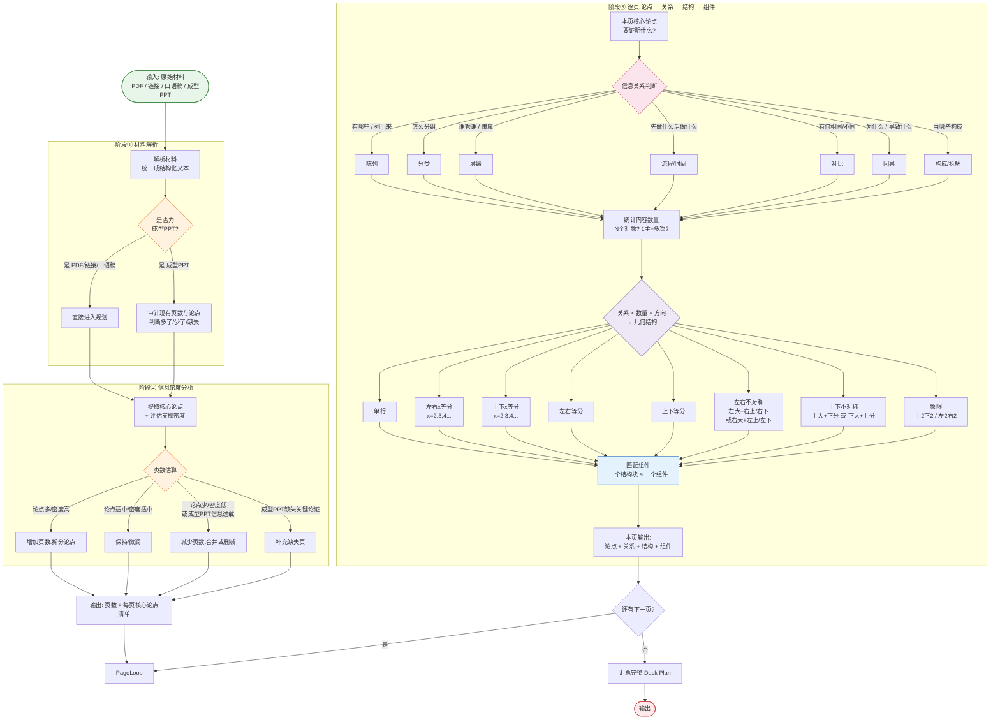

# Skill 设计文档:内容 → 关系 → 结构 → 组件

> 目标:设计一个 Skill,把原始材料(PDF / 链接 / 口语稿 / 成型PPT)转化为可渲染的 Deck Plan。
> 本文档持续微调,当前为初版。

---

## 一、整体流程



---

## 二、三个阶段说明

| 阶段 | 做什么 | 输出 |
|------|--------|------|
| **① 材料解析** | PDF/链接/口语稿/PPT → 统一成结构化文本;若为成型PPT则审计现有页数与论点 | 原始内容池 |
| **② 信息密度分析** | 提取核心论点 + 评估支撑密度,决定页数增删/合并/补充 | **页数 + 每页论点** |
| **③ 逐页三段式** | 论点 → 关系 → 几何结构 → 组件 | **每页的关系+结构+组件** |

---

## 三、页面分类:关系页 vs 非关系页

进入"关系 → 结构 → 组件"流程前,先区分页面类型:

| 页面类型 | 走哪条路 | 说明 |
|---|---|---|
| **非关系页** | 直接套模板,不进关系/结构/组件流程 | 封面、尾卡、Outro、章节隔页、金句页、联络尾页 |
| **关系页** | 进入关系 → 几何结构 → 组件 三段式 | 页面承载信息关系,需匹配版式和组件 |

> **只有关系页才进入版式、组件的选择。** 非关系页只承担节奏停顿、情绪定调、品牌落版等功能,走固定模板。

参考版式库(paper-ink/ai)中的非关系页示例:
- 封面:D1
- 尾卡:D2
- Outro:D3
- 章节隔页:D5
- 金句页:M2
- 联络尾页:D6

---

## 四、信息关系:六大族(MECE)

按第一性原理,信息之间的连接方式只有四种本质形态:
```
A ──→ B    有方向
A ── B     无方向但有连接
A └─ B     包含/从属
A | B      无关系,只是放一起
```
加上"只有 1 个对象"和"对齐比较"两种边界情况,穷尽为 **6 大族**。

### 判断流程(每页走一遍)

```
只有 1 个对象?           → 重心 Focus
多个对象,之间:
  没关系?                 → 并列 Parallel
  有包含/从属?            → 结构 Structure
  有方向(先后/因果)?     → 有序 Sequential
  要对齐看异同/对应?      → 比较 Comparison
  只是有关联(无方向)?    → 连接 Connection
```

6 个分支,**互斥、穷尽**。

### 六大族总表

| 族(中文) | Family(English) | 判断特征 |
|---|---|---|
| ① 重心 | Focus | 只有 1 个对象 |
| ② 并列 | Parallel | 对象间无关系,放一起 |
| ③ 结构 | Structure | 包含/从属,看边界 |
| ④ 有序 | Sequential | 有方向(A→B) |
| ⑤ 比较 | Comparison | 对齐并排看异同 |
| ⑥ 连接 | Connection | 有关联但无方向、无包含 |

### 族内细分

| 族 | 关系(中文) | 语义 |
|---|---|---|
| ① 重心 Focus | 焦点 focus | 单一重心 |
| ② 并列 Parallel | 陈列 | 无结构罗列 |
| | 并行 parallel | 多条独立并行线 |
| ③ 结构 Structure | 层级 hierarchy | 上下级从属(谁管谁) |
| | 拆解 decomposition | 整体拆成部分 |
| | 部分整体 part-whole | 部分构成整体 |
| | 嵌套 nesting | 包含/嵌套/内外层 |
| ④ 有序 Sequential | 时序 sequence | 按时序推进 |
| | 流动 flow | 资源/状态流动 |
| | 循环 cycle | 首尾闭合 |
| | 汇聚 convergence | 多路径汇聚到一个结果 |
| | 漏斗 funnel | 从多到少收窄 |
| | 因果 causal | 原因导致结果 |
| ⑤ 比较 Comparison | 对比 comparison | 同维度看异同 |
| | 矩阵 matrix | 二维交叉 |
| | 映射 mapping | A↔B 对应/转换 |
| ⑥ 连接 Connection | 网络 network | 多对多连接 |
| | 空间 spatial | 按位置/区域分布 |
| | 证据 evidence | 结论与支撑证明关系 |

> 族是**判断入口**,族内细种是**精确匹配**。两层都保留,既 MECE 又不丢表达力。

### 易混关系辨析

| 三者 | 回答的问题 | 换掉成立吗? |
|---|---|---|
| 层级 | "谁归谁管?" | 是人/组织的**管辖**关系 |
| 拆解 | "整体由什么组成?" | 各部分**加起来=总数**,可量化 |
| 部分整体 | "哪些共同构成整体?" | 强调**共同构成**,非拆的动作 |

> 一句话:**层级看"管辖",拆解看"加总",部分整体看"构成"**。

### 关键共识

1. **不看长相看语义** —— 同样的树状图,可能是层级,也可能是拆解
2. **对比的核心是"维度对齐"**,不是版式
3. **因果的核心是"方向性"**,去掉方向信息就不成立
4. **关系决定版式,数量只决定容量** —— 每页 1 个主关系 + 最多 2 个辅关系
5. **一维分类不单列** —— 按语义归到拆解或层级(分类看标签,拆解看加总,层级看管辖)

---

## 五、几何结构清单

> **结构与组件分层**:结构 = 页面怎么切区域(矩形分块);组件 = 区域内画什么形状(放射、环形、蛇形、漏斗都是组件的形状,不是页面结构)。
> G1/G4/H1/J1 等版式的页面结构都是"单行",里面放一个大组件。

| 结构 | 说明 |
|------|------|
| 单行 | 整页一块,组件形状自由(放射/环形/蛇形/漏斗…) |
| 左右x等分 | 横向均分,x≥2 |
| 上下x等分 | 纵向均分,x≥2 |
| 左右不对称 | 主+次,次侧可再分 |
| 上下不对称 | 主+次,如上表格+下收束带 |
| 网格 mxn | 均质分格陈列,含象限 2×2(A7 logo墙 7×4、F4 六宫格 2×3) |
| 表格 | 行列双语义交叉,对应 matrix 关系(K4 场景×阶段、E4 前后×环节) |

### 表格 vs 网格(易混)

| | 特征 | 例子 | 对应关系 |
|---|---|---|---|
| **表格** | 行有行的语义、列有列的语义,交叉格才有内容 | K4、K1、E4 | 天然对应 **matrix 矩阵** |
| **网格** | 均质分格,格与格等价,只是陈列 | A7、F4 | 天然对应 **陈列/并行** |

> 已删除冗余项:左右等分/上下等分(= x等分 x=2)、象限(= 网格 2×2)、上下N段(K1/E4 用"上下不对称+表格"覆盖)。

---

## 六、关系 × 数量 × 方向 → 结构(映射表)

> 这张表是阶段③结构选择的核心规则,持续补充完善。

| 关系 | 内容数量 | 方向 | → 几何结构 |
|------|---------|------|-----------|
| 陈列 | 1项 | — | 单行 |
| 陈列 | 2项 | 横 | 左右等分 |
| 陈列 | 3项 | 横 | 左右3等分 |
| 陈列 | 4项 | 横 | 左右4等分 |
| 陈列 | 4项 | 田字 | 象限(上2下2) |
| 对比 | 2对象 | 横 | 左右等分 |
| 对比 | 1主+多次 | 纵 | 上下不对称 |
| 分类 | 1主+3子类 | 横 | 左大+右上/右下不对称 |
| 流程 | 3-5步 | 横 | 左右N等分(带箭头) |
| 层级 | 1根+多枝 | 纵 | 上下不对称(树) |

---

## 七、组件匹配(待填充)

> 阶段③最后一步:结构 → 组件。
> 组件库清单待用户提供,届时填充具体映射。

- [ ] 组件清单(待提供)
- [ ] 结构 → 组件映射规则(待定义)

---

## 修订记录

- **2026-08-14 初版**:确定三阶段流程、6类核心关系 + 待定候选、8种几何结构、关系×数量×方向映射表。组件匹配待填充。
- **2026-08-14 v2**:关系层重构为六大族 MECE 体系。补入因果、陈列(共19种细种)。一维分类不单列。基于已有 17 种页面信息关系合同(decomposition/part-whole/nesting/focus/convergence/funnel/evidence/mapping 等)。
- **2026-08-14 v3**:反向验证 60 个版式,六大族全覆盖。新增"关系页 vs 非关系页"分类(非关系页直接套模板,不进关系流程)。
- **2026-08-14 v4**:几何结构重构。核心修正:结构与组件分层(放射/环形/蛇形/漏斗是组件形状,不是页面结构)。结构收敛为 7 种,新增网格 mxn(象限推广)和表格(行列双语义,对应 matrix),删除冗余项(左右/上下等分、象限、上下N段)。
